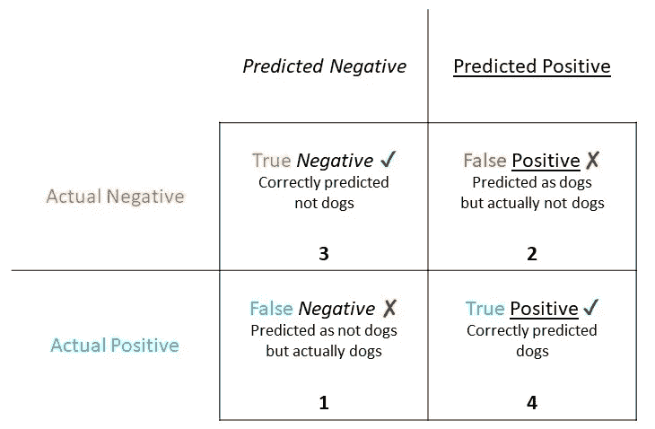
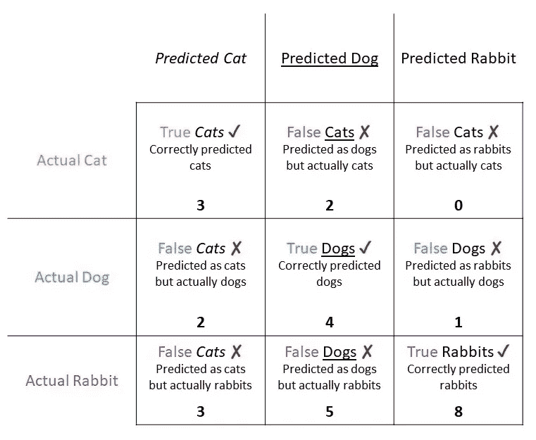

# 分类指标—混淆矩阵解释

> 原文：<https://towardsdatascience.com/classification-metrics-confusion-matrix-explained-7c7abe4e9543?source=collection_archive---------30----------------------->

照片由[陈伶俐·桑特兰](https://unsplash.com/@brianna_santellan)在 [Unsplash](https://unsplash.com/photos/K4GqdInyBQI) 上拍摄

我正在撰写一系列博客文章，旨在涵盖各种数据科学和机器学习概念的基础知识。我这么做主要是为了自己更好的理解这些概念。我希望在这个过程中，我也能帮助别人理解他们。好吧，我们开始吧！

在机器学习领域，混淆矩阵(也称为**误差矩阵**)是一个表格，允许我们**可视化算法**的性能。它仅用于分类任务。

> 这个名字来源于这样一个事实，即很容易看出一个**算法是否混淆了两个或更多的类**(即没有做出正确的预测)

## 二元(2 类)分类器示例

让我们从最简单的例子开始。想象一下，我们训练了一个机器学习模型来检测照片中是否有狗。这是一个二元分类任务，意味着只有两个类别(照片中的“**狗”**或“**不是狗”**)。如果照片中有狗，则用于训练过程的标签为 1，否则为 0。在二进制分类任务中，我们经常把这些类叫做**正**和**负**。当我们向模型传递一张新照片时，它会预测照片中是否有一只狗。

现在，假设我们要对 10 张新照片进行分类。我们可以使用我们的分类器对照片进行分类。每张照片都会收到一个包含标签(0 或 1)的预测，该标签代表两个类别(狗或非狗)。因此，对于每张照片，我们将有预测类和实际类。根据这些信息，我们可以为这 10 张照片生成一个混淆矩阵。稍后，我会给你一个链接，链接到一个很棒的绘制混淆矩阵的例子。现在，假设在我们通过了预测类和实际类之后，返回下面的混淆矩阵:

混淆矩阵—二元分类器 10 只狗

矩阵的每一列代表**实际类**中的实例，而每一行代表**预测类**的实例(反之亦然)。我们训练了一个模型来检测两个类，因此我们最终只有 4 个代表不同信息的单元格:

*   т第一行第一列的单元格包含**真实底片**的数量(在我们的例子中，该单元格包含不包含狗的正确预测照片的数量)。**模型真实预测这 3 张照片中没有狗**。
*   т第一行第二列的单元格包含**假阳性**的数量(在我们的例子中，该单元格包含预测为狗的照片的数量，但实际上照片不包含狗)。**模型错误地预测这两张照片中有一只狗**。
*   т第二行第一列的单元格包含**假阴性**的数量(在我们的例子中，该单元格包含预测为不是狗的数量，但实际上照片包含一只狗)。模型错误地预测在这张照片中没有狗。
*   т第二行第二列的单元格包含**真阳性**的数量(在我们的例子中，该单元格包含包含狗的正确预测照片的数量)。**模型真实预测这 4 张照片中有一只狗**。

我们可以很容易地看到，我们的模型正确预测了 10 张照片中的 7 张，并错误分类(混淆)了 3 张照片。从上面的观察，我们可以决定我们的分类器是否足够好，并继续对错误分类的照片进行额外的分析。

## 多类分类器示例

这是一个非常简单的例子。在某些情况下，我们需要训练一个模型来预测两个以上的类。让我们想象一下，我们想要训练一个模型来预测一张照片是否包含一只狗、猫或兔子。在这种情况下，类的数量将是 3。现在，假设我们传递 27 张照片进行分类(预测),我们得到以下混淆矩阵:

混淆矩阵-多类分类器 27 张照片

同样，矩阵的每一列代表**实际类**中的实例，而每一行代表**预测类**的实例。然而，这次我们有 9 个单元，因为我们有 3 个类。

请注意，我所说的**真实的猫**是指被归类为猫的照片，而且是真实的猫。另外，所谓的**假猫**，我指的是那些我们归类为猫但实际上不是猫的照片。对/错单词告诉我们预测是否正确，猫/狗/兔子单词告诉我们**实际等级**。

从这个混乱矩阵中可以得出一些见解:

*   模型**只正确预测(分类)了全部 27 张照片中的 15 张**。有 3 张正确预测的照片包含猫，4 张正确预测的照片包含狗，8 张正确预测的照片包含兔子。
*   从所有**错误分类的照片**中，我们有:2 张预测为狗但实际包含猫的照片，2 张预测为猫但实际包含狗的照片，1 张预测为兔但实际包含狗的照片，3 张预测为猫但实际包含兔的照片，以及 5 张预测为狗但实际包含兔的照片。
*   此外，我们可以看到，我们**没有任何错误预测为兔子的照片，实际上包含一只猫**。

现在你知道如何阅读一个混淆矩阵和它代表什么。这里有一个[很好的例子，展示了如何使用 sklearn 软件包轻松生成漂亮的混淆矩阵](https://scikit-learn.org/stable/auto_examples/model_selection/plot_confusion_matrix.html)。

## 摘要

混淆矩阵可以用来分析分类器的性能，并让我们了解应该朝哪个方向改进分类器。然而，我们只是看了两个由少量类别(2 和 3)训练的分类器生成的混淆矩阵。想象一下，我们要训练一个有 100 个类的分类器。在这种情况下，也许我们需要一些指标来聚集混淆矩阵提供的信息。请继续关注下一篇文章，我将向您展示我们如何使用准确度、精确度和召回指标，这些指标的定义只是使用矩阵值的公式。

好了，这就是所有的人！我希望你喜欢这篇博文。如果你对我有任何反馈，请告诉我。[这里有一张图片](https://ibb.co/w4VyFWs)总结了混淆矩阵的定义和例子。

如果你想在我发表新的博客文章时得到通知，你可以订阅[我的简讯](https://buttondown.email/Ventsislav)。这是我在 LinkedIn 上的简介，如果你想和我联系的话。我将很高兴与你联系在一起。

## 资源:

*   [https://en.wikipedia.org/wiki/Confusion_matrix](https://en.wikipedia.org/wiki/Confusion_matrix)
*   [https://sci kit-learn . org/stable/auto _ examples/model _ selection/plot _ confusion _ matrix . html](https://scikit-learn.org/stable/auto_examples/model_selection/plot_confusion_matrix.html)