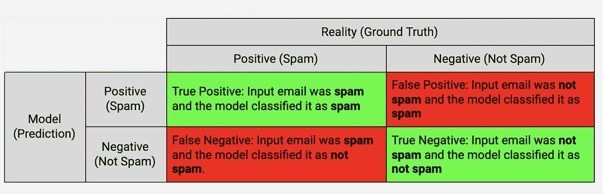
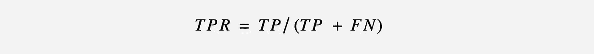
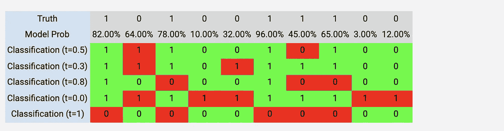
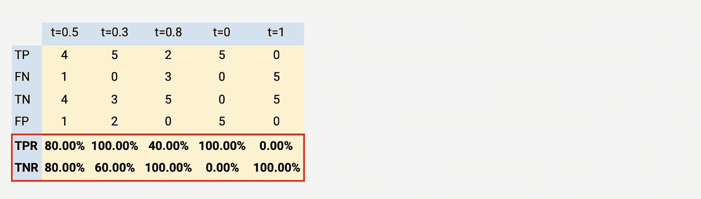
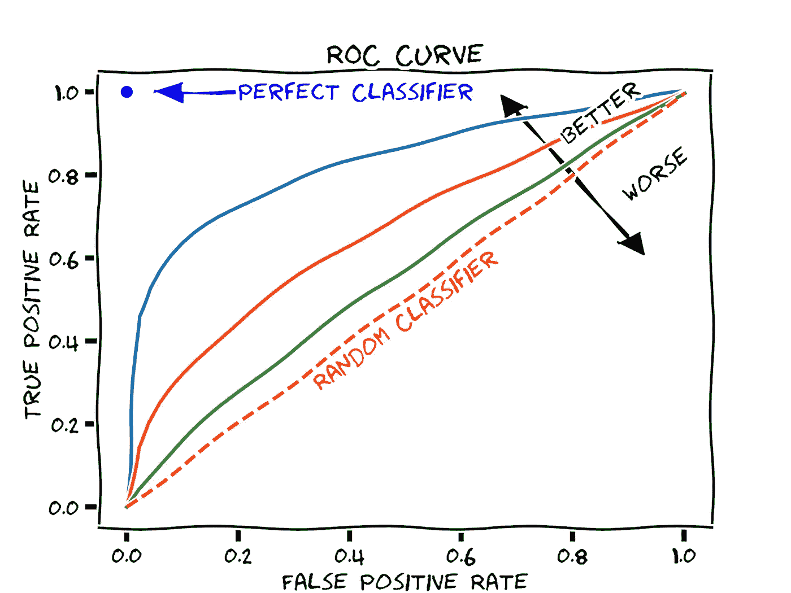
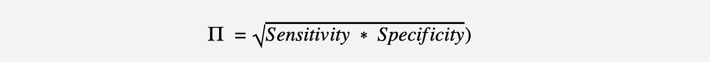
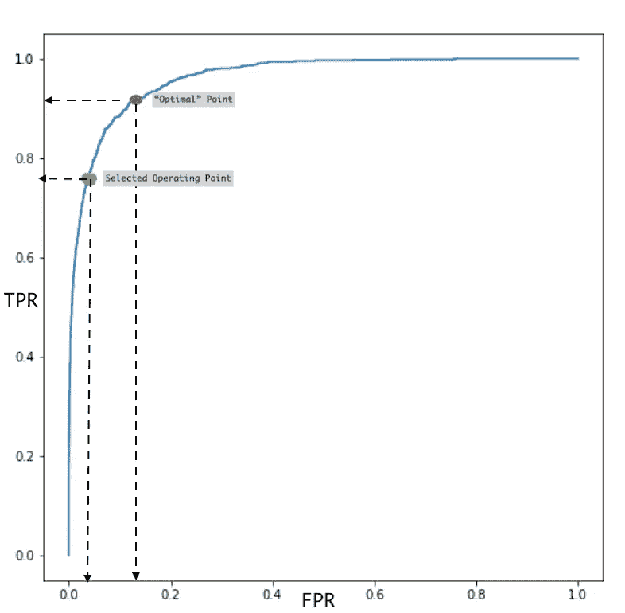

# 机器学习中的分类模型和阈值

> 原文：<https://towardsdatascience.com/classification-models-and-thresholds-97821aa5760f?source=collection_archive---------16----------------------->

## 如何选择阈值以及它们为什么重要

Pawel Czerwinski 在 [Unsplash](https://unsplash.com/@pawel_czerwinski?utm_source=unsplash&utm_medium=referral&utm_content=creditCopyText) 上的照片

分类模型是监督机器学习的子集。分类模型读取一些输入，并生成将输入分类到某个类别的输出。例如，一个模型可能会读取一封电子邮件，并将其分类为垃圾邮件或非垃圾邮件—二进制分类。或者，模型可以读取医学图像，比如乳房 x 光照片，并将其分类为良性或恶性。

像逻辑回归这样的分类算法会生成一个概率分数，为属于某个类别的输入分配一定的概率。假设分类是二进制的(恶性或良性，垃圾邮件或非垃圾邮件)，这个概率然后被映射到二进制映射。在前面的垃圾邮件示例中，模型可能会读取一封电子邮件，并生成 92%的垃圾邮件概率得分，这意味着该电子邮件确实是垃圾邮件的可能性非常高。对于频谱两端的概率分数，映射非常明显。分数*接近*0 意味着该电子邮件很可能不是垃圾邮件，而接近 100 意味着该电子邮件很可能是垃圾邮件。然而，映射决策在许多情况下并不完全明显。考虑 58%的分数，这应该被归类为垃圾邮件吗？同样，32%的分数是否应该被归类为非垃圾邮件？

为了将逻辑回归或类似的概率分类模型的输出映射到二元分类类别中，您需要定义一个*分类阈值*。这个阈值代表决策边界。在前面的垃圾邮件分类器示例中，高于该阈值的值将被映射到垃圾邮件类别，而低于或等于该阈值的值将被映射到非垃圾邮件类别。问题是你如何选择这个门槛，这个选择意味着什么。

在我们能够回答这个问题之前，我们将需要稍微走一点弯路来理解如何度量模型。像我们这样将电子邮件分类为垃圾邮件或非垃圾邮件的模型可以通过这 4 种测量进行评估:真阳性、假阳性、真阴性和假阴性，这些都在下面的 2x2 中定义。绿色象限代表现实(真相)和模型(预测)之间的一致，而红色象限代表不一致。

作者图片

使用上述 4 个度量，我们可以导出另外两个度量，这两个度量有助于评估模型的性能以及最终如何选择阈值。

**真阳性率(TPR):** 这衡量模型能够正确预测阳性病例的程度。这是模型能够相对于被模型错误分类为阴性的真阳性和阳性病例的总和正确识别真阳性的功能；假阴性。更令人困惑的是，这种测量经常被称为**敏感度**或**回忆**

作者图片

**真负率(TNR):** 这是正例的逆例。它衡量模型能够正确识别真正负面案例的程度。这是相对于真阴性和模型错误分类为阳性的情况的总和的真阴性的函数；假阳性。这种测量也被称为**特异性**

作者图片

现在让我们用一个说明性的例子来展示这些测量。假设我们有一个模型，将 10 封电子邮件分类为垃圾邮件(正面)或非垃圾邮件(负面)。下表的第一行显示了这 10 封邮件的真相。在这 10 封邮件中，5 封是真正的垃圾邮件，5 封不是。该模型为每封输入的电子邮件生成一个概率分数，如下面第二行所示。最后五行使用 5 个不同的阈值将这个概率分数映射到一个二元决策——垃圾邮件还是非垃圾邮件。第一个阈值是 0.5，这意味着如果该模式的概率大于 50%，则该电子邮件将被分类为垃圾邮件，任何低于该分数的邮件都将被分类为非垃圾邮件。其他阈值为 0.3、0.8、0.0 (100%垃圾邮件)和 1.0 (100%无垃圾邮件)。后两个阈值是极端情况。最后，标为绿色的单元格表示真阳性和真阴性，而标为红色的单元格表示假阳性和假阴性。

作者图片

下表显示了之前定义的 4 个测量值，以及所用三个阈值中的每一个的 TPR 和 TNR。注意 TPR 和 TNR 是如何受阈值变化影响的。还要注意敏感性(TPR)和特异性(TNR)之间的反比关系。一个增加，另一个减少。找到正确的阈值是这两种测量之间的权衡。

作者图片

这很直观。阈值非常高(0.8)的模型会错误地将大多数电子邮件归类为非垃圾邮件。相反，阈值非常低(0.3)的模型会很快将大多数电子邮件分类为垃圾邮件。两者都是*正确的*，最终重要的是模型的预期用途和这些阈值的含义。

想象一下，如果实际部署了阈值为 0.3 的模型来过滤您的电子邮件提供商的垃圾邮件。该模型将非常积极地将大多数电子邮件归类为垃圾邮件。这种方法的后果将是你错过了非垃圾邮件，这些邮件最终会出现在你的垃圾邮件文件夹中..你必须定期检查你的垃圾邮件文件夹，看看它是否包含非垃圾邮件(误报)信息。这可能会导致糟糕的用户体验。或者，阈值非常高(0.8)的垃圾邮件过滤器可能会导致收件箱充满垃圾邮件。这也不是很好的用户体验。

在回答我们最初的问题之前，我们需要引入另一个概念:如何选择“正确的”阈值。这个概念就是[接收算子曲线](https://en.wikipedia.org/wiki/Receiver_operating_characteristic)，简称 ROC。ROC 绘制了不同阈值下模型的灵敏度和特异性(实际上它绘制了*1-特异性*)。这类似于前面的例子，它显示了一个模型沿 5 个不同阈值的敏感性和特异性。下图显示了各种模型的示例性 ROC。每条曲线代表一个分类模型

图像由马丁·托马斯——自己的作品， [CC0](https://commons.wikimedia.org/w/index.php?curid=70212136)

该曲线有助于理解 TPR 和 FPR(对于不同阈值为 1-TNR)之间的权衡。此外，曲线下面积(AUC)提供了一个数字来概括模型的性能。完美模型的 ROC 为 1，而表现不佳的模型(随机分类器)的 ROC 为 0.5。ROC 是理解不同阈值之间权衡的有用诊断工具，AUC 提供了基于一般能力比较模型的有用数字。

快到了，我保证！

最佳阈值是最大化 TPR 和最小化 FRP 的点。我们可以在 TPR 约为 0.65 的蓝色曲线上大致了解一下。除了瞎猜，我们还可以选择使特异性和敏感性的几何平均值最大化的阈值。

作者图片

确定最佳阈值的几何平均法实际上可能不是您想要使用的最佳点(双关语)。简单地选择最大化 TPR 和最小化 FRP 的点可能会有一些不期望的结果。考虑一个模型的情况，该模型将罪犯分类为应该判死刑或不应该判死刑的人——我希望这样的模型永远不要被开发出来，但是请原谅我。您可能希望尽量减少假阳性，因为假阳性的后果是非常不利的:您的模型会让一个无辜的人走向死亡。您必须采取的平衡措施是选择一个阈值来减少误报，同时也产生一个合理的 TPR。下图描述了这一点。

作者图片

使用几何平均法将得出上面红点所示的阈值。这个阈值将导致大约 18%的 FPR。可选地，沿着 ROC 曲线(绿点)选择较低的阈值导致约 2%的 FPR。这里明显的权衡是通过选择绿点处的阈值，TPR 降低约 10%，但考虑到我们模型中假阳性的后果，这可能是一个很好的权衡。

因此，使用什么阈值的答案毕竟是“视情况而定”:)

*最初发表于*[*【https://karimfanous.substack.com】*](https://karimfanous.substack.com/p/classification-models-and-thresholds)*。*