# 雷达回波的分类

> 原文：<https://towardsdatascience.com/classification-of-radar-returns-c79fa1ce42eb?source=collection_archive---------29----------------------->

## 电离层数据集的案例研究

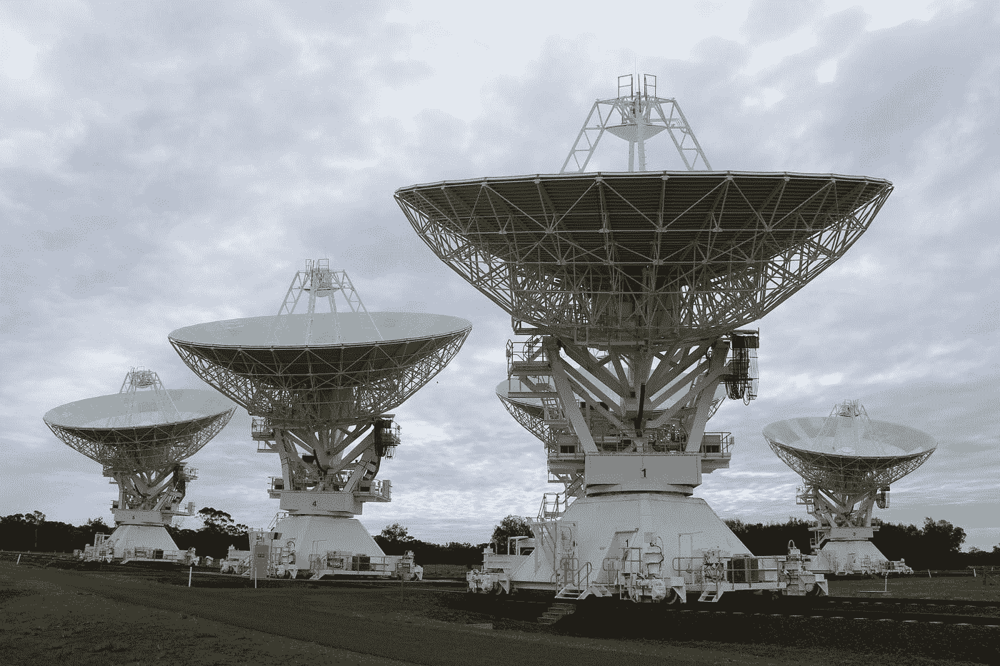

由 [VM Quezada](https://unsplash.com/@vmqc?utm_source=medium&utm_medium=referral) 在 [Unsplash](https://unsplash.com?utm_source=medium&utm_medium=referral) 上拍摄的照片

1.  介绍
2.  问题陈述
3.  映射到 ML/DL 问题
4.  理解数据
5.  数据处理和探索性数据分析
6.  结构
7.  结论和未来工作
8.  参考

## 1.介绍

电离层位于大气层和外层空间的地平线上。有趣的是，电离层探索属于太阳系探索的范畴。电离层是地球大气层从 48 公里到 965 公里的电离部分，包括热层和部分中间层和外逸层。[维基百科]

研究电离层的十个重要原因

*   它容纳了地球大气中所有的带电粒子。
*   它是地球大气层和太空的分界线。
*   在这个区域可以感觉到轨道阻力。
*   地球轨道卫星最喜欢去的地方。
*   它受到地球上天气条件波动的影响。
*   无线电和全球定位系统信号被电离层的辐射干扰。
*   受太空天气条件的影响。
*   空气辉光发生在原子和分子被太阳光的辐射激发而发光并释放多余能量的地方。
*   太空机构用不可见类型的光研究电离层
*   2019 年 10 月，美国宇航局加入了 GOLD，使用 ICON-电离层连接探测器研究电离层

## 2.问题陈述

在电离层研究中，我们需要将信号分为有用的(好的)或无用的(坏的)以供进一步分析。通常在这种分析中，手动干预是必要的，这是一项痛苦耗时的任务。约翰·霍普斯金应用物理实验室已经把从拉布拉多鹅湾雷达收集的数据存入了 UCI 机器学习知识库。

## 3.映射到 ML 问题

这个来自地球物理领域的问题可以映射成机器学习中的二分类问题。我们需要将数据分为好的(“g”)和坏的(“b”)。好的(‘g’)雷达显示了一些在电离层中返回的证据，而坏的(‘b’)雷达是那些不通过电离层的信号。

## **4。理解数据**

“这些雷达数据是由拉布拉多鹅湾的一个系统收集的。该系统由 16 个高频天线的相控阵组成，总传输功率为 6.4 千瓦。目标是电离层中的自由电子。使用自相关函数处理接收的信号，自相关函数的自变量是脉冲的时间和脉冲数。鹅湾系统有 17 个脉冲数。该数据库中的实例由每个脉冲数的 2 个属性描述，对应于由复合电磁信号“[UCI 档案]产生的函数返回的复合值。

给定的数据集包含 351 行和 35 列。前 34 列是特征，最后一列包含“g”和“b”的分类标签。

## **5。数据预处理和探索性数据分析**

给定的数据集包含 34 个特征。在深入研究特性的重要性之前，为了找出哪个特性更有用，哪个不是，先做一个随机数据分析。

我们将把数据集转换成 pandas 数据框，并执行进一步的处理。在转换成 pandas 数据框后，我们将删除数据集中任何重复的行。因此，最终的数据帧有 350 行和 34 列。

我们需要使用 MinMaxScaler 规范化数据集，然后对数据集执行初步的 EDA。概率密度函数图和累积密度函数如下所示。

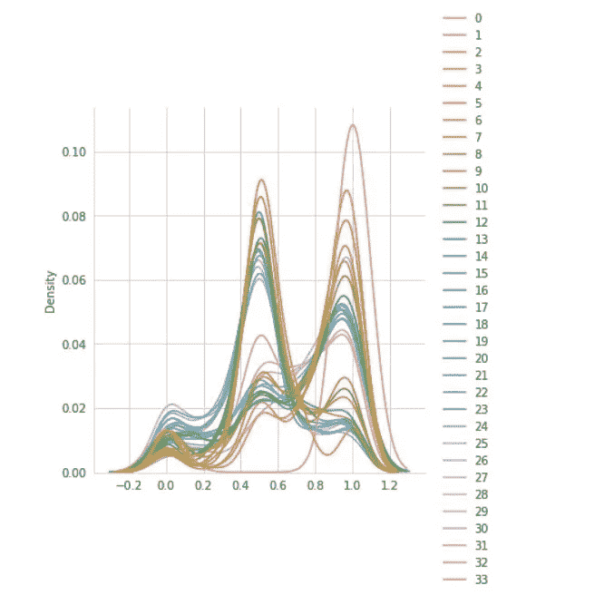

PDF 绘图

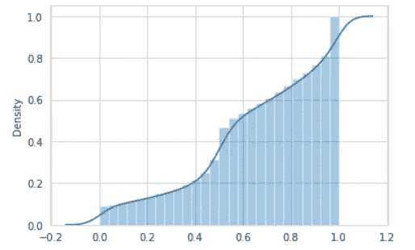

CDF 图

由于特征值高度重叠，我们无法从上述图中推断出任何关于特征的重要信息。

我们现在将绘制具有相应标签的要素的热图，以检查是否可以进行任何重要的分析。

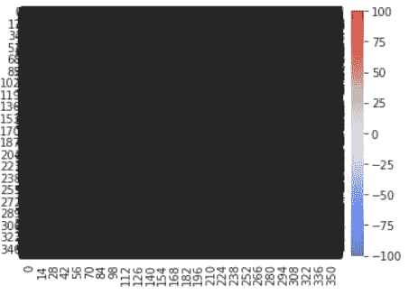

相关矩阵的热图

根据上面的热图，除了图中的要素高度重叠之外，无法推断出更多信息。

我们使用 sklearn 的*选择测试*功能来选择前 k 个重要特性。这在分类任务中使用。sklearn 的实现是用于分类的 ANOVA(分析均值之间的差异)。

计算最佳特性的代码

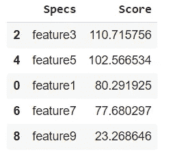

最重要的 5 个特征

**降维**

让我们使用一些降维技术，如主成分分析和 t-SNE，看看我们是否可以从我们的数据中获得任何其他见解。

*主成分分析*

我们使用主成分分析来找出数据集中的哪些成分解释了 80%以上的方差

代码和分析

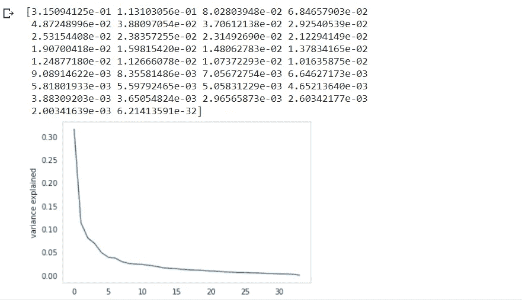

从上图可以明显看出，1 到 10 之间的特征解释了最大方差。因此，“选择最佳”的输出和 PCA 的输出几乎匹配。

*t-SNE: t 分布式随机邻域嵌入*

让我们对数据集运行 *t-SNE* 算法，进行多次迭代并改变困惑分数，并检查是否有任何现象可以解释数据集中所有要素的高度重叠性质，从而使分析变得复杂。

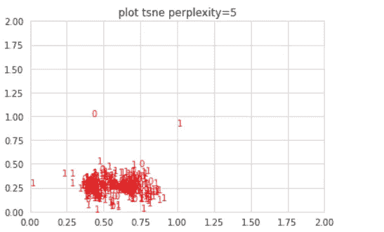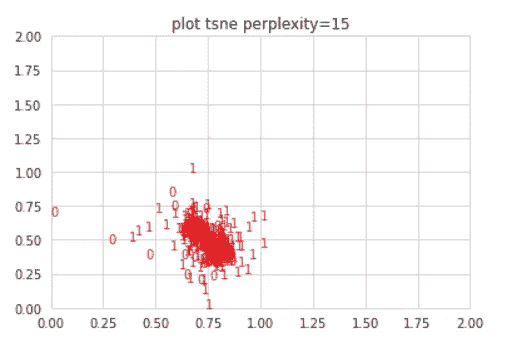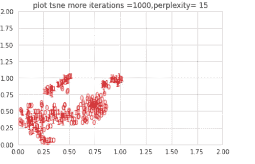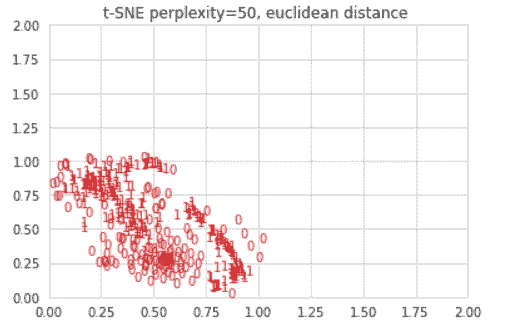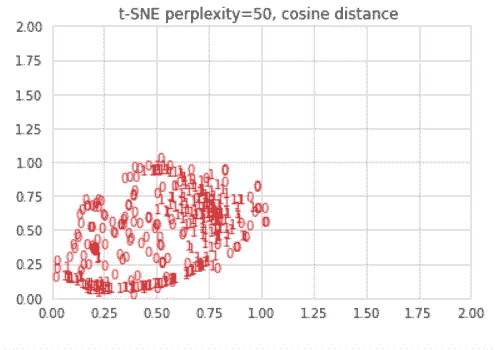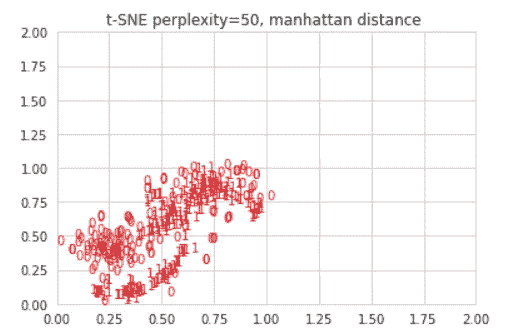

基于 *t-SNE* 图，通过迭代= 50k 和不同的困惑分数，特征是不可区分的。因此，由于这些是电离层中的信号或辐射，它们由复数表示，因此它们需要更详细的机器学习模型来解释它们的行为。

## 6.结构

我们需要建立一个有监督的机器学习模型来解决这个二元分类问题。为了对好的和坏的回报进行分类，我们需要找到将两者平均分开的超平面。

我们可以使用 SVM 分类器来完成这项任务。使用 sklearn 的带 loss='hinge '的 SGDClassifier，可以得到 LinearSVM 模型。我们为模型评估选择的度量是 AUC。

具有所有 34 个特征的模型的训练和测试 AUC 被评估为 0.5。这意味着数据集本质上是高度随机的。因此，我们需要只选择最佳特征，并在这些特征上拟合模型，以获得所需的 AUC。

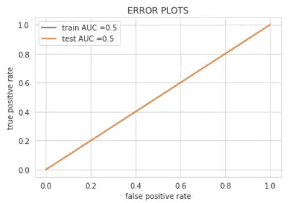

对数据集的前 5 个要素运行分析的代码如下。在这种情况下，获得的 AUC 从 0.5 提高到 0.7

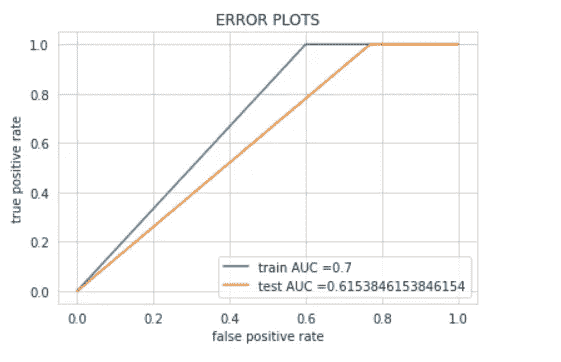

为了进一步提高 AUC 和准确性，我们可以使用梯度推进决策树。梯度推进决策树在处理异构数据和相对少量的数据时非常有效。CatBoostClassifier 是 Yandex 公司的一个开源库。获得的 AUC 在训练数据集和测试数据集上提高到 0.85

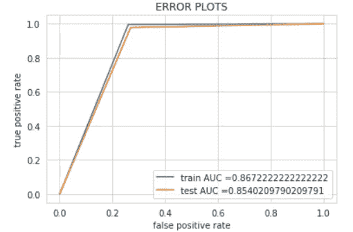

在相同的上运行分类报告后，我们得到以下结果

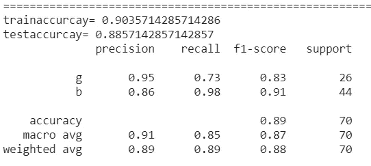

分类报告

在将 GBDT 模型用于雷达回波的二元分类任务之后，在训练和测试数据集上的准确率分别提高到 85%和 89%。

根据应用物理实验室[【3】](https://www.jhuapl.edu/Content/techdigest/pdf/V10-N03/10-03-Sigillito_Class.pdf)的研究论文，深度学习神经网络模型，如简单的多层感知器，在特异性和敏感性方面超过了任何机器学习模型

我们已经实现了一个 MLP 模型与亚当优化。模型摘要和模型如下所示。关于代码实现，请参考文章末尾给出的 Github 链接。

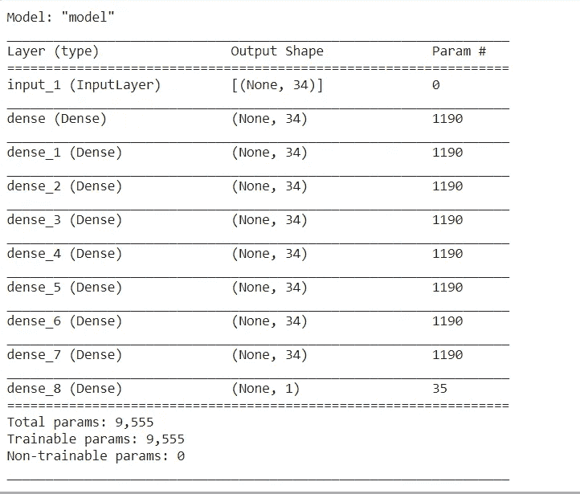

多层感知器的自定义层实现在研究论文中给出的测试数据集上给出了更好的准确性。获得的测试准确度为 98%。完整的代码可以在下面参考资料部分提供的 GitHub 链接中找到。

## 7.结论和未来工作

对于给定的数据集，具有 5 个隐藏层和 Adam 优化器的多层感知器简单地优于其余的模型对应物

根据该研究论文，利用 MLFN 效应、非相干散射、雷达脉冲吸收和发射机干扰来分析不良回波的原因将是令人感兴趣的。我对研究这些方法感兴趣，并使用深度学习方法来实现和分析它们。

这些可以探索电离层研究的新的研究途径。

**8。参考文献**

1.  https://www.appliedaicourse.com/
2.  [UCI 机器学习知识库:电离层数据 Se](https://archive.ics.uci.edu/ml/datasets/Ionosphere) t
3.  [https://www . jhuapl . edu/Content/tech digest/pdf/V10-N03/10-03-Sigillito _ class . pdf](https://www.jhuapl.edu/Content/techdigest/pdf/V10-N03/10-03-Sigillito_Class.pdf)
4.  [Github](https://github.com/jayaBalaR/IonosphereDataset/blob/master/Ionosphere.ipynb) 源代码。
5.  链接到我的 LinkedIn 个人资料