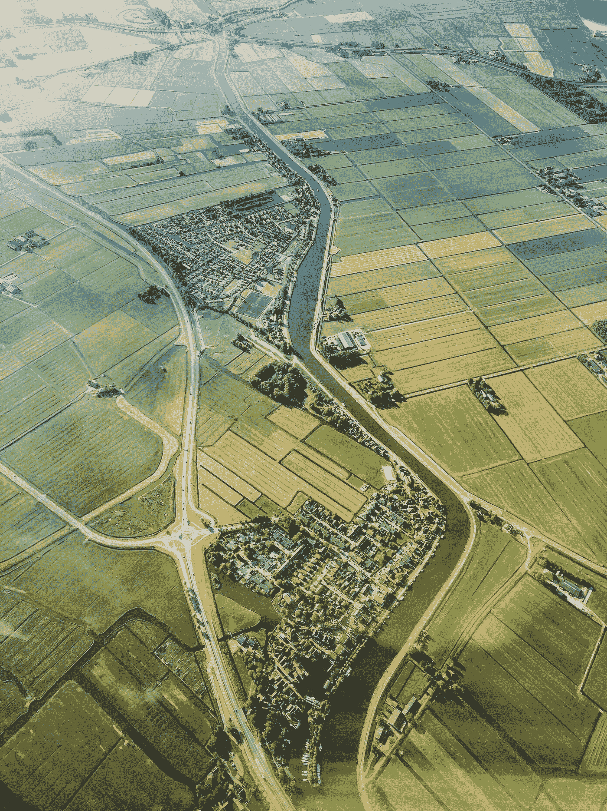
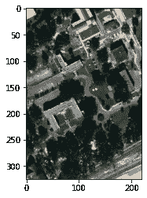
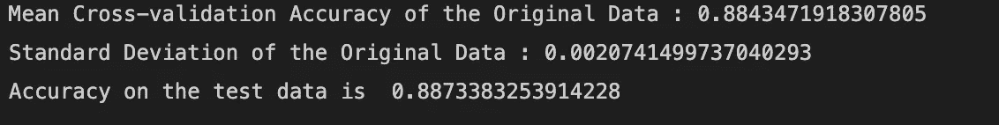
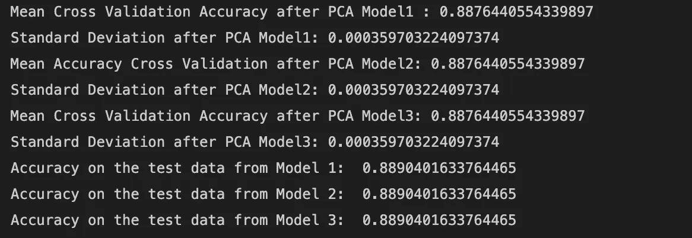
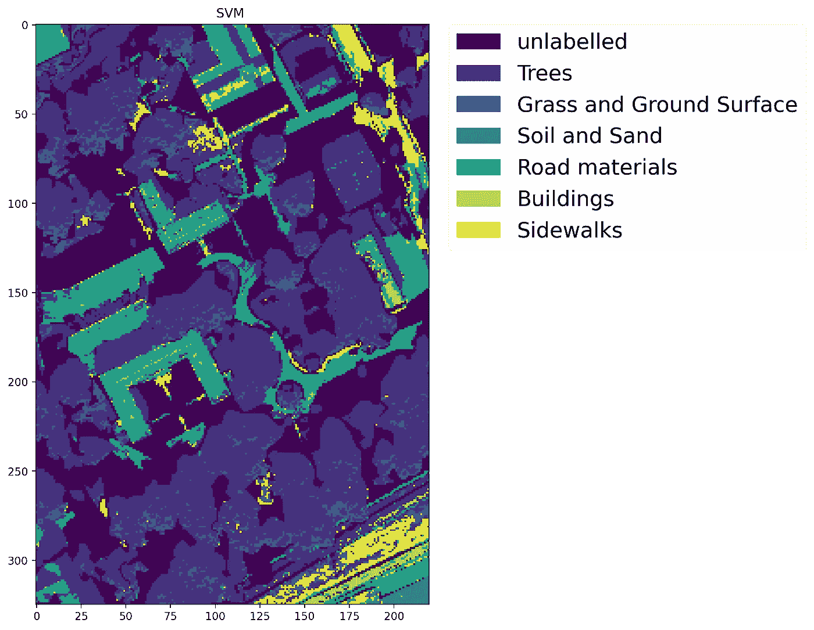

# 高光谱数据分类

> 原文：<https://towardsdatascience.com/classification-on-hyperspectral-data-19c48c432b96?source=collection_archive---------25----------------------->

## 这是一个循序渐进的教程，介绍如何使用支持向量机执行特征约简，然后对高光谱数据进行分类

[米卡·科霍宁的照片](https://unsplash.com/photos/4_oil70Vy_E)

# **简介**

本教程的目标是将 PCA 应用于高光谱数据。(要了解 PCA，请阅读文章“[高光谱数据的 PCA](/pca-on-hyperspectral-data-99c9c5178385)”。).在使用 PCA 降低数据的维度之后，通过应用支持向量机(SVM)对图像中的不同材料进行分类来对数据进行分类。

# 步伐

在本教程中，我们将使用高光谱 Gulfport 数据集。您可以从以下链接下载数据。

 [## GitHub-gator sense/muuflgulport:MUUFL gulf port 超光谱和激光雷达数据:该数据集…

### MUUFL Gulfport 超光谱和激光雷达数据:该数据集包括 HSI 和激光雷达数据，评分代码，照片…

github.com](https://github.com/GatorSense/MUUFLGulfport) 

MUUFL Gulfport 数据包含基于像素的地面真实地图，该地图通过手动标注场景中的像素来提供。在场景树中标记了以下类别，主要是草地、地面、混合地面、泥土和沙子、道路、水、建筑物、建筑物的阴影、人行道、黄色路缘、布料面板(目标)和未标记的点。

## 步骤 1:导入库

## 步骤 2:加载数据

原始数据中有 65 个波段。

RGB 图像

## 步骤 3:去掉未标记的和一些类数据

移除未标记的数据点，并且将一些相似的类合并成一个。例如，水和建筑阴影合并成一类，因为它们具有相似的光谱。此外，布面板和黄色路缘类被忽略，因为他们的数量很少，因此，没有足够的培训。

因为地面真相标签从一开始。所以在最后一行，我从所有标签中减去 1，以确保它们从零开始。

## 步骤 4:将数据分为训练和测试

## 步骤 5:对原始数据应用 SVM 分类器

我对训练数据进行了 K 重交叉验证。

## 步骤 6:对 PCA 数据应用 SVM 分类器

我已经应用了 3 个模型的集合，并在训练数据上使用了 K-fold 交叉验证。

计算多数票后所有三个模型的最终预测。

# 步骤 7:绘制 PCA 后的最终图像

应用 PCA 后的图像

# 结论

PCA 前的数据维数为 65，PCA 后的数据维数为 3。主成分分析将数据的维数降低了近 21 倍。

从上面的结果我们可以得出结论，当我们将 SVM 应用于原始数据时，准确率在 **88.7%** 左右，而将 SVM 应用于主成分分析后，准确率在 **88.9%** 左右。所以在这两种情况下，我们得到了几乎相同的精度。

这就是为什么我们对减少的数据应用分类器。降低了时间和空间复杂度。根据问题的不同，与使用原始数据相比，PCA 的准确性可能更高。

> 感谢阅读！我希望这篇文章对你有用。如果你有任何问题，请随意提问。

# 参考

 [## GitHub-gator sense/muuflgulport:MUUFL gulf port 超光谱和激光雷达数据:该数据集…

### MUUFL Gulfport 超光谱和激光雷达数据:该数据集包括 HSI 和激光雷达数据，评分代码，照片…

github.com](https://github.com/GatorSense/MUUFLGulfport)  [## sklearn.svm.SVC

### c-支持向量分类。该实现基于 libsvm。拟合时间至少与…成二次比例

scikit-learn.org](https://scikit-learn.org/stable/modules/generated/sklearn.svm.SVC.html)  [## k-fold 交叉验证的温和介绍-机器学习掌握

### 交叉验证是一种统计方法，用于评估机器学习模型的技能。它通常用于…

machinelearningmastery.com](https://machinelearningmastery.com/k-fold-cross-validation/)  [## sklearn.decomposition.PCA

### 主成分分析。使用数据的奇异值分解进行线性降维…

scikit-learn.org](https://scikit-learn.org/stable/modules/generated/sklearn.decomposition.PCA.html)  [## 如何在 Python -机器学习掌握中使用 StandardScaler 和 MinMaxScaler 变换

### 当数字输入变量被缩放到标准范围时，许多机器学习算法表现得更好。这个…

machinelearningmastery.com](https://machinelearningmastery.com/standardscaler-and-minmaxscaler-transforms-in-python/)