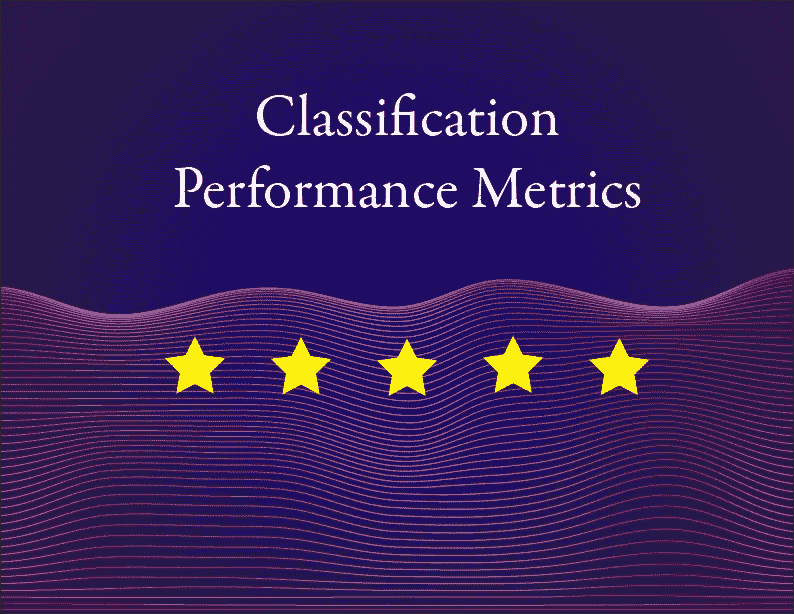
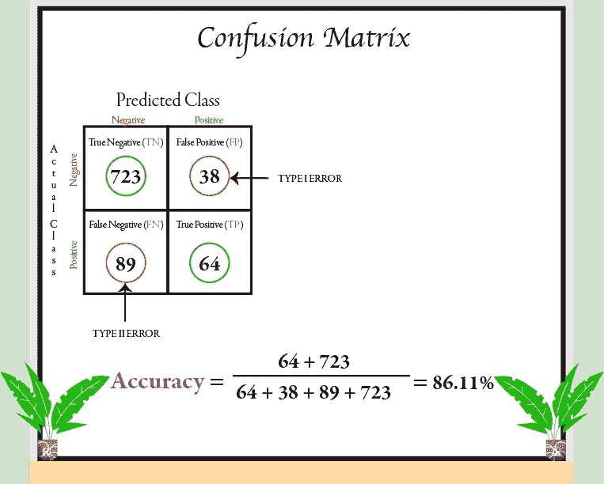
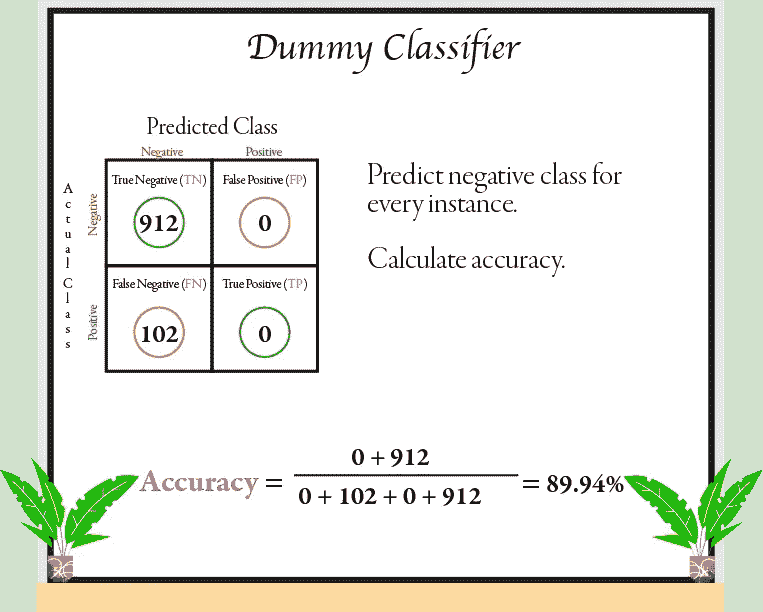
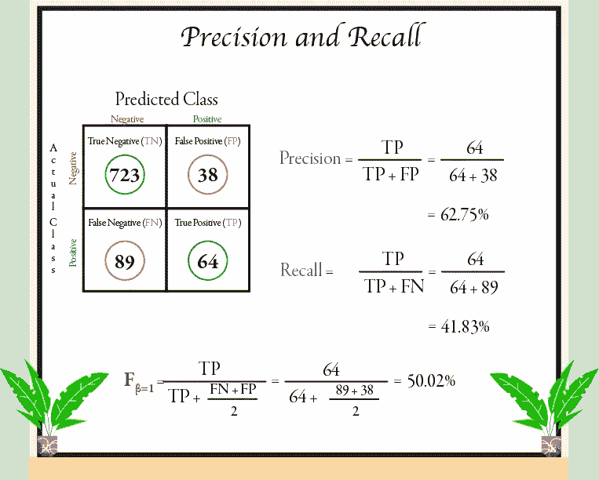
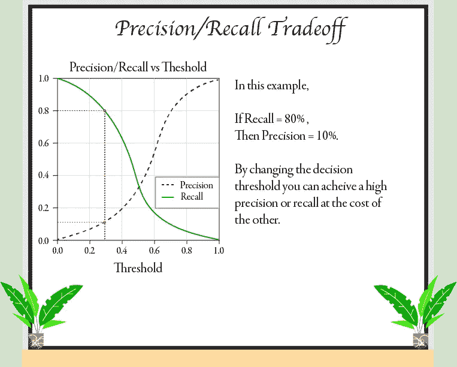
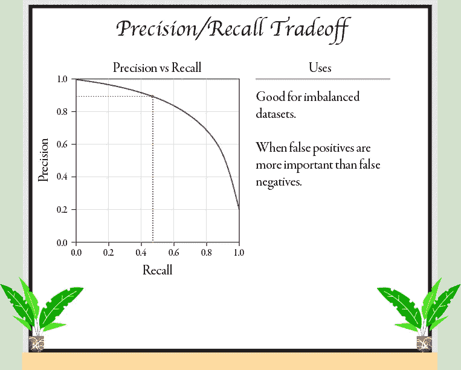
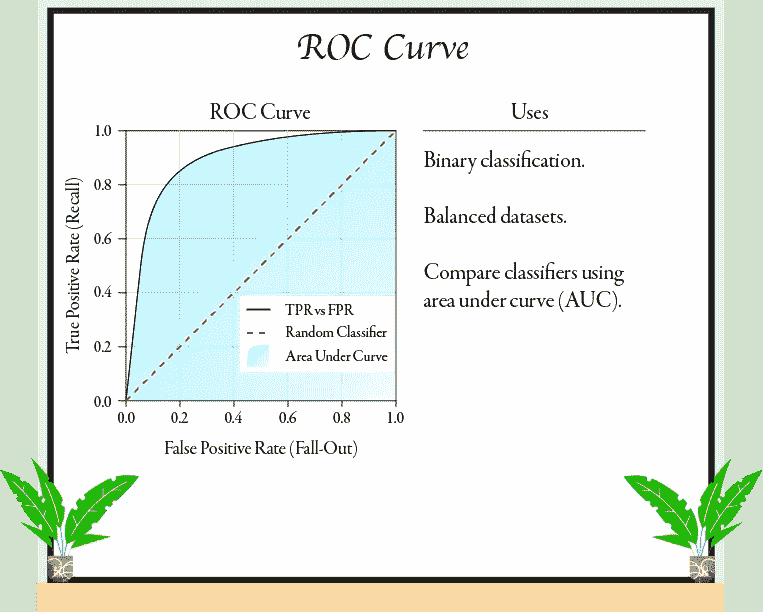

# 分类性能指标

> 原文：<https://towardsdatascience.com/classification-performance-metrics-69c69ab03f17?source=collection_archive---------47----------------------->

## 探索各种性能测量方法，用具体的例子和插图来评估您的分类器。

分类性能指标包括照片。

评估一个分类器通常比评估一个回归量更困难，因为有许多可用的性能度量，并且不同类型的问题需要特定的度量。了解度量之间的差异以及何时使用它们仍然是解决任何分类问题的关键技能。

在本文中，我将从理解最重要的概念之一——混淆矩阵开始，然后进入其他度量，为您提供一种更简洁的方法来对分类器进行评分。

# 混淆矩阵

混淆矩阵是评估分类器性能的最佳方法之一。基本思想是计算一个类中的实例被正确分类或被错误分类为另一个类的次数。

混淆矩阵中的行代表*实际类别*，而每列代表*预测类别*。一个完美的分类器只会有*真* *正*和*真* *负*，这意味着它的混淆矩阵只会在其对角线上有非零值。

使用混淆矩阵计算准确度。

在混淆矩阵中，有两种类型的错误需要注意:*假阳性*或 I 型错误和*假阴性*或 II 型错误。这些术语来自统计学中的假设检验，并与分类问题互换使用。

从混淆矩阵中，你可以计算出各种不同的指标，包括最简单的一个*准确度*。准确度定义为正确分类的实例总数除以实例总数。在上面的例子中，我们计算的准确率为 86.11%！看起来不错，对吧？好吧，让我们来看一个虚拟分类器，它只是将每个实例分类为负类。

使用虚拟分类器计算准确度。

没错，虚拟分类器具有更好的准确性，这仅仅是因为正面分类器占总实例的 10%左右。这说明了为什么准确性通常不是首选的性能指标，尤其是当您处理不平衡的数据集时(例如，当一些类比其他类出现得更频繁时)。

# 精确度和召回率

混淆矩阵为您提供了有价值的信息，但有时您可能需要更简洁的度量。一种方法是计算被分类在正类中的所有实例的准确度。这叫做*精度*。由于 precision 只关注 I 类错误，所以它经常与另一个称为*召回*的指标(也称为*灵敏度*或*真阳性率*)一起使用。

计算精确度、召回率和 F1 分数。

这里我们看到，即使我们有超过 85%的准确率，我们的分类器只有 62.8%的时间是正确的。此外，它仅检测到 41.8%的阳性类别。将精确度和召回率结合成一个称为 *F1 分数*的指标通常是有帮助的。F1 分数被定义为精确度和召回率的*调和平均值*。它对较低的值赋予较重的权重，这意味着当这些值接近时，它将始终落在精度范围内，并回忆和偏好。

> 一种赋予精确度或召回率更大权重的方法是使用 Fβ分数，该分数赋予召回率β倍的重要性。因此，小于 1 的值有利于精度，大于 1 的值有利于召回。

# 精确度/召回率的权衡

有时你更关心精确度，有时你更关心回忆。例如，如果您训练一个分类器来检测欺诈性信用卡活动，如果您的分类器精度较低，只要它具有非常高的召回率(这意味着可能会有一些错误警报，但几乎所有的欺诈活动都会被检测到)，这并不是什么大问题。

另一方面，假设你训练了一个分类器，它检测自然界中的蘑菇是否可以食用(无毒)。当预测蘑菇可食用(高精度)但将一些可食用蘑菇错误分类为有毒(低召回率)时，您可能更喜欢您可以信任的分类器，而不是将有毒蘑菇错误分类为可食用的分类器。

现在你可能已经知道，提高精确度会降低回忆，反之亦然。这被称为*精度/召回权衡*。

通过绘制精度/召回率与阈值的关系来解释精度召回率的权衡。

要理解精度/召回率的权衡，您必须理解分类器如何将实例分配给正类或负类。每个分类器都有一个*决策函数*，它计算得分/概率，如果得分/概率大于某个*阈值*，则该实例被分配给肯定类；否则，它被分配给负类。

通过改变这个阈值，您可以有效地改变假阳性的数量，而以您的假阴性为代价。提高阈值会提高精度，降低召回率。而降低阈值会增加召回率并降低精确度。

> 在某些情况下，召回曲线会比精确曲线更平滑。这是因为当您提高阈值使其看起来平滑时，召回率总是降低，但是尽管提高了阈值，精确度也可能降低。

我们也可以直接绘制精度与召回率的关系图，以帮助我们选择一个好的精度/召回率折衷方案。

精确/召回曲线及其应用。

*精度/召回*曲线允许您准确地看到在给定期望精度的情况下，您将获得什么样的召回。在上面的例子中，您可能希望在急剧下降之前选择 90%左右的精度。您可以通过搜索最低可能阈值来做到这一点，该阈值至少可以提供您想要的精度。

到目前为止，您可能已经知道，通过设置足够高的阈值，在分类器上实现您想要的任何精度是相当容易的。但是，一个具有高精度和低召回率的分类器不是很有用。了解业务问题将帮助您决定一个好的精度/召回权衡。

# 受试者工作特性曲线

*接收器工作特性*曲线是另一种用于分析二元分类器误差的工具。它与精确度/召回率曲线非常相似，但 ROC 曲线不是绘制精确度对召回率，而是绘制*真阳性率* ( *召回*)对*假阳性率* ( *下降*)。

通过测量曲线下的*面积(AUC ),我们可以对分类器的性能进行评分。完美分类器的面积为 1，而随机分类器的面积为 0.5。我们用虚线对角线表示随机分类器。我们希望我们的分类器尽可能远离这条线(朝向左上角)。*

受试者工作特性曲线及其应用。

现在，您可能想知道是否应该使用精确度/召回曲线或 ROC 曲线，因为它们非常相似。当数据集不平衡或者当您更关心假阳性而不是假阴性时，最好使用精度/召回曲线。否则，使用 ROC 曲线。

# 结论

希望这篇文章已经使您能够为您的问题选择一个合适的度量标准，找到一个好的精确度/召回率的折衷，并使用 ROC 曲线和 ROC AUC 分数来评估和比较各种模型。

一如既往地感谢您花时间阅读我的文章。我希望你从阅读中学到的和我从写作中学到的一样多。

*本文中的所有插图都是我画的，我计划画更多像这样的文章。*

如果你喜欢这里的内容，就给我一个关注吧！:-)