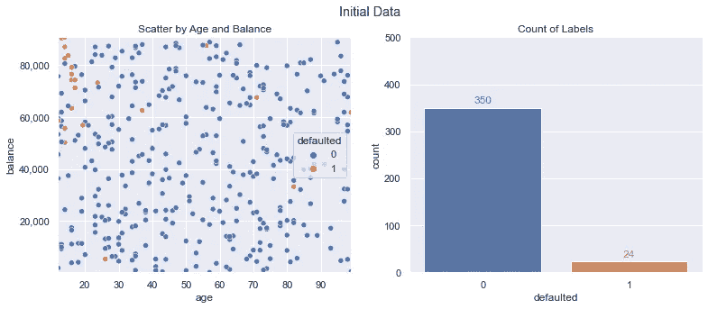
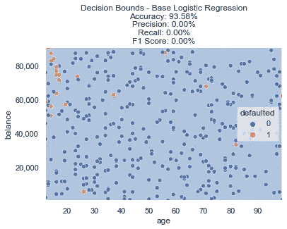
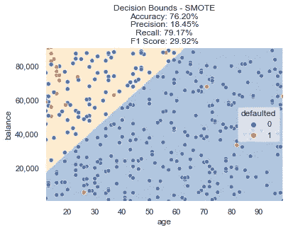
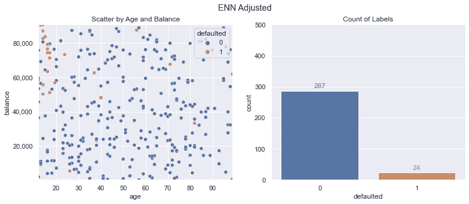
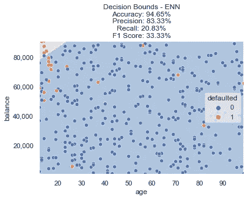
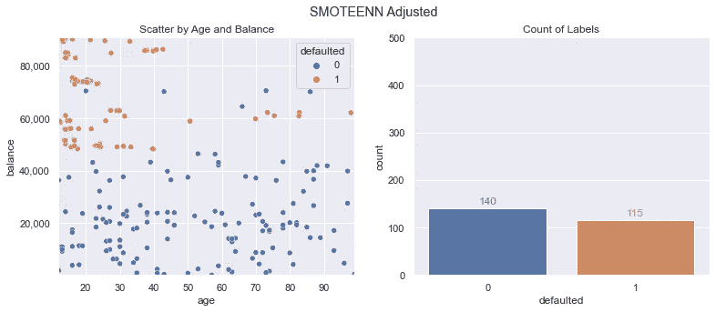
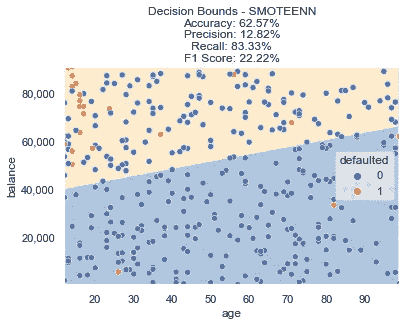
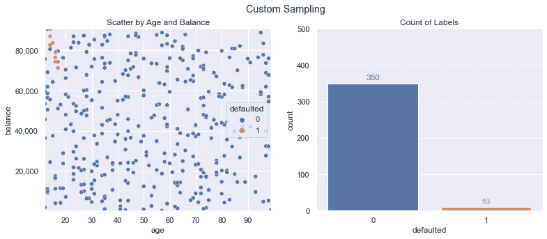
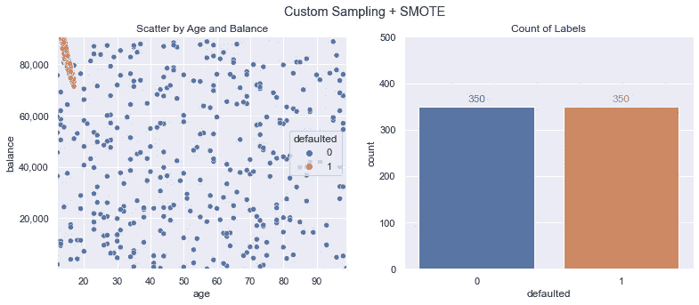
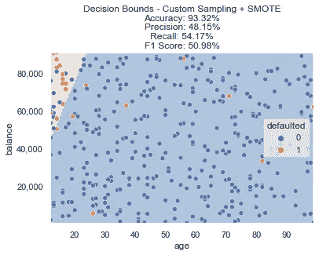

# 不平衡数据分类

> 原文：<https://towardsdatascience.com/classification-with-imbalanced-data-f13ccb0496b3?source=collection_archive---------5----------------------->

## 使用各种重采样方法来改进机器学习模型

照片由 [Unsplash](https://unsplash.com?utm_source=medium&utm_medium=referral) 上的 [Aziz Acharki](https://unsplash.com/@acharki95?utm_source=medium&utm_medium=referral) 拍摄

在具有大量不平衡类别的数据上构建分类模型可能很困难。使用过采样、欠采样、重采样组合和自定义滤波等技术可以提高精度。

在本文中，我将介绍几种不同的方法来处理分类任务中的数据不平衡。

1.  **过采样**
2.  **欠采样**
3.  **组合过采样和欠采样**
4.  **自定义过滤和采样**

# 场景和数据概述

为了演示各种类别不平衡技术，将使用一个虚构的信用卡违约数据集。在我们的场景中，我们试图构建一个可解释的分类器，它接受两个输入(年龄和卡余额)并预测某人是否会错过即将到来的付款。

下面的图表显示了数据模型。您将看到数据中有一些随机的默认值(橙色点)，但它们只占很小的百分比(374 个训练示例实例中的 24 个，约 6.4%)。这可能会使一些机器学习分类算法变得具有挑战性，并且我们可能希望在某些情况下限制我们潜在的模型选择集，以获得可解释性/监管因素。

在这种情况下，我们的目标是使用逻辑回归的准确率达到 90%以上，F1 分数达到 50%以上(精确度/召回率的调和平均值)。

按作者分类的数据概述、图像和数据

# 基线逻辑回归

对于用于比较的基线模型，我们将运行简单的 [**逻辑回归**](https://scikit-learn.org/stable/modules/generated/sklearn.linear_model.LogisticRegression.html) 并绘制决策界限，以及计算各种准确性指标。

基本逻辑回归符合我们 90%以上的准确性目标，但在精确度/召回率方面失败了。您将在下面看到为什么默认类的相对大小如此之小，模型只是将每个单个数据点预测为 ***未默认*** (由决策边界图中的浅蓝色背景表示)。

基线逻辑回归-在任何重采样之前，按作者分类的图像

然而，在我们的数据的左上方有一个明显的部分(非常年轻的高余额年龄)，似乎比随机违约更频繁。当引入重采样方法时，我们能做得更好吗？

# 过采样

处理这个问题的一种流行方法是使用 SMOTE 进行过采样。[不平衡学习](https://imbalanced-learn.org/stable/index.html)是一个 python 库，为不平衡类的分类任务提供了许多不同的方法。一种流行的过采样方法是 [SMOTE](https://imbalanced-learn.org/stable/references/generated/imblearn.over_sampling.SMOTE.html) 。

SMOTE 代表合成少数过采样技术。根据名称，您可能会直观地知道它是做什么的——用较少的数据点为类创建合成的附加数据点。它通过考虑其他特征来做到这一点——你几乎可以认为它是在我们必须添加新数据点的少数样本之间使用插值。

应用 SMOTE 很简单；我们只需传入我们的 x/y 训练数据，并取回所需的重采样数据。绘制这些新数据，我们现在显示了类的平均分布(350 个默认与 350 个非默认)。创建了许多新的*默认类*数据点，这应该允许我们的模型学习一个函数，该函数不仅仅预测每个数据点的相同结果。

SMOTE 调整后的训练数据，图片由作者提供

在这个重新采样的数据上拟合新的逻辑回归模型产生下面的决策边界。

您现在可以看到，不是蓝色背景代表整个图表的非默认决策(如我们的基线模型)，而是根据 SMOTE 重采样数据训练的新模型预测左上角部分的默认决策(用浅橙色背景表示)。

SMOTE 决策界限，作者图像

对只有几个数据点的类进行过采样肯定会导致更高的默认预测百分比，但是我们达到目标了吗？准确率下降至约 76%，但 F1 分数上升至约 30%。还没有，让我们尝试一些额外的方法，看看是否可以改进。

# 欠采样

用较少的例子对类进行过采样的反面是用较多的例子对类进行欠采样。使用[编辑最近邻](https://imbalanced-learn.org/stable/references/generated/imblearn.under_sampling.EditedNearestNeighbours.html)的方法，我们可以战略性地对数据点进行欠采样。这样做将导致以下修改的训练数据——我们仍然有 24 个*默认类*数据点，但是在我们的新训练数据集中，多数类现在只有原始 350 个数据点中的 287 个数据点。

ENN 调整训练数据，图片由作者提供

这导致以下决策界限。该模型正确地将左上角作为最频繁违约的区域，但 F1 分数并不在我们需要的位置。当然，仍有一些数据点可以捕捉，以创建一个更理想的决策边界。

ENN 决定界限，图像由作者

# 欠采样+过采样

另一种流行的方法是结合这两种方法。我们可以使用 SMOTE 进行过采样，然后使用 ENN 清理数据点。这在 imblearn 中被称为 [SMOTEENN](https://imbalanced-learn.org/stable/references/generated/imblearn.combine.SMOTEENN.html) 。

SMOTEENN 调整后的训练数据，图片由作者提供

我们的标签数更接近相等，但是我们的总数据点更少。这对我们的指标有什么影响？

SMOTEENN 决策界限，作者图片

这种方法导致了更多的极端决策边界，准确性进一步下降，F1 分数更低。

# 自定义采样+ Smote

对于我们的数据，SMOTE 似乎有所帮助，但也许我们可以更有针对性地选择想要过采样的数据点。我们可以采取的一种方法是使用一个简单的 [K 最近邻](https://scikit-learn.org/stable/modules/generated/sklearn.neighbors.KNeighborsClassifier.html)分类器，只挑选那些邻居也属于我们默认的具有某种概率阈值的类的数据点。

有了这些，我们现在有了下面的一组数据——将我们默认的类从 24 个减少到 10 个(但是希望去掉 ***有噪声的*** 数据点，这些数据点可能会扰乱我们的 SMOTE 过程并创建过于激进的插值)。

KNN 过滤数据，作者图片

执行 SMOTE(使用与前面步骤中相同的代码)会产生以下训练数据集—从我们最初的 10 个样本中创建 350 个默认的类样本:

自定义采样+ SMOTE 调整后的训练数据，图片由作者提供

我们训练了另一个新的逻辑回归模型和 ***使用这个重新采样的数据，我们现在达到了我们的目标！*** 我们可以看到，在对我们调整后的数据进行训练后，决策边界现在考虑到了那部分违约。准确率仍然是 90%以上，F1 分数高于我们 50%的目标。

自定义采样+ SMOTE 决策界限，图片由作者提供

# 摘要

在建立机器学习模型时，有多种方法来处理不平衡的类。根据您的约束、目标和数据，有些可能比其他更适用。我们还可以提出一些创造性的重采样方法，以便构建一个分类器，正确地针对我们感兴趣的决策范围和场景，过滤掉数据中可能出现的噪声。

*所有的例子和文件都可以在* [*Github*](https://github.com/bstuddard/python-examples/tree/master/smote) *上找到。*

*原发布于*[*https://data stud . dev*](https://datastud.dev/posts/smote)*。*