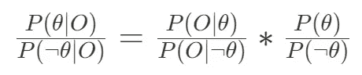
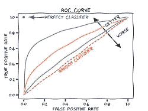
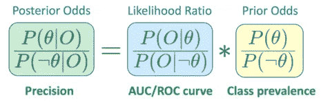

# 分类器很简单，如果你认为贝叶斯

> 原文：<https://towardsdatascience.com/classifiers-are-easy-if-you-think-bayes-d3da1afbec36?source=collection_archive---------23----------------------->

## 许多分类术语与贝叶斯概念直接对应:评估分类器变得容易多了

图片由[塔纳西斯·帕帕萨恰里亚斯](https://pixabay.com/users/papazachariasa-12696704/?utm_source=link-attribution&amp;utm_medium=referral&amp;utm_campaign=image&amp;utm_content=5029548)从[皮克斯拜](https://pixabay.com/?utm_source=link-attribution&amp;utm_medium=referral&amp;utm_campaign=image&amp;utm_content=5029548)拍摄

评估分类器可能很棘手。首先，术语相当混乱，[很难记住](https://en.wikipedia.org/wiki/Confusion_matrix)。有许多不同的评估指标可用，使用其中一个而不是另一个的原因可能很模糊。

但是这些概念不必混淆。事实上，一旦你以正确的方式构建分类问题，它们就变得相当直观。我最近说服自己，构建这个问题的正确方法是…贝叶斯方法！

在这篇文章中，我将解释很多分类术语是如何与贝叶斯概念一一对应的。这种关系很好理解，所以我在这里没有发现任何新的东西。尽管如此，它很少在教程和书籍中被提及。这很不幸，因为理解这种 1:1 的映射非常重要，原因有二:

1.  贝叶斯思维非常直观，这意味着复杂的分类术语变得更加清晰和容易记忆；
2.  评估分类器也变得更简单，因为每个评估指标的优点和缺点通过贝叶斯透镜变得直观。

我将从贝叶斯的快速回顾/介绍开始。我将在阐明分类器和贝叶斯术语之间 1:1 映射的同时做到这一点。最后，我将解释这种映射如何对您的分类器日常工作非常有用，尤其是对它们的评估。

开始吧！

# (重新)定义分类问题

首先，我们需要一些符号。假设给你一个由**特征向量** *X* 表示的数据点，你知道 *X* 可以属于两个可能的**类**之一:类 0 ( *y* =0)或类 1 ( *y* =1)。不幸的是，你不知道 *X* 属于哪一类，但是你得到了一个黑盒(分类器)，它做了一个有趣的把戏:它获取特征向量 *X* ，它进行一些计算并最终输出关于 *X* 属于哪一类的猜测( *g =* 1 表示分类器正在猜测类 1， *g =* 0 类 0)。

根据 Bayes 的说法，这是一个分类器

猜测并不总是可靠的:你在许多测试特征向量上尝试分类器，你最终得到的是正确和错误预测的混合体。因此，自然的问题是:给定这些测试，我如何量化分类器的可靠性？

# 输入贝叶斯

为了形式化评估分类器的过程，我们将使用贝叶斯规则(或定理)的概率形式，如下所示:

其中 P(…)表示概率，P(…|…)表示条件概率， *θ* 、 *θ* 和 *O* 为随机变量。

简而言之，这条规则显示的是，在进行观察后，我们应该如何将我们之前对理论的信念(最右边的项， *P(θ)/P( θ)* )改变为新的、更新的信念(最左边的项， *P(θ|O)/P( θ|O)* )，该信念考虑了观察结果。Bayes 告诉我们，正确的方法是将之前的信念乘以一个乘法因子(中间的那个词， *P(O|θ)/P(O| θ)* )，我们懂点数学就能计算出来。

这是总的想法，但是为了了解这个公式如何帮助理解分类器，我们需要更详细地研究这个公式的每个组成部分。我们将看到，在我们的分类问题中，每个术语都对应一个等价的概念。

**理论**

*θ和θ是关于世界的两种替代说法或* ***学说****；*

在我们的分类问题中，这些只是我们关于 *X* 来源的替代理论，即: *θ* = " *X* 属于第 1 类"( *y=1* )， *θ* = " *X* 属于第 0 类"( *y=0* )。我们不知道这两种理论哪一种是正确的，我们希望分类器能提供一些线索。

**先前赔率**

*P(θ)/P( θ)是我们在对世界进行任何观察之前，对理论θ为真的置信度(用赔率表示)(* ***先验赔率****)；*

在我们的分类问题中，这仅仅是 *P(y=1)/P(y=0)* 。我们应该给这个比率分配什么值？嗯，在询问分类器之前，我们对 *X* 一无所知，因此合理的做法是将 *P(y=1)/P(y=0)* 设置为等于这两个阶层在人口中的相对比例(例如，如果你衣柜中白/黑袜子的比例是 3/2，那么你分配给一只随机的白袜子的几率是 3/2)。因此，先验就是我们在分类设置中称之为 1 级的**患病率。**

小心小概率…(照片由[迪伦·诺尔特](https://unsplash.com/@dylan_nolte?utm_source=unsplash&utm_medium=referral&utm_content=creditCopyText)在 [Unsplash](https://unsplash.com/s/photos/dylan-nolte-lottery?utm_source=unsplash&utm_medium=referral&utm_content=creditCopyText) 上拍摄)

请注意，严重不平衡的数据集将导致先前的赔率非常高(因为分子 *P(y=1)* 接近 1，分母 *P(y=0)* 接近 0)或非常低( *P(y=1)* 接近 0， *P(y=0)* 接近 1)。

**观察**

*O 是一个* ***观察*** *，一个我们碰巧观察到的与理论θ和θ* 有关的世界事实

在我们的分类问题中，当我们将特征向量 *X* 馈送给分类器时，观察值 *O* 是分类器的**输出。换句话说，就是分类器对 *X* 的类的猜测。这是我们想要用来改变我们先前对 *θ的信念的信号。***

我们用二进制变量“ *g* ”来表示这个猜测。为了简单起见，我们假设分类器是猜测类 1，即 *g = 1* 。

一个拟人化的分类器正试图猜测(照片由[莱曼·汉瑟·杰罗娜](https://unsplash.com/@lhgerona?utm_source=unsplash&utm_medium=referral&utm_content=creditCopyText)在 [Unsplash](https://unsplash.com/s/photos/c3po?utm_source=unsplash&utm_medium=referral&utm_content=creditCopyText) 上拍摄)

**似然比**

P(O|θ)是理论θ赋予事实“O”发生的概率。它被称为θ的“似然函数”。同样，P(O| θ)是θ分配给“O”发生的概率。他们的比率 P(O|θ)/P(O| θ)被称为“ ***【似然比*** *”，它量化了理论θ在多大程度上给观察“O”比θ不同(更高或更低)的概率:如果差异很大(似然比非常高或非常低)，那么这一项乘以先前的赔率将导致我们信念的强烈更新，这具有直观意义。*

在我们的分类问题中， *P(O|θ) = P(g =1|y=1)* :这是分类器会猜测 X 属于第 1 类( *g=1* )的概率，在 X 确实属于 1 ( *y=1* )的场景下。如果你熟悉(令人困惑的)分类器术语，你会知道这只不过是分类器的**真阳性率(TPR)** ！

而 *P(O| θ)* 呢？这就是 *P(g =1|y=0)* ，即当实际上 *X* 属于 0 类时，分类器会猜测 *X* 属于 1 类的概率。你认出它了吗？这个术语无非就是**假阳性率(FPR)** ！

这两项都可以很容易地用你收集的关于测试特征向量的实验来计算。

现在，这两项在贝叶斯规则中以比率的形式出现， *P(g =1|y=1)/P(g =1|y=0)* 。我们刚刚展示了这可以重写为 TPR/FPR。

有印象吗？你知道任何比较 TPR 和 FPR 的分类标准吗？具体来说，TPR/FPR 的比率越高，度量就越高？是的， **AUC** ！！这个非常常见的分类器的度量只是简单地描述了贝叶斯定理中的似然比！

计算 AUC 的 ROC 曲线示例( [MartinThoma，CC0，通过 Wikimedia Commons](https://commons.wikimedia.org/wiki/File:Roc-draft-xkcd-style.svg) )

**后验概率**

*P(θ|O)/P( θ/O)是我们在观察事实 O (* ***后验概率*** *)后对理论θ的确信程度(再次表示为赔率)。根据贝叶斯规则，它可以通过将先验概率乘以似然比来计算。*

在我们的分类问题中，后验概率是 *P(y=1|g=1)/P(y=0|g=1)* 。

如果我们思考这个表达式的含义，我们会立即意识到分子 *P(y=1|g=1)* (当分类器预测时 *X* 真正属于第 1 类的概率)是分类器的**精度**！这是分类器的另一个流行的评估指标，通常被描述为 AUC 的替代。我们可以看到这两者是如何通过贝叶斯法则紧密联系在一起的。

顺便说一下，后验概率的分母 *P(y=1|g=0)* ，也是一个标准的分类指标——尽管在数据科学家中没有 precision 那么受欢迎——称为**错误发现率**。

# 分类器，重温

现在让我们欣赏贝叶斯框架给我们的关于分类器的新视角。为此，在这里重写贝叶斯规则是有用的，连同贝叶斯术语(公式的顶部)和相应的分类器概念(底部):

贝叶斯规则，分类器(底部)和贝叶斯术语(顶部)之间的对应关系(图片由作者提供)

我们发现 AUC(以及从中得出的 ROC 曲线)只不过是一种总结似然比的方法。如果我们再看看贝叶斯规则，我们认识到似然比是将先验信念转换为后验信念的乘法因子。因此*AUC 真正量化的是使用分类器改变我们的先验概率*的程度:如果乘法因子非常高或非常低，那么分类器的使用将显著改变我们关于 X 属于哪一类的信念，这是好的(AUC 将用接近 1 的值捕捉这一事实)；如果乘法因子反而接近 1，那么它对先验的影响将是可忽略的，我们的先验信念不会改变太多，并且分类器是无用的(并且 AUC 将接近 0.5)。

这使得 AUC(以及总体 ROC 曲线)成为评估分类器的一个很好的默认选项。它有一个很好的特性，就是作为一个关于分类器的度量标准，而不是其他任何东西——特别是，它不是关于数据集的(数据集的属性，比如类之间的比例，是由先前的概率捕获的)。

然而，AUC 和似然比没有捕捉到的是使用分类器后我们将得到的关于 *X* 的*绝对置信度……毕竟，似然比只是告诉我们，由于使用了分类器，先验信念发生了多大程度的变化。但是有些情况下，即使一个非常强大的贝叶斯更新也不会改变太多，在实践中，你对理论的信心 *θ* …*

例如，如果在使用分类器之前，您认为 *X* 非常非常不可能属于类别 1(假设θ的先验概率为 1/1，000，000)，那么即使使用强贝叶斯更新(假设可能性比为 100)也不会改变我们的情况(后验概率将为 100*1/1，000，000 = 1/10，000，这仍然是极小的概率)。正如我们所见，当目标样本严重失衡时，这些非常小的先验概率就会出现。

这就是精确度发挥作用的地方。*当目标不平衡时，Precision 是更好的选择，因为在这种情况下，您希望在使用分类器后查看您的信念——也就是说，您希望查看后验概率*。精度完全是 that⁴.

优秀的 AUC？在全押之前，你可能还是想检查一下你的后验概率(图片由 [cottonbro](https://www.pexels.com/@cottonbro?utm_content=attributionCopyText&utm_medium=referral&utm_source=pexels) 提供，来自 [Pexels](https://www.pexels.com/photo/person-in-white-sweater-holding-poker-chips-on-a-wooden-table-6962262/?utm_content=attributionCopyText&utm_medium=referral&utm_source=pexels)

后验概率(又名精度)的缺点是，因为它们考虑了似然比和先验概率，所以它们不仅仅是关于分类器的度量。相反，它们测量分类器的可靠性(似然比)和应用分类器的实际数据集(先验概率)之间的相互作用(实际上是乘积)。因此，尽管精度很有用，但它并不能告诉我们分类器本质上有多好，而且它会随着数据集的变化而变化(特别是，如果您在生产中获得的类的流行程度与训练集不同，它也会变化)。

# 不需要选择一个指标(如果你认为贝叶斯)

那么，哪个指标是最好的呢？像往常一样，没有明确的答案，这完全取决于你的特定问题和背景。标准的手册答案是，通常应该选择 ROC/AUC，除非目标严重失衡，在这种情况下，您希望使用 precision。

作为经验法则，这很好，但是我希望通过用贝叶斯术语来描述这个问题，你现在能够看到这个启发背后的原因。ROC/AUC 通常是一个很好的默认选择，因为可能性评估了分类器在分离两个类别时的内在性能，与类别 1 与类别 0 相比有多罕见的问题无关(编码在先前的优势中)。当目标不平衡时，Precision 是更好的选择，因为在这种情况下，即使是好的分类器也只能给我们很小的信心，在实践中，关于分类问题，你会意识到只看后验概率。

理想情况下，你希望看到两者的全貌。您既想知道分类器总体上有多好，又想知道它在实践中与数据集的交互有多好。如果你思考贝叶斯，你就能记住这两个方面，做出更好的决定。

[1]从技术上讲，AUC 是在分类器阈值的整个范围内总结 TPR/FPR 比率*，而在这个贝叶斯框架中，为了简单起见，我们保持阈值固定。*

[2]通常其形式是在分类器阈值的整个范围内取平均值，也称为平均精度。

[3]非常小的似然比实际上会转化为接近 0 而不是 1 的 AUC，但我们可以将这种情况视为以错误方式使用的良好分类器…

[4]通过贝叶斯框架，很明显整个“如果目标不平衡，不要使用 AUC”的建议只是为了避免[基础利率谬误](https://en.wikipedia.org/wiki/Base_rate_fallacy)。