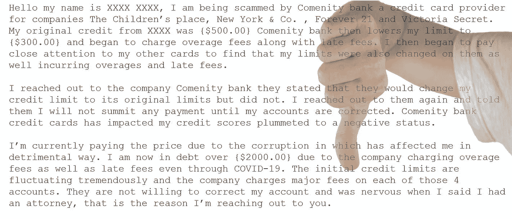
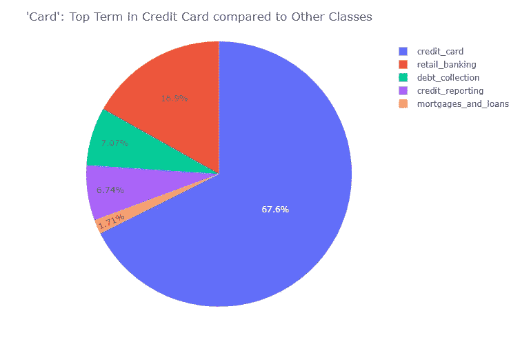
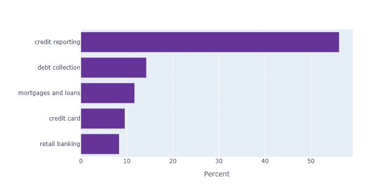
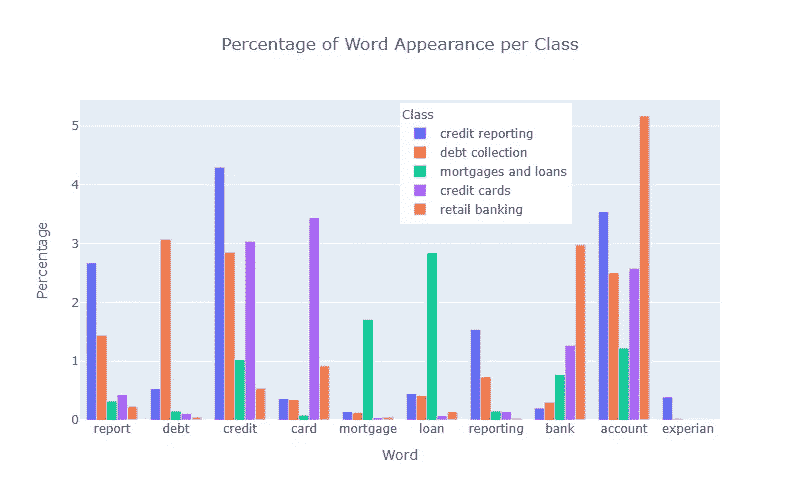

# 用自然语言处理对投诉进行分类

> 原文：<https://towardsdatascience.com/classifying-complaints-with-natural-language-processing-e3b2765d525f?source=collection_archive---------21----------------------->

## 如何使用 NLP 模型对传入的消息进行排序

图片由作者提供，[布鲁诺/德](https://pixabay.com/users/bru-no-1161770/?utm_source=link-attribution&amp;utm_medium=referral&amp;utm_campaign=image&amp;utm_content=1006395) / [皮克斯拜](https://pixabay.com/?utm_source=link-attribution&amp;utm_medium=referral&amp;utm_campaign=image&amp;utm_content=1006395)

[消费者金融保护局](https://www.consumerfinance.gov/) (CFPB)，一个 2011 年才开始运作的联邦机构，在金融领域照顾消费者的利益。作为这一使命的一部分，当消费者觉得自己受到了征信机构、银行、信用卡公司或其他金融服务提供商的不公正对待时，他们可以提出投诉。

这些投诉可供数据科学家下载，作为一个数据集，它们为构建自然语言处理(NLP)分类系统提供了一个很好的切入点。

我创建了一个模型来分析投诉，并将其分为五类。这种模型或类似的模型有许多实际用途。它可以用于简化组织的传入消息的路由和处理，并可以简化消费者的投诉提交过程。

# 类别

除了投诉的叙述和关于他们自己的信息，在线表格还要求消费者将他们提交的材料分为九个产品类别中的一个。我的数据集包括一年的提交内容，经过清理后有 16 万条叙述。出于我的目的，我最终将产品类别分为五类:

1.  信用报告
2.  收债
3.  信用卡(包括预付卡)
4.  抵押贷款(包括助学贷款、车贷等。)
5.  零售银行业务(包括储蓄和支票账户以及 Venmo 等在线服务)

对于大多数班级来说，特定的单词占主导地位。例如，该饼图显示术语“card”在信用卡类中出现 67.6%，但在抵押和贷款类中只出现 1.71%。

在我的探索性数据分析过程中，我还发现这些类是不平衡的。超过一半的提交属于信用报告类别，其他四个类别占提交的 8%到 14%。

阶级失衡

# 处理建模投诉

为了用数据训练一个机器学习模型，首先我必须把它转换成模型可以使用的形式。

1.  我把每个故事都符号化了。换句话说，我将叙述拆分成一个(小写)单个字符串的列表:["my "、" bank "、" scammed "、" me"]。
2.  从标记中，我删除了任何带有数字、标点符号或奇怪符号的字符串，如“xxxx ”, CFPB 在匿名化数据时将这些符号用作占位符。
3.  我知道像“银行”和“信贷”这样的词可能对我的模型有用，而像“the”和“if”这样的词太常见了，没有什么帮助。所以，我去掉了这些所谓的停用词。
4.  在语言学中，一个引理是字典中的关键词；这就是为什么“购买”、“购买”和“已购买”都出现在*购买*条目下。我对叙述的符号进行了符号化，将单词简化为它们的关键概念。
5.  最后，我必须将单个令牌连接回更长的字符串，以便模型能够使用它们。

经过这些转换后，数据集中的第一个叙述现在以“采购订单日发货金额收到……”开始这种文本作为人类语言没有什么意义，但可以用于 NLP 模型。

# 建模管道

在建模之前，我必须再次通过矢量化来转换数据。换句话说，我使用工具给投诉语料库中的每个词分配一个数字频率。然后，我将语料库分为训练集(80%)和测试集(20%)。

我尝试了各种类型的模型，即多项朴素贝叶斯、随机森林、决策树、KNN、梯度推进和 XG 推进，或多或少使用了默认参数。我寻找那些有大量正确分类的文本，并且在训练集和测试集之间有相似结果的模型，这意味着模型不会过度拟合数据。

从我的前三个基线模型中，我试验了各种参数来改善结果。除了调整模型的参数，我还尝试了两种矢量化技术的不同参数，计数矢量化和 TF-IDF。

我的获胜者是一个计数矢量器，带有多项式朴素贝叶斯模型，这种组合将 86%的文本分类到正确的类别中。我使用了另一个模型，Gradient Boosting，它的性能与获胜的那个相差不远，来检查它发现的对投诉分类最重要的特征(在这种情况下是单词)。

为了再次检查我的管道，我从 CFPB 的 API 下载了 1000 个新提交的内容。我通过函数运行它们，以处理用于建模的投诉，对数据进行矢量化，并将其输入到训练好的模型中。我得到了类似的结果，模型对新投诉的正确分类率为 84%。本质上，一旦模型被训练，机构理论上可以使用它来实时分类收到的提交。

# 局限性和展望

我使用的数据的一个局限性是，产品类别是由消费者自己选择的。考虑到他们可能不太了解金融服务业务，他们可能选择了错误的类别。让 CFPB 的员工仔细检查记叙文的类别会很有趣，尤其是那些被模型错误分类的类别。

即使这些分类都是正确的，这 160，000 个故事仍然需要由人类来分类。尽管幸运的是，这些投诉被标记了产品类别，但是当文本没有被预先标记时，它可能是 NLP 建模的绊脚石。(见我的[中帖](https://halpert3.medium.com/using-machine-learning-to-categorize-texts-into-topics-3650f64f663f)可能解决这个问题。)

然而，我使用的过程可以被复制用于其他 NLP 分类任务，无论是将文本分类为问题、子主题还是情感。在有人可以选择将文本标记为*我不知道*的数据集中，数据科学家可以使用标记有确定内容的文本来重新处理*我不知道*。一般来说，NLP 技术非常有用和有效。

[ [项目](https://github.com/halpert3/complaint-content-classification-nlp)的 GitHub 资源库