# 使用录音和 Python 对情绪进行分类

> 原文：<https://towardsdatascience.com/classifying-emotions-using-audio-recordings-and-python-434e748a95eb?source=collection_archive---------5----------------------->

## [实践教程](https://towardsdatascience.com/tagged/hands-on-tutorials)

## *声音和声学理论可以用于尖端的情感识别技术。下面是我们如何使用 Python* 来应用它

在过去的几年中，情感识别技术已经被广泛应用于各种不同的应用中，并且在当今的行业中似乎变得更加流行。从心理学研究到客户需求的高级分析，这些技术的潜力似乎是无穷无尽的。然而，对于不具备音频帧和声波分析专家特权的普通数据科学家来说，这些方法仍然被认为是极其复杂和难以理解的。

在本文中，我们的目标是通过展示一个使用 python 和 Librosa 的情感识别分类器的例子，使这一过程尽可能地容易和简单——这是一个 python 包，使音频文件的分析变得非常简单和直接。我们将从理论和技术上解释这个过程的每一步。

首先，为了理解如何创建一个处理音频声音并理解其内在含义的算法，我们首先需要理解人类大脑是如何做完全相同的事情的。

# 声波等等

我们要讲的第一个术语是声波。声音可以定义为通过弹性材料介质(如空气)传播的机械扰动。它以纵波形式传播(因此称为“声波”)，由交替的压缩和[稀疏](https://www.britannica.com/science/rarefaction)，或者高压[区域](https://www.britannica.com/science/pressure)和低压[区域](https://www.britannica.com/science/cyclone-meteorology)组成，以一定的速度移动。我们的身体能够产生声波的方式源于我们的声门脉冲，当我们说话时，声门脉冲操纵我们的声带。这显然对产生声音非常有帮助，但不足以真正理解它们，更不用说相互交流了。为了实现这一点，我们有自己的声道。

声道是一个描述我们口腔和咽喉中不同器官系统的术语，包括鼻腔、舌尖、牙齿、软腭等等。这个系统的目标是作为我们声门脉冲的过滤器，以某种方式理解我们产生的不同声音。为了让事情变得简单，我们可以说我们的语言是我们使用声道对我们的声门脉冲进行不同运动和操作的结果。稍后，我们将更多地讨论分析这些声波的方法，但现在，在我们深入这项任务的更务实部分时，让我们记住这些细节。

# 我们的数据集——探索声波

为了创建这个算法，我们结合了三个不同的数据集，其中包括语音记录和它们各自的标签——快乐、悲伤、愤怒、平静等。我们使用的数据集是[拉夫德斯](https://zenodo.org/record/1188976#.YDU_i-hvbIX)、[苔丝](https://tspace.library.utoronto.ca/handle/1807/24487)和 [SAVEE](http://kahlan.eps.surrey.ac.uk/savee/Download.html) 。由于最终的数据集似乎在某些特征上非常不平衡(例如，我们的男性记录比女性记录少得多，与“消极”情绪相比，“积极”情绪的数量相对较少)，我们决定首先从简化的模型开始——对男性和女性进行 3 个不同类别的分类(总共 6 个不同类别[【1】](#_ftn1)):

```
mydf.head()
```

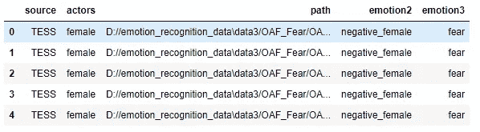

我们的数据集

```
mydf.info()
```

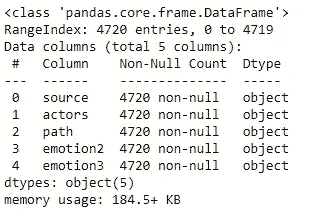

使用我们之前提到的 Librosa，我们成功绘制了一个声波的原始显示:

```
ind = np.random.randint(0,len(mydf))
data, sampling_rate = librosa.load(mydf['path'][ind], sr=44100)
emotion = mydf['emotion2'][ind]plt.title(f'Sound wave of- {emotion}')
librosa.display.waveplot(data, sampling_rate)
plt.show()
```

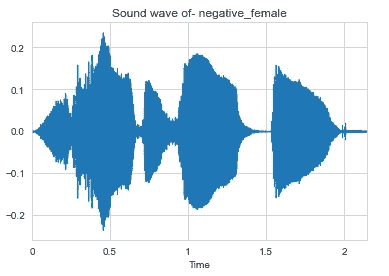

声波表示

然后，我们在时间-频率域中显示相同的信号，以便我们可以检查信号随时间变化的不同频率和幅度。这是通过对我们的数据执行傅立叶变换来实现的:

```
D = np.abs(librosa.stft(data))
librosa.display.specshow(D, sr=sampling_rate, x_axis='time', y_axis='linear');
plt.colorbar()
plt.show()
```

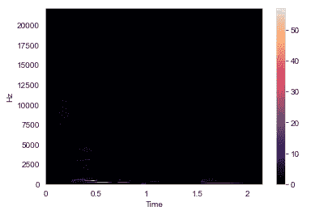

光谱的线性表示

上面的图显示了我们的频率随时间变化的线性表示，似乎没有给我们太多有价值的信息。原因是人类只能听到集中在非常小的频率和振幅范围内的声音(例如，不像狗)。为了解决这个问题，我们对频率和振幅都应用了对数标度。请注意，对数据应用对数标度后，我们不再以幅度为单位测量信号，而是以分贝为单位。

```
DB = librosa.amplitude_to_db(D, ref=np.max)
librosa.display.specshow(DB, sr=sampling_rate, x_axis='time', y_axis='log');
plt.colorbar(format='%+2.0f db')
plt.show()
```

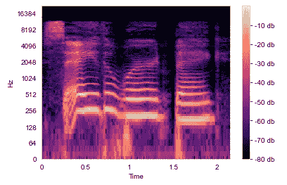

声谱图

这个结果提供了更多的信息，因为我们可以看到不同频率的分贝数随时间的变化。这种表示的正式术语叫做声谱图。由于声谱图能够近似人类对声音的感知，因此声谱图本身也被证明在情绪分类方面非常有用。

# 深入声波中

既然我们已经了解了声谱图，让我们考虑一下声波的频谱；也就是说，在我们给定的时间范围内，分贝与频率的关系如下:

```
plt.magnitude_spectrum(data, scale='dB')
plt.show()
```

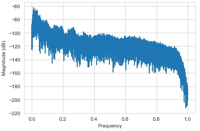

对数标度谱

对数标度谱是通过对我们的数据应用傅立叶变换，然后对结果进行对数标度变换而获得的。频谱图和对数标度频谱都是通过类似的数学运算实现的，它们之间的区别在于，前者显示的是频率和分贝随时间的变化，而后者显示的是分贝和频率之间的关系。一个细微但重要的区别。

回到我们对语音的定义，我们可以说我们的对数标度频谱是语音本身的非常准确的表示。正如我们前面提到的，语言可以被描述为声道和声门脉冲的结合。为了有效地分析我们的语音，我们需要从没有附加噪声的语音中提取声道，声道类似于滤波器，包含关于声音含义的完整信息。为了简化事情，我们需要从没有声门脉冲的语音中提取声道。

现在让我们考虑对数标度频谱的更平滑版本——频谱包络:

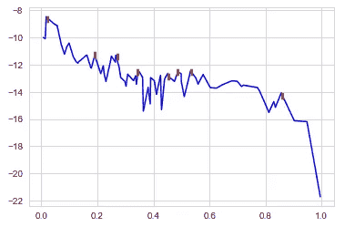

光谱包络

上面的图类似于我们的对数标度谱的主要和最重要的部分——我们可以检查主要的周期性、最大值点(用红色标记)以及总体趋势。这个频谱包络相当于我们所认为的声道，其最大值点称为“共振峰”。这些波峰包含了声音的主要“身份”,被认为是我们声波中最重要的部分。研究表明，我们的大脑可以通过共振峰来识别大部分讲话的意思。

# MFCC 是这次任务的目标

既然我们认识到了我们的声道，我们需要找到一种方法从我们的讲话中提取它。为此，我们需要再进行一些数学运算。首先，我们需要将对数标度频谱转换为 Mel 标度[【2】](#_ftn2)，然后对数据执行离散余弦变换。最后一个变换与我们之前使用的傅立叶变换相对相似，因为它也从我们当前的状态创建了一个光谱。所以基本上，我们在这里做的是在之前的光谱上创建一个光谱。我们的新频谱现在被称为倒谱，而我们的新频率被称为倒频。所有这些混乱的原因很简单——使用我们新的倒谱和倒频，我们可以很容易地区分我们的频谱包络(声道)和噪音(声门脉冲)。不仅如此，离散余弦变换已经产生了这个倒谱的主要和最重要的系数——梅尔频率倒谱系数，也称为 MFCC 系数！

幸运的是，Librosa 让这项工作变得非常简单，我们可以用一行简单的代码提取 MFCC 氏症，我们很快就会看到。

# 数据准备

要使用 MFCC 作为我们的特征，我们首先需要他们在一个同质的形状。由于我们的每一个信号波的长度都略有不同，这个过程也会导致 MFCC 波的长度不同，这对于为我们的数据创建模型没有太大的帮助。因此，我们首先使所有信号波的长度相同——比平均值短的信号被填充(使用中值)，比平均值长的信号被截断(我们还事先去掉了极端长度的信号)。

然后，我们很容易地从每个信号波形中提取出 MFCC。我们从每个信号波中提取 20 个不同的系数，每个系数包含一个给定长度的向量。注意——传统的 MFCC 数通常是 12-13，Librosa 函数的默认值是 20。第一个系数通常是携带关于语音的大多数重要信息的系数，因此在大多数情况下，使用大量的 MFCC 不会改进模型。

```
mfccs = []
for i in tqdm(X):
    mfcc = librosa.feature.mfcc(y=i, sr=44000, n_mfcc=20)
    mfcc = mfcc.T
    mfccs.append(mfcc)
```

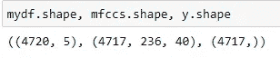

正如我们所见，每个样本包括 20 个长度为 236 的 MFCC，每个长度为[【3】](#_ftn3)。在此过程中，我们还丢弃了 3 个异常值。现在，我们终于为建模做好了准备。

# 建模

众所周知，RNN 网络非常适合语音识别任务。然而，有大量的研究证明，在很多情况下，CNN 网络可以胜过 RNN 网络。在这种情况下，我们决定使用 1 维卷积层和 1 维池层来构建 CNN 网络(因为我们的训练数据由 3 维组成)。

我们的 CNN 网络由两个模块组成，每个模块由 1 维卷积层、激活函数(“ReLu”)、1 维池层和 dropout 构成。这两个模块之后是两个完全连接的密集层和一个“SoftMax”激活功能，因为我们正在处理一个多类问题:

```
model = Sequential()model.add(layers.Conv1D(256, 5,padding='same',
                 input_shape=(236,40)))
model.add(layers.Activation('relu'))
model.add(layers.MaxPooling1D(pool_size=(8)))
model.add(layers.Dropout(0.2))model.add(layers.Conv1D(128, 5,padding='same'))
model.add(layers.Activation('relu'))
model.add(layers.MaxPooling1D(pool_size=(4)))
model.add(layers.Dropout(0.1))model.add(layers.Flatten())
model.add(layers.Dense(64))
model.add(layers.Dense(7))
model.add(layers.Activation('softmax'))
```

我们设法达到了相对较好的结果，达到了 90%的准确率。正如所料，男性录音的分数明显低于女性，因为我们的数据集中男性样本少得多:

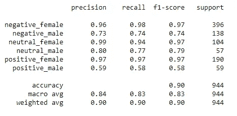

我们第一个分类模型的指标

之后，我们瞄准了一个更复杂的模型——对不同的情绪进行分类:“恐惧”、“惊讶”、“悲伤”、“厌恶”、“快乐”、“愤怒”和“中性”[【4】](#_ftn4)。样本的分布比前一次更平衡，所以我们期望这次的分类更平衡。

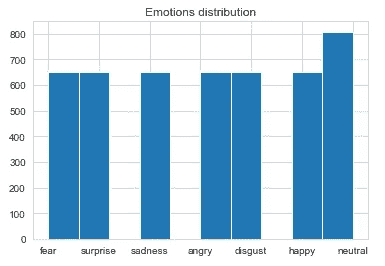

不同情绪的分布——我们第二个分类模型的目标

我们对数据进行了与之前相同的处理，并运行了完全相同的模型。这些是我们得到的结果:

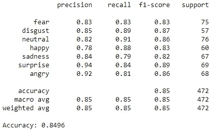

我们第二个分类模型的指标

正如所料，这种分类看起来相对平衡，结果也相当不错。我们还可以观察混淆矩阵，它表明我们的绝大多数样本被正确分类:

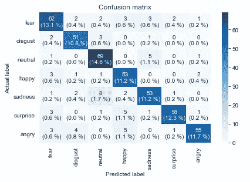

有趣的是，有相当多被预测为‘中性’的样本结果是‘悲伤’(1.5%)。这也许可以用声音表达悲伤时的微妙特征来解释，这些特征很可能被误认为与中性情绪有关。

然后，我们想进一步检查这些类之间的关系，所以我们使用 PCA 和 KMeans 聚类进行降维，将数据分为 7 个聚类。我们的希望是找到 7 个独特的群体来对应我们的 7 种情绪。我们通过检查分类标签和类别预测之间的相关性并查看与不同标签相关的类别分布，来检查分类标签和类别预测之间的关系。最终我们得出了这个散点图:

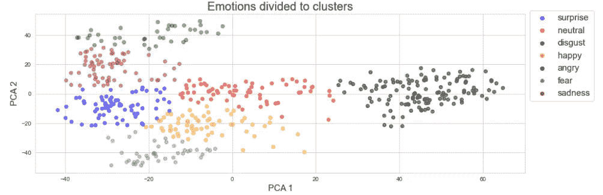

我们可以清楚地检查 7 个不同的集群。我们注意到的第一件事是“愤怒”似乎相对独立于其他情绪。“中性”似乎位于中间，这当然是有意义的，而且它和“悲伤”之间也有一些接近，这可以解释我们之前关于两者之间联系的假设。“厌恶”也接近于“悲伤”，而“快乐”接近于“惊讶”——两者似乎都很直观。解释“恐惧”的位置有点困难，因为它最近的邻居是“快乐”，这没什么意义。在这种情况下，I t 与“惊喜”的接近似乎更直观。

总的来说，这些结果证明了即使使用一个简单的 CNN 网络，我们也可以以很高的可信度从音频记录中对情绪进行分类，甚至检查它们之间的关系。

# 最后的话

音频分类之所以如此有趣，是因为复杂的理论可以用普通的实用方法来表达。数学程序可以用来成功地实现这些概念的方式是不可思议的。幸运的是，大部分艰苦的工作都是由预制工具完成的。然而，了解这些工具背后的理论概念仍然是成功构建和使用这些模型的关键。

我们希望这篇文章有助于阐明这个迷人的主题，使它更容易理解，也希望更有用。

欲了解更多信息，请点击查看我们的项目。

# 参考

-[https://www . Microsoft . com/en-us/research/WP-content/uploads/2016/02/CNN _ aslptrans 2-14 . pdf](https://www.microsoft.com/en-us/research/wp-content/uploads/2016/02/CNN_ASLPTrans2-14.pdf)

-[https://www . izotope . com/en/learn/understanding-spectrograms . html](https://www.izotope.com/en/learn/understanding-spectrograms.html)

——【https://arxiv.org/pdf/2007.11154.pdf 

-[https://arxiv.org/pdf/2012.14781.pdf](https://arxiv.org/pdf/2012.14781.pdf)

——[https://saurabhgarg1996.github.io/files/6.pdf](https://saurabhgarg1996.github.io/files/6.pdf)

-[https://www.youtube.com/watch?v=4_SH2nfbQZ8&t = 1357s](https://www.youtube.com/watch?v=4_SH2nfbQZ8&t=1357s)

*   [http://www . socsci . UCI . edu/~ JSP rouse/courses/S12/155/lectures/lectures 4](http://www.socsci.uci.edu/~jsprouse/courses/s12/155/lectures/lecture4)
*   [https://librosa.org/doc/latest/index.html](https://librosa.org/doc/latest/index.html)

[【1】](#_ftnref1)数据框中的列“情绪 2”是我们的第一个目标，列“情绪 3”是我们的第二个目标。本文稍后将对这两种方法进行更详细的描述。

[【2】](#_ftnref2)一种以更真实的方式模拟人类声谱的音阶，因为人耳无法轻易识别高于 500Hz 的频率变化。

[【3】](#_ftnref3)为了简单起见，我们调换了 MFCC 的形状。

注意，为了达到平衡的分类，我们使用了具有更多样本的情感。