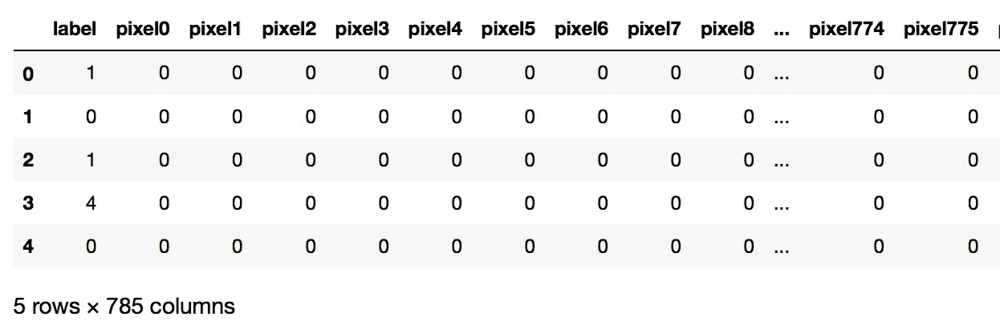
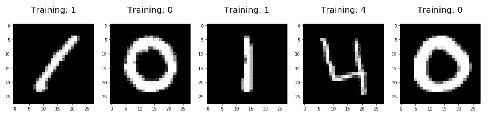
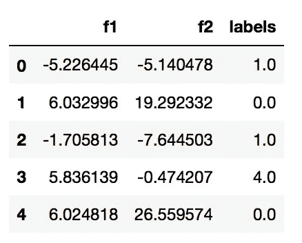
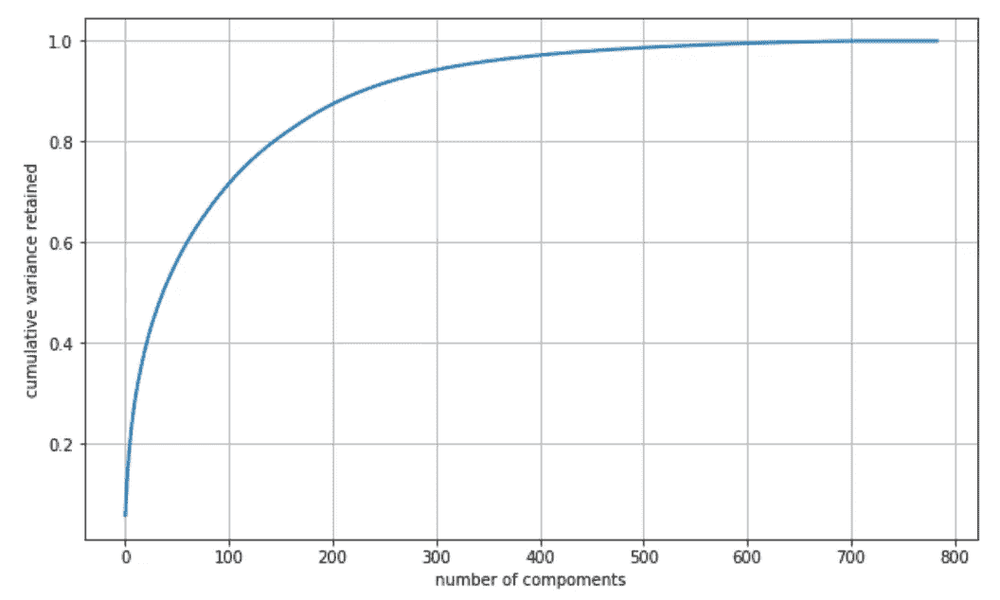
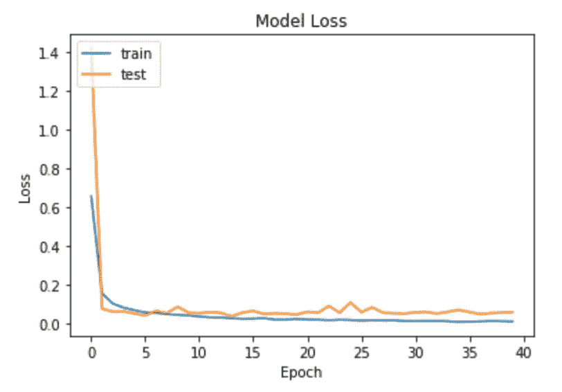
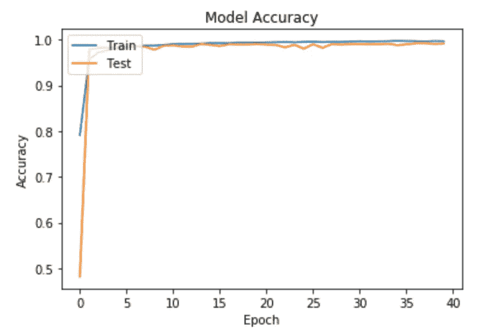

# 使用 PCA +深度学习对 MNIST 数字进行分类

> 原文：<https://towardsdatascience.com/classifying-mnist-digits-using-pca-deep-learning-852aeaff48a5?source=collection_archive---------15----------------------->

## *用 PCA 对 MNIST 数据进行预处理，建立更高效的 CNN 模型*


由[尼克·希利尔](https://unsplash.com/@nhillier?utm_source=unsplash&utm_medium=referral&utm_content=creditCopyText)在 [Unsplash](https://unsplash.com/s/photos/numbers?utm_source=unsplash&utm_medium=referral&utm_content=creditCopyText) 上拍摄

## 什么是主成分分析？

数据科学中的许多重要概念之一包括主成分分析(PCA)，这是一种无监督的学习方法。它通常被用作大型数据集的降维方法或简化其复杂性，这是通过将一组大型变量转换为一组小型变量，同时保留数据集中的大部分变量来实现的。PCA 通过将数据几何投影到更低的维度上来减少数据，这些维度又被称为主成分(PC)。该方法的目标是通过使用最少的主成分找到我们数据的最佳摘要，通过选择我们的主成分，我们最小化原始数据与其在主成分上的投影值之间的距离。

## 什么是深度学习？

深度学习是机器学习的一个子集，受人脑结构的启发。深度学习算法试图通过不断分析具有给定逻辑结构的数据，得出与人类相似的结论。为了实现这一点，深度学习使用了一种多层结构的算法，称为神经网络。无论是 Alexa、Siri 还是 Cortana，深度学习都有助于他们理解语音和语言。深度学习使用不同类型的神经网络架构，如对象识别、图像和声音分类以及针对不同类型问题的对象检测。深度学习算法训练的数据越多，它就越准确。

## MNIST 数据集

[MNIST 数据集](https://www.kaggle.com/c/digit-recognizer)(修改后的国家标准与技术研究所数据库)是深度学习爱好者中更受欢迎的数据集之一。该数据集包含 42，000 个带标签的灰度图像(28 x 28 像素),这些图像是训练集中从 0 到 9 的手写数字，以及 28，000 个未带标签的测试图像。

在这篇博客中，我将演示如何使用 PCA 建立 CNN 模型来识别 MNIST 数据集中的手写数字，以实现高精度。

## 要遵循的步骤

1.  **导入库并加载数据集:**导入必要的库、包和 MNIST 数据集
2.  **数据预处理**
3.  **PCA 实施**
4.  **创建 CNN 模型**
5.  **训练和评估模型**

## 1.导入库并加载数据集

我们首先导入训练数据所需的所有必要的库，然后加载我们的 MNIST 数据集，可以在这里找到—您也可以使用 keras.datasets 来导入 mnist 数据集！

```
# Import Libraries
%matplotlib inline
import pandas as pd
from sklearn.decomposition import PCA
import numpy as np
import matplotlib.pyplot as plt
from sklearn.preprocessing import StandardScaler
from keras.utils.np_utils import to_categorical
from sklearn.preprocessing import LabelEncoderfrom tensorflow.keras.layers import Input,InputLayer, Dense, Activation, ZeroPadding2D, BatchNormalization, Flatten, Conv2D
from tensorflow.keras.layers import AveragePooling2D, MaxPooling2D, Dropout
from tensorflow.keras.models import Sequential,Model
from tensorflow.keras.optimizers import SGD
from tensorflow.keras.callbacks import ModelCheckpoint,LearningRateScheduler
import keras
from tensorflow.keras import backend as K
from sklearn.preprocessing import StandardScaler
from scipy.linalg import eigh# Load the Dataset
train = pd.read_csv("data/train.csv")
test = pd.read_csv("data/test.csv")
train.head()
```



作者图片

数据集的样本图像:



作者图片

## 2.预处理数据

首先，我们将数据集分成训练集和测试集

```
y_train = train['label']
X_train = train.drop(['label'], axis=1)
X_test = test
X_train.shape, y_train.shape, X_test.shape#Output
((42000, 784), (42000,), (28000, 784))X_train = X_train/255
X_test = X_test/255
```

注意，我们没有 y_test，因为测试集的标签没有给出。接下来，我们将标准化数据，这在 PCA 实施中很重要，因为它将原始数据投影到最大化方差的方向上。

## 3.PCA 实施

现在，我们将对我们的数据实施 PCA。首先，我们将标准化我们的数据，并计算我们的协方差矩阵。协方差可以认为是变量之间线性关系的方向。协方差矩阵是降维的第一步，因为它给出了强相关特征数量的概念，并且它通常是降维的第一步，因为它给出了强相关特征数量的概念，以便可以丢弃那些特征。

```
standardized_scalar = StandardScaler()
standardized_data = standardized_scalar.fit_transform(X_train)
standardized_data.shape# Output
(42000, 784)cov_matrix = np.matmul(standardized_data.T, standardized_data)
cov_matrix.shape# Output
(784,784)
```

接下来，我们将计算特征值和特征向量。协方差矩阵(或相关性)的特征向量和特征值描述了 PCA 的来源。特征向量(主成分)决定新属性空间的方向，特征值决定其大小。

```
# Calculate eigenvalues and eigenvectors
lambdas, vectors = eigh(cov_matrix, eigvals=(782, 783))
vectors.shape# Output
(784,2)vectors = vectors.T
vectors.shape
# (2, 784)
```

然后，我们将计算单位向量和它的新坐标。单位向量是大小为 1 的向量，我们试图找到使方差最大化的单位向量。

```
new_coordinates = np.matmul(vectors, standardized_data.T)
print(new_coordinates.shape)
new_coordinates = np.vstack((new_coordinates, y_train)).T# Output
(2, 42000)df_new = pd.DataFrame(new_coordinates, columns=["f1", "f2", "labels"])
df_new.head()
```



作者图片

让我们来看一下跨多个组件(784)保留的累积方差的可视化:



作者图片

## 4.创建 CNN 模型

在构建 CNN 模型之前，我们需要采取一些预处理步骤。这包括将训练集转换为一个数组，对输入数据进行整形以使其符合模型预期的形状，以及对图像标签进行编码。

```
X_train = np.array(X_train)
y_train = np.array(y_train)X_train = X_train.reshape(X_train.shape[0], 28, 28, 1)
print(X_train.shape, y_train.shape)# Output
(42000, 28, 28, 1) (42000,)nclasses = y_train.max() - y_train.min() + 1
y_train = to_categorical(y_train, num_classes = nclasses)
print("Shape of ytrain after encoding: ", y_train.shape)# Output
Shape of ytrain after encoding:  (42000, 10)
```

现在我们可以建立我们的 CNN 模型，我建立了一个 2D CNN 模型，有 3 层和 1 个完全连接的层。

```
input_shape = (28,28,1)
X_input = Input(input_shape)# layer 1
x = Conv2D(64,(3,3),strides=(1,1),name='layer_conv1',padding='same')(X_input)
x = BatchNormalization()(x)
x = Activation('relu')(x)
x = MaxPooling2D((2,2),name='maxPool1')(x)
# layer 2
x = Conv2D(32,(3,3),strides=(1,1),name='layer_conv2',padding='same')(x)
x = BatchNormalization()(x)
x = Activation('relu')(x)
x = MaxPooling2D((2,2),name='maxPool2')(x)
# layer 3
x = Conv2D(32,(3,3),strides=(1,1),name='conv3',padding='same')(x)
x = BatchNormalization()(x)
x = Activation('relu')(x)
x = MaxPooling2D((2,2), name='maxPool3')(x)
# fc
x = Flatten()(x)
x = Dense(64,activation ='relu',name='fc0')(x)
x = Dropout(0.25)(x)
x = Dense(32,activation ='relu',name='fc1')(x)
x = Dropout(0.25)(x)
x = Dense(10,activation ='softmax',name='fc2')(x)conv_model = Model(inputs=X_input, outputs=x, name='Predict')
conv_model.summary()
```

经过 40 个纪元，我们达到了 99.8%的准确率！



作者图片

## 摘要

从这篇文章中，我们使用神经网络对手写数字进行分类，并使用 PCA 对数据进行预处理。有关五氯苯甲醚及其用途的更多信息，请参见以下有用的文章。感谢您的阅读，所有代码都在我的 [Github](https://github.com/mkosaka1/MNIST_PCA_CNN) 上！:)

<https://medium.com/towards-artificial-intelligence/principal-component-analysis-pca-with-python-examples-tutorial-67a917bae9aa>  <https://medium.com/analytics-vidhya/a-deep-dive-into-principal-component-analysis-pca-4e8a6d5a6386> 