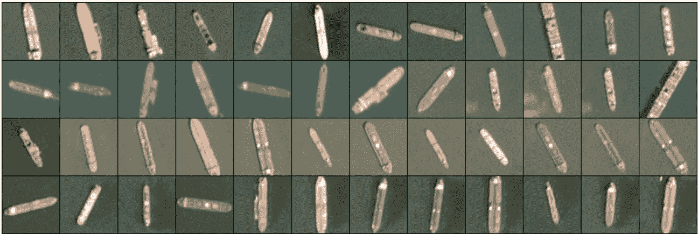
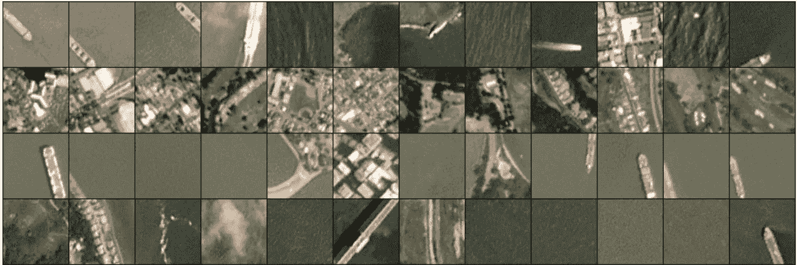
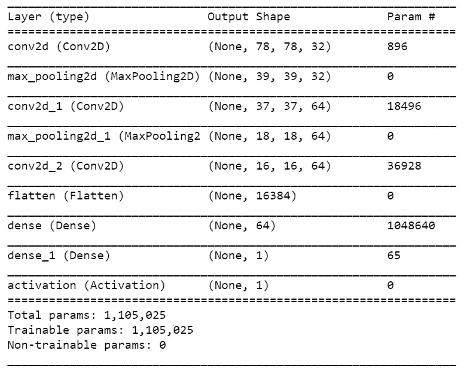
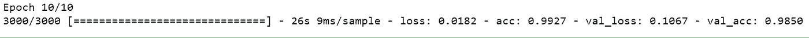
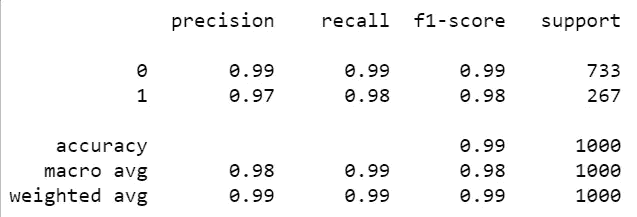
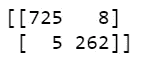

# 用神经网络对卫星图像中的船舶进行分类

> 原文：<https://towardsdatascience.com/classifying-ships-in-satellite-imagery-with-neural-networks-944024879651?source=collection_archive---------22----------------------->

## 如何从零开始训练 CNN 的一课


内特·切尼在 [Unsplash](https://unsplash.com?utm_source=medium&utm_medium=referral) 上的照片

没有什么比[谷歌地图](https://www.google.com/maps)更能说明卫星图像的无处不在。一项完全免费的服务为任何人提供互联网接入，获取整个地球的卫星图像。虽然谷歌地图是免费的，但也存在其他付费的替代品，它们可以更频繁地为商业用途拍摄地球表面的照片。世界各国政府也将其卫星用于许多国内用途。

由于卫星图像的可用性超过了人类手动浏览它们的能力，因此必须开发一种对它们进行分类的自动化方法。图像分类是计算机视觉中的一个基本问题，神经网络提供了一个有趣的解决方案。

# 对海湾中的船只进行分类

卫星图像数据集中的船只包含 4000 张船只和非船只的注释图像。取自[星球 API](https://developers.planet.com/) 的 1000 张飞船图像统一为 80px x 80px，包含一艘处于不同方位的飞船，但总是在中心附近。



取自数据集的示例。CC-BY-SA 许可下的所有图像。

在 3000 幅非船只图像中，大约 1000 幅描绘了随机特征，如海洋或建筑物，大约 1000 幅描绘了船只的部分但不完整的图像，最后 1000 幅描绘了被其他机器学习模型错误标记的图像。



取自数据集的示例。CC-BY-SA 许可下的所有图像。

附带的 JSON 文件包括图像的 ID 和图像是否包含船只的标记，相应地用 1 或 0 表示。此外，它还包含每个图像的实际像素值。

排列为 19，200 个整数值，前三分之一包含红色通道中的所有像素值，接下来是绿色通道中的像素值，最后三分之一包含蓝色通道中的像素值。由于像素值是在数据集中明确说明的，实际的图像本身在技术上不需要下载，但它们是一个很好的参考。

为了对这些图像进行分类，将训练一个卷积神经网络(CNN)。作为一种人工神经网络，CNN 模仿大脑中的神经元，特别是那些用于视觉的神经元。网络中的每个神经元都开发了一个独特的特征图，可以识别图像中的特征。在浅层网络中，要素地图可能会识别垂直线或水平线。但是，随着图层被添加到网络中，要素地图可能会识别更复杂的结构，例如眼睛，或者在本例中是船只。

存在各种库来编写 CNN，但是本教程将使用 Keras 来介绍 TensorFlow。

# Python 中的卷积神经网络

```
import tensorflow as tf
import pandas as pd
import numpy as np
```

在训练任何东西之前，使用基本导入。TensorFlow 是一个机器学习库，主要关注神经网络。Pandas 是一个电子表格类型的库，用于帮助解析数据。最后，NumPy 有助于快速有效地处理数字。

```
# Read the data
df = pd.read_json("shipsnet.json")
```

这一行只是导入 JSON 文件，并将其作为数据帧读取。

```
# Normalize and reshape the image data
df["normalized_data"] = df["data"].apply(lambda x: (np.array(x) / 255).reshape(80, 80, 3))
```

像素值存储在标题为“数据”的数据框的列中事实上，这些像素值还不能被 CNN 处理。相反，新数据被转换成一个 NumPy 数组，然后除以 255 来对值进行规范化。所有 19，200 个值现在应该是介于 0 和 1 之间的某个值。接下来，数据被整形为 80 x 80 x 3 的矩阵，这样它就被格式化为一张图片。

```
# Define X and Y
X = df["normalized_data"]
Y = df["labels"]# Split the data into training and testing sets. Use a 75/25 split
from sklearn.model_selection import train_test_split
(X_train, X_test, Y_train, Y_test) = train_test_split(X, Y, test_size=0.25, random_state=42)
```

定义了 X 和 Y 值。y 是标题为“标签”的列，包含 1 和 0 的数组，以定义图像是否包含船。X 是从像素值中提取的归一化图像数据。

定义了 X 和 Y 后，它们被分成 75/25 的训练集和测试集。因此，该模型将在 3000 幅图像上进行训练，并在 1000 幅其他图像上验证其结果。

```
# Transform the training and testing data into arrays
X_train = np.array([x for x in X_train])
X_test = np.array([x for x in X_test])
Y_train = np.array([y for y in Y_train])
Y_test = np.array([y for y in Y_test])
```

不幸的是，TensorFlow 不接受 Pandas 系列，因此训练和测试数据被转换为数组。

```
from tensorflow.keras import datasets, layers, models
from tensorflow.keras.layers import Activation# Starts the model with a sequential ANN
model = models.Sequential()
```

经过几次导入，真正的 CNN 已经准备好了。CNN 被初始化为一个[序列模型](https://keras.io/guides/sequential_model/#:~:text=A%20Sequential%20model%20is%20appropriate,%22layer1%22)%2C%20layers.)，它确保每一层接收一个输入和一个输出。

```
# Adds the first convulsion layer and follows up with max pooling
model.add(layers.Conv2D(32, (3, 3), activation='relu', input_shape=(80, 80, 3)))
model.add(layers.MaxPooling2D((2, 2)))
```

前两层被添加到模型中。第一层是卷积层，其使用“ [ReLu](https://en.wikipedia.org/wiki/Rectifier_(neural_networks)) ”激活函数，并期望 80×80×3 的输入张量，即训练图像的精确尺寸。32 表示图层输出的维度，而(3，3)表示卷积窗口的大小，在本例中为 3px x 3px。

添加的下一层用于最大池化，其池大小为 2 x 2。

```
# Add additional hidden layers
model.add(layers.Conv2D(64, (3, 3), activation='relu'))
model.add(layers.MaxPooling2D((2, 2)))
model.add(layers.Conv2D(64, (3, 3), activation='relu'))
```

与前面的代码非常相似，这两行代码是网络的附加隐藏层。虽然输出大小发生了变化，但这些层遵循与前两层相同的基本模式。

```
# Flattens the input into a 1D tensor
model.add(layers.Flatten())# Makes the input more readable for classification
model.add(layers.Dense(64, activation='relu'))# Classifies - ensure the input in the number of classes, indexed
# at 0
model.add(layers.Dense(1))# Final activation function
model.add(Activation('sigmoid'))
```

第一行简单地将张量展平为一维，这将使处理更容易。下一行，第一个密集层，格式化结果输入。

下一个密集层与分类有关。因此，传递的唯一参数是类的数量，索引为 0。因为在这个例子中有两个类，ship 或者 not-ship，所以传递 1。

最后，添加一个激活层，告知是否激活神经元。

```
model.summary()
```

在继续下一步之前，花点时间用总结的方法回顾一下模型。输出应该如下所示:



模型总结。图由作者制作。

请注意每一行是如何描述 CNN 内置的一个层的，以及它的输出形状和参数数量。

```
# Compile the model
# Use binary_crossentropy because there are only 2 classes present
model.compile(loss='binary_crossentropy', optimizer='rmsprop', metrics=['accuracy'])
```

这一行只是编译模型。如果添加图层时存在输入/输出维度问题，程序会在这一步通知您。

损失函数采用二元交叉熵，因为该模型仅使用两个类别。使用更多的类将需要一些不同的东西。损失函数的完整列表可在[这里](https://keras.io/api/losses/)查看。优化器被当作 RMS prop 算法，但是其他的也是可用的[这里](https://www.tensorflow.org/api_docs/python/tf/keras/optimizers)。度量参数只是查看需要优化的内容，在本例中就是准确性。

```
# Train the model
gen_model = model.fit(X_train, Y_train, epochs=10, validation_data=(X_test, Y_test))
```

终于到了拟合模型的时候了。传递训练和测试数据非常简单。epochs 参数本质上是告诉模型要经历多少次迭代。

设定时代的回报边际递减。数字越大，通常精度越高，但是精度的每一次提高都会降低，直到接近数据集能够产生的最大精度。此外，更多的纪元将需要更长的时间来运行。对于这个数据集，10 将返回好的结果。

当模型训练时，每个历元的输出如下所示:



为模型定型的输出。作者制作的图

在返回样本数并给出训练历元的时间后，该行还将返回其自己的训练图像集的模型的损失和准确性，以及其验证集的损失和准确性。

在这种情况下，在第 10 个时期，该模型在其自己的训练图像上实现了 99.27%的准确性，在该模型从未见过的图像上实现了 98.5%的准确性。

# 估价

在过度庆祝之前，应该对结果进行更深入的分析。

```
# Evaluate the model
from sklearn.metrics import classification_report, confusion_matrix
predictions = model.predict(X_test)
print(classification_report(Y_test, predictions.round()))
print(confusion_matrix(Y_test, predictions.round()))
```

这些行导入一些函数来帮助评估模型的准确性，将模型应用到测试数据，并打印分类报告和混淆矩阵。

分类报告:



模型的分类报告。图由作者制作。

测试数据由 1000 幅图像组成，其中 733 幅是非舰船，267 幅是舰船。非船舶的精度为 99%，略高于船舶的精度 97%。本质上，对于所有被模型归类为船只的图像，97%都是真实的船只。该模型能够分别回忆起 99%的非船只图像和 98%的非船只图像。

总的来说，对于一个简单的 CNN 来说，这些都是很好的结果。

现在，看看混乱矩阵:



模型的混淆矩阵。图由作者制作。

在 733 幅非船只图像中，725 幅被正确识别，8 幅被误标为船只。这些都是误报。

在 267 张舰船图像中，262 张被正确识别，5 张被误标为非舰船。这些是假阴性。

# 保存和加载模型

如果每次需要的时候都需要训练，CNN 可能不会很有用。在这种情况下，训练时间只需要几分钟，但在更深的具有更多纪元的网络上，训练可能需要几个小时甚至几天。因此，有一个简单的方法可以调用来保存整个模型。

```
# Save the model for later use
model.save("ShipCNN.h5")
```

save 方法只接受路径名，将其保存为 H5 文件。

```
# Load a model
new_model = tf.keras.models.load_model("model.h5")
```

加载预先保存的文件也相当简单。调用 summary 方法来检查模型的架构是否符合预期也是一个好主意。

# 结论

使用卫星图像训练 CNN 提供了完美的数据集。所有的图像都是同样的大小，在基本相同的角度和距离拍摄，每艘船都保留了俯视图。虽然改变这些参数中的任何一个都会使分类问题变得更加困难，但船只图像展示了神经网络应用于计算机视觉问题的能力。

使用的 CNN 相对简单，但仍然只需要几分钟的训练就可以返回很高的准确度。接近人类水平的表现，1000 张图像中只有 13 张被错误标记。虽然应用程序是理想化的，但潜力是显而易见的。