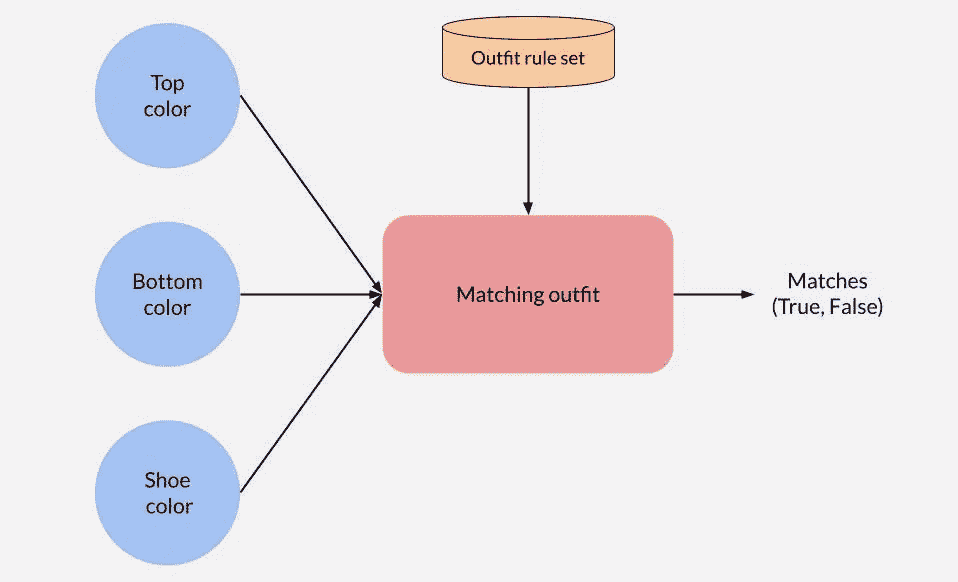

# 借助模糊逻辑对简单配色服装进行分类

> 原文：<https://towardsdatascience.com/classifying-simple-color-matching-outfits-with-the-help-of-fuzzy-logic-fc9733ce8346?source=collection_archive---------24----------------------->

## [实践教程](https://towardsdatascience.com/tagged/hands-on-tutorials)

## 跟随我们创建一个智能助手，它将帮助我们决定一套服装是否有匹配的颜色

# 概观

在下面的文章中，我们将介绍一个概念验证项目的完整开发过程，它将帮助我们对由衬衫、下装和鞋子组成的简单配色进行分类。本文将分为以下几个部分:

*   *了解问题(问题的起源)*
*   *快速回顾我们的主要工具‘模糊逻辑’*
*   *HSV 颜色表示概述*
*   *建立模糊逻辑模型*
*   *添加装备规则过滤匹配的装备*
*   *最终结果和结论*

# 了解问题

在 Covid 来到我们国家之前，大学里的一天，我和一些同事正在等老师开始讲课，突然出现了服装的话题。在谈话的某个时候，我们问我们的色盲朋友，他是如何选择每天穿的衣服的。他继续解释说，他过去常常依靠家人告诉他衣服是否相配，自从他搬出去开始独立生活后，他再也不能向他们求助了。他目前的方法要求他通过识别服装的品牌或图案来猜测或记住好的服装，这听起来非常适得其反。

我无法想象看不到完整色谱的概念及其对我日常生活的影响，这让我开始思考颜色和时尚之间的关系。那天晚些时候，我决定联系 Valeria，她是我的朋友，目前正在学习时尚和设计，希望获得一些知识，并找到解决我朋友问题的方法。我问她在选择服装配色方案时遵循的流程，在一次富有成效的长谈后，我发现自己在想，“难怪没有一个通用的解决方案，它比我想象的更加复杂和主观！”。我试图缩小指导方针的范围，这些是经常出现的规则:

*   *中性色(白色、黑色、灰色、藏青色等。)可以适合任何装扮。*
*   *有暖色(红色)和冷色(蓝色)两种颜色，可以用不同的组合来搭配一套服装。*
*   *每种颜色都有不同的色调，搭配衣服时也要考虑到这一点。*

当时我正在上机器学习的入门课。我天真地认为，很可能有一种简单的方法来训练一个模型来对匹配的衣服进行分类，并且这个模型会从所有输入的数据中推断出这些规则。最初的想法相对简单明了:

*   *-收集匹配和不匹配服装的数据并进行预处理
    -用数据训练神经网络
    -检查结果并进行调整
    -使用模型将三种颜色的任意组合分类为匹配/不匹配*

这个计划听起来可行，但是当我开始设计一个更具体的解决方案时，我发现有一些主要的细节我没有考虑进去。

我遇到的第一个障碍与颜色有关，这个话题我很快就会谈到。第二个障碍与训练模型和收集使其工作所需的大量数据有关。有很多关于时尚的数据库，但没有一个是以颜色为中心的。我想过自己收集数据，但这也带来了一些耗时的问题。

这一切都开始崩溃，看起来像一个太复杂而无法完成的项目，所以随着时间的推移，我失去了兴趣，并将其添加到“有趣但目前不可行”的项目列表中。直到我在计算机智能课程上听了一次特别的讲座，我才重新获得了继续这个项目的动力，这次脑子里有了一个新概念:模糊逻辑。

# 模糊逻辑概述

为了使这篇文章简短，我将用简单的术语总结我对模糊逻辑的理解，足以让你完成这个项目的其余部分。我绝不是这方面的专家，因为我自己刚刚才知道，所以如果你想要更深入地解释模糊逻辑，我建议你看看[https://www.guru99.com/what-is-fuzzy-logic.html](https://www.guru99.com/what-is-fuzzy-logic.html)或[电脑爱好者关于这个话题的视频](https://www.youtube.com/watch?v=r804UF8Ia4c)。

我们首先需要回到“经典逻辑”。经典逻辑依赖于离散的、定义明确的值，如“真”或“假”。这些值之间没有混淆，它们可以完整地描述一种状态或结果，例如，如果加热器是“开”或“关”，则没有类似“稍微开”的中间值。另一方面，模糊逻辑可以使用没有严格定义的“中间”值。让我们来看一个最常见的例子:温度。

假设你想创建一个逻辑系统，当房间很热的时候关掉一会儿加热器，问题是，你如何定义“热”？热、暖、冷没有明确的界限；它似乎以连续的方式转变，并且在某一点上主观上变暖或变冷。模糊逻辑允许您定义没有明确界限的变量集，如['热'、'暖'、'冷']，并使用它们和一组规则来确定不同的结果。一个规则的例子可以是:如果房间“热”，关掉加热器“几分钟”。请记住，您需要指定这些模糊集及其隶属函数，这有助于模型计算某个值属于某个子集(模糊值)的程度。让我们看一个例子:

来源:[https://commons . wikimedia . org/wiki/File:Fuzzy _ logic _ temperature _ en . SVG](https://commons.wikimedia.org/wiki/File:Fuzzy_logic_temperature_en.svg)

这是“温度”隶属函数的图形表示。它解释了与温度变量相关的模糊集['冷'，'暖'，'冷']。给定一个明确的值，可以认为是变量的可测量值(在本例中是以摄氏度或华氏度为单位的温度)，该函数将确定每个模糊元素描述该值的程度。在这个例子中，我们看到枢轴被放置成与“冷”和“暖”相交。我们可以推断，这个地方的温度并不完全冷，但也没有热到可以认为完全暖和。如果将其描述为 cold 更准确，它将给出与 cold 最匹配的模糊值。
在本例中，我们看到的是梯形隶属函数，但您可以使用不同的函数来映射每个变量，包括:三角形、高斯形、钟形等。

一旦我们模糊了温度的明确值，我们就可以使用一组以直观方式描述的规则来指定预期输出，例如:

*   如果温度“很高”,关闭加热器“几分钟”
*   如果温度“温暖”,关闭加热器“几分钟”

这些规则将被推理机用来计算输出。最后，我们可以通过将结果输出映射到一个描述分钟数['一些'，'几个'，…]的隶属函数来消除其模糊性。这个反模糊值将给出数字结果，表明我们应该关闭加热器的精确分钟数。

# 理解数字颜色表示

鉴于我们的助手将生活在数字空间，我们所知道的颜色将需要用计算机能够处理的方式来表示。颜色有几种数字表示，最著名的是 RGB(红绿蓝)。

自然，我们可以开始考虑使用 RGB 作为模糊逻辑模型的清晰值，但是我们对 RGB 了解得越多，我们对使用它就越不乐观。RGB 允许超过 1600 万种不同的颜色，在一种颜色和另一种颜色之间没有直观的过渡/模式，除了一个人可能有更多的“红色”和更少的“蓝色”的想法。

这可能感觉像是一个巨大的挫折，但是如果你曾经使用过像 Photoshop 这样的照片编辑工具，并试图选择一种新的颜色，你可能会记得看到许多不同的选项来指定它。在这些选项中，我们可以看到 RGB、十六进制、CYM 和 HSV。如果我们对所有这些选项进行一些调查，并阅读它们之间的差异，我们可以观察到 HSV 具有一些值得探索的有用特征。

HSV 代表色调、饱和度和价值。每个组件在表示中都有特定的功能和一系列可能的值:

*   色调:代表感知的颜色，不考虑阴影。值从[0，360]
*   *饱和度:表示颜色的丰富程度。饱和度越低，颜色就越淡，越灰。值从[0，100]*
*   *值:表示颜色的亮度，或发出的光量。值越低，颜色越深。值从[0，100]*

这是 HSV 的视觉表示，我们可以看到每个维度如何以其独特的方式影响颜色。来源:[https://es . m . Wikipedia . org/wiki/Archivo:HSV _ color _ solid _ cylinder . png](https://es.m.wikipedia.org/wiki/Archivo:HSV_color_solid_cylinder.png)

HSV 表示法的最大优点是:

*   *颜色与色调/强度分离*
*   *色调成分对光线变化不太敏感*

这里有一个例子，我们在不同的光线下有相同的颜色:

RGB (50，132，219)
HSV ( **211** ，77，86)

RGB (30，80，133)
HSV ( **211** ，77，52)

正如您所看到的，RGB 表示在每个维度上为两个元素提供了不同的值，而 HSV 保留了色调分量，只对值分量进行了调整。

这很有用，因为我们可以分离色调来确定一种颜色是“冷”还是“暖”温度，而无需考虑它的阴影/色调，然后使用饱和度和值来描述色调。
我们还可以通过同时检查饱和度和值来确定颜色是否为“中性”。低饱和度会产生接近灰色的褪色颜色。低值会产生暗(黑)色，高值会产生亮(白)色。所有这些都可以归类为“中性”颜色，可以在搭配服装时用作通配符。

# 改进的项目计划

现在我们对数据和问题有了更好的理解，我们可以制定一个新的计划，分两步来解决这个项目:

1.创建一个模糊逻辑模型，给定一种 HSV 格式的颜色，可以确定该颜色是“中性色”、“暖色”还是“冷色”，并指示其色调是“暗”还是“亮”。例如，给定 HSV 中的一种颜色，按照“暗暖色”或“亮冷色”2 返回一个描述。使用模型获得每件衣服的描述，然后使用时尚规则来确定服装是否匹配。《出埃及记》冬季服装应该包含所有“深色”，最好是“冷”色调。

# 模糊逻辑模型

第一步围绕着创建模糊逻辑模型，这将为我们提供颜色的描述。目标是以 HSV 格式输入一种颜色，并得到该颜色的描述性文本。

如果我们看一下在与 Valeria 交谈期间收集的笔记，我们会看到这些描述颜色的单词不断出现:“中性”、“暖色”、“冷色”、“暗色”、“亮色”，因此找到一种将 HSV 的颜色转换为类似颜色的方法可能会很有用。这些词主要用于表示一套服装的良好搭配。两种“暗冷”色和一种“亮冷”色，或者两种“中性色”和一种“亮暖色”。

HSV 将色调与其他成分分开，这样即使它们具有不同的色调，您也可以获得相同的色调。这将有助于我们对颜色的温度进行分类(“暖”或“冷”)。

(左)修改图片来自[https://commons . wikimedia . org/wiki/File:RGB _ color _ wheel _ 360 . SVG](https://commons.wikimedia.org/wiki/File:RGB_color_wheel_360.svg)——(右)图片作者

这是“温度”变量的隶属函数，由模糊集[“温暖”、“凉爽”]和范围从[0，360]的清晰值组成。正如在色轮中看到的，给定其圆形表示，色调在冷色、暖色和回到冷色之间过渡。有两种过渡色(绿色和棕色)，其中“暖”和“冷”的概念变得非常主观。

作者提供的图片

这些隶属函数变得更加简单。
第一张图描述了颜色“值”的隶属函数，它可以帮助我们识别颜色从“黑”到“非常亮”的所有亮度。
第二个标识“饱和度”函数的成员，该函数可以基于饱和度值描述颜色是否完全“灰色”、“褪色”或不同程度的“饱和”。为了简单起见，这些都是均匀分割的高斯函数，但并不需要这样。

这两种成分的混合可以帮助我们识别不同的色调(“暗”或“亮”)和“中性”颜色，因为低饱和度导致灰色，低或高值分别导致黑色或白色。

我们需要添加规则来指导音调变量的计算。我们可以从一些简单的规则开始，例如:

*   *1。饱和度被标识为“灰色”或“非常褪色”的颜色将被视为中性色
    2。具有“黑色”值的颜色将被视为中性
    3。“饱和”和“非常暗”的颜色将被视为深色
    4。“褪色”和“深色”的颜色将被视为深色
    5。“非常饱和”和“暗”的颜色将被视为暗
    6。“褪色”和“非常亮”的颜色将被视为明亮的颜色
    7。“饱和”和“明亮”的颜色将被视为明亮
    8。“非常饱和”和“非常亮”的颜色将被视为明亮*

如果我们要映射所有不同的值与饱和度的组合，我们将得到下面演示的表格。红色单元格表示在规则集(ej)中特别指定的结果值。“饱和”和“非常暗”导致“暗”色调)。白细胞不是显式编程的，但模型将根据前面的规则推断它们。如果这些结果不能正常工作，我们总是可以根据自己的喜好改变规则集。

有了这些规则，我们只需要为音调变量创建隶属函数，这样我们就可以将推理机的结果映射到其对应的类别。

作者图片

这是音调变量的隶属函数的图形表示。我们可以使用各种函数来帮助我们将推理机的结果映射到相应的模糊值。这些功能背后的直觉源于一个想法，即色调可以在暗色调和冷色调之间转换，但我们仍然必须考虑中性色。中性色可以被认为是那些足够暗或褪色到没有可感知的色调的颜色，这就是为什么我们看到中性色的映射接近深色。通常，我们会对推理机的结果进行去模糊化，以获得一个清晰的值，但对于这个特定的项目，我们感兴趣的是描述性的模糊值，如“明亮”。

下图显示了数据在清晰值和模糊值之间进行修改和转换的各个阶段，从 HSV 格式的数字颜色表示开始，并产生颜色的描述性文本。

作者图片

完成这些操作后，下一步将是将 HSV 值输入到它们各自的模糊化器中，并组合结果以获得由(TONE，TEMP)组成的描述。以下是一些测试结果:

作者图片

不错！这个过程似乎正在起作用。在某些情况下，我们可以用不同的方式来描述颜色，但这也可能是主观的。幸运的是，由于这是一个由规则引导的模糊逻辑模型，我们可以立即根据自己的喜好调整规则。现在我们已经有了描述，我们可以继续拼图的最后一块了。
**中性色包含了一个温度描述，因为在过程中还在单独计算色相，但是可以忽略。*

重要的是要重申，我们可以增加模型的复杂性，使其更加准确，例如增加精确的色调集，或添加特殊的硬编码“中性”情况，如可能难以计算的棕色或米色。我们还可以添加一些偏差，这样冷色就有“暗”色调偏差，暖色就有“亮”色调偏差。为了完成这篇文章，我们将继续我们目前的结果。

# 添加匹配装备规则

我们可以遵循不同的服装配色方案，每一种都有自己的一套规则。我们能找到的最常见的是下面的*(在大多数这些‘中性’颜色中，它们可以用作通配符，因为它们基本上在任何地方都匹配)*:

*   *-中性色:只由中性色组成
    -基本(safe-bet):任何颜色之间没有高对比度，不超过一个明亮的暖色
    -对比度:两个深色和一个亮色，可以混合暖色和冷色。
    -类比:不同色调下相同温度的颜色
    -冬季:多为暗冷色
    -夏季:多为暖色和一些对比鲜明的颜色*

我们可以为备选服装配色方案创建不同的规则集，并将服装颜色描述传递给一个函数，该函数将验证规则并决定服装是否匹配特定的配色方案。

作者图片

有了这些规则，我们可以寻找一个特定的服装搭配，或者通过所有的方案运行颜色，并检查至少一个匹配的结果。

# 结果

为了尝试和测试这种算法，我们可以用谷歌图片快速搜索匹配和不匹配的服装。找到搭配的例子很容易，因为有很多关于搭配衣服的指南。我们可能很难找到不匹配的服装，因为这些服装并不公开。

来源:[https://burst.shopify.com/photos/casual-urban-menswear?c =型号](https://burst.shopify.com/photos/casual-urban-menswear?c=models)

如果所有颜色都是中性色，则按预期工作。“类比”分类在技术上是正确的，但更准确的描述应该是“单色”，因为颜色属于同一色调，但具有不同的色调。

来源:[https://www . pexels . com/photo/woman-in-pink-turtle-weather-1649896/](https://www.pexels.com/photo/woman-in-pink-turtleneck-sweater-1649896/)

按预期工作。

来源:https://stylishlyme.com/style/fur-coat-outfit/

由于这套服装主要由深色和冷色组成，因此效果与预期一致。

来源:https://www.freepik.com/photos/man[—由 astock_productions 创作的人物照片](https://www.freepik.com/photos/man)

按预期工作。我们可以从这幅图中观察到一个潜在的问题。我们知道鞋子是白色的，但是照片的背景给了它们一些蓝色。分类仍然是准确的，但应该进行更多的测试来查看任何类似的问题。

来源:[https://I . pinimg . com/736 x/0b/1c/c8/0 B1 cc 861706 edabe 86 c 089 da 600122 b 3 . jpg](https://i.pinimg.com/736x/0b/1c/c8/0b1cc861706edabe86c089da600122b3.jpg)

按预期工作。这件衣服是在搜索“不匹配的衣服”时发现的。

来源:[https://www.freepik.com/photos/people](https://www.freepik.com/photos/people)—由 lookstudio 创作的人物照片

按预期工作。这看起来像是一套色彩丰富但有风险的服装，所以它没有被归类为“基本款”。

# 最后的想法

总的来说，我们可以发现这些结果对于概念验证项目来说已经足够好了，但是可以进一步调整以提高准确性。有一些棘手的颜色，如紫色，棕色和绿色，应该进行更彻底的调查，并可能作为特例添加。

如果这个项目作为针对色盲的产品投入生产，它很可能只会考虑更安全的服装，如基本、中性、冬季风格，并避免一些高对比度的危险服装，如 Analogous 和 Summer。话又说回来，根据具体情况，一些危险的服装也可能成为时尚。

值得一提的是，搭配一套简单的衣服并不难，当衣服中加入更多的物品时，比如夹克、皮带、袜子等，搭配不当的可能性就会增加..此外，在选择服装时，还有一些其他细节需要考虑:

*   *-质地/图案也可能对服装有很大影响
    -一件衣服的正式/优雅也应考虑在内。polo 衫(正式)与运动裤(非正式)
    -肤色可能会影响整套服装的整体外观*

至于模糊逻辑模型，我们总是可以增加它的复杂性，以获得更精确的描述，以及深入挖掘不同的隶属函数，可以与模糊变量一起使用，以获得更好的结果。

理想的最终产品将实现这一解决方案以及计算机视觉，以识别服装各自的颜色。此外，这可以开发为任何即将推出的 AR 眼镜的 AR 应用程序，以模拟实时服装助手，可以帮助色盲或任何想要时尚建议的人。

欢迎评论中的任何反馈或建设性的批评

github Repo:[https://github . com/FCARRILLOM/ClassifyingColorMatchingOutfits](https://github.com/FCARRILLOM/ClassifyingColorMatchingOutfits)

特别感谢:
瓦莱里娅，分享她的时尚知识。(在 Instagram @wtf.isfashion 上找到她的时尚简介)
朱安·迭戈，分享他色盲的经历。