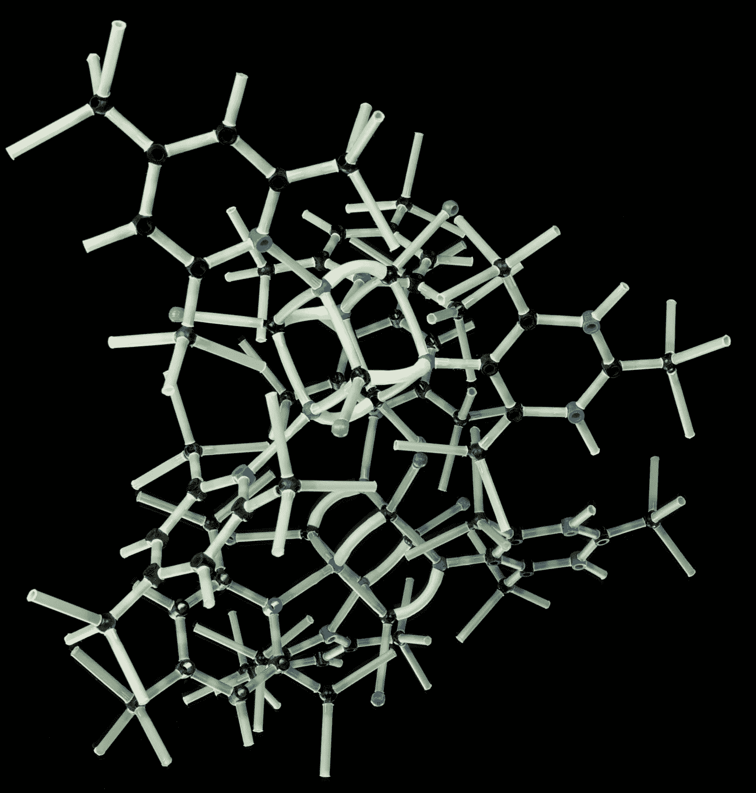
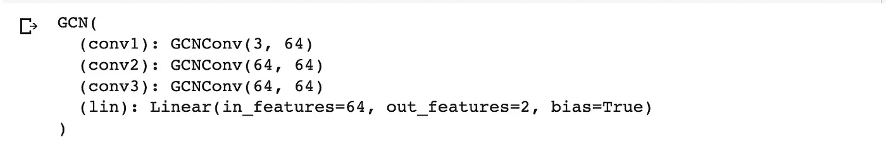
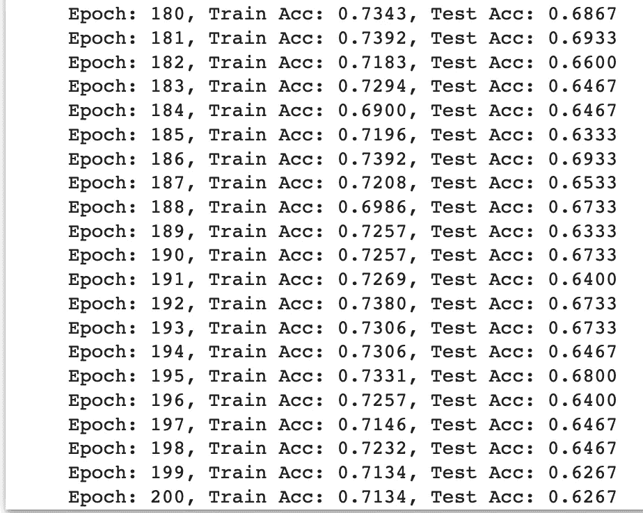

# 蛋白质基准数据集分类

> 原文：<https://towardsdatascience.com/classifying-the-proteins-benchmark-dataset-ec18e728a17a?source=collection_archive---------20----------------------->

## 实现图形卷积网络的两种方法

这是图论和图卷积网络系列的第四部分。

[摄影](https://unsplash.com/@photoholgic?utm_source=unsplash&utm_medium=referral&utm_content=creditCopyText)在 [Unsplash](https://unsplash.com/s/photos/science?utm_source=unsplash&utm_medium=referral&utm_content=creditCopyText) 上拍摄的照片

如果你一直在阅读这整个系列，那么你已经伴随我走过了这整个旅程——通过[讨论什么是图论以及为什么它很重要](https://medium.com/mlearning-ai/why-graph-theory-is-cooler-than-you-thought-4df73e2a4950)，什么是[图卷积网络甚至是](https://medium.datadriveninvestor.com/graph-convolutional-networks-explained-d88566682b8f?source=your_stories_page-------------------------------------)和[它们如何工作](/what-makes-graph-convolutional-networks-work-53badade0ce9?source=your_stories_page-------------------------------------)，现在我们在这里，到了有趣的部分——构建我们自己的 GCN。

如果你是这个系列的新手，那也完全没问题！不管是哪种情况，让我们开始编码吧！

在本教程中，我们将通过 GCNs 的两个实现来对蛋白质基准数据集进行分类。*如果你想找到这些数据的归属或论文，或者自己下载看看，可以在“生物信息学”标题下* [*这里*](https://chrsmrrs.github.io/datasets/docs/datasets/) *找到。*你也可以在这里看一看整个笔记本[。代码的属性可以在这个项目的](https://colab.research.google.com/drive/1W0syoaSSP-MpFhYC14cBV0O32Esyr_zF?usp=sharing)[库](https://github.com/sidneyarcidiacono/graph-convolutional-networks#readme)中找到。

## 第一部分:带频谱的 GCNs

什么是[光谱](https://graphneural.network/)？根据他们的主页:

> Spektral 是一个用于图形深度学习的 Python 库，基于 Keras API 和 TensorFlow 2。这个项目的主要目标是为创建图形神经网络(GNNs)提供一个简单而灵活的框架。

开始使用 Spektral 非常容易，因为对项目进行了预先考虑——如果你已经使用 Keras 或 Tensorflow 进行过建模，我想你会发现 Spektral 非常直观。

此外，Spektral 有许多内置的基准图数据集，这意味着您不必担心需要确保您的数据是使用 GNNs 建模的正确格式，并且可以很容易地开始实验。

无论您是在 Colab 中学习本教程，还是仅仅学习一本普通的笔记本，我们的第一步都是一样的。Spektral 不是 Colab 的内置库之一，所以我们需要安装它:

PROTEINS 是来自 TU Dortmund 的图形内核的基准数据集之一。您可以从`TUDataset`类中访问这个数据集类，我们通过首先导入然后实例化它的一个对象来访问它，我们要访问的数据集的名称被传入:

当我们加载数据集时，我们可以看到它在`n_graphs`属性中包含了多少个图。在这里，我们可以看到这个数据集有 1113 个图形。在这个数据集中，这些被分成两个不同的类。

Spektral 的`GCNConv`层基于 Thomas N. Kipf 和 Max Welling 的论文:“[使用图卷积网络的半监督分类](https://arxiv.org/abs/1609.02907)”。这是完美的，因为这是我们一直在参考的论文，如果你一直在关注这个系列的话。如果您还没有，我建议您看看这篇论文以及我写的关于这些网络如何工作的文章，以便更好地了解 Spektral 在幕后为我们做了什么！

因为这是我们想要使用的层，我们将不得不执行一些预处理。Spektral 用他们的`GCNFilter`类让这变得非常简单，该类只用两行代码就为我们执行了预处理步骤(在论文中有概述)。

首先，从`spektral.transforms`导入`GCNFilter`，然后在我们的数据集上调用`.apply()`，传入`GCNFilter`的实例:

在这个阶段，我们希望确保执行我们的训练/测试分割。在这个简单的例子中，我通过混排数据，然后取切片(分别约 80/20%)来实现，但是一旦您熟悉了这个实现，欢迎您进一步优化这个步骤！

现在，让我们导入我们的模型需要的层:

等一下——这些导入语句不是来自 Keras 吗？别担心——这不是偶然的。因为 Spektral 是建立在 Keras 之上的，所以我们可以很容易地使用 Keras functional API 来构建我们的模型，在我们处理图形结构数据时添加 Spektral 特定的层。

我们导入`Dense`和`Dropout`层— `Dense`是典型的执行前向传播的密集神经网络层，而`Dropout`以我们设定的速率将输入单元随机设置为 0。这里的直觉是，这一步可以帮助避免过度拟合*。

然后，我们导入我们之前介绍的`GCNConv`层和`GlobalSumPool`层。Spektral 为我们简明地定义了这一层:

> 全局汇总层。通过计算图的节点特征的总和来汇集图。

这就是全部了！让我们建立我们的模型:

这里，我们使用模型子类来定义我们的模型。当我们实例化模型进行训练时，我们将向模型传递`n_hidden`:隐藏层数和`n_labels`:标签(目标类)数。

然后，在`__init__`中，我们将所有的层定义为属性。在`call`中，我们定义了这个方法，通过按顺序调用我们的输入层来创建和返回我们想要的输出。

让我们为训练实例化我们的模型！

在这里，我们将初始化 32 个隐藏层和数据标签的数量。当我们读入时，Spektral 方便地在我们的`TUDataset`上给了我们一个`n_labels`属性。*这样做的好处是，如果您想探索其他数据，您可以对任何其他光谱数据集使用相同的代码，无需修改！*

上面，我们在我们的模型上调用`.compile()`。如果你熟悉 Keras，你就会熟悉这个方法。我们将传递我们的优化器，`adam`，并定义我们的损失函数，`categorical crossentropy`。

现在我们遇到了一个障碍。你们中熟悉 Tensorflow 和 Keras 的人可能会尝试给`model.fit()`打电话，然后就到此为止。然而，即使 Spektral 在 Keras 上无缝地构建 GNNs，我们也不能完全以同样的方式处理我们的数据。

因为我们使用的是图形结构的数据，所以需要创建批处理来填充我们的 Keras 模型。对于这项任务，Spektral 仍然通过提供[装载机](https://graphneural.network/loaders/)让我们的生活变得更加轻松。

现在我们已经处理了批处理，我们可以调用`model.fit()`。我们不需要指定批处理，只需传入我们的加载器，因为它作为一个生成器工作。我们需要提供我们的`steps_per_epoch`参数用于培训。

对于这个简单的例子，我们只选择了 10 个时期。为了验证，让我们为测试数据创建一个加载器:

我们将通过调用`.load()`把它提供给我们的模型。

用 Spektral 构建 gcn 到此结束！我强烈建议您试着优化这个例子，或者深入到可以用 Spektral 构建的其他 gnn 中去。

## 第二部分:Pytorch 几何的 GCNs

尽管 Spektral 为我们提供了一个优秀的图形神经网络层、加载器、数据集等库，但有时我们可能需要更精细的控制，或者我们可能需要另一个工具来完成这项工作。

[Pytorch-Geometric](https://pytorch-geometric.readthedocs.io/en/latest/) 还提供了基于 Kipf & Welling paper 以及基准数据集的 GCN 图层。PyTorch 的实现看起来略有不同，但仍然易于使用和理解。

我们开始吧！我们将从同一个[笔记本](https://colab.research.google.com/drive/1W0syoaSSP-MpFhYC14cBV0O32Esyr_zF?usp=sharing)开始，从标题“Pytorch 几何 GCN”的正下方开始。提供了此代码的归属。

像往常一样，我们的第一步是安装我们需要的包:

现在，让我们拿起数据集:

看看我们的数据:

这里，我们演示了 Pytorch-Geometric 在我们的 TUDataset 对象上提供的各种属性。这为我们提供了大量信息，我们可以使用这些信息在以后微调我们的方法，并深入了解我们的数据。

现在我们知道了数据的样子，我们将执行我们的训练/测试分割。对于这个例子，我也使用了一个简单的洗牌和切片方法，但是和往常一样，我鼓励你研究一下这个步骤的优化！

Pytorch 还为我们提供用于配料的`DataLoaders`:

现在我们已经完成了这一步，我们可以构建我们的模型了。我们将使用类似的方法，但是记住现在我们使用 Pytorch 而不是 Keras。

我们将导入我们的功能层(类似于 Keras 的`Dense`层)、我们的`GCNConv`层和一个`global_mean_pool`层。这执行了与 Spektral 的`GlobalSumPool`类似的汇集操作，但是取平均值而不是相邻节点的和。

在构建我们的模型时，我们继承了 Pytorch 的`GCN`模型，然后初始化三个卷积层。我们将在实例化模型时传递隐藏通道的数量。

然后，我们构建一个`forward()`方法，它类似于我们之前在特定 GCN 中构建的`call()`方法。这告诉我们的模型如何通过卷积层传播我们的输入。使用 Pytorch，我们显式地定义了我们的激活函数。在这个例子中，我们使用`relu`。

在我们的最终分类之前，我们执行我们的池，然后设置我们的 dropout 并通过最终的线性层传递我们的输入。

虽然有很多机会来定制和微调我们的 Spektral 模型，但我喜欢我们用 Pytorch 明确定义我们的架构的方式。当谈到“哪种方法更好”时，像大多数事情一样，这取决于你的团队需要优先考虑什么(例如，解释能力比快速证明概念的效率更重要)。

让我们来看看由此产生的架构:

接下来，我们需要:

1.  设置我们的优化器——我们也将在这个实现中使用`adam`
2.  定义我们的损失函数——同样，我们将保持`categorical crossentropy`
3.  定义训练和测试函数，然后在设定的时间段内调用它们。

我们在这个例子中使用了更多的纪元，因此，我们获得了更好的指标。除了我用来帮助构建模型和学习各个库的代码示例之外，没有什么内在的原因。此外，鉴于 Pytorch-Geometric 实现是我的最终实现，我比早期的实验更关注结果。一如既往地，我鼓励您尝试和优化代码，使它变得更好！

查看最近 20 个训练时期，我们看到我们实现了大约 71.34%的训练准确度和大约 62.67%的测试准确度。评估 186 年前后的测试数据的准确性，一个潜在的优化将是早期停止回调，这确保我们一旦达到收敛就停止训练，以避免过度拟合模型。

我们还可以进行更多的优化，但这是一篇很长的文章，所以我们就此打住，我将让您自己进行试验和优化！

**注意事项**:

* —要了解更多关于辍学或为什么辍学的信息，请查看[这个](https://ai-pool.com/a/s/dropout-in-deep-learning)来源。