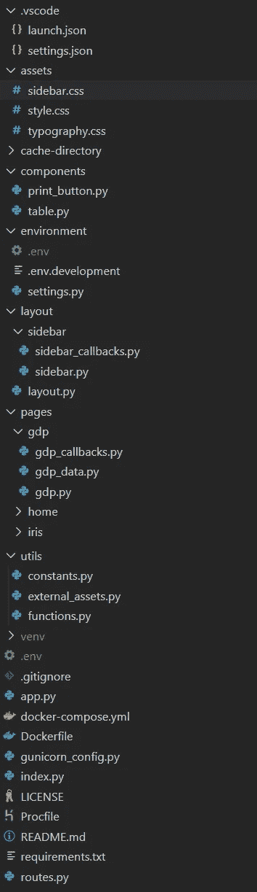
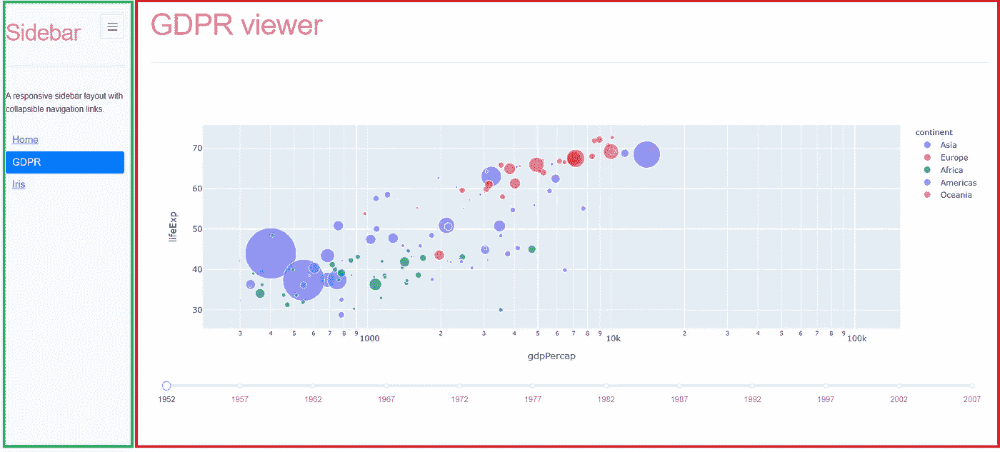
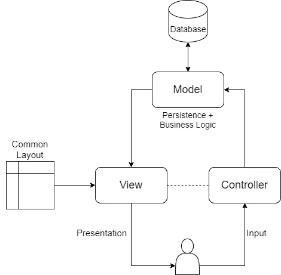

# 将 Dash 和 Plotly 与 Docker 结合使用，为 AI/ML 应用提供简洁的架构

> 原文：<https://towardsdatascience.com/clean-architecture-for-ai-ml-applications-using-dash-and-plotly-with-docker-42a3eeba6233?source=collection_archive---------2----------------------->

## *使用 Dash 和 Plotly 创建企业级仪表板，在 Dash 中了解最佳实践、项目结构、架构模式*

由[露丝·齐默曼](https://unsplash.com/@ruthson_zimmerman?utm_source=unsplash&utm_medium=referral&utm_content=creditCopyText)在 [Unsplash](https://unsplash.com/s/photos/statistics?utm_source=unsplash&utm_medium=referral&utm_content=creditCopyText) 上拍摄的照片

几乎每个数据科学项目都需要某种形式的可视化，如可视化输入数据、[使用直方图或散点图的探索性数据分析](/exploratory-data-analysis-8fc1cb20fd15)、使用[盒须图](https://datavizcatalogue.com/methods/box_plot.html)查找异常值或绘制统计数据、使用[网络图](https://towardsdatascience.com/tagged/network-analysis)可视化节点之间的关系、使用[相关矩阵](/better-heatmaps-and-correlation-matrix-plots-in-python-41445d0f2bec)检查变量之间的关系、帮助[理解高维数据集内的关系的可视化技术](/how-to-present-the-relationships-amongst-multiple-variables-in-python-70f1b5693f5)、[可视化模型的性能](https://medium.com/datadriveninvestor/visualizing-scikit-model-performance-fb26ff16f7c6)或

此外，数据可视化可能成为任何演示文稿的重要补充，也是理解数据的最快途径。

正如你所看到的，**数据可视化是任何数据科学项目**的关键部分，但是创建一个仪表板并不是一项简单的任务。有很多库可以用来生成漂亮的图，但是在我看来，如果你正在使用 python，Dash 是最好的选择。

# 为什么 Dash

正如您在[官方文档](https://dash.plotly.com/introduction)中看到的，Dash 是一个用于构建 web 分析应用程序的高效 Python 框架。Dash 是基于最流行的框架和库编写的**，比如 Flask、React 和 Plotly** ，它是构建数据可视化应用的理想选择。它很容易学习，因为 Dash 抽象了构建基于 web 的交互式应用程序所需的所有技术和协议。**使用 Dash 你可以完全在 Python** 中工作，后端，前端也可以用 Python 编写。

## Dash 的优势

1.  需要很少的样板文件就可以开始
2.  Dash 应用程序完全由 Python，甚至 HTML 和 JS 生成
3.  它是“反应式”的，这意味着很容易推断出复杂的 ui 有多输入、多输出以及依赖于其他输入的输入
4.  Dash 应用程序本质上是多用户应用程序:多个用户可以查看应用程序并进行独立的会话
5.  Dash 应用程序可以有多个输入、多个输出以及依赖于其他输入的输入
6.  因为 Dash 应用程序使用 Flask 作为后端，所以我们可以使用 Gunicorn 来运行它们，所以很容易通过增加工作进程的数量来扩展这些应用程序，以服务数百或数千个用户
7.  使用 [React.js](https://facebook.github.io/react/) 渲染组件，并包含一个[插件系统](http://plot.ly/dash/plugins)，用于使用 React 创建您自己的 Dash 组件
8.  因为它使用 Flask 作为服务器，所以您可以像部署 Flask 应用程序一样部署 Dash 应用程序
9.  开源库，在许可的 MIT 许可下发布
10.  Dash 有很好的文档记录，并且在 Stack Overflow 和 Github 上有一个很好的响应社区

## Dash 的缺点

1.  反应图中没有中间值，对于中间数据，您必须添加一个隐藏的 div(正如 Plotly 所建议的)
2.  您必须为每个输出编写单独的函数，这迫使您重新构建代码(有时这也是一种优势)
3.  两个 Python 回调不可能更新同一个元素
4.  不能有没有输入或没有输出的回调

每个框架或库也有缺点，但是在 Dash 的情况下，**优点多于缺点，并且可以使用一些变通方法**来解决缺点。

总的来说，如果你想为你的数据科学模型或算法创建一个**企业级交互式仪表板**，带有小样本的**，**完全用 Python 编写**(这样你就可以在后端和前端之间重用代码)Dash 是最好的选择。**

# Dash 的干净建筑

***注:*** 我们将在虚拟环境中工作。创建和激活虚拟环境参见 [**Python 虚拟环境**](https://uoa-eresearch.github.io/eresearch-cookbook/recipe/2014/11/26/python-virtual-env/) **。**

获得清晰架构的第一步是定义项目的文件结构**。任何严肃的 web 应用程序都有多个组件和多个页面。为了便于*添加功能而不影响其他布局，并引入清晰的关注点分离*，我推荐以下**文件结构**:**

作者图片

## 资产文件夹

如果您想要在项目中自动包含图像、样式表或 Javascript 文件，Dash 要求您将它们添加到 Assets 文件夹中。Dash 将自动处理该文件夹中包含的所有文件。参见[仪表板外部资源](https://dash.plotly.com/external-resources)。

## 组件文件夹

该文件夹将包含可重用的组件，如在多个页面上使用的按钮、可视化数据的表格、在多个页面上使用的标题等。

例如，它可以包含基于数据帧构建表的函数:

## 布局文件夹

web 应用程序将有一个始终可见的通用布局。通常，这是由侧边栏和/或菜单和内容页面组成的。在我们的例子中，我们有一个可折叠的侧边栏和内容页面。

作者图片

正如我们在上面的图片中看到的，作为一个常见的布局，我们有一个侧边栏(用绿色突出显示)，它总是可以看到的(除非它是折叠的)，以及内容，它会根据侧边栏中的页面选择而变化。

对于侧栏，我们有两个文件，一个用于定义视图(sidebar.py)，另一个用于定义行为，以声明回调(sidebar_callbacks.py)。

内容是一个简单的 div，最终的通用布局由侧边栏、内容 Div 组成，它还包括破折号的[位置组件，代表 web 浏览器中的位置或地址栏。通过它的 *href* 、*路径名*、*搜索、*和*哈希*属性，你可以访问加载应用的 URL 的不同部分，这对路由和导航非常有帮助。](https://dash.plotly.com/dash-core-components/location)

## 页面文件夹

一个企业级的 web 应用程序通常由多个页面组成，我们将为每个页面创建一个新的文件夹。每个页面将由三个不同的文件组成，这样我们就可以将 MVC 架构模式也应用于 Dash。我们将在本教程的后面描述如何在 Dash 中使用 MVC。

## 实用程序文件夹

该文件夹将包含与特定页面或组件无关但可通用的通用和可重用功能。例如，我们可以在这里添加货币转换、十进制数字格式化或其他数学函数。

它还将包含全局使用的常量或指向外部资产的链接(指向样式表、图标、字体等的链接)。)

## 环境文件夹

因为不同的环境(开发、测试、试运行、生产前、生产或其他)将具有不同的配置文件和不同的环境变量，所以我们需要一种在这些配置文件之间进行选择的方法。该文件夹将包含不同的配置文件以及根据环境在这些文件之间进行选择的机制。

在我们的教程中，我们将有两个环境，开发和生产。

对于这**两个环境**，我们会有**两个不同。环境文件**。以便从**中读取键值对。env** 文件并将它们添加到环境变量中，我们使用[**【dotenv】**](https://pypi.org/project/python-dotenv/)**库。**

**对于开发，我们将使用 **.env.development** 配置文件。**

**对于生产，我们将使用**。env** 文件。**

**主机必须是 0.0.0.0，因为在本教程的后面，我们将为我们的示例应用程序创建一个 Docker 容器，Docker 要求主机=0.0.0.0。**

**根据环境读取不同配置的逻辑可以在 **settings.py** 文件中找到。**

**在第 5 行，我们根据**环境文件环境变量**的值设置了正确配置文件的路径。对于开发，这将具有值 *".env.development"* ，在生产环境中，我们将此变量设置为*"。env"* 。这样，我们将根据不同的环境拥有不同的配置。**

**要设置环境变量 ENVIRONMENT_FILE 的值，在 **VS 代码**中，我们可以使用下面的 **launch.json** 文件:**

**我们的生产环境将是 Docker，因此在 Docker 文件中，我们将使用 **ENV ENVIRONMENT_FILE= "来设置这个环境变量。env"** 命令。**

## ****缓存目录****

**这个文件夹是由 Dash 的所谓 [**记忆**](https://dash.plotly.com/performance) **能力自动生成的。由于 Dash 的回调本质上是功能性的(它们不包含任何状态)，所以很容易添加内存化缓存。记忆化在函数被调用后存储它的结果，如果用相同的参数调用该函数，则重用该结果。****

**为了设置这种记忆能力，我们必须定义缓存类型。**

**代替本地文件系统，我们也可以使用一个 **Redis 缓存。****

**设置 Redis 超出了本教程的范围，因此我们将使用文件系统来缓存和重用调用之间的数据。**

# **仪表板中的 MVC**

**在 MVC(模型-视图-控制器)架构设计模式的情况下，每个相互连接的组件都是为承担开发过程中的特定任务而构建的。**

**使用这种模式有多重好处**:****

1.  ******快速并行开发**——因为组件是解耦的，所以多人可以并行工作****
2.  ******单个模型的多个视图******
3.  ******稳定的业务逻辑** —很明显，我们对视图做了更多的修改(改变颜色、位置等)。)而不是在业务逻辑上，并且改变视图不会影响业务层****
4.  ****易于**重复使用、维护和测试**组件****
5.  ****它**通过将应用程序分成**独立的(MVC)单元**来避免复杂性******
6.  **它提供了一个**清晰的关注点分离(SoC)。****
7.  ****逻辑分组**将一个控制器上的相关动作组合在一起**

**MVC 模式最重要的缺点之一是，通常我们需要了解多种技术，因为视图和控制器+模型是使用不同的技术实现的(比如 React/Angular/Vue/等等)。为了风景和。net/Java/Python/Node/Go/等。用于后端)。如果您使用 Python 和 Dash，那么这个问题就解决了，您可以将 Python 用于视图和控制器+模型。**

****

**作者图片**

**正如你在上面的图片中看到的，在我们的项目中，**每一页我们将有三个文件**，我们有**一个共同的布局**，正如我们在本文前面已经介绍过的。**

**现在让我们看一个例子，我们如何创建一个使用 MVC 模式的页面。我们将创建一个示例页面，其中我们将根据 GDP 绘制不同国家的预期寿命图表。**

****型号示例****

**在上面的代码中，我们使用了 Dash 的**内存化**特性，因为我们不想多次读取相同的数据，所以我们**缓存数据**，这种方式提高了我们应用程序的性能。**

****模型不依赖于视图或控制器**，它是解耦的，它的职责是处理数据，它不必处理用户界面或数据处理。**

****视图示例****

**视图的唯一职责是向用户显示数据。如您所见，它使用模型(dataframe)并定义 Html/Css/Js/其他标记语言元素来将数据呈现给用户。**

**正如您在上面的代码中看到的，我们的示例**只使用了模型，并创建了表示元素**。它**没有定义处理用户事件的逻辑，也不包含业务逻辑**。**

****控制器示例****

****控制器解释来自用户的鼠标和键盘输入，通知模型和视图适当地改变。****

**正如您在上面的例子中所看到的，update_figure 回调函数获取用户在滑块上选择的值作为输入(因此它处理用户事件),并基于从模型中读取的数据从视图中更新图形作为输出。因此，正如 MVC 模式所定义的，控制器是在我们从视图获得请求之后，在用我们的模型更新数据库之前，我们处理数据的部分。**

# **按指定路线发送**

**为了在页面之间导航，我们需要定义路由规则。为此，在根文件夹中，我们创建了一个名为***routes . py****的文件。***

**正如我们在代码中看到的，我们定义了一个回调函数，它接受活动路径作为输入(当路径改变时，这个方法将被触发)，输出将呈现在主布局的内容中(页面内容)。**

**为了呈现适当的页面，我们检查活动路径，并基于活动路径返回页面。**

# **归档我们的 Dash 应用程序**

**第一步是定义 **Dockerfile** 。**

**为了减小图像的大小，我们使用了 **slim** 版本，我们还**移除了缓存文件**(第 8 行)。**

**该应用将由 [**Gunicorn**](https://gunicorn.org/) 提供服务，因此我们必须为其定义配置(参见 **gunicorn_config.py** )。**

**在 docker 镜像中，**主机必须是 0.0.0.0** 否则无法访问。**

**Dash 实例在单独的 **app.py** 中定义，而运行 app 的入口点是 **index.py** 。这种分离是避免循环导入所必需的:包含回调定义的文件需要访问 Dash **app 实例**，然而，如果这是从 **index.py** 导入的，那么 **index.py** 的初始加载将最终要求它自己已经被导入，这是无法满足的。**

**对于 Gunicorn 来说，重要的是**将服务器明确定义为 Falsk 应用**(第 12 行)。**

**由于**我们正在添加对 app.layout** 中不存在的元素的回调，Dash 将引发一个异常，警告我们可能做错了什么。我们可以通过设置**suppress _ callback _ exceptions = True**来忽略该异常(这在多页面应用上很正常)。**

**注意，我们从**环境中读取**主机、端口、调试和 dev_tools_props_check** 的值。****

**对于 Gunicorn，我们还需要定义 **Procfile** 。**

**如您所见，我们从索引文件(index:server)运行服务器(这是我们在 app.py 中定义的 Falsk 应用程序)。**

**为了安装所有需要的依赖项，我们定义了 requirements.txt 文件。**

**我们还定义了一个 **docker-compose.yml** 文件，这样就很容易构建和运行我们的 docker 映像。**

**为了设置$VERSION 和$TARGET 变量，我们定义了一个**。docker-compose.yml** 旁边的 env 文件(在同一个文件夹中)**

**为了构建和运行我们的应用程序，我们运行***docker-compose build***，然后运行***docker-compose up-d***命令(在根文件夹中)。**

# **结论**

**在本教程中，我们描述了**组织 Dash 应用**的一种可能方式，我们展示了**如何应用架构设计模式**来引入**关注点分离**并编写**干净且可维护的代码**。我们还介绍了如何使用**多页面**，如何使用**Dash 的内存化来缓存和重用数据**，如何**为不同的环境使用不同的配置**，并且我们描述了一种干净的方式**为您的 Dash 应用**设置和创建 Docker 容器。**

****

**我真的很喜欢咖啡，因为它给了我写更多文章的能量。**

**如果你喜欢这篇文章，那么你可以请我喝杯咖啡来表达你的欣赏和支持！**

****成为媒介上的作家:**【https://czakozoltan08.medium.com/membership】T2**

# **后续步骤**

**在我们的 ***下一篇教程*** 中，我们将呈现 Dash 更高级的概念，比如**在回调之间共享数据、持久性、使用 Redis 的内存化、动态创建回调以及使用模式匹配回调。****

# **代码**

**本教程的代码可以在 [**这个 git 资源库**](https://github.com/CzakoZoltan08/dash-clean-architecture-template) 中找到。(喜欢我的代码请留个✩)**

# **最后的话**

**感谢您阅读这篇长文！**

**如果你想要一些**【愚蠢简单】的解释**，请**跟我上媒**！**

**有一个正在进行的**《愚蠢简单的 AI》系列**。前两篇可以在这里找到: [**SVM 和内核 SVM**](/svm-and-kernel-svm-fed02bef1200)[**KNN 在 Python**](/knn-in-python-835643e2fb53) 。**

**如果想要一些关于 **Kubernetes** 的**“愚蠢简单”的讲解和教程**，可以查看我的 [**愚蠢简单 Kubernetes**](https://levelup.gitconnected.com/stupid-simple-kubernetes-e509355fba3d) 系列。**

**谢谢大家！**