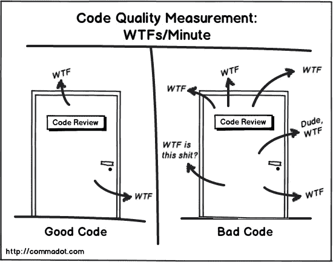

# 面向数据科学家的干净代码

> 原文：<https://towardsdatascience.com/clean-code-for-data-scientists-6fc90872398f?source=collection_archive---------12----------------------->

萨曼莎·加德斯在 [Unsplash](https://unsplash.com?utm_source=medium&utm_medium=referral) 上的照片

## 第 1 部分——动机

你好，如果你是一名数据科学家，并且关心你的代码，那么你来对地方了。这是为数据科学家撰写的干净代码系列文章的第一部分:

第一部分——这是你目前正在阅读的内容。在这一部分，我将分享**为什么我认为把你的时间和精力投入到编写干净的代码**中是很重要的。

[第 2 部分——实施](https://medium.com/p/db1d88c42fab)的实用技巧。

[第 3 部分——作为数据科学团队如何实践干净的代码](https://medium.com/p/150ce920c39e)。

我将首先解释什么是干净的代码，以及为什么它对于数据科学家来说是至关重要的实践。

# 什么是干净代码？

干净的代码是人们可读的代码，而不仅仅是编译器可读的代码。很容易改变和维护。我发现描述干净代码的最好方式是度量——“每分钟 WTFs”。也就是说，当你阅读一段对你来说是新的代码时，你会有多少次对自己说“哇哦？”：

图片由 Glen Lipka 在 [commadot](https://commadot.com/wtf-per-minute/) 上拍摄

当我们想到干净的代码时，我们可能会想——嗯，这是软件工程师和架构师需要担心的事情。所以实际上没有。请继续关注，因为我将试图让您相信**干净的代码对于您作为数据科学家的工作是至关重要的**，并提供一些实用的工具和实现它的技巧。

# 干净代码对数据科学家的重要性

一般来说，干净的代码是可读的，所以更容易调试和重构。这种方便使得代码易于维护，因此添加或更改代码没什么大不了的。这意味着生产率不会随着时间和复杂性的增加而下降，也不会随着我们添加更多的代码而下降。另外，干净的代码对错误更免疫。

作为数据科学家，我们做研究，我们学习，我们计划，但最终— **我们需要编写代码来实现这一切**。如果你的代码对别人(和你自己)来说是错误的或者不可读的，即使是最聪明的算法也一定会出错。我们的算法和我们的代码一样好。

作为数据科学家，我们有时单独工作，有时团队工作。在这两种情况下，编写干净的代码至关重要:

*   在团队中，这将使**更容易理解和重构团队成员的代码**(这可能是干净代码的第一条规则——剧透警告)。这也将使新团队成员的**开始和入职更加顺利**(说心里话——因为我最近刚开始一个新职位)。
*   当你独自工作，或者独自完成大部分项目时， **cleaner code 将帮助你在项目之间跳转，并以最少的“我在这里做了什么？”阶段。**

鲍勃叔叔说“花在阅读和写作上的时间比远远超过 10 比 1”。在编写新代码的过程中，我们不断地阅读旧代码。编写新的代码并不容易，更不用说当你试图在弄清楚之前有什么的时候。

举个例子，看看这个简短的函数，试着理解它的作用:

现在看看这个函数，做着完全相同的事情:

你只看名字就有这么多信息，每一行都讲述了一个故事。现在想象一下你的代码只由混乱的代码组成——难道不需要更长的时间来理解那里发生了什么吗？更别说重构了。事实是——我只花了大约半分钟的时间来编写更好的代码。

# 数据科学家的干净代码之争

你可能会达到这一点，并说——“是的！我想写更干净的代码，为什么我一直没有这么做？”。事实是你可能有很好的理由。首先，它需要知识、实践和渴望。作为数据科学家，保持我们的清单像我们希望的那样整洁并不总是容易的。

## 高风险代码编写

根据我的经验，第一个原因是我们工作的“高风险”性质。意思是，**当我们在脚本中编写第一行代码时，我们通常不知道它会发生什么**——它会工作吗？会量产吗？我们还会用它吗？它有价值吗？

我们最终可能会在高风险的概念验证或一次性数据探索上花费大量时间。在这种情况下，编写最简洁耗时的代码可能不是正确的方法。但是，我们以粗略的方式编写的这个 POC 变成了一个实际的项目，它甚至进入了生产阶段，而它的代码却是一团糟！听起来很熟悉？我以前经常遇到这种事。

## 耗时的

所有代码编写者的共同点是时间方面。**写干净的代码首先要花费更多的时间**因为你在写任何一行代码之前都需要三思。我们总是被督促或鼓励快速完成工作，这可能会以牺牲代码为代价。

请记住——在匆忙中快速完成工作，可能会在你每天处理 bug 的时候伤害到你。**你花在编写干净代码上的时间肯定会在 bug 上节省的时间上得到回报**。

## 韵律学

斗争的另一个原因是衡量我们的方式。作为数据科学家，**我们的雇主正在寻找结果** —准确的预测、有见地的数据发现、最新的技术。但是通常，**没有人会看着引擎盖下的东西**，只有当我们的代码整洁时，才标记这个季度的任务是成功的。代码基础设施和条件是团队的内部目标，很难让其他人意识到。

# 一些基本原则

如果你已经做到了这一步，并且想让你的代码更整洁，这里有一些我最喜欢的指导方针:

> **让你的代码质量与草稿水平相匹配**

高风险的概念验证或数据探索可以从草稿开始，随着您的进展，您的代码会变得更加整洁

> **遵循标准惯例**

这包括变量、函数和类的有意义的名字；常数而不是硬编码的字符串和整数；格式一致。

> **让你的功能变得强大**

每个功能应该只做一件事。他们应该是短期的，没有副作用。

> **少即是多**

你的代码应该尽可能的短，不带注释(除非他们告诉你为什么，但从不告诉你怎么做)。另外，确保删除注释掉的代码，因为它只会造成混乱。

> **保持简单**

越简单越好，所以尽量降低复杂度。

> 童子军规则——让露营地比你发现时更干净

在团队中工作时——不要害怕改变别人的代码。单独工作时——在重新审视代码时，修改自己的代码。

> **报纸文章原则**

脚本的顶部应该是最顶层的函数，越往下越详细。

如果你想知道更多，欢迎你来查看我的教程 **的第二部分** [**，它解释了如何实施这些指导方针**，并列出了更多值得关注的内容。](https://medium.com/p/db1d88c42fab)

# 改变从现在开始

任何人在任何时间编写干净的代码都是可能的。不管你是新人还是有经验的人，所需要的只是一件简单的事情——想要它。改变从内部开始。

在瑜伽中，有一种想法是想做点什么，即使你不一定会成功。你的意图才是最重要的。

我发现写代码也很类似。我们不一定要遵循所有的协议或做得完美。只要把它放在我们的脑海中，想要它，并思考它，就一定会让我们的代码变得更好。当然，熟能生巧。如果你不相信我，你自己试试看吧！