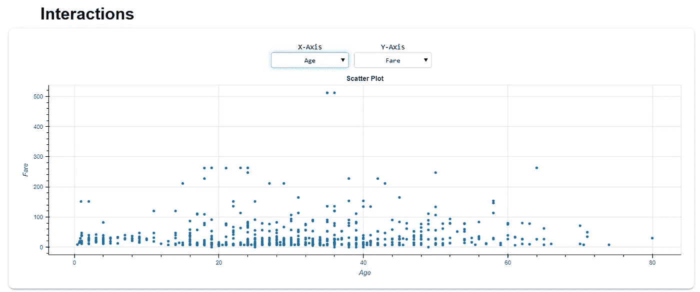

# 使用 DataPrep 进行交互式清理、连接和可视化

> 原文：<https://towardsdatascience.com/clean-connect-and-visualize-interactively-with-dataprep-9c4bcd071ea9?source=collection_archive---------16----------------------->

## 适用于您的数据分析过程的一体化软件包


照片由 [UX 印尼](https://unsplash.com/@uxindo?utm_source=medium&utm_medium=referral)在 [Unsplash](https://unsplash.com?utm_source=medium&utm_medium=referral)

数据准备是任何数据专业人员都要做的第一步。无论是要对数据进行分析，还是要对机器学习模型的数据进行预处理，都需要准备好数据。

准备数据意味着您需要收集、清理和探索数据。为了完成我提到的所有活动，开发了一个名为 [DataPrep](https://docs.dataprep.ai/index.html) 的 Python 包。这个包裹对我们有什么帮助？让我们一起来探索一下。

# **数据准备**

DataPrep 是为准备数据而开发的 Python 包。这个包包含三个主要的 API 供我们使用，它们是:

*   数据探索(`dataprep.eda`)
*   数据清理(`dataprep.clean`)
*   数据收集(`dataprep.connector`)

DataPrep 包被设计成具有快速的数据浏览，并且与 Pandas 和 Dask DataFrame 对象配合良好。为了探索 DataPrep 功能，我们需要首先安装这个包。

```
pip install -U dataprep
```

在我们安装完这个包之后，让我们使用 API 来准备我们的数据。

## 数据准备探索

DataPrep 让我们用一行代码创建一个交互式的概要报告。这个报告对象是一个 HTML 对象，从我们的笔记本中分离出来，有许多探索选项。让我们用示例数据来尝试一下 API。

```
from dataprep.datasets import load_dataset
from dataprep.eda import create_report
df = load_dataset("titanic")
df.head()
```


作者图片

我们将使用泰坦尼克号样本数据集作为我们的数据。加载完数据后，我们将使用`create_report`函数来生成交互式报告。

```
create_report(df).show_browser()
```


作者 GIF

正如我们在上面的 GIF 中看到的，API 创建了一个很好的交互式报告供我们探索。让我们试着逐一剖析这些信息。


概览选项卡(按作者分类的图像)

从 overview 选项卡中，我们可以看到数据集的所有概述信息。我们可以获得的信息包括缺失数据数和百分比、重复数据、变量数据类型以及每个变量的详细信息。


变量选项卡(按作者分类的图像)

variables 选项卡为我们提供了数据集中每个变量的详细信息。几乎所有您需要的信息都是可用的，例如，唯一、缺失数据、分位数和描述性统计、分布和正态性。



交互选项卡(按作者分类的图片)

interactions 选项卡将从两个数字变量创建一个散点图。我们可以自己设置 X 轴和 Y 轴，这让我们可以控制如何可视化它。


相关性选项卡(按作者分类的图片)

“相关性”选项卡为我们提供了数值之间的统计相关性计算热图。目前，我们可以使用三种计算方法——Pearson、Spearman 和 KendallTau。


缺失值选项卡(按作者排序的图像)

“缺失值”选项卡为我们提供了关于选项卡中缺失值的所有详细信息。我们可以选择条形图、光谱图、热图和树状图来充分探索缺失值信息。

## 数据准备清洗

DataPrep 清理 API 集合提供了 140 多个 API 来清理和验证我们的数据帧。例如，我们可以使用的 API 有:

*   [列标题](https://docs.dataprep.ai/user_guide/clean/clean_headers.html)
*   [国名](https://docs.dataprep.ai/user_guide/clean/clean_country.html)
*   [日期和时间](https://docs.dataprep.ai/user_guide/clean/clean_date.html)
*   [重复值](https://docs.dataprep.ai/user_guide/clean/clean_duplication.html)
*   [电子邮件地址](https://docs.dataprep.ai/user_guide/clean/clean_email.html)

还有很多。我们可以尝试的功能太多了，本文不可能涵盖所有的 API。如果你有兴趣，可以在这里查阅文档[。](https://docs.dataprep.ai/user_guide/clean/introduction.html)

让我们以 Titanic 数据集为例，尝试一下**列标题**清理功能。

```
from dataprep.clean import clean_headers
clean_headers(df, case = 'const').head()
```


作者图片

使用“Const”的情况下，我们将结束所有大写的列名。如果我们把这个案例换成“骆驼”

```
clean_headers(df, case = 'camel').head()
```


作者图片

结果是除“sibSp”列之外的所有较低的列名，在“sibSp”列中，它们的列名中有两个单词。

如果你想要一个完整干净的数据框架，我们可以使用来自 [DataPrep](https://docs.dataprep.ai/user_guide/clean/clean_df.html) 的`clean_df` API。这个 API 有两个输出—推断的数据类型和清理的数据帧。

```
from dataprep.clean import clean_df
inferred_dtypes, cleaned_df = clean_df(df)
```


作者图片

有许多参数可以在 API 中使用。我建议您阅读所有文档，看看哪些参数适合您的数据准备目的。

## DataPrep 集合

DataPrep 收集 API 用于从数据库或 Web API 收集数据。如果我们可以访问数据库，比如 MySQL 或 PostgreSQL，您可以用 DataPrep API 连接它，但是也可以使用 DataPrep `connect` API 访问公共 API。

如果您想从 web 上收集数据，仍然需要 API 代码，但是一切都被简化了。如果你想了解更多关于集合 API 的内容，你可以在这里阅读全部[。](https://docs.dataprep.ai/user_guide/connector/introduction.html)

# **结论**

DataPrep 是一个单行 Python 包，用于清理、连接和浏览您拥有的数据集。该功能包括:

*   数据探索(`dataprep.eda`)
*   数据清理(`dataprep.clean`)
*   数据收集(`dataprep.connector`)

希望有帮助！

在我的[**LinkedIn**](https://www.linkedin.com/in/cornellius-yudha-wijaya/)**或 [**Twitter**](https://twitter.com/CornelliusYW) 上访问我。**

> **如果您喜欢我的内容，并希望获得更多关于数据或数据科学家日常生活的深入知识，请考虑在此订阅我的[简讯。](https://cornellius.substack.com/welcome)**

> ***如果您不是作为中等会员认购，请考虑通过* [*我的推荐*](https://cornelliusyudhawijaya.medium.com/membership) *进行认购。***