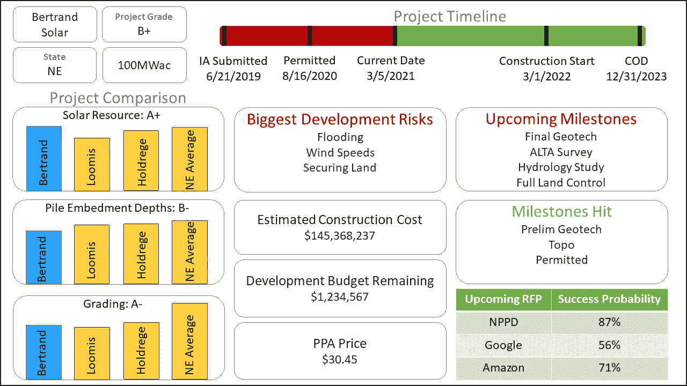

# 清洁能源开发商需要兑现他们的数据

> 原文：<https://towardsdatascience.com/clean-energy-developers-need-to-cash-in-their-data-63a2672147e8?source=collection_archive---------29----------------------->

## 不采用大数据工具将意味着能源行业的死亡

照片由 [Unsplash](/s/photos/cash?utm_source=unsplash&utm_medium=referral&utm_content=creditCopyText) 上的 [Jp Valery](https://unsplash.com/@jpvalery?utm_source=unsplash&utm_medium=referral&utm_content=creditCopyText)

太阳能、风能和储能发电厂的公用事业规模开发商在一个利润微薄、资本支出极高且时间表漫长的行业中竞争。每一个新的发展都是一场赌博，只有在数年和数百万美元后才显示出它的可能性。鉴于该行业的历史性质，大多数用于评估这些发展的工具都是 20 世纪的人工制品。然而，“清洁技术”品牌吸引了大数据公司的注意，这些公司以强大的竞争优势进入了数据丰富的行业。如果保守的能源公司不采用最佳数据实践，他们高昂的开发成本将扼杀未来项目成功的任何希望。

> 是时候让开发公司意识到他们是大数据公司了。

# **数据驱动发展**

开发的目标是通过最小化不确定性来最小化项目风险。一个完美开发的项目将确切地知道它将产生多少能量，确切地知道它的成本将是多少(以及被完全许可和准备建造)。为了降低风险，开发人员使用“数据驱动开发”它们会产生数量惊人的数据，从历史风速和辐照度等传统格式到工程报告或许可文件等组织性较差的格式。来自所有这些来源的数据在决策者的头脑中汇集，然后他们预测项目的经济效益。这种预测必须有足够的证据来支持它，以说服其他关键的利益相关者(如希望贷款给项目的金融家或希望购买项目的公用事业公司)。开发商通过以尽可能低的成本充分降低经济项目的风险而获得成功。

减少开发费用通常意味着产生更少的数据(因为你为更少的研究付费)。数据越少，项目的风险就越大。因此，开发公司削减项目成本的效率是有限的，他们必须寻求建筑、技术和性能方面的创新来获得优势。当然，除非你有办法在不需要获得更多数据的情况下，为关键涉众减少足够的项目不确定性。如果更少的数据并不意味着更高的项目风险呢？如果您可以从现有数据中获得更多见解，会怎么样？

# **大数据创新**

在“大数据”的世界中，存在可以从我们生成的数据中提取出无数奇迹的工具，丰富的数据源就像等待数据科学“49 人组”挖掘的金矿很难找到比项目开发更丰富的未开发数据来源。然而，这些数据中的大部分都没有被传统的开发者使用。这里有一个例子:

## 示例开发

比方说，一家开发商正在考虑将其“Bertrand”太阳能发电场竞标到一些即将到来的提案请求中(RFP:当一家公司有兴趣从太阳能发电场购买电力时，要求开发商向他们发送项目以供选择)。为了决定是否支付投标这个项目的价格，以及如果有任何研究，它应该提前开始以进一步降低开发风险，开发商举行“思想会议”这些决策涉及许多因素，为了准备这次会议，公司的不同部门被要求总结他们对项目开发的每个关键部分的发现。

对于一个这样的组件，一名工程师阅读了一份初步的岩土工程研究，以评估该场地的土壤将大幅增加建筑成本的风险。这位工程师必须浏览几百页的文档，从中提取关键信息，然后将这些信息提交给她的经理，经理再将这些信息传递给她的经理，以此类推，直到在会议上提交。生成这份文件的研究花费了数十万美元，耗时数月才完成。所有这些时间和费用都转化为决策者在做出关于 RFP 的决定之前在许多其他要点中消化的一条知识。

如果你曾经有过认知偏差，或者你曾经玩过“电话”游戏，你知道在这个过程中做出的决定会受到很多“噪音”的影响，干扰了正确的“信号”。决策者无法对项目做出公正的决策，所提供的数据可能会遗漏它所保证的细微差别，而且整个过程既及时又昂贵。与此同时，这家开发公司拥有大量相关数据，但这些数据并没有在这个决策中使用。精通数据的公司面临所有这些问题。

## 更好的发展

为了降低这个项目的开发成本，公司可以引入附近项目已经生成的所有数据，以及相关的公开可用数据集。为了减少决策时的不确定性和偏见，机器学习模型可以提供数据驱动的建议。为了减少误解，项目的所有数据都可以在一个位置方便地访问和汇总。

下面的仪表板提供了一个排名系统，用于将一个项目与附近的其他开发项目进行比较，显示项目时间表和即将交付的成果，甚至估计该项目赢得即将到来的 RFP 的概率。决策者可以利用这些信息来了解应该启动哪些开发任务，以及应该投标或回避哪些 RFP。最重要的是，通过项目开发周期生成的每个数据点都被整合到影响整个开发组合的数据池中，减少了对未来研究的需求。

仪表板示例(按作者)

这个例子只是触及了大数据驱动的开发者所能获得的东西的表面。那些还运营发电厂的公司可以将运营和发展数据结合起来，以获得更大的洞察力，而参与电力市场竞标的独立发电商提供了另一个丰富的数据源。

# **结论**

目前，有效的数据管理和分析为当前的公用事业规模开发商提供了巨大的竞争优势，但这将是短暂的，因为改进的数据平台的低成本和高收益迫切需要快速采用。迟早，适当的数据处理将成为行业的必需品。在已经成为 21 世纪能源行业标志的情况下，那些适应缓慢的公司将很快倒闭。

如果你是一家开发公司，是时候认识到你是一家大数据公司了。给自己提供成功所需的工具，培训能源专家，让他们的数据为自己服务。关于数据科学如何让您的团队受益的另一个例子，您可能有兴趣阅读[这篇文章](/bringing-data-science-to-energy-cbebfc704c57)。你可以在这里找到提升你的团队[的免费资源路线图。至少，和你的团队讨论一下如何更好地使用你的数据。你会对唾手可得的水果感到惊讶。](/data-science-curriculum-for-professionals-46d131675602)