# 用 Python 中的傅里叶变换清除数据噪声

> 原文：<https://towardsdatascience.com/clean-up-data-noise-with-fourier-transform-in-python-7480252fd9c9?source=collection_archive---------0----------------------->

## 用傅立叶变换清理时间序列数据用最短的 Python 代码

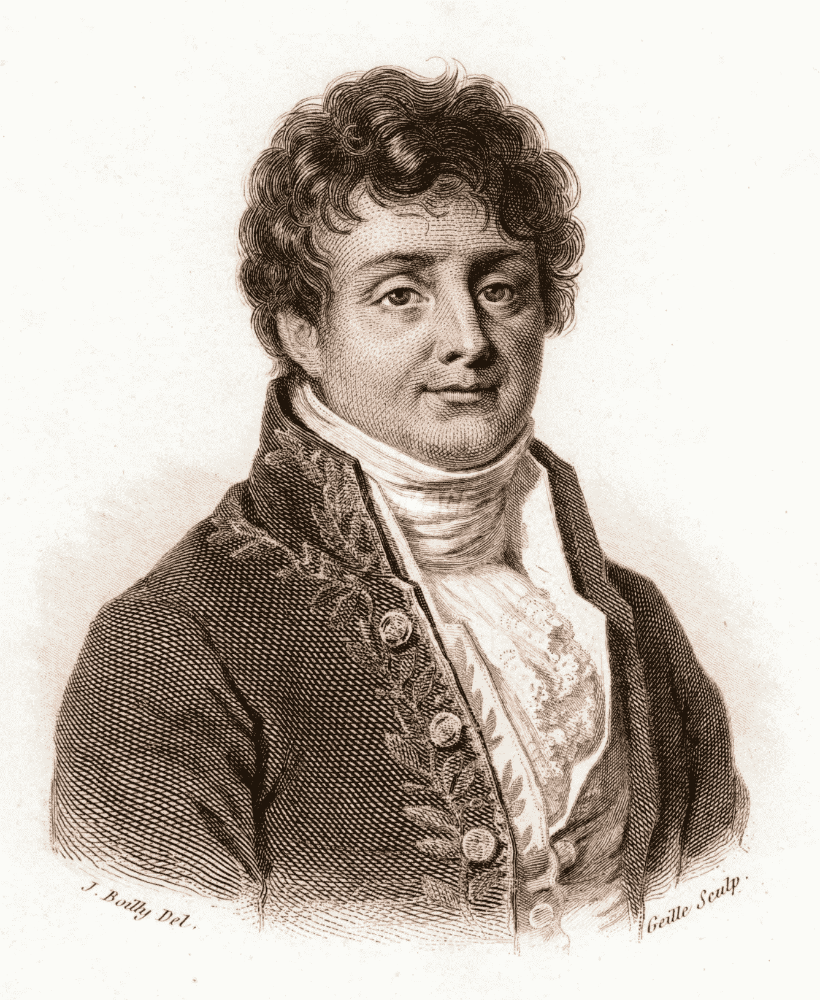

来自[维基](https://en.wikipedia.org/wiki/Joseph_Fourier)的约瑟夫·傅立叶

傅立叶变换是一种从完全不同的角度查看数据的强大方法:**从时域到频域。**但是这个强大的运算看起来很可怕，因为它的数学方程式。

将时域波转换到频域；

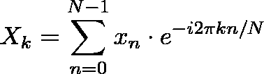

从时域到频域，也称为前向离散傅立叶变换或 DFT

下图很好地说明了傅立叶变换:将一个复杂的波分解成许多规则的正弦波。

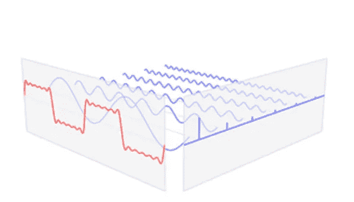

图片来自[维基](https://en.wikipedia.org/wiki/File:Fourier_series_and_transform.gif)

下面是完整的动画，解释了将时域波形数据转换到频域视图时会发生什么。


来自 [wiki](https://en.wikipedia.org/wiki/File:Fourier_series_and_transform.gif) 的 Gif

我们可以很容易地操纵频域中的数据，例如:去除噪声波。之后，我们可以使用这个逆方程将频域数据转换回时域波:

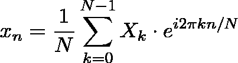

从频域到时域的逆变换，也称为离散傅里叶逆变换或 IDFT

让我们暂时忽略 FT 方程的复杂性。假设我们已经完全理解了数学方程的含义，让我们使用傅立叶变换在 Python 中做一些实际的工作。

理解任何事物的最好方法是使用它，就像学习游泳的最好方法是潜入水中变湿。

# 将干净的数据与噪声混合

创建两个正弦波并将它们合并成一个正弦波，然后有目的地用从`np.random.randn(len(t))`生成的数据污染干净的波。

```
import numpy as np
import matplotlib.pyplot as plt
plt.rcParams['figure.figsize'] = [16,10]
plt.rcParams.update({'font.size':18})#Create a simple signal with two frequencies
data_step   = 0.001
t           = np.arange(*start*=0,*stop*=1,*step*=data_step)
**f_clean     = np.sin(2*np.pi*50*t) + np.sin(2*np.pi*120*t)
f_noise     = f_clean + 2.5*np.random.randn(len(t))**plt.plot(t,f_noise,*color*='c',*Linewidth*=1.5,*label*='Noisy')
plt.plot(t,f_clean,*color*='k',*Linewidth*=2,*label*='Clean')
plt.legend()
```

(将两个信号组合形成第三个信号也称为[卷积或信号卷积](https://www.analog.com/media/en/technical-documentation/dsp-book/dsp_book_Ch6.pdf)。这是另一个有趣的主题，目前广泛用于神经网络模型中)

我们有带噪音的波浪，黑色是我们想要的波浪，绿色线条是噪音。

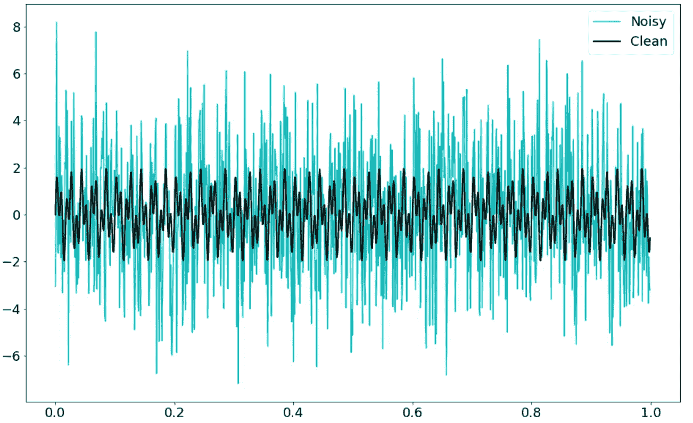

干净的海浪夹杂着噪音，作者安德鲁·朱

如果我隐藏图表中的颜色，我们几乎无法从干净的数据中分离出噪音。傅立叶变换在这里可以有所帮助，我们需要做的就是将数据转换到另一个角度，从时间视图(x 轴)到频率视图(x 轴将是波频率)。

# 从时域到频域的变换

可以用`numpy.fft`或者`scipy.fft`。我发现`scipy.fft`非常方便，功能齐全。这里我将在本文中使用`scipy.fft`，但是如果您想要使用其他模块，这是您的选择，或者您甚至可以基于我在开始时给出的公式构建一个您自己的模块(见后面的代码)。

```
from scipy.fft import rfft,rfftfreq
n    = len(t)
yf   = rfft(f_noise)
xf   = rfftfreq(n,data_step)
plt.plot(xf,np.abs(yf))
```

*   在代码中，我使用了`rfft` 而不是`fft`。r 的意思是减少(我想)以便只计算正频率。所有负镜像频率将被忽略。而且速度也更快。更多讨论见[此处](https://stackoverflow.com/questions/52387673/what-is-the-difference-between-numpy-fft-fft-and-numpy-fft-rfft)。
*   来自`rfft`函数的`yf`结果是一个复数，形式类似于`a+bj`。`np.abs()`函数将计算复数的√(a + b)。

这是我们原始波的神奇的频域视图。x 轴代表频率。

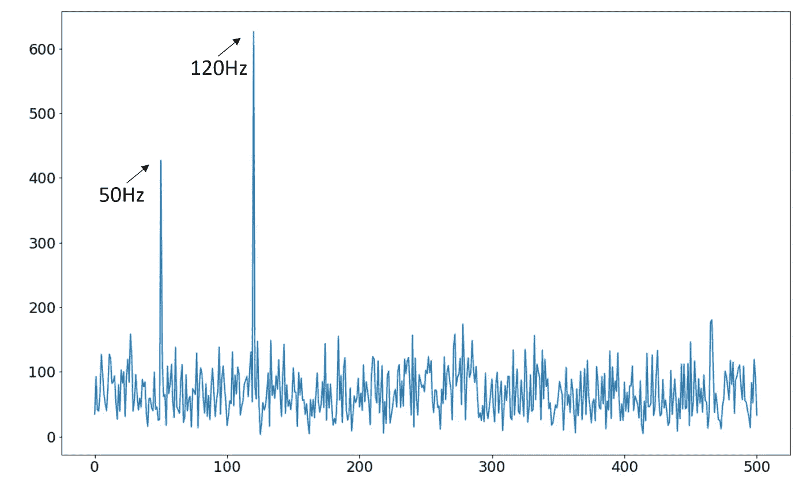

《频域数据》，作者 Andrew Zhu

在时域看起来复杂的东西现在被转换成非常简单的频域数据。两个峰值代表两个正弦波的频率。一波是 50 赫兹，另一波是 120 赫兹。再回头看看产生正弦波的代码。

```
f_clean     = np.sin(2*np.pi***50***t) + np.sin(2*np.pi***120***t)
```

其他频率都是噪声，下一步会很容易去除。

# 去除噪声频率

在 Numpy 的帮助下，我们可以很容易地将这些频率数据设置为 0，除了 50Hz 和 120Hz。

```
yf_abs      = np.abs(yf) 
**indices     = yf_abs>300   # filter out those value under 300**
**yf_clean    = indices * yf # noise frequency will be set to 0**
plt.plot(xf,np.abs(yf_clean))
```

现在，所有的噪音都被消除了。

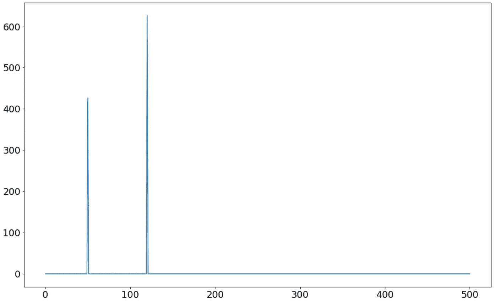

清理噪音，作者安德鲁·朱

# 逆回到时域数据

代码:

```
from scipy.fft import irfft
**new_f_clean = irfft(yf_clean)**
plt.plot(t,new_f_clean)
plt.ylim(-6,8)
```

结果表明，所有的噪声波都被消除了。

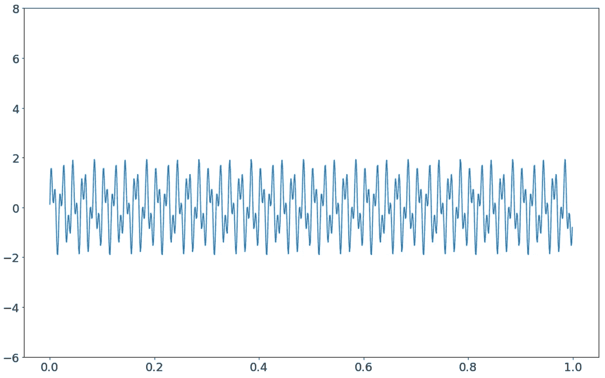

洁净的波浪，作者安德鲁·朱

# 转变是如何进行的

回到转换等式:


从时域到频域，也称为前向离散傅立叶变换或 DFT

原始时域信号由小写 *x* 表示。 *x[n]* 表示 n 位置(时间)的时域数据点。频域中的数据点由大写字母 *X* 表示。*X【k】*表示频率为 k 时的值

比方说，我们有 10 个数据点。

```
x = np.random.random(10)
```

`N`应该是 10，所以`n`的范围是 0 到 9，10 个数据点。`k`代表频率#，其范围是 0 到 9，为什么？极端情况是每个数据点代表一个独立的正弦波。

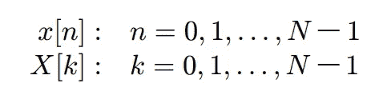

n 和 k 的范围。

在传统的编程语言中，需要两个**用于**循环，一个用于`k`，另一个用于`n`。在 Python 中，对于循环，可以用 0 显式**对操作进行矢量化(表达式 Python)。**

而且 Python 对复数的原生支持也很牛逼。让我们建立傅立叶变换函数。

```
import numpy as np
from scipy.fft import fft
*def* DFT_slow(*x*):
    *x* = np.asarray(*x*, *dtype*=float)# ensure the data type
    N = *x*.shape[0]                # get the x array length
    n = np.arange(N)              # 1d array
    k = n.reshape((N, 1))       # 2d array, 10 x 1, aka column array
    M = np.exp(-2*j* * np.pi * k * n / N)
    return np.dot(M, *x*)       # [a,b] . [c,d] = ac + bd, it is a sum
x = np.random.random(1024)
np.allclose(DFT_slow(x), fft(x))
```

与来自`numpy` 或`scipy`的函数相比，这个函数相对较慢，但对于理解 FFT 函数如何工作已经足够了。为了更快地实现，请阅读杰克的[理解 FFT 算法](http://jakevdp.github.io/blog/2013/08/28/understanding-the-fft/)。

# 进一步的思考——不是总结

傅立叶变换所表达的思想是如此深刻。它提醒我，世界可能不是你看到的那样，你生活的世界可能有一个完全不同的新面貌，只有通过某种变换才能看到，比如傅立叶变换。

不仅可以转换声音数据，还可以转换图像、视频、电磁波，甚至股票交易数据( [Kondratiev 波](https://en.wikipedia.org/wiki/Kondratiev_wave))。

傅立叶变换也可以用波生成圆来解释。

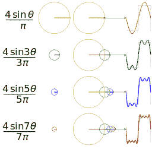

来自[维基](https://en.wikipedia.org/wiki/File:Fourier_series_square_wave_circles_animation.gif)

大圈是我们的国家，我们的时代。我们作为一个个体是一个小小的核心圈子。没有那个驱动一切的大圈子，我们真的是做不到太多。

工业革命发生在英国而不是其他国家，不仅仅是因为采用了蒸汽机，还有许多其他原因。— [英国为什么先工业化](https://erik-engheim.medium.com/why-england-industrialized-first-d09bc797cf7f)。就是那个时候只存在于英格兰的大圈。

如果你很富有或者在某些时候、某些地方非常成功，这可能不全是因为你自己的优点，而很大程度上是因为你的国家、你周围的人或者你工作的好公司。没有那些驱使你前进的大圈子，你可能无法实现你现在所拥有的。

我对傅立叶变换了解得越多，我就越对约瑟夫·傅立叶感到惊讶，他在 1822 年提出了这个令人难以置信的方程。他永远也不会知道，在 21 世纪，他的作品现在到处都在使用。

# 附录—四种傅立叶变换

本文中提到的所有傅立叶变换都是指离散傅立叶变换。

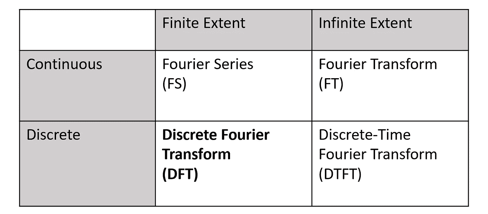

《傅立叶变换的四种类型》，作者安德鲁·朱

当你坐在计算机前，试图用傅立叶变换做一些事情时，你只会使用 DFT——本文讨论的变换。如果你决定投身于数学沼泽，这里有两本推荐阅读的书:

1.  **频域和傅立叶变换**。[保罗·w·库夫](http://www.princeton.edu/~cuff/)的[课本](https://www.princeton.edu/~cuff/ele201/kulkarni_text/frequency.pdf)来自普林斯顿。

2.《数字信号处理》一书的第 8 章**——作者史蒂文·W·史密斯他们提供了在线链接: [DSP Ch8](https://www.analog.com/media/en/technical-documentation/dsp-book/dsp_book_Ch8.pdf)**

# 参考

1.  傅立叶变换互动指南:[https://better explained . com/articles/an-Interactive-Guide-To-The-Fourier-Transform/](https://betterexplained.com/articles/an-interactive-guide-to-the-fourier-transform/)
2.  用 scipy.fft 进行傅立叶变换:Python 信号处理:[https://realpython.com/python-scipy-fft/](https://realpython.com/python-scipy-fft/)
3.  了解 FFT 算法:[http://jakevdp . github . io/blog/2013/08/28/understanding-the-FFT/](http://jakevdp.github.io/blog/2013/08/28/understanding-the-fft/)
4.  频域和傅立叶变换:[https://www . Princeton . edu/~ cuff/ele 201/kulkarni _ text/frequency . pdf](https://www.princeton.edu/~cuff/ele201/kulkarni_text/frequency.pdf)
5.  用 FFT 去噪数据【Python】:[https://www.youtube.com/watch?v=s2K1JfNR7Sc&ab _ channel = Steve brunton](https://www.youtube.com/watch?v=s2K1JfNR7Sc&ab_channel=SteveBrunton)
6.  FFT 算法——简单的一步一步来:[https://www.youtube.com/watch?v=htCj9exbGo0&ab _ channel = Simon Xu](https://www.youtube.com/watch?v=htCj9exbGo0&ab_channel=SimonXu)

如果你有任何问题，请留下评论，我会尽力回答，如果你发现了错误，不要犹豫，把它们标记出来。你们的阅读和支持是驱使我继续多写的大圈子。谢谢你。