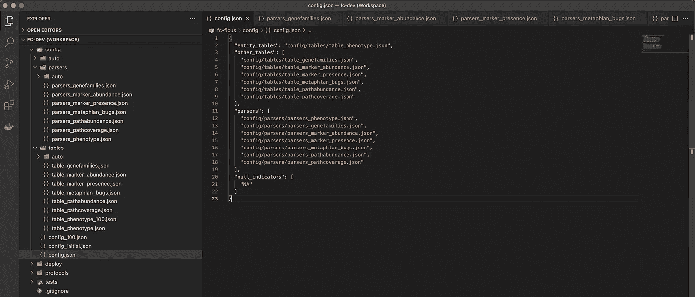
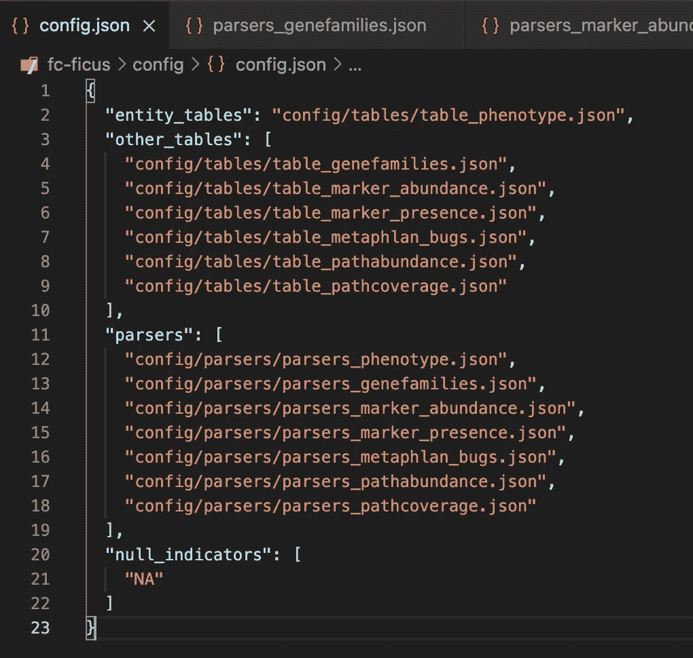
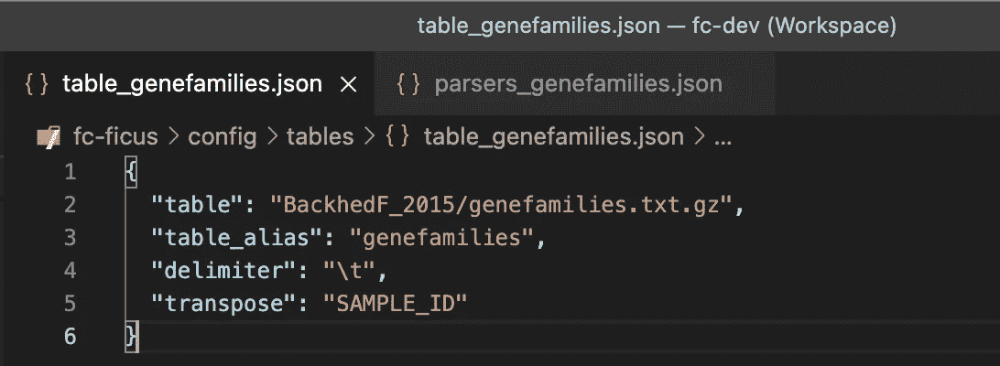
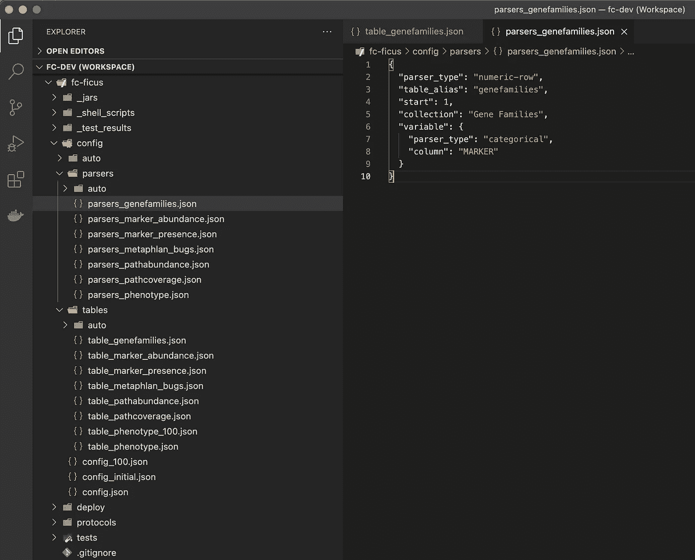
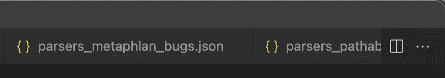
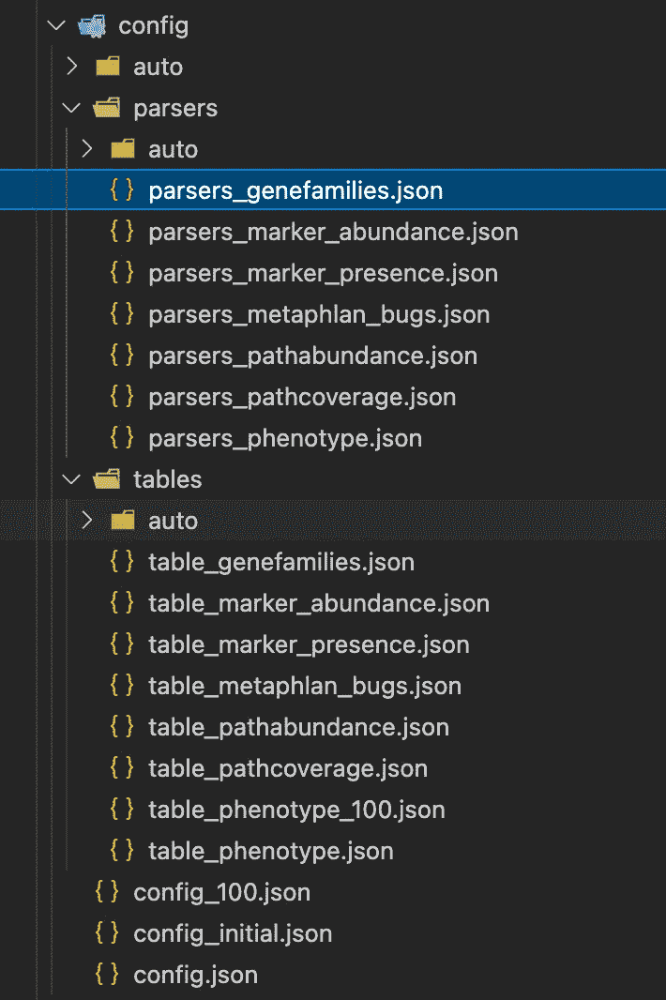
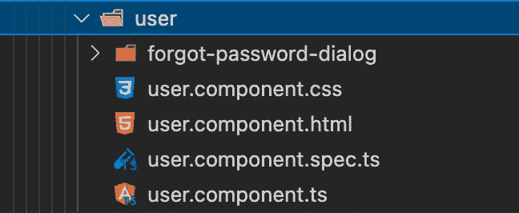

# 带有匈牙利符号的更清晰的代码

> 原文：<https://towardsdatascience.com/cleaner-code-with-hungarian-notation-49dfb1c88502?source=collection_archive---------13----------------------->

我最近开发的微生物组数据产品的 JSON 配置。记下文件名。

超越英语用语的限制，更好地组织和更快地解释你的工作。

# 前言

你还记得你什么时候学会了如何格式化日历日期进行字母数字排序吗？你或者有月首美国格式的日期，例如*09–11–1991*，或者有日首欧洲格式的日期，例如*11–09–1991*，并且你意识到排序不起作用。日期排序需要首先按年份进行，然后按月份进行，最后按月份进行，例如[*1991–09–11*](https://nerdcalendar.tumblr.com/post/150260458657/september-11-1991-the-dude-writes-a-check-for)。

或者——您还记得您什么时候学习了更清晰的变量、方法和类命名的更好实践吗？也许当你看着别人的代码，却不知道变量 *isOvrLn* 是什么意思的时候，或者不知道名为 *mkZro()的函数是什么意思的时候，就会发生这种情况；*

哈！我本能地用分号结束了最后一句话。

无论如何，我在这里想说的是，从你认识到这些更好的编码实践的那一刻起，一切都变了。有时这个教训会产生如此大的影响，你不得不回去重构遗留代码，以帮助未来的读者和[避免潜在的尴尬](http://threevirtues.com/)。

另一个类似的顿悟最近又发生在我身上——在我 20 年的编程生涯中。

# 匈牙利符号

这里有一个[维基百科链接](https://en.wikipedia.org/wiki/Hungarian_notation)来复习一下——这是一个相对古老的概念，可以归结为你可能想用代码命名一个东西——例如变量、类、接口等等。—包括关于它是什么的信息，即它的*类型*。

匈牙利符号仍然有争议，所以在这篇文章中，我将关注我的一个特殊用例，以及为什么我认为它有效。

# 微生物组数据产品示例

在这里，我使用低代码 JSON 模板从源数据文件定义一个 [Tag.bio 数据产品](https://tag.bio/)。您应该能够在不了解 Tag.bio 语法的情况下理解这些示例。

这个顶层文件 *config.json* 概述了创建数据模型所需的所有文件和函数。

注意我们是如何使用文件路径来引用嵌套代码的——包含**表**对象的文件以*表 _* 为前缀，包含**解析器**对象的文件以*解析器 _* 为前缀。

您可能会注意到,**表**目标文件已经位于一个名为*表/* 的文件夹中，而**解析器**目标文件已经位于一个名为*解析器/* 的文件夹中。那么，为什么会有冗余呢？

因为我并不总是通过文件的完整路径来查看文件。很多时候，我会在编辑器中将文件名单独作为一个标签来看。

这里，我们使用*类型*前缀来区分同一个**gene families***aspect*的**表**目标文件和**解析器**目标文件。

此外，当查看我的 IDE 的资源管理器视图中列出的许多文件时，我希望直接从文件名中快速了解每个文件的用途，而不必通过视觉扫描来识别父文件夹。

# 为什么使用前缀和后缀？

这是它有助于远离英语的地方。在英语中，我们把形容词放在名词前面，例如大河。在许多其他语言中，形容词放在名词之后，例如西班牙语中的 *el rio grande* 。

鉴于本文中的代码——以及绝大多数已编写的代码——都是英文的，为什么我们决定将文件命名为*table _ gene families . JSON*而不是*gene families _ table . JSON*？这不是显而易见的。当我和我的同事谈到这些对象时，我们肯定会说“genefamilies 表”，而不是“genefamilies 表”。

我使用匈牙利符号前缀的理由——在这个特定的例子中是*——与 IDE 以及文件名如何组织、显示和排序有关。*

当您打开许多编辑器选项卡时，文件名通常会被截断。通过使用前缀，名称中最重要的部分——在本例中是*类型*——最后被删除。

在构建文件夹层次结构时，我们已经声明了每个对象的*类型*比*方面*更重要——即**解析器**被放入*解析器/* 文件夹，而**表**被放入*表/* 文件夹。

前缀不仅清楚地表明每个文件包含什么类型的对象，而且前缀的冗余性——在左侧水平对齐——也清楚地表明我正在查看哪个父文件夹。

确定我在*解析器/* 文件夹中并查看**解析器**对象后，我可以沿着最右边的信息“列”垂直扫描，以确定我需要打开的特定文件——或者快速了解该文件夹中所有文件的范围。

值得注意的是，在 Tag.bio 中，我们已经为我们的 JSON 文件建立了一个约定，首先围绕*类型*，其次围绕*方面*进行组织。我们更喜欢嵌套更少的更宽的文件夹，并且在相同*类型*的文件之间有许多有用的代码复制/粘贴。开发人员更频繁地在多个**表**或多个**解析器**上工作，而在单个*方面*内工作的频率较低——例如 **genefamilies** 。

# 有时候后缀会更好

切换到一个不同的代码示例——因为我已经注意到在 Web 应用程序世界中，像 [Angular](https://en.wikipedia.org/wiki/Angular_(web_framework)) 这样的框架已经迁移到代码主要由*方面*组织而不是由*类型*组织的惯例。

在这个来自 Tag.bio web 应用程序(Angular)代码库的示例中，我们围绕用户页面*方面*对文件进行分组，包括同一文件夹中不同*类型*的文件。在这里，带有**后缀**的匈牙利符号对于*类型*——即**文件扩展名**——是一个更好的选择。

Angular 社区意识到，开发人员经常处理与特定*方面*相关的文件，例如**用户.组件**，而较少处理与特定*类型*相关的文件，例如**。css** 。

仔细想想，文件扩展名可能是匈牙利符号中争议最小的形式。

# 这一切不是很明显吗？

那么，检查你的代码库，自己决定文件名是否足够清楚。另一个开发人员会仅仅通过阅读文件名来理解每个文件的用途吗？

感谢阅读！