# 用“看门人”包清理和探索数据

> 原文：<https://towardsdatascience.com/cleaning-and-exploring-data-with-the-janitor-package-ee4a3edf085e?source=collection_archive---------17----------------------->

## 探索 clean_names()之外的功能


照片由 Pexels 的 Pixabay 拍摄

# **看门人包**

《T2》看门人套装可在 CRAN 上下载，由山姆·菲尔克、比尔·丹尼、克里斯·海德、瑞安·奈特、马尔特·格罗塞和乔纳森·扎德拉创作。虽然可以说最出名的是它非常有用的 clean_names()函数(我将在本文的后面介绍)，但是看门人包有大量的函数可以简化数据清理和探索。该软件包旨在与 tidyverse 兼容，因此可以无缝集成到大多数数据准备工作流中。我所参考的看门人软件包功能的有用概述可以在[这里](https://cran.r-project.org/web/packages/janitor/vignettes/janitor.html)和[这里](https://garthtarr.github.io/meatR/janitor.html#crosstabulation)找到。此外，以下引用的所有数据和代码都可以在[GitHub repo](https://github.com/emilyhalford/janitor_package)中访问。

# **GNIS 数据**

我们将在本教程中使用的数据来自地理名称信息系统(GNIS)，这是一个由美国地名委员会创建的数据库。这个数据集出现在 Jeremy Singer-Vine 的 [Data is Plural](https://tinyletter.com/data-is-plural) 时事通讯中，本质上是一个国内地名的可搜索目录。

为了下载数据，我们首先需要导航到[查询表单](https://geonames.usgs.gov/apex/f?p=138:1::::::):

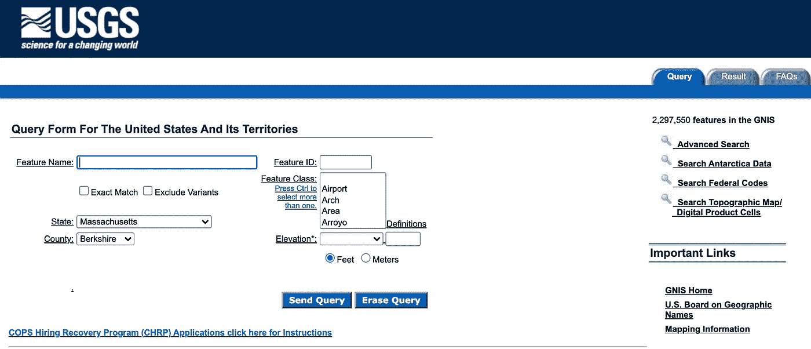

我选择使用代表马萨诸塞州伯克郡地名的数据，这个地区包括我的家乡。为了创建该搜索，从州下拉菜单中选择“马萨诸塞州”,从县下拉菜单中选择“伯克希尔”。然后，点击“发送查询”按钮:

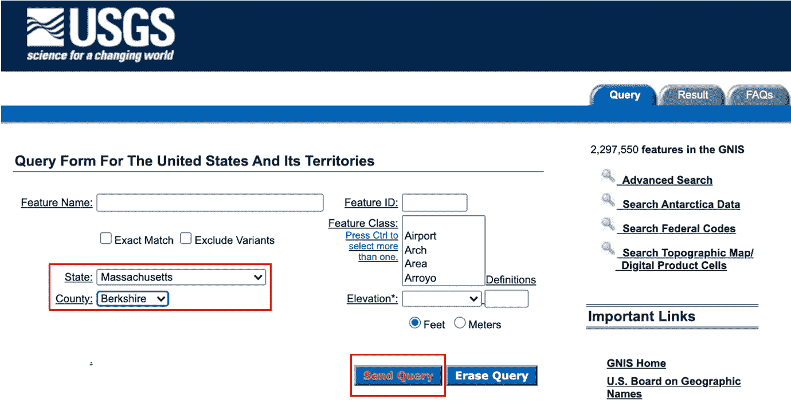

查询结果将如下所示。在结果表下方，单击“另存为管道”|“分隔文件”将数据保存到本地:

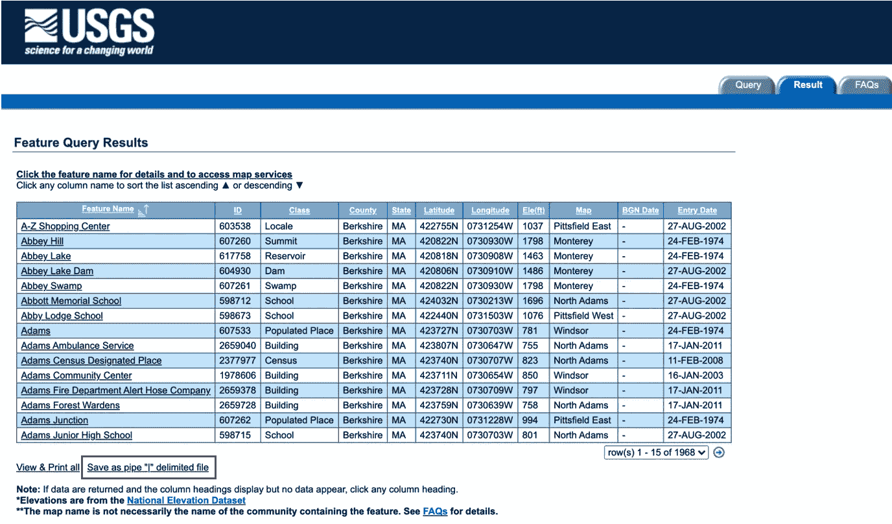

数据应该开始自动下载，并将出现在一个. csv 文件中，其特征由“|”分隔:

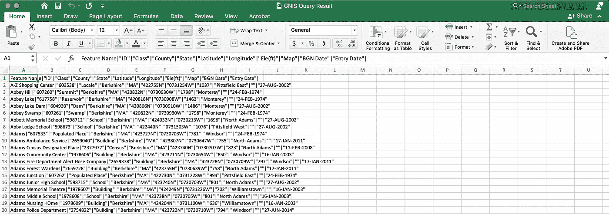

将这个 csv 文件保存到新 R 项目的“data”文件夹中。让我们将数据放入 R 中，将这些列分离出来，并执行一点修改，以便于我们的看门人包探索。首先，在一个新的 R Markdown 文件中加载 tidyverse 和看门人包。使用 read.csv()函数将数据作为“place_names”加载:

```
library(tidyverse)
library(janitor)place_names = read.csv("./data/GNIS Query Result.csv")
```

数据看起来应该和它在 Excel 中的样子差不多，一个巨大的列包含了我们所有的数据:

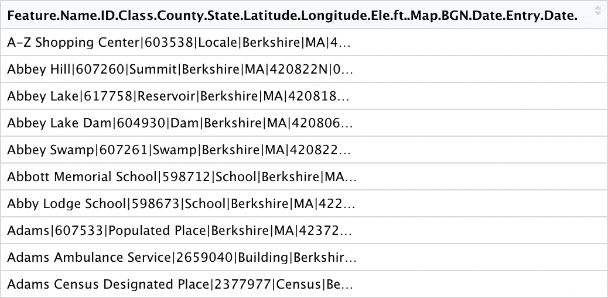

让我们来研究一下这个。首先，我们将名称“columns”分配给这个单独的列，以避免在代码中包含像默认列名称那样混乱和冗长的内容。接下来，我们使用 separate()函数将这一列分成它的所有组成部分。然后，我们将数据过滤到伯克希尔县，随着对数据的进一步检查，很明显，我们的伯克希尔县查询中包含了该县以外的一些条目。然后，我们在 mutate()步骤中稍微修改一下数据，以便以后整理它。str_replace()用于将 ID“598673”替换为数据集中已经存在的 ID 号“598712”，以便创建一个重复的 ID。最后，使用 NAs 在每行中创建了一个名为“extra_column”的额外列:

```
colnames(place_names) = "columns"place_names = 
  place_names %>% 
  separate(columns, c("Feature Name", "ID", "Class", "County", "State", "Latitude", "Longitude", "Ele(ft)", "Map", "BGN Date", "Entry Date"), sep = "[|]") %>%
  filter(County == "Berkshire") %>% 
  mutate(
    ID = str_replace(ID, "598673", "598712"),
    extra_column = NA
  )
```

在继续之前，让我们快速创建第二个名为“non_ma_names”的数据集，其中包含实际上并非来自伯克希尔县的条目。我们再次读入“GNIS 查询结果. csv”文件并分离出列名。然后，我们应用看门人包中的 clean_names()函数，这将在下一节中深入讨论。最后，我们在 mutate 步骤中使用 as.numeric()和 as.factor()将 ele_ft 变量转换为数字变量，将 map 变量转换为因子:

```
non_ma_names = read.csv("./data/GNIS Query Result.csv")colnames(non_ma_names) = "columns"non_ma_names = 
  non_ma_names %>% 
  separate(columns, c("Feature Name", "ID", "Class", "County", "State", "Latitude", "Longitude", "Ele(ft)", "Map", "BGN Date", "Entry Date"), sep = "[|]") %>% 
  filter(County != "Berkshire") %>% 
  clean_names() %>% 
  mutate(
    ele_ft = as.numeric(ele_ft),
    map = as.factor(map)
  )
```

现在让我们看看看门人能做什么！

# **使用看门人**

## 行名()

您可能已经收到了大量的数据文件，可能在。xlsx 表单，在实际数据开始之前，电子表格顶部有几行。这些行可以是空白的，也可以填充信息和公司徽标。当您将这些数据加载到 R 中时，这些前导行的内容可能会自动成为您的列标题和第一行。看门人包中的 row_to_names()函数允许您指出数据框中的哪一行包含实际的列名，并删除该行之前的所有内容。对我们来说很方便的是，GNIS 数据已经在正确的位置有了列名。不管怎样，让我们试一下，假设列名实际上在第三行。

我们使用 row_to_names()函数创建一个名为“test_names”的新数据帧。row_to_names()函数采用以下参数:数据源、列名应该来自的行号、是否应该从数据中删除该行以及是否应该从数据中删除上面的行:

```
test_names = row_to_names(place_names, 3, remove_row = TRUE, remove_rows_above = TRUE)
```

我们可以看到，第 3 行的信息现在构成了我们的列名。该行及其上方的行已从数据框中移除，我们可以看到数据现在从第 4 行开始:

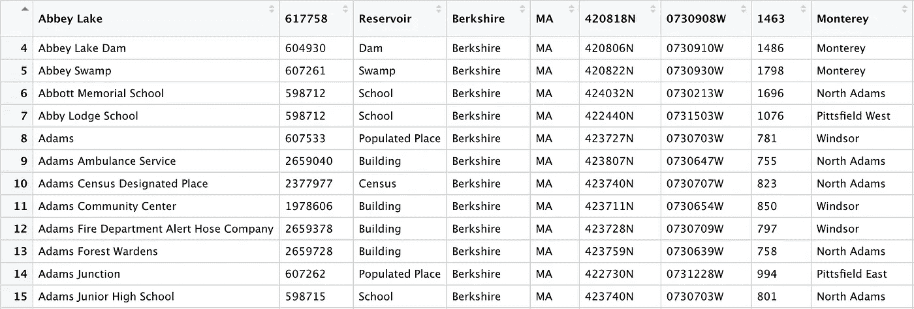

虽然这个函数不是清理 GNIS 数据所必需的，但是它对于其他数据集来说肯定是很方便的！

## 清理名称()

这个函数是我几乎每次将新数据集加载到 r 中时都会用到的函数。如果您还没有使用这个函数，我强烈建议将它合并到您的工作流中。这是这个包中最受欢迎的功能，因为它非常有用！

[tidyverse style guide](https://style.tidyverse.org/syntax.html) 推荐对象名和列名使用 snake case(由下划线分隔的单词，如 this)。让我们花一点时间回顾一下我们的列名。有各种大写字母和空格(如“功能名称”、“BGN 日期”)以及符号(“Ele(ft)”)。clean_names()函数将把所有这些转换成 snake case。

使用 clean_names()非常简单，如下所示:

```
place_names = clean_names(place_names)ORplace_names = 
  place_names %>% 
  clean_names()
```

正如您在下面看到的，这个函数处理了数据集中出现的各种混乱的列名。现在一切看起来干净整洁:

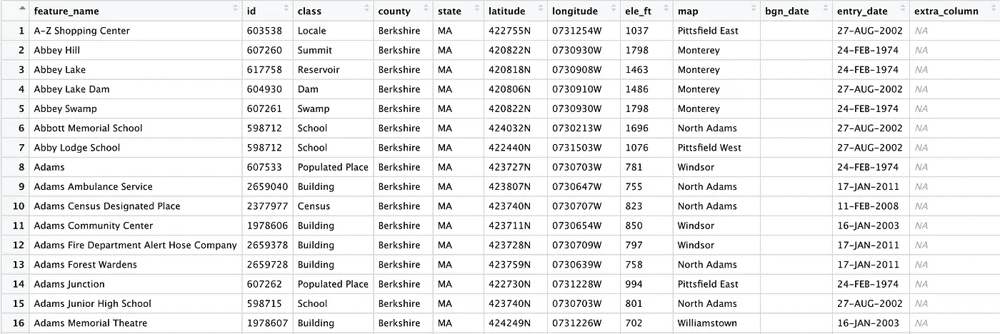

## 移除 _empty()

remove_empty()函数，顾名思义，删除空的列。在准备数据时，我们在“place_names”数据框中创建了一个空列，因此我们知道至少有一列会受到此函数的影响。让我们试一试:

```
place_names = 
  place_names %>% 
  remove_empty()
```

如您所见，empty_column 已从我们的数据框中删除，只留下包含数据的列:

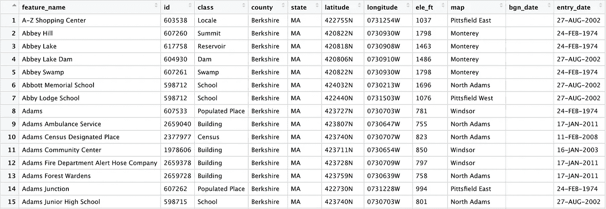

bgn_date 列看起来是空的，但是它没有被 remove_empty()删除的事实告诉我们，至少在一行中必须有数据。如果我们向下滚动，我们会看到事实就是这样:

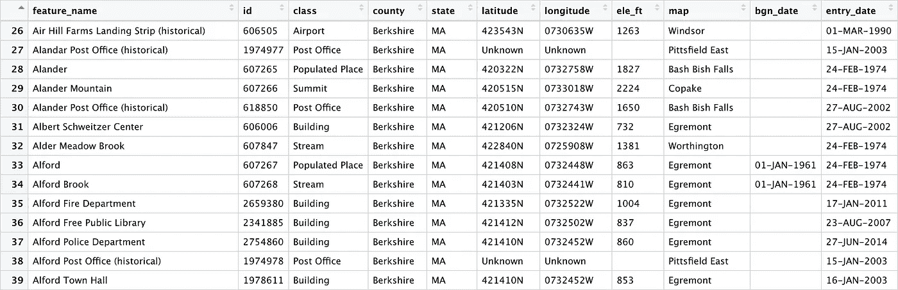

## 移除常量()

remove_constant()函数删除所有行中具有相同值的列。我们的数据集目前有其中的两个，因为我们将数据过滤到了伯克希尔县，所有伯克希尔县都在马萨诸塞州内，所有行的 county = "Berkshire "和 state = "MA"。这些行保留在数据集中不是特别有用，因为它们不提供特定于行的信息。我们可以简单地使用 select()来删除这些列，但是 remove_constant()的好处是，这个函数可以对我们假设的所有条目都相同的情况进行双重检查。事实上，使用 remove_constant()是我第一次发现原始数据中 1968 个条目中有 38 个实际上不是来自伯克希尔郡！

像 remove_empty()一样，remove_constant()函数需要的所有信息都是它应该操作的数据集:

```
place_names = 
  place_names %>% 
  remove_constant()
```

正如您在下面看到的，县和州列已被删除:

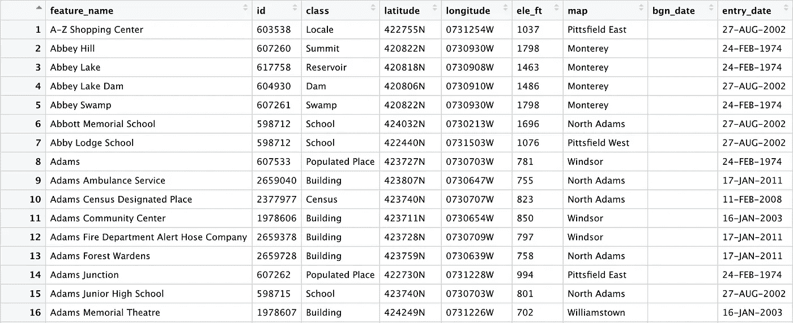

## compare_df_cols()

有没有试过使用 rbind()将两个数据帧堆叠在一起，却遇到意外错误？compare_df_cols()函数直接比较两个数据框中的列，对于解决这个问题非常有用。让我们通过将我们的“地名”数据框与我们创建的包含伯克郡以外条目的数据框“非马萨诸塞州名称”进行比较来尝试一下:

```
compare_df_cols(place_names, non_ma_names)
```

输出是一个比较两个数据帧的方便的表格。我们在地名中看到“NA”代表县和州，在非地名中看到“character”代表这些变量。这是因为我们用 remove_constant()从 place_names 中删除了这些列，但从未对 non_ma_names 中的默认字符变量做任何事情。在 non_ma_names 中，我们还将 ele_ft 视为数字，将 map 视为因子变量，这是我们在数据准备期间特别指定的。如果我们试图将这些数据框合并在一起，了解哪些列缺失以及哪些列在数据框中具有不一致的类型会很有用。在包含许多列的数据框中，compare_df_cols()可以显著减少进行这些比较所花费的时间。


## get_dupes()

我经常从事具有唯一患者 id 的项目，您不希望在您的数据集中看到重复的 id。在很多其他情况下，您可能希望确保某个 ID 变量具有完全唯一的值，包括我们的 GNIS 数据。您应该还记得，我们在准备数据时创建了一个重复的 ID。让我们看看 get_dupes()是如何检测到这一点的。该函数只需要数据框的名称和作为标识符的列的名称:

```
get_dupes(place_names, id)
```

如下所示，数据框被过滤为 ID 列中有重复值的行，从而便于调查任何问题:

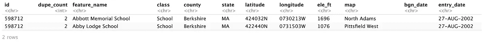

## 泰伯基()

tabyl()函数是 table()函数的 tidyverse 兼容替代函数。它还与 knitr 包兼容，对于数据探索非常有用。

让我们先用一个变量来试一下。假设我们对伯克郡的每个城镇有多少所学校感兴趣。我们首先将我们的类变量过滤为“School”，然后将 tabyl()函数用于我们的 map (location)变量。最后，我们将它输入到 knitter::kable()中，将输出格式化成一个漂亮的表格:

```
place_names %>% 
  filter(class %in% "School") %>% 
  tabyl(map) %>% 
  knitr::kable()
```

运行这个非常基本的代码块会产生下面的输出表:

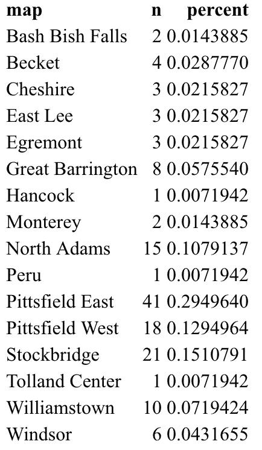

当我们编织 Rmd 文件时，kable()函数将很好地格式化表格，如下所示。我们可以方便地得到每个城镇中学校的数量，以及该城镇中所有学校的百分比。很容易对这些数据进行观察，例如 29.5%的学校在皮茨菲尔德东部，那里有 41 所学校。或者这三个镇太小了，只有一所学校:

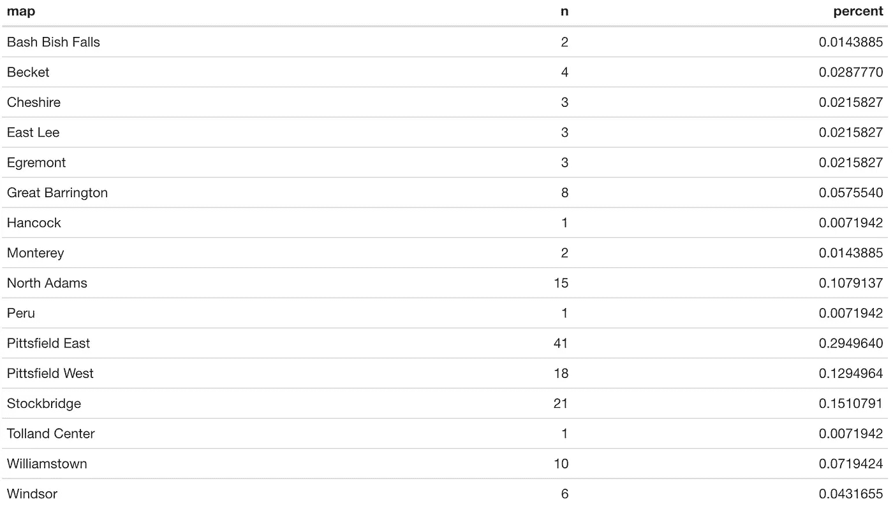

现在让我们试试两个变量的交叉列表。让我们看看每个城镇中有多少每种类型的地标:

```
place_names %>% 
  tabyl(map, class) %>% 
  knitr::kable()
```

我们的桌子的一部分(一旦编织)如下所示。对于每个城镇，我们可以清楚地看到每个地标类型在数据库中有多少:

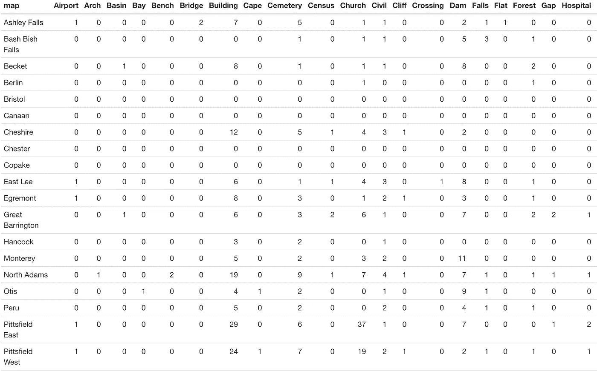

虽然像这样简单的计数可能非常有用，但也许我们更关心列百分比。换句话说，每个城镇中每个地标类型的条目占多大比例？这很容易通过“装饰百分比()”函数用 tabyl()来研究:

```
place_names %>% 
  tabyl(map, class) %>% 
  adorn_percentages("col") %>% 
  knitr::kable()
```

现在我们看到的是这些列的百分比而不是计数，但是这个表很难阅读:

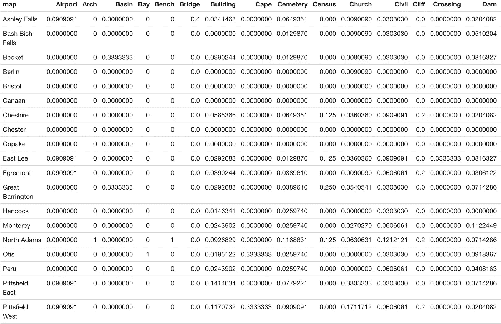

我们可以用 attear _ pct _ formatting()函数稍微清理一下，它允许用户指定输出中包含的小数位数。精度对于这个探索性的表不是特别重要，所以让我们使用 0 个小数位来使这个表更容易阅读:

```
place_names %>% 
  tabyl(map, class) %>% 
  adorn_percentages("col") %>% 
  adorn_pct_formatting(digits = 0) %>% 
  knitr::kable()
```

好多了！现在，阅读表格和理解我们的列百分比就容易多了:

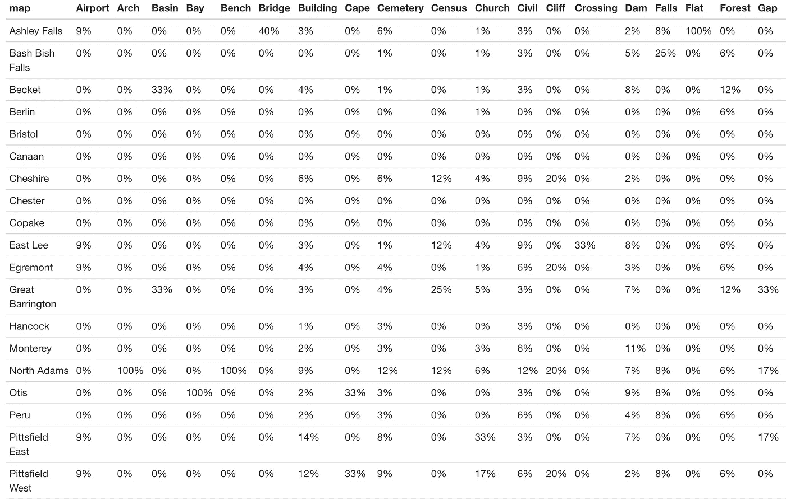

使用 embody _ percentages()来查看行百分比(在我们的例子中，是属于每个地标类型的每个城镇的条目的百分比)同样简单:

```
place_names %>% 
  tabyl(map, class) %>% 
  adorn_percentages("row") %>% 
  adorn_pct_formatting(digits = 0) %>% 
  knitr::kable()
```

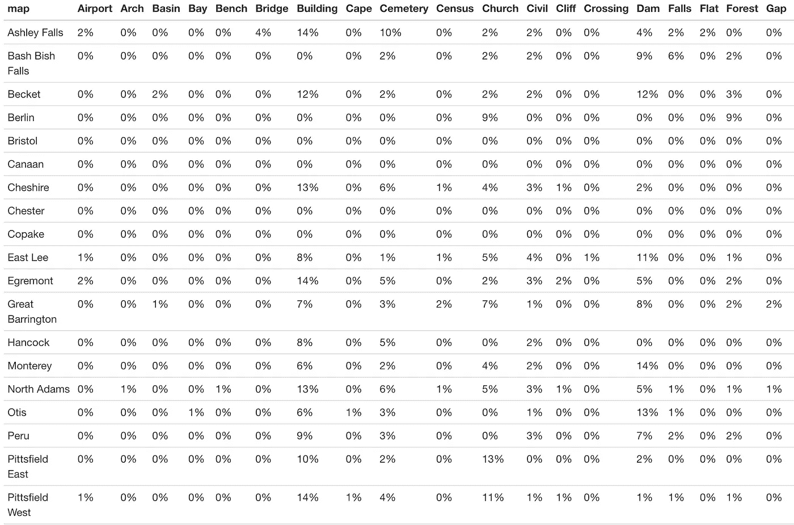

## 其他功能

在本文中，我描述了看门人包中的函数，我发现这些函数在我的日常工作中很有用。然而，这并不是看门人功能的详尽列表，我建议参考[文档](https://cran.r-project.org/web/packages/janitor/janitor.pdf)以获得关于这个包的更多信息。

也就是说，这里至少有几个其他函数值得注意:

1.  **excel_numeric_to_date():** 该函数设计用于处理 excel 的许多日期格式，并将这些数字变量转换为日期变量。对于那些经常在 Excel 中处理数据的人来说，这似乎可以节省大量时间。作为一个不常使用 Excel 的用户，我非常依赖 lubridate 包来处理日期变量。
2.  **round_to_fraction():** 此函数允许您将小数四舍五入为精确的分数分母。想要将所有值四舍五入到最接近的四分之一，还是使用小数来表示一小时中的分钟数？round_to_fraction()函数可能会对您有所帮助。
3.  **top_levels():** 该函数生成一个频率表，将分类变量折叠成高、中、低三个级别。常见的[用例](https://cran.r-project.org/web/packages/janitor/vignettes/janitor.html#count-factor-levels-in-groups-of-high-medium-and-low-with-top_levels)包括简化李克特式秤。

# 结论

在这一点上，大多数数据分析师和数据科学家将大部分时间投入到数据清理和探索中，这是一个常识，因此，我总是发现新的包和函数可以使这些过程更加高效，这是一件令人兴奋的事情。

无论您以前是否使用过看门人包，我希望这篇文章已经向您介绍了一些函数，这些函数将被证明是对您的数据科学工具包的有用补充。