# 在建模或分析之前，清理和准备 R 中的营销数据

> 原文：<https://towardsdatascience.com/cleaning-and-preparing-marketing-data-in-r-prior-to-machine-learning-or-analysis-ec1a12079f1?source=collection_archive---------11----------------------->

## [实践教程](https://towardsdatascience.com/tagged/hands-on-tutorials)

## *一个基本的、循序渐进的指南，帮助你清理 R* 中典型的杂乱营销数据


照片由[亚历山大·曾](https://unsplash.com/@alexander_tsang?utm_source=unsplash&utm_medium=referral&utm_content=creditCopyText)在 [Unsplash](https://unsplash.com/collections/1920918/minimal-architecture?utm_source=unsplash&utm_medium=referral&utm_content=creditCopyText) 上拍摄

# **TLDR**

本文着眼于在分析或输入 ML 模型之前处理 R 中杂乱数据的基本工作流程。具体来说，它将讨论:

*   正确导入 csv 数据
*   添加、删除和重命名列
*   识别独特性，处理重复的价值和 NAs
*   一致的大小写和格式
*   查找和替换字符串
*   处理不同的日期格式🙀！
*   将不同的数据集合并成一个
*   将每日数据转换为每周数据
*   将长数据转换为宽格式

我一直深入到基础，一步一步地帮助新的 R 用户一行一行地掌握 R。如果时间允许的话，我希望很快能把这变成一个关于营销组合建模的系列🤗！

# **挑战**

在本练习中，我特意设置了以下挑战:

*   使用两个不同的数据集，这两个数据集都被认为是混乱的
*   尽可能坚持使用**底座/默认 R**
*   尽可能多地注释代码

# 让我们先解决这个问题:营销数据总是混乱的。

为什么？这是因为这些数据通常存放在多个平台上，有些在线，有些离线，全部由不同的团队、外部合作伙伴等管理。简直是*遍地*。

让我们举例说明:如果你是一名负责衡量数字营销活动有效性的分析师，你可能需要从 Google Analytics 收集网站表现数据，从 Search Ads 360 或 Tradedesk 收集广告表现数据，然后从 CRM 或 SQL 数据库检索客户数据及其订单。

接受会有不完整的数据。将会有 NAs 或许多丢失的值。将会有格式和结构问题。有些数据甚至可能不是你所想的那样(嘘！看到那个叫做“转换”的专栏了吗这不是收到的查询总数，实际上是衡量用户点击*提交查询按钮的次数——查询是否成功是另一回事🙄。)*

在我们可以在任何建模或分析中可行地使用这些数据之前，我们需要擦洗、清理和整理这些数据。我们开始吧！💪

# 与 R 中混乱的数据争论

## **数据集**

在本练习中，我们将查看两个数据集:

*   一个是每日营销绩效数据，具有典型的指标，如日期、渠道、每日支出、展示、转化、点击等。我们可以假设这来自一个分析平台。
*   另一个是日常销售数据(订单 id、收入、税收、运输等)。我们可以假设这来自一个客户关系管理系统。
*   这两个数据集都可以被认为是杂乱的(你马上就会明白为什么！🤭)

> 👉你可以在这里访问 Kaggle [上的数据集。感谢 Firat，数据集所有者，感谢他让我在帖子中使用它！](https://www.kaggle.com/fehmifratpolat/marketing-report)

## **使用基本/默认 R**

我已经决定尽可能地坚持使用**基地 R** 。为什么？因为在使用尽可能少的 R 包时，我的目标是尽可能减少依赖。当你加载一个 R 包时，它有时也会在后台加载额外的库。这没有错，使用 R 的好处之一是我们可以在他人的工作基础上进行构建，并为社区做出贡献。然而，使用 base R，这里讨论的许多任务都可以简单地(有时同样快速地)完成。

也就是说，一些像 View()、str()、aggregate()、merge()这样的函数在技术上不是 base R，它们来自于已经默认加载的包(例如{utils}、{stats}等)。从这个意义上说，我们将把它们视为默认函数，并可以在这个挑战中使用它们。

另外，我真诚地认为，如果这是您第一次尝试使用 R，那么在直接进入 tidyverse 之前，学习 R 基础是很重要的。根据经验，我发现有 R 基础的基础非常有用。

## **尽可能多的评论**

我将尽可能地对我的代码进行注释，一行一行地注释，以帮助新的 R 用户更容易了解这一点。**注释代码也应该是很好的练习 btw！因为如果你要和你的团队共享代码模板，这有助于他们理解每个代码块或代码行的作用。**

## 加载数据

我们有 [2 个数据集](https://www.kaggle.com/fehmifratpolat/marketing-report)。让我们下载这些 CSV，在 R 中加载它们，看看它们是什么样子的:

第一行主要使用 read.csv()函数读取文件，然后将其保存到名为 **marketing_df** 的数据帧中。

下一行中的 [View()](https://www.rdocumentation.org/packages/utils/versions/3.6.2/topics/View) 函数(注意大写字母“V”)应该会打开 R 中的文件，这样您就可以查看它了:

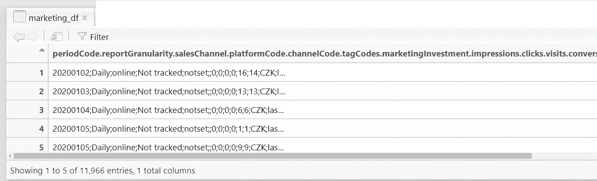

呸！数据看起来乱糟糟的！CSV 文件可以用不同的分隔符保存。默认情况下，CSV 以逗号分隔(因此缩写为😉)但是这个是用分号隔开的，就像截图中的分号可以看到的。让我们再次加载数据，这次指定分隔符，如下所示:

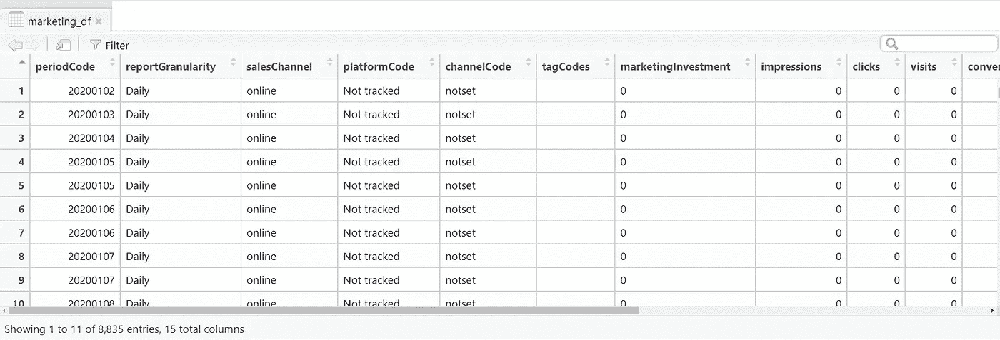

好多了！我们现在可以看到每个值在各自的列中！

现在我们已经处理了营销数据，让我们获取订单数据并将其保存到名为 **orders_df:** 的数据帧中

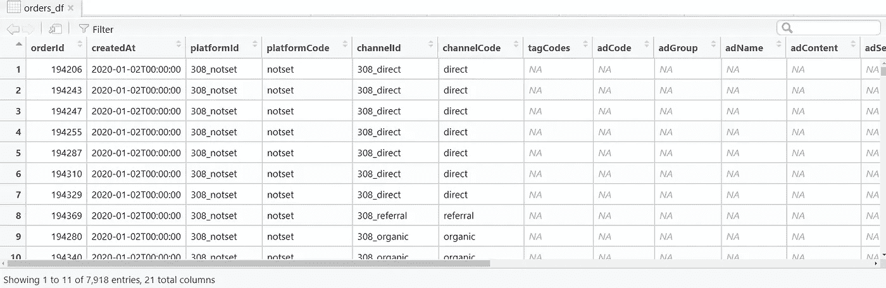

很好，我们已经加载了两个数据集。显然，我们可以看到有工作要做，以清理他们。让我们首先处理营销数据集，然后我们将处理订单数据集。

## 清理营销数据

**marketing_df** 数据框架有许多有用的列。为了便于说明，假设我们只关心以下 3 列:

*   周期代码(第一列)
*   平台代码(第 4 列)
*   营销投资(第 7 列)。

我们将抓取这些列，并将它们保存到一个名为 **marketing_df_clean** 的新数据框架中。我们还想用更容易理解的名称来重命名这些列。

我们走吧:

所以我们把数据框从这里转了过来:


对此👇

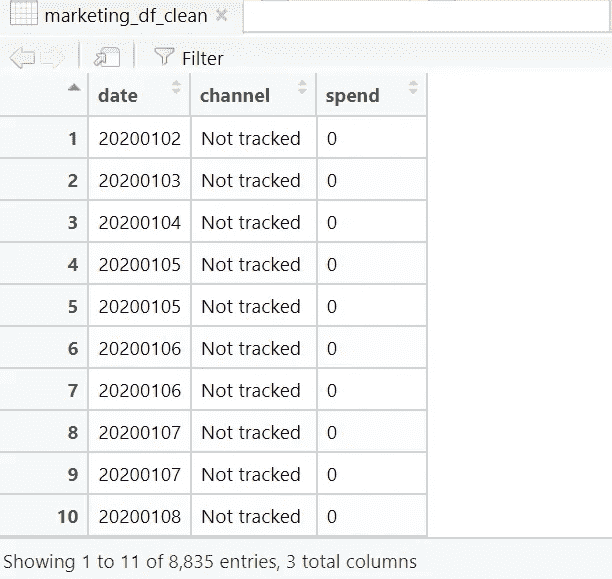

我们将它保存到一个更小的数据框架中，名为 **marketing_df_clean** ，只有 3 列。查看数据，滚动并注意这些值是如何显示的。你会注意到几件事:

*   日期很奇怪。我的意思是，我们当然认识到它们是日期，但它们也可能被 R 解读为其他任何东西。我们需要将它们标准化成合适的日期格式。
*   通道列中的值有各种大小写。让我们将它们都强制转换为小写，以保持一致。
    还有一些价值需要更新，这就是**领域知识派上用场的地方:**由于付费媒体已经被定义(如脸书、Adwords)，那么“非付费”可以被视为“有机的”。“未跟踪”可能意味着“直接”，而“silverpop”是一个电子邮件平台，因此可以重命名为“电子邮件”。
*   如果您仔细查看支出列，您还会注意到值是用逗号分隔的。例如 20，29。

您可以通过运行以下代码行来检查 R 是如何读取这些值的:

```
str(marketing_df_clean)
```

这个 [str()](https://www.rdocumentation.org/packages/utils/versions/3.6.2/topics/str) 函数向您展示了 R 如何查看 R 对象的内部结构，在本例中是一个包含 3 列的数据帧:

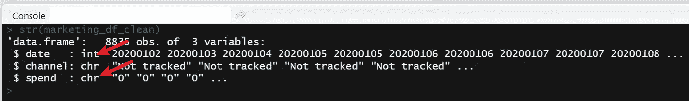

这个输出显示，R 错误地将日期列读取为整数，而不是格式日期。花被读作文字是不正确的！花费应该是数字。这可能是因为数字之间的逗号导致它被读为文本。

基于以上所述，我们知道我们需要做以下工作:

1.  设置日期列的格式，以便将其正确识别为日期。不幸的是，日期格式化真的很麻烦😡。因此对于这一部分，我将使用奇妙的{lubridate}包将这些日期强制转换成正确的格式。公平地说，我认为这是我在这个练习中使用的唯一一个非基本/非默认包。我们将最后安排日期。
2.  强制频道列中的所有文本值小写
3.  一旦小写，检查通道列，查看所有可能的唯一值
4.  选择我们想要重命名的频道
5.  最后，确保花费一栏被识别为数字。

这是:

**注意**:是的，我经常使用 str()、View()和 head()，我建议你也这样做。它帮助我检查我没有在争论中损坏我的数据。

然后，用 StatQuest 的[乔希·斯塔默](https://www.youtube.com/user/joshstarmer)的睿智的话来说:

> 嘭！！！💥

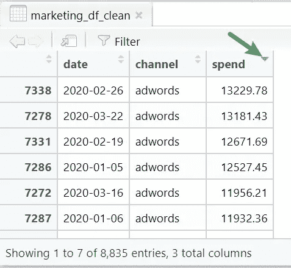

你可以在 r 中点击来排序你的表，你也可以过滤和搜索。

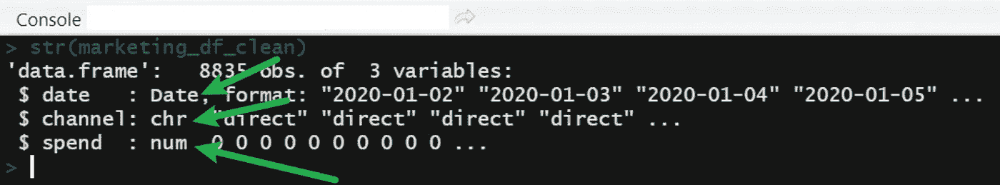

日期现在可以正确格式化并被识别。花费现在被正确地识别为数字。我们在做生意！！

呃，实际上不完全是。再次查看数据-似乎有重复的行(例如，同一个频道，同一天)。

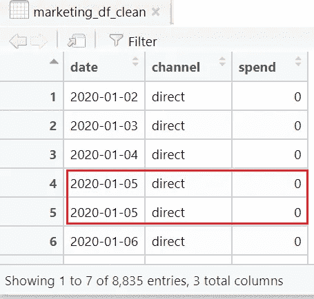

还没有脱离险境

我们要确保每天只有一个渠道，支出是该渠道在这一天的总支出。回想一下，我们之前已经删除了不需要的其他列。这些列用于进一步细分数据(例如，按桌面或移动设备)。当我们删除这些列时，我们需要记住按渠道合计当天的支出。

[aggregate()](https://www.rdocumentation.org/packages/stats/versions/3.6.2/topics/aggregate) 函数很好地完成了这一任务:

```
marketing_df_clean <- aggregate(spend ~ date + channel, data = marketing_df_clean, sum)
```

这给了我们一张漂亮的桌子，像这样:

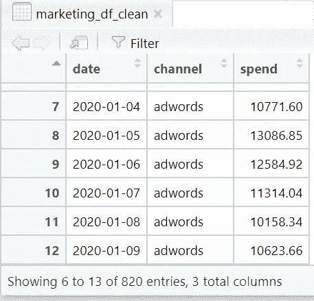

每天按渠道列出的总支出。没有重复。

耶！我们现在已经获得了每个频道每天花费的清晰数据集。

## 清除订单数据

现在，让我们执行与上面相同的步骤，但是这次使用的是订单数据。为了提醒我们自己， **orders_df** dataframe 看起来像这样:

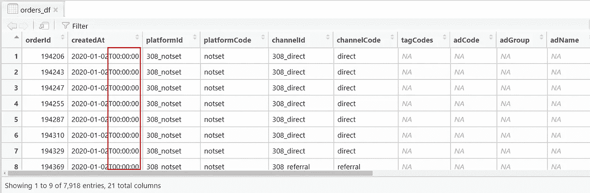

在本练习中，我们只关心 createdAt(第 2)、platformCode(第 4)和 revenue(第 18)列。

还要注意，日期后面附加了这些时间戳。在使用{lubridate}将日期格式化为我们之前使用的一致的年-月-日格式之前，我们需要先去掉这些内容。

除此之外，我们可以对订单数据使用与营销数据相同的工作流程，如下所示:

这应该会产生这个干净的表:

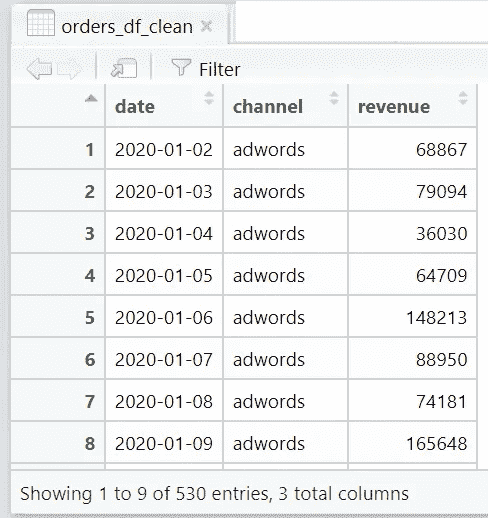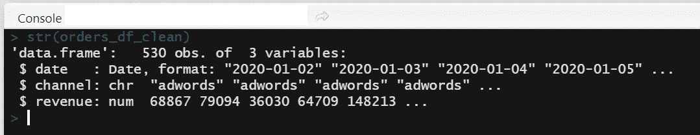

r 还将日期列识别为日期格式，收入是数字。订单数据现在完成了！对营销和订单数据进行排序后，我们现在可以将它们转换成每周数据集。

## **将每日数据转换为每周数据**

将每日数据集转换为每周数据集有很多原因。在**营销组合建模**和数字营销的一般预测中，通常使用每周数据，因为并非所有渠道都能在同一天对销售产生直接影响，转化可能发生在最初印象后的第二、第三或第四天。

我们可以在 r 中很容易地做到这一点

1.  首先，我们将创建一个名为“week”的新列。这将表示日期所在的一年中的第几周。例如，2020 年 3 月 15 日是 2020 年的第 11 周。(我发现[这个网站](https://www.timeanddate.com/date/weeknumber.html)真的很有助于快速查周。)
2.  然后我们将创建一个名为“monthyear”的新列。对于日期 2020–03–15，month year 将输出“03–2020”。
3.  我们将对营销和订单数据都这样做👇

你现在应该有 2 个新的数据帧。

**市场营销 _ df _ 周刊**:

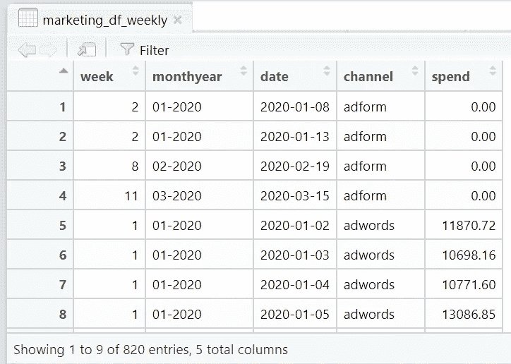

和 **orders_df_weekly:**


如您所见，这些值还没有按周进行聚合和求和。我们只是在每个数据帧中引入了 2 个新列来告诉我们每个特定日期属于哪一周。

接下来，我们将把营销和订单数据连接到一个数据框架中，我们称之为 **weekly_df** 。我们使用 [merge()](https://www.rdocumentation.org/packages/base/versions/3.6.2/topics/merge) 函数来实现这一点:

```
weekly_df <- merge(marketing_df_weekly, orders_df_weekly)
View(weekly_df)
```

使用上面的代码行应该会得到这个结果👇—每天按渠道列出支出和收入的表格。“星期”和“月份”列显示了日期所属的星期数和月份。

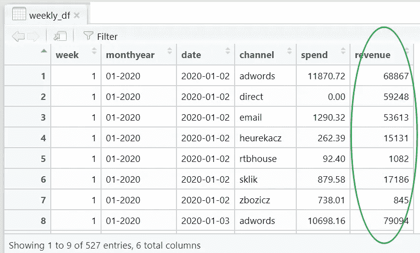

现在，我们可以按周汇总支出和收入，如下所示:

1.  按渠道合计每周所有支出。将其保存到名为 **weekly_spend_df** 的数据帧中
2.  按渠道汇总每周所有收入。将其保存到名为 **weekly_rev_df** 的数据帧中
3.  获取每周的第一天，将该列称为“weekdatestart”并保存到名为 **weekly_df_dates** 的数据帧中。移除任何重复的行。
4.  将这 3 个数据帧合并成一个干净的每周聚合数据帧，称为 **weekly_df_updated** 。

太棒了。您现在应该会得到如下所示的数据帧:

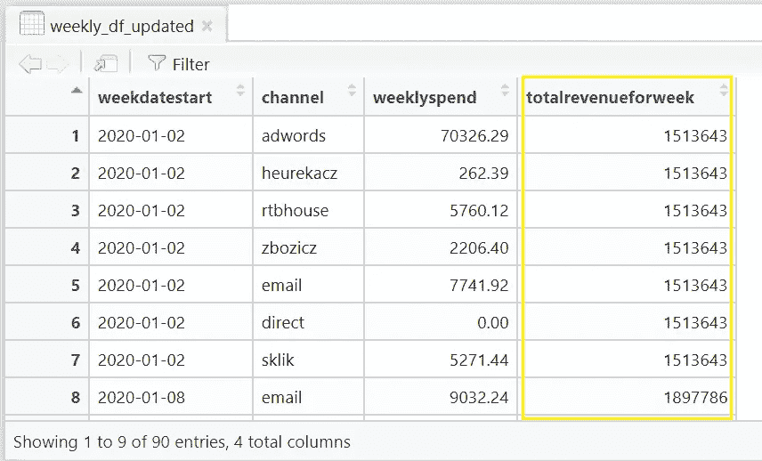

坚持住！你注意到这有什么奇怪的吗🤔？

顾名思义，totalrevenuefortheweek 是该周的总收入，定义如下:

```
weekly_rev_df <- aggregate(revenue ~ week, data = weekly_df, sum)
```

然而， **weeklyspend** 指的是给定一周特定渠道的总支出*，定义如下:*

```
weekly_spend_df <- aggregate(spend ~ week + channel, data = weekly_df, sum)
```

从上表可以看出，从 2020 年 1 月 2 日开始的一周，在“adwords”上花费 70，326.29 英镑产生了 1，513，643 英镑的收入。在同一周内，在“heurekacz”频道上花费 262.32 英镑获得了另外 1，513，643 英镑的收入！诸如此类。

👎这当然是不正确的！

我们想要展示的是，在给定的一周内，在 adwords、电子邮件、rtbhouse 和其他渠道上的支出的综合表现，*在该周总共产生了 1，513，643 英镑的收入。*

*为了正确理解这一点，我们需要将这种长数据格式转换为宽数据格式。*

## *将长数据转换为宽数据*

*将长数据转换成宽数据非常简单，反之亦然！基本的 [reshape()](https://www.rdocumentation.org/packages/stats/versions/3.6.2/topics/reshape) 函数让你在一行代码中就能做到，就像这样:*

```
*weekly_reshaped_channel <- reshape(weekly_df_updated, idvar = c("weekdatestart","totalrevenueforweek"), timevar = "channel", direction = "wide")*
```

*当您查看(**weekly _ reshaved _ channel**)时，您应该会看到下表:*

*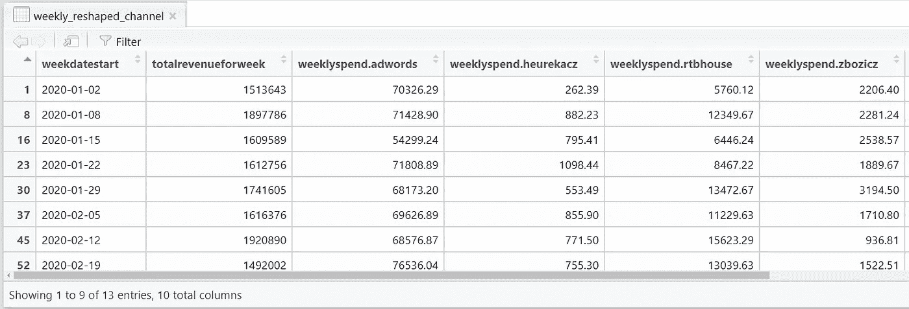*

*这更有意义，因为您可以看到每周实现的总收入和该周每个渠道的支出！*

## ***处理 NAs***

*您可以使用 [print()](https://www.rdocumentation.org/packages/base/versions/3.6.2/topics/print) 查看控制台中的数据并检查 NA 值。或者，如果您喜欢像我们在本练习中所做的那样，以电子表格的方式查看它，只需使用 View()即可:*

*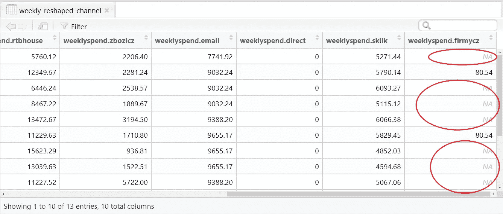*

*如果检测到 NAs，您可以使用 [is.na()](https://www.rdocumentation.org/packages/base/versions/3.6.2/topics/NA) 将 NA 值替换为 0，如下所示:*

```
*#view the data and check for NA or missing values
print(weekly_reshaped_channel)#if found, replace any NA with 0
weekly_reshaped_channel[is.na(weekly_reshaped_channel)] <- 0#check
str(weekly_reshaped_channel)
View(weekly_reshaped_channel)*
```

## *结束了*

*👏干得好，一直到最后！我们终于得到了我们需要的数据集，我们可以用它来执行以后的建模。*

## *完整的 R 代码*

*👉从我的 Github repo [这里](https://github.com/Practical-ML/marketing-mix-modelling/blob/32f6a7a92626ee1e5a747f7a9bec398b7cfa258b/wrangling-messy-data-full-code.R)获取完整的 R 代码。*

*我希望这篇文章对你有所帮助。毫无疑问，有更快更好的方法来达到同样的最终结果，但这篇文章的目的是深入基础，帮助新的 R 用户掌握 R。如果你做过类似的练习，并找到了更好的方法，请在评论中分享🤗！*

*我还想在下一篇文章中继续使用同样的数据来制作**营销组合模型**。我们会看到的。TTFN！*