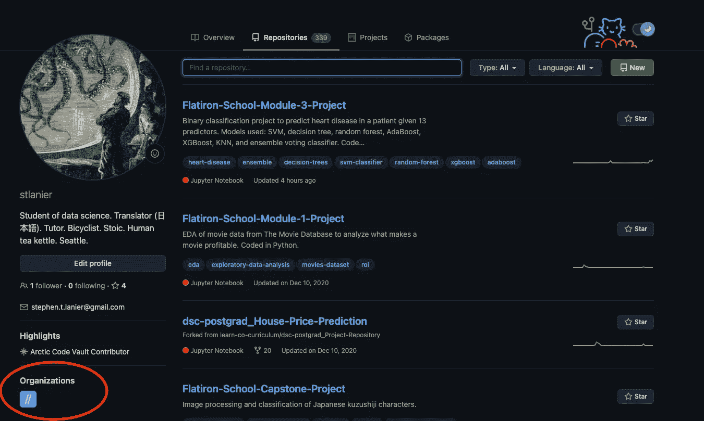

# 清理 GitHub(用于数据科学)

> 原文：<https://towardsdatascience.com/cleaning-up-github-for-data-science-d6b2dabca3cb?source=collection_archive---------16----------------------->

## 保持您的存储库数量易于管理

呀。图片作者。

你使用 GitHub 已经有一段时间了，也许你开始注意到你的存储库页面(pages？？？)比以前丰满了。也许，事实上，它变得如此之满，以至于它更像是一个代码转储，而不是一个有意义的代码集合。在写这篇文章的时候，我的 GitHub 明显属于前一类(是的，那就是我)，感觉是时候改变这种情况了。

毕竟，在许多方面，你的 GitHub 是你向世界其他地方展示的编码面孔，因此，你希望它(如果不是通过 GitHub 的网站设计，而是通过对人类精神的设计)部分是作品集，部分是诗歌，部分是可视化，部分是对话——但完全整洁，记录良好，易于导航。

据我所见，有五种主要的方法来清理你的存储库:

1.  删除旧的存储库
2.  在 Github 上模仿一个目录式的架构:

*   子树/子模块
*   项目
*   组织

# 策略 1:删除旧的存储库

我们现在都已经读过《T2》了，对吗？浏览你的每一个储存库，问你自己，“[这能激发快乐](https://www.youtube.com/watch?v=9AvWs2X-bEA)？”如果没有，就把它处理掉。

环顾网络，这是一个令人惊讶的受欢迎的选择。你一下午就完成的 Udemy 课程的知识库？摆脱它。你几个月或几年没做的事？摆脱它。我承认，这个选项可能会触发我的强迫症(“如果我以后需要这个生成猫的 GAN 怎么办？”)，但这是你清除 GitHub 的第一站。也许浏览一下你所有的存储库，特别是如果它们和我的一样有数百个，问问你是否真的需要它们。也许你可以放走一些。

来自[giphy.com](https://giphy.com/gifs/marie-kondo-spark-joy-this-one-sparks-PmABbbUe3IqUKSOIBV)

来自[imgur.com](https://imgur.com/t/mariekondo/kkJYlG9)

这种方法有一个潜在的缺点。嗯，两个。第一，代码不见了，第二，如果你删除了一个给定的库，那么在你的贡献图上显示的任何东西都会消失。如果这令人不安，考虑一些替代方法来重新填充你的贡献图

# 策略 2:模仿目录结构

Github，从它的概念来看，提供了相对简约的结构。它缺少真正的目录或文件结构。例如，我的 339 个知识库中的绝大多数来自 Flatiron School 的数据科学训练营，但我不能把它们都放在一个“Flatiron”文件夹中，因为 GitHub 天生就没有这种结构。虽然有许多模仿这种结构的选择，但工具的原始目的需要不同程度的低劣化。

# 子树(可能还有子模块)

出于清理存储库页面的目的，我认为 subtree 是两者中的赢家，但我肯定有人会更好地使用`git submodule`。关于这两者区别的详细讨论，请阅读这里的、这里的和这里的，但主要区别是:

*   **子模块**在外部存储库内留下一个指针，指向内部存储库中的一个特定提交(它不会像我们想象文件在文件夹内移动那样将内部存储库*移动到外部存储库*内)并且在 git 中有一个明确的命令`git submodule`，这使得设置很容易，但之后很难维护；
*   另一方面，**子树**实际上将内部回购*的代码移动到*外部回购中，就像将文件移动到文件夹中一样，但它在 git 中没有默认命令，这使得设置起来有点困难，但之后更容易维护。

如果试图在数百个回购中利用这两种方法的结构，它们会很快变得耗时，但你会得到你的贡献图。

# 项目

仅仅从名字上看，这一个听起来很有前途——当听到这个名字时，我的直觉是“我将多个存储库组合在一个项目下”——但是它有一个更接近于待办事项列表的功能，用于跟踪问题、拉请求和注释。尽管如此，我还是听说有人使用这个特性来组织存储库(每个项目最多 5 个 repos)。

# 组织

这个对我来说是赢家。您可以创建组织来对 repos 进行分组，它 1)从您的存储库页面中删除 repos，2)列出组织名称。因此，从这个重要的角度来看，这可以说是 GitHub 上最接近于模仿目录结构的了。看起来是这样的:

左下角用红色圈出的新组织。图片作者。

组织的悬停效应。图片作者。

将鼠标悬停在它上面，它会提供关于该组织的一些信息。在图中，它仍然显示我有大约 300 个存储库，但这是因为我还没有将其中的大部分转移到新的组织中。将存储库转移到组织中，即使是您拥有的组织，也会从您的个人资料页面*上的存储库列表中删除该存储库，并从您的贡献图*中删除对这些存储库所做的任何贡献。对我来说，这是一个很小的代价，可以让我有一个很好的地方把这 300 个存储库藏在一起，看不见，但我确信对一些人来说这是两个世界中最糟糕的:回购仍然存在，我失去了贡献图。

更好的例子，请看安德烈·乔阿拉的文章[。](https://andreicioara.com/how-i-organize-my-github-repositories-ce877db2e8b6)

一旦你清理了你的 GitHub 档案，我认为考虑如何更好地构建你的 GitHub 是一个好主意。最好的方法之一就是看看其他人是如何组织他们的。你可以[从这里](/these-data-science-portfolios-will-awe-and-inspire-you-mid-2020-edition-728e1021f60)开始，看看一些漂亮的数据科学投资组合的例子。我个人最喜欢的是汉娜·韩嫣的 [GitHub](https://github.com/yanhann10) 和[个人网站](https://www.hannahyan.com/)。她将存储库的数量保持在 20 个以内(尽管她有更多的项目)，并且由于智能回购名称和描述，很容易找到它们。

**对于任何一个刚刚开始在 git 仓库之外运作的技术训练营的人来说，我的建议是只去那些你付出了原创努力的实验室(大约 10 秒，而不是 100 秒的回购)，或者在 GitHub 上从一开始就建立一个组织来学习所有这些课程。**