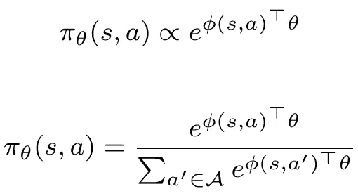
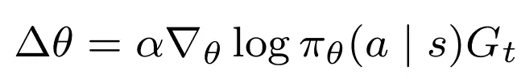
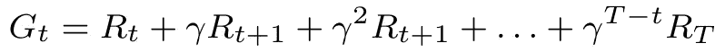
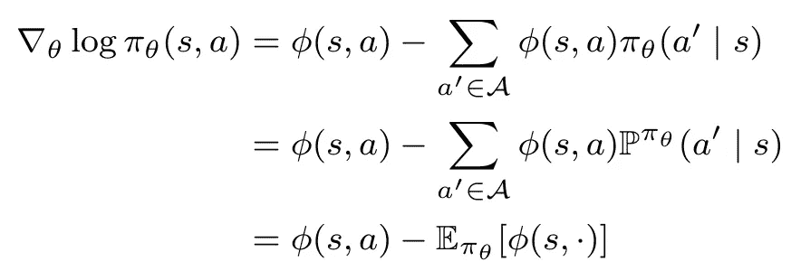
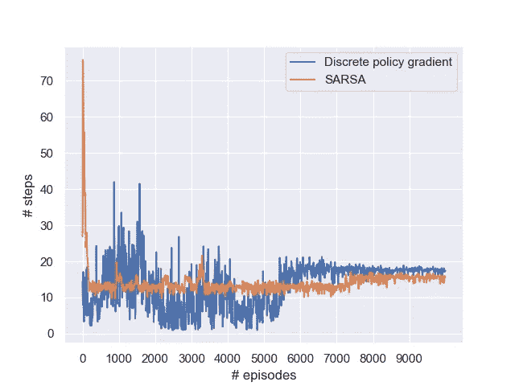
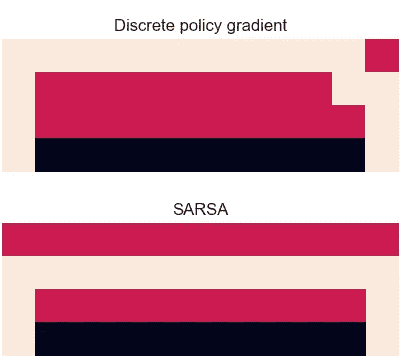

# 基于离散策略梯度算法的悬崖行走问题

> 原文：<https://towardsdatascience.com/cliff-walking-problem-with-the-discrete-policy-gradient-algorithm-59d1900d80d8?source=collection_archive---------19----------------------->

## 用 Python 实现了一个完整的增强算法。手动执行这些步骤来说明该过程的内部工作原理。

詹妮弗·卡佩尔在 [Unsplash](https://unsplash.com?utm_source=medium&utm_medium=referral) 上的照片

教科书上的悬崖行走问题继续引人入胜。虽然非常简单，但它阐明了强化学习算法的许多有趣的方面。在处理了一些基于价值的实现(这里是 SARSA 和 Q-learning，这里是深度 Q-learning)之后，现在是时候转向基于策略的实现了。尽管现在有很多库，我们还是用 Python 手动实现了这个过程，来演示**离散策略梯度算法**背后的机制。最后，我们与 SARSA 进行了面对面的比较。

 [## 强化学习中的策略梯度解释

### 了解所有关于基于似然比的政策梯度算法(加强):直觉，推导，和…

towardsdatascience.com](/policy-gradients-in-reinforcement-learning-explained-ecec7df94245) 

# 悬崖行走问题

先把问题勾勒出来。我们的世界是一个相当全面的网格，除了应该避免的致命悬崖。代理从悬崖的左手边开始，目标(代理不知道)在右手边等待。目标是找到到达目标的最短路径而不坠入悬崖，这直接结束了这一集。

悬崖世界[图片由作者提供]

存在各种强化学习解决方案。本文主要讨论策略梯度算法。简单地说，策略告诉代理在给定状态下做什么——比计算和利用对应于每个动作的值函数更直接。在此设置中，您可能倾向于将策略视为一个表格，其中列出了 48 个图块中每个图块的最佳操作。

不过这有点复杂，因为这种方法依赖于随机策略。策略**不是简单地告诉我们最好的行动，而是提供了我们应该采取每个行动的概率**。不涉及太多细节，随机政策通常在未知环境中是有意义的，并为探索提供了一种内置机制。不良行为的概率应该趋近于零。

# 离散策略— Softmax 函数

是时候正式制定政策了。我们使用一个 *softmax* 策略，它有效地将任何一系列真实值映射到一系列概率。作为输入，它需要一个特征向量和一个相应权重的向量。

作为特征向量 *ϕ(s,a，*我们定义了一个 48⋅4 向量，每四个元素代表任何给定瓷砖上的移动——本质上是一个查找表(或者可以使用[后决策状态](/what-are-post-decision-states-and-what-do-they-want-from-us-9e02105b7f40)方法，只需要 48 个特征，但丢失了细节)。该向量是**一位热编码的**，这意味着我们有一个具有 191 个 0 和 1 个 1 的向量，对应于状态 *s* 中的动作 *a* 。如前所述， *θ* 是一个权重向量，每个 *(s，a)* 对一个。 *ϕ(s,a)* 和 *θ* 的点积捕捉了位于特定瓷砖上的值，与众所周知的 q 值相当。

现在，我们可以将 softmax 策略形式化如下:

Softmax 政策。

*ϕ(s,a)^⊤ θ越大，*a*采取行动的概率越高。用正常的语言来说:我们很有可能采取措施，让我们更接近目标。但是在我们知道这些步骤之前，我们首先需要了解政策。*

# 离散政策梯度

定义了策略本身之后，让我们来看看如何更新它。这就是政策梯度定理的用武之地。为了保持文章的范围，我们将自己限制在权重更新过程中:

策略梯度方法的更新功能

这里的 *α* 简单来说就是学习率。奖励函数 *G_t* 也很简单:

累积奖励函数

主要的挑战在于讨厌的 *∇_θ对数(π_θ(a|s)) —* 也称为*得分函数—* 我们如何将它转化为可实施的规则？从数学上来说，这是相当多的工作(详细推导[这里](/policy-gradients-in-reinforcement-learning-explained-ecec7df94245))，所以让我们直接跳到最终结果:

离散政策梯度的得分函数。得分函数是所选动作的特征向量减去所有动作的加权特征向量。

在教科书中，最下面的方程通常是作为最终结果出现的，但实际上我发现其他方程更有用。

举个例子吧。处理一个 48 元素的向量有点不方便，所以假设我们有一个只有 4 个元素的特征向量。首先，我们的一键向量 *ϕ(s,a)* 可能看起来像`[0 1 0 0]`——代表我们采取的行动。其次，我们计算我们的**期望**，它本质上是一个**加权特征向量**。假设我们有一个概率向量`[0.2 0.5 0.1 0.2]`，每个动作将我们引向一个不同的瓦片(状态)。所有的动作都是一次性编码的，所以期望可以写成

`weighted_phi: [1 0 0 0]*0.2 + [0 1 0 0]*0.5 + [0 0 1 0]*0.1 + [0 0 0 1]*0.2 = [0.2 0.5 0.1 0.2]`

对，那和概率向量本身完全一样。事情并不总是这么简单——特征向量不一定是一个热门向量——但是你会明白的。现在，我们只需要从特征向量中减去期望值就可以得到

`score function: [0 1 0 0] - [0.2 0.5 0.1 0.2] = [-0.2 0.5 -0.1 -0.2]`

概括地说，我们采用了与我们选择的动作相对应的特征向量，然后**减去所有动作的加权特征向量**，从而获得该动作的得分。

为了执行权重更新*δθ*，我们将得分函数与奖励 *G_t* 和学习率 *α* 相乘。例如:

`Weight update: Δθ = α * score_function * G_t = 0.01 *[-0.2 0.5 -0.1 -0.2]*10 = [-0.02 0.05 -0.01 -0.02]`

直觉上，其中的含义是清楚的。如果我们把一个积极的分数(行动 2)乘以一个积极的回报，这个概率会增加，我们会在未来更频繁地采取行动。更微妙:**奖励信号越强，更新越大**。渐渐地，概率在最坏的情况下会收敛到局部最优，在最好的情况下会收敛到全局最优。

# Python 实现

回到我们的悬崖漫步问题。最初，我们不知道什么行为是好的，因此相等地初始化概率是有意义的(简单地将所有的 *θ* 设置为 0)。我们的代理人会在一段时间内磕磕绊绊，但最终应该击中目标。这给了倒数第二块瓷砖一个强烈的奖励信号(增加向下移动的概率)，从那里开始就是连锁反应。

请注意，尽管该方法是基于政策而不是基于价值的，但**奖励轨迹**隐含地保留了整个过程中的核心角色。更新只发生在一集的结尾，所以如果我们走了 20 步，我们执行 20 次更新，追溯完整的轨迹(即蒙特卡罗学习)。

完整的实现可以在我的 [GitHub](https://github.com/woutervanheeswijk/cliff_walking_public) 上找到，在这里我将重点放在最相关的片段上(为了可读性做了一些清理)。

首先，让我们定义策略:

相应的 softmax 可以表示如下。实际的实现通常涉及缩放—指数可能会变得非常大。

使用相应的折扣，为存储的轨迹中的每个决策时刻 *t* 计算奖励函数 *G_t* 。通常，您还需要在这里执行一些奖励标准化。

最后，评分函数 *∇_θ log(π_θ(a|s))* ，需要执行更新*δθ=α⋅g_t⋅∇_θlog(π_θ(a | s))。*提醒一下，我们只是简单的从实际的特征向量(选择的动作)中减去加权的特征向量(所有动作)。

这就是我们所需要的。现在让我们运行它，使用 SARSA(另一个基于策略的方法，但是基于值)进行比较。

10，000 集的步骤数，使用策略梯度和 SARSA 进行培训。SARSA 更快地收敛到更好的解，并且经历更少的噪声。[图片由作者提供]

政策梯度和 SARSA 的培训路径。由于更高的探索，梯度剂走了更长的弯路。两者都不走最短路径，都是带有嵌入式探索的策略方法。[图片由作者提供]

显而易见，政策梯度更新比 SARSA 更新要混乱得多。这部分是随机策略所固有的(我们的 SARSA 代理只探索了 5%的时间，梯度方法探索了更多的时间)-即使在 10，000 次迭代之后，代理也要绕着悬崖走一大段路，以对抗随机移动的**不利影响**。

此外，SARSA 使用时间差异，而政策梯度使用完全回报轨迹——后者具有**高得多的方差**。因此，我们也需要较低的学习速率 *α* 来获得稳定的结果。

虽然政策梯度法在这里没有得到好评，但这并不意味着被驳回。像任何算法一样，对某些问题来说，这是一个很好的选择，但对其他问题来说，这是一个很差的选择。这些结果只是作为一个典型的强化行为的例子，可悲的是，它包含了高度的可变性和向局部最优的收敛。一如既往，适当的调整，奖励正常化，功能设计等。对提高性能大有帮助。

但是现在，让我们庆幸我们又一次勇敢地面对了悬崖。

*完整的代码，包括其他针对悬崖行走问题的 RL 解决方案，可以在我的 GitHub 上找到:*

 [## GitHub—woutervanheeswijk/Cliff _ walking _ public:悬崖行走强化学习示例，带…

### 此时您不能执行该操作。您已使用另一个标签页或窗口登录。您已在另一个选项卡中注销，或者…

github.com](https://github.com/woutervanheeswijk/cliff_walking_public) 

# 外卖食品

*   为了解决悬崖行走问题，我们可以采用离散策略，使用 softmax 策略选择动作。
*   更新依赖于得分函数，该函数是对应于所选动作的特征向量 *ϕ(s,a)* 减去所有动作的加权特征向量 *ϕ(s,⋅)* 。
*   逐渐地，策略收敛到每个状态的最佳动作的高概率(在这种情况下是平铺)。
*   由于奖励轨迹的高可变性和高探索性，在这种基本实现中，收敛比基于价值的方法慢。

*Q-learning 和 SARSA 的实现:*

 [## 用非策略强化学习走下悬崖

### 政策外强化学习和政策内强化学习的深入比较

towardsdatascience.com](/walking-off-the-cliff-with-off-policy-reinforcement-learning-7fdbcdfe31ff) 

*深度 Q 学习的实现:*

 [## 悬崖行走问题的深度 Q 学习

### 一个完整的 Python 实现，用 TensorFlow 2.0 导航悬崖。

towardsdatascience.com](/deep-q-learning-for-the-cliff-walking-problem-b54835409046) 

*首先在离散政策梯度的基础上迎头赶上？查看我的文章最小工作实例和理论推导:*

 [## TensorFlow 2.0 中离散策略梯度的最小工作示例

### 一个训练离散演员网络的多兵种土匪例子。在梯度胶带功能的帮助下…

towardsdatascience.com](/a-minimal-working-example-for-discrete-policy-gradients-in-tensorflow-2-0-d6a0d6b1a6d7)  [## 强化学习中的策略梯度解释

### 了解所有关于基于似然比的政策梯度算法(加强):直觉，推导，和…

towardsdatascience.com](/policy-gradients-in-reinforcement-learning-explained-ecec7df94245) 

# 参考

Benderski，E. (2016 年)。*soft max 函数及其导数。*[https://Eli . the green place . net/2016/the-soft max-function-and-its-derivative/](https://eli.thegreenplace.net/2016/the-softmax-function-and-its-derivative/)

西格尔，E. (2029)。*政策梯度。*[https://siegel.work/blog/PolicyGradient/](https://siegel.work/blog/PolicyGradient/)

西尔弗博士(2020)。第七讲:政策梯度[https://www . David silver . uk/WP-content/uploads/2020/03/pg . pdf](https://www.davidsilver.uk/wp-content/uploads/2020/03/pg.pdf)

萨顿和巴尔托(2018 年)。强化学习:介绍。麻省理工出版社。

威廉姆斯，R. J. (1992)。*连接主义强化学习的简单统计梯度跟踪算法。机器学习，8(3–4):229–256。*

于，鄂(2017)。*用 Python 从零开始的策略渐变。*[http://quant.am/cs/2017/08/07/policy-gradients/](http://quant.am/cs/2017/08/07/policy-gradients/)