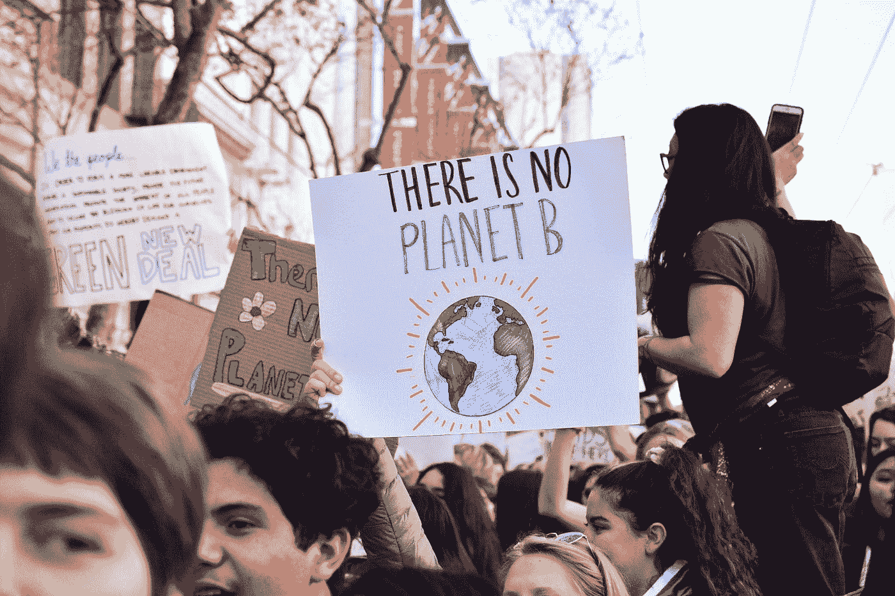
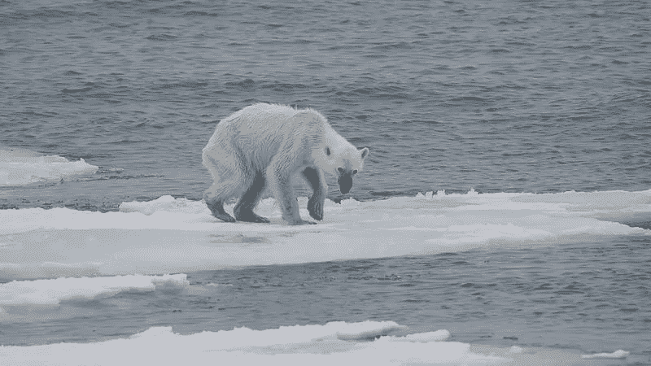
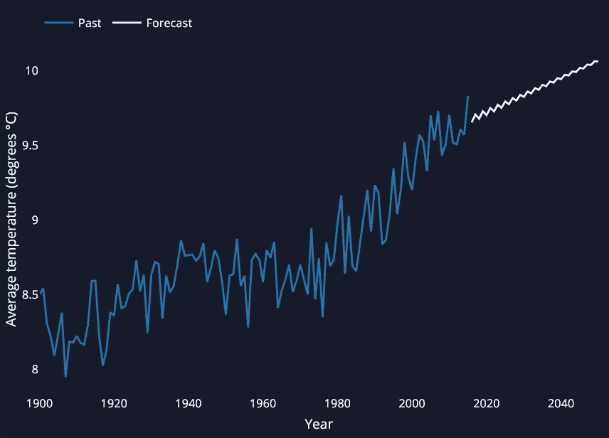
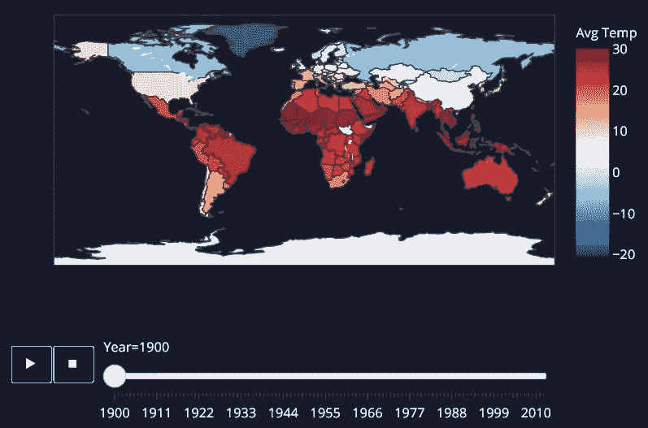
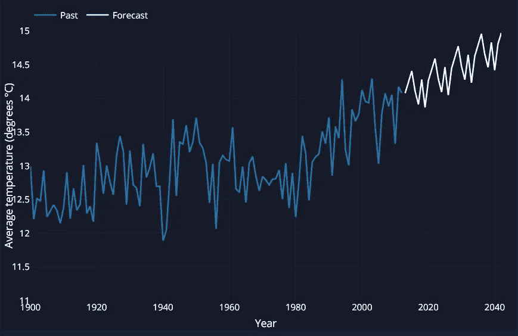
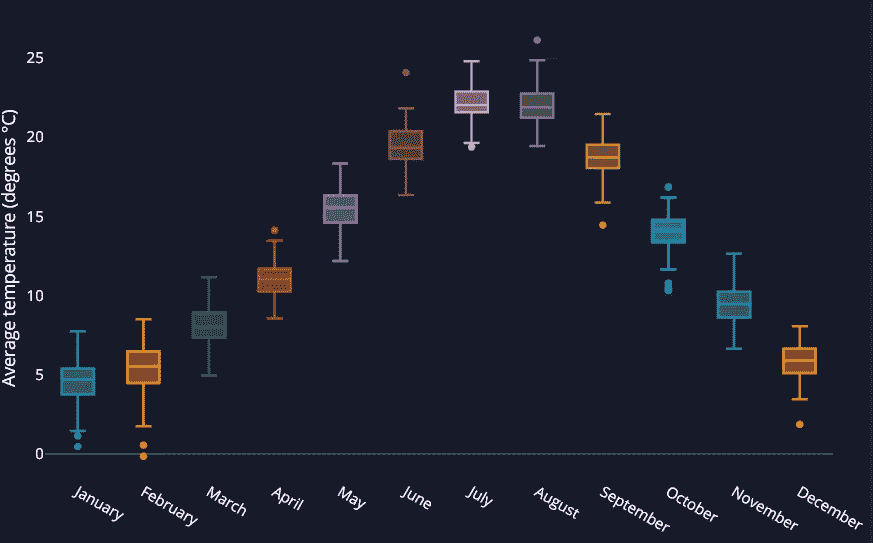
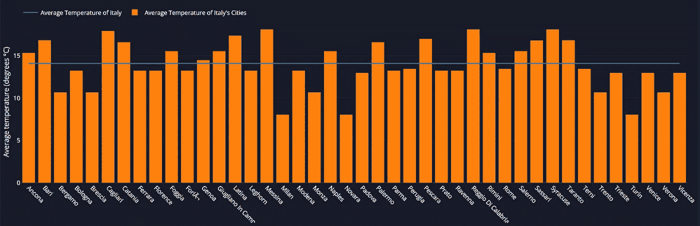
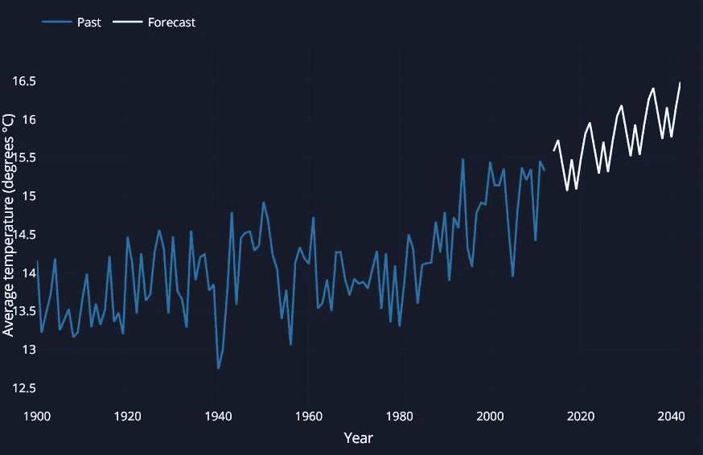
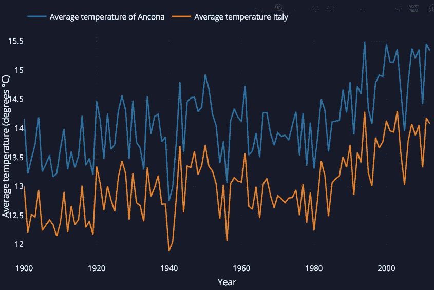

# 气候变化:互动 Plotly Dash 发现我们的未来前景

> 原文：<https://towardsdatascience.com/climate-change-interactive-plotly-dash-to-discover-our-future-prospective-d3d60d62cb86?source=collection_archive---------39----------------------->

## 数据科学，了解城市、国家和我们的世界正在发生什么，以及将会发生什么。

*作者:* [卡米拉·马西](https://medium.com/u/cbe9f5930ebe?source=post_page-----d3d60d62cb86--------------------------------) ( [李](https://www.linkedin.com/in/camilla-massi-36037b212/) ) [西尔维娅·保鲁奇](https://medium.com/u/9f52a47f33f3?source=post_page-----d3d60d62cb86--------------------------------) ( [李](https://www.linkedin.com/in/silvia-paolucci-713595212/) ) [唐塔雷利](https://medium.com/u/f540641bb2b0?source=post_page-----d3d60d62cb86--------------------------------) ( [李](https://www.linkedin.com/in/francesco-tontarelli-4560a3178))

*** [*链接到****app***](https://climate--change--global.herokuapp.com/)* * *

[林丽安](https://unsplash.com/@li_anlim?utm_source=medium&utm_medium=referral)在 [Unsplash](https://unsplash.com?utm_source=medium&utm_medium=referral) 上的照片

在过去的几年里，一些机构提供的数据强调了我们星球的气温上升趋势。不幸的是，这种趋势没有任何积极的一面。

多年来，科学家们不断发出警告，让我们意识到尽可能降低气温的上升是多么重要。尽管在这个问题上达成了各种各样的协议，但事情并不完全像我们所希望的那样发展，并且[后果是明显的](https://climate.nasa.gov/images-of-change/?id=755#755-stalled-landslide-threatens-tsunami-in-alaskan-fjord)。

大量研究表明，气候变化正在对动物和植物产生重大影响。气候条件是决定哪些动植物物种能够在特定地理区域生存、生长和繁殖的决定性因素。其中一些与它们已经适应的气候条件密切相关，温度的轻微上升、降雨量的少量减少或另一个参数的细微变化都会增加它们的脆弱性。

由于温度过高，两极的冰川不断融化。这导致生态系统发生重大变化，[加速了生活在其中的动物的灭绝](https://www.instagram.com/p/BcU-6PsAoIp/?hl=it&taken-by=paulnicklen)(例如:蜜蜂、北极熊、树袋熊、海豹和许多其他动物)以及海平面的上升。

[安德里亚斯·韦思](https://commons.wikimedia.org/wiki/File:Endangered_arctic_-_starving_polar_bear.jpg)， [CC BY-SA 4.0](https://creativecommons.org/licenses/by-sa/4.0) ，通过维基共享

当然，不仅仅是地球上寒冷的地方显示了气候变化的后果。此外，非洲“包含世界上五分之一的已知植物、哺乳动物和鸟类物种，以及六分之一的两栖动物和爬行动物”(齐格弗里德 1989)，正显示出一致的变化。这些变化包括候鸟和大型哺乳动物习性的改变、珊瑚礁的减少以及随之而来的生物多样性的丧失，而生物多样性是非洲人民的一种相关资源。

即使在意大利，我们也有气候变化影响的例子。例如，我们可以指出这样一个事实，即据估计，白云石(世界遗产)中最大的 Marmolada 冰川将在 15 年内消失，而且情况每年都在变得越来越糟。

[SkiNick890](https://commons.wikimedia.org/wiki/File:Ghiacciaio_della_Marmolada_vista_su_Punta_Rocca_e_Punta_Penia.jpg) ， [CC BY-SA 4.0](https://creativecommons.org/licenses/by-sa/4.0) ，通过维基共享

所以，我们认为提供我们的星球正在发生什么的证据是相关的，除非有所发现，否则我们将继续在这个星球上生活一辈子。为此，我们认为利用数据科学和数据分析的新技术开发一个 Python 仪表盘会很有意思，它将清楚明确地突出显示我们正在目睹的气候变化(我们是气候变化的原因)。

# **数据集**

我们选择了由伯克利地球公司发布的开源数据集。这是一个美国非营利组织，它与各种机构一起进行了测量，其中美国宇航局是最突出的。

它包含了从 1750 年到 2013 年上半年的地球月平均温度、不同国家和一些特定城市的信息。其中一条信息是测量的不确定性。它在最初的几个世纪里太高了，所以这导致我们决定排除它们，因此只研究 1900 年到 2012 年之间的城市和城镇，以及 1900 年到 2015 年之间的地球。

# **阴谋地**

我们所有的图表都使用了 [Plotly](https://plotly.com/) ，这是一个免费的开源库。它实现了各种各样的图表，这些图表在视觉上非常吸引人，令人印象深刻。它还允许您添加不同类型的交互式内容，如动画、滑块等。

[Pensrulerstape](https://commons.wikimedia.org/wiki/File:Plotly_logo_for_digital_final_(6).png) ， [CC BY-SA 4.0](https://creativecommons.org/licenses/by-sa/4.0) ，通过维基共享

# **破折号**

Dash 是一个用于构建 web 分析应用程序的高效 Python 框架，不需要 JavaScript，并且与 Plotly 紧密集成。Dash 是构建具有高度定制的用户界面的数据可视化应用程序的理想选择。通过几个简单的方案，Dash 抽象了构建基于 web 的交互式应用程序所需的所有技术和协议，使您可以将应用程序部署到服务器上，然后轻松地共享它们。此外，因为应用程序显示在 web 浏览器中，所以 Dash 本身就是跨平台的。

# **Heroku**

Heroku 是一个云编程平台，旨在帮助构建和部署在线应用(PaaS)。它是首批出现在网络上的应用程序之一，允许用户开发、部署和管理在线应用程序，并支持包括 Python 在内的六种编程语言。

作为一个 PaaS，Heroku 的目的是为用户提供在各种平台(如脸书)上分发和运行基于网络的应用程序所需的计算资源。

[Heroku](https://commons.wikimedia.org/wiki/File:Logo_di_Heroku.png) ， [CC BY-SA 4.0](https://creativecommons.org/licenses/by-sa/4.0) ，通过维基共享

# 应用

*** [*链接到* ***app***](https://climate--change--global.herokuapp.com/) ***

**这个应用程序是通过 Dash 和 Plotly 构建的，由三个选项卡组成:全球、国家和城市**。每一个都是一个交互式仪表板，显示和报告从 1900 年到过去十年的前五年的各种图表和分析。

**全球选项卡**中收集的图表是最重要的:它们**直接显示了上个世纪的全球变暖现象及其演变**。

左侧的线形图显示了**地球历年的平均温度趋势及其到 2050 年的预测**。久而久之，增长的趋势越来越明显，预测证实了科学家们长期以来一直重复的话:**如果我们不与这种趋势作斗争，气温将迅速上升，情况只会变得更糟。**

[全球气温趋势及预测](https://climate--change--global.herokuapp.com/)

通过**动画图表**,还可以通过颜色与侧面的色标图例进行比较，直观地了解**世界每个国家**的气温变化。我们注意到，与 1900 年相比，几乎每个国家的气温都上升了，这可以从地图上的暖色调中看出。将鼠标悬停在不同的国家上，可以观察到不同年份的这种变化。

[各国平均气温变化](https://climate--change--global.herokuapp.com/)

**国家选项卡按国家**提供了对 **温度变化的更深入分析:您可以使用顶部的下拉菜单将分析集中在特定国家和特定年份。**

第一个图表显示了**所选国家到 2042 年**的平均气温趋势和预测。举个例子，我们关注我们的国家意大利:同样在这种情况下，随着地球温度的上升，很容易注意到一个毫无疑问的**上升趋势**，特别是自 80 年代以来，这导致了不间断的温度上升，导致自 1900 年以来气温上升超过 1 摄氏度。

[国家平均气温趋势及预测](https://climate--change--country.herokuapp.com/)’(意大利)

**通过**箱线图**在右上角的图表中可以看到所选国家多年来**平均气温的月分布。这样就可以知道一个国家一年中各月平均气温的最小值、第一个四分位数、中位数、第三个四分位数和最大值。此外，该图**突出显示了异常值**，与其他年份各月的平均温度记录相比，这些异常值代表了异常的炎热或寒冷月份。例如，如果您选择意大利，则可能会注意到六月和八月的异常值，这两个月份都对应于 2003 年记录的异常高温。事实上，在那年的夏天，一场强烈的热浪袭击了整个欧洲，在整个欧洲大陆造成了至少 3 万人死亡。

[国家平均气温分布](https://climate--change--country.herokuapp.com/)'(意大利)

在选项卡的底部，我们可以找到一个**直方图，显示了属于所选国家的不同城市的平均温度。**水平段表示国家的平均温度，直方图的**列表示城市的平均温度。**正如我们所料，选择意大利，最高的列对应于南部城市。

[主要城市平均气温](https://climate--change--country.herokuapp.com/)’(意大利— 2012 年)

转到**城市选项卡，**可以通过线性图表详细调查**一个城市及其所在国家的平均温度。**

到 2042 年所选城市的平均气温预测也以图表形式显示在该选项卡中。这一预测**与全球气温的总体上升**一致，这让我们想知道**气候变化现象在未来可能会持续并恶化到什么程度。**

[城市平均气温趋势及预测](https://climate--change--city.herokuapp.com/)’(意大利—安科纳)

[国家和城市平均温度](https://climate--change--city.herokuapp.com/)’(意大利—安科纳)

# 结论

总之，我们希望我们已经清楚地解释了**气候变化和全球变暖**的问题，并激发了你们对这个主题的兴趣。我们的目标是**为理解我们的星球正在经历的突变以及气候变化和全球变暖对我们生活的影响提供定量支持。**这不“仅仅”是两极冰川融化或荒漠化加剧的问题，因为**这关系到我们所有人，因此我们必须应对气候变化。**

我们所做的预测显示了一个明确的趋势。它导致不安全和令人担忧的前景延伸到 2050 年，这是世界主要领导人在最近的气候领导人峰会上设定的实现零排放的目标，但这些所谓的气候目标会实现吗？它们够用吗？还是会是惯常的“大言不惭，小动作”？

> “我们知道世界是复杂的，许多人都在尽最大努力，需要的东西并不容易。但是我们不能满足[……]我们必须走得更远。我们必须相信我们能做到，因为我们能。当我们人类走到一起，决定完成某件事时，我们几乎可以完成任何事。我们将继续为一个安全的未来而奋斗。学位的每一分都很重要，而且*将永远*重要。需要做的事情和我们实际正在做的事情之间的差距每分钟都在扩大。所需的紧迫性与目前的认识和关注水平之间的差距越来越荒谬。我们所谓的气候目标和当前最有效的整体科学之间的差距不应再被忽视。”
> 
> 格里塔·图恩伯格

*作者:* [卡米拉·马西](https://medium.com/u/cbe9f5930ebe?source=post_page-----d3d60d62cb86--------------------------------) ( [领英](https://www.linkedin.com/in/camilla-massi-36037b212/) )
[西尔维亚·保鲁奇](https://medium.com/u/9f52a47f33f3?source=post_page-----d3d60d62cb86--------------------------------) ( [领英](https://www.linkedin.com/in/silvia-paolucci-713595212/) )
[弗朗切斯科·通塔雷利](https://medium.com/u/f540641bb2b0?source=post_page-----d3d60d62cb86--------------------------------) ( [领英](https://www.linkedin.com/in/francesco-tontarelli-4560a3178))