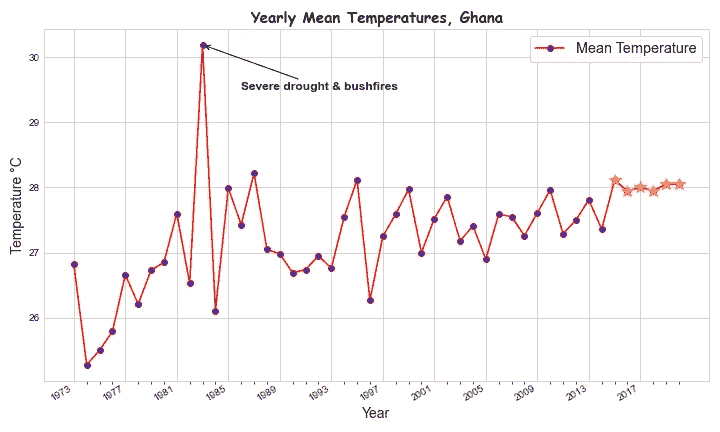
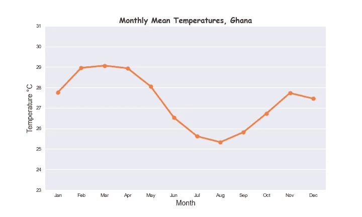

# 利用 Pandas 和 Matplotlib 进行气候数据分析

> 原文：<https://towardsdatascience.com/climate-data-analysis-with-pandas-and-matplotlib-ca75f18a0587?source=collection_archive---------27----------------------->

## 探索性数据分析揭示了加纳最热的日、月、年

照片由[达维德·扎维亚](https://unsplash.com/@davealmine?utm_source=medium&utm_medium=referral)在 [Unsplash](https://unsplash.com?utm_source=medium&utm_medium=referral) 上拍摄

# 基本原理

加纳气候数据的探索性数据分析(EDA)展示了我第一个数据科学项目组合。气候数据提供了一个时间序列的天气变量记录，按时间顺序排列，对 EDA 非常有用。其次，它可以免费公开获得，对我来说，只需点击几下鼠标，就可以从 https://www.ncdc.noaa.gov/cdo-web 的 T4 获得数据。

从美国国家海洋和大气管理局记录的最热月份项目中得到启示，该项目来自 https://www.ncdc.noaa.gov/sotc/global/201904。我使用 Pandas 和 Matplotlib 研究了加纳气候数据的 EDA，以了解趋势以及它如何与全球气候变化现象进行比较。就个人而言，从当地的角度把握气候变化的咒语。这篇文章介绍了该项目的成果和一点旅程。

# 旅程

在过去的几个月里，由于 Covid 19 疫情导致工作放缓，我陷入了学习 Python 编程的困境，以此来掩盖我的业余时间。互联网上许多免费的资源对我自学这个科目很有帮助。特别值得一提的是赫尔辛基大学提供的完整的地理 python 课程。这是为环境和自然资源领域的趋势学习者准备的。其他的包括科里·谢弗在 youtube 上的教程和 StackOverflow 上提供的一些有价值的建议。

有趣的是，在设置我的 Github 账户来托管这个项目时，我遇到了一个大惊喜。Github 通知我我的电子邮件帐户已经被占用了，真是一个惊喜！我成功地找回了密码。只有当我访问该帐户时，我才意识到，该帐户是 2014 年第一次设置的，哇！事实上，它已经来了很久。

# 结果

这些数据是从遍布加纳的 17 个站点/城镇获得的记录。它包含 70，068 条每日记录的 11 个变量。记录从 1973 年开始，到 2020 年，一段 47 年的气候数据。不同站点的独特记录的长度各不相同，这丝毫不影响数据的整体分析。最终只选择了四个主要变量进行分析。

## 总结和简要评论如下:

加纳的日平均气温为 27.6 摄氏度，即日平均气温。最热的一天，即 1977 年 4 月 22 日记录的最高日平均温度为 35.0 摄氏度。与全球 4 月最热月份记录一致。最高月平均温度 31.1 摄氏度，记录于 1983 年 4 月——最热的一个月。最高年平均温度 30.2 摄氏度，记录于 1983 年——最热的一年。这与 2020 年不同，根据美国宇航局的数据，2016 年是全球最热的一年。

加纳年平均温度

年平均温度图显示了总体上升和波动的温度，从 2015 年开始稳定在 28 摄氏度左右。这意味着更热的天气会带来严重的气候影响。1983 年，加纳经历了历史上最严重的干旱和森林大火，这些都被精确地记录在图片中。

在此期间，记录显示自 1973 年以来气温每十年上升 1.5 摄氏度。访问加纳的最佳时期是 6 月中旬到 9 月，那时气温会降到 26 摄氏度以下，这是我们最凉爽的月份。

加纳月平均气温

关于用 Pandas 编码，一个主要的收获是在任何切片操作之前对数据帧进行排序，否则，您可能会在分析中遇到挑战。也就是说，如果你的数据还没有排序。你不会想体验我作为切片新手所经历的麻烦。考虑到 17 个站点的数据集类型，该项目可以进行更多的分析、可视化和推断。去我的 [Github](https://github.com/fnOcansey/GhClimate_EDA) 便携版玩玩吧。欢迎对这篇文章提出意见和问题。感谢阅读。