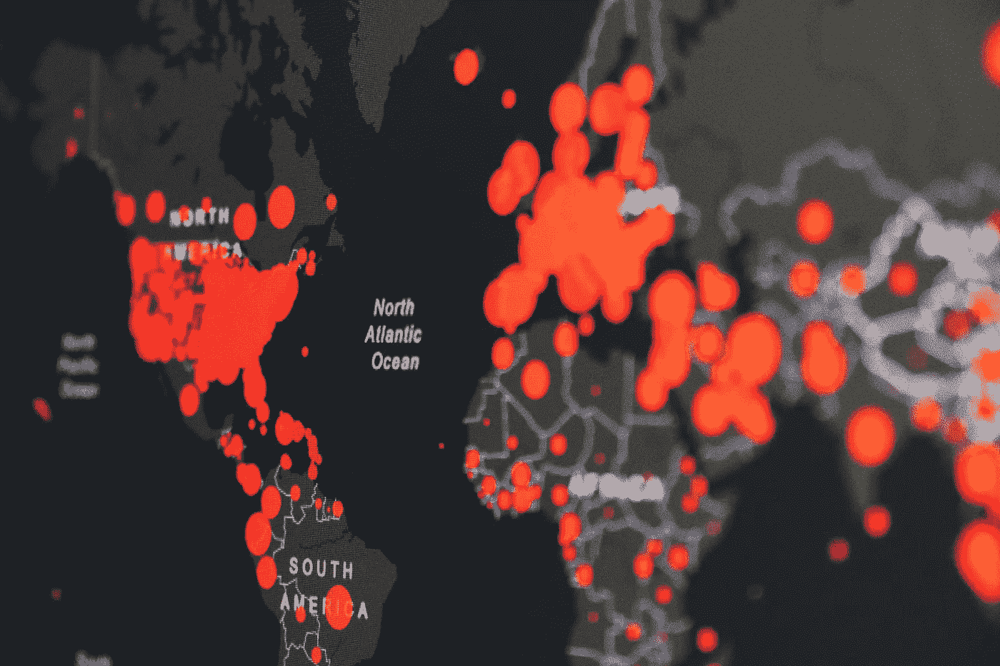
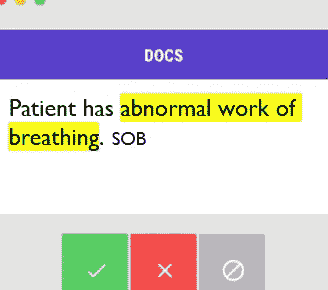
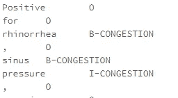

# 临床自然语言处理

> 原文：<https://towardsdatascience.com/clinical-natural-language-processing-5c7b3d17e137?source=collection_archive---------11----------------------->

## 迁移学习和弱监督


由 [Unsplash](https://unsplash.com/) 上的 [Hush Naidoo](https://unsplash.com/@hush52) 拍摄的照片

在全国各地，医生每天都在给病人看病，并仔细地将他们的病情、健康的社会决定因素、病史等记录到电子健康记录(EHRs)中。这些文档繁重的工作流产生了丰富的数据存储，有可能从根本上改善患者护理。这些数据的大部分不是离散的字段，而是自由文本的临床笔记。传统的医疗保健分析主要依赖于离散数据字段，偶尔也依赖于自由文本数据的正则表达式，从而错过了大量的临床数据。

在疫情早期，在建立广泛的检测之前，关于新冠肺炎的症状信息(即发烧、咳嗽、气短)对于跟踪传播是有价值的。更好地了解疾病的进展并识别可能经历更差结果的患者仍然是有价值的。在离散数据字段中，无法可靠地捕获症状数据。临床进展记录，特别是在门诊环境中，提供了新冠肺炎感染的早期证据，使得能够预测即将到来的医院激增。在本文中，我们将研究 NLP 如何通过迁移学习和弱监督来实现这些见解。



照片由[马丁·桑切斯](https://unsplash.com/@martinsanchez)在 [Unsplash](https://unsplash.com/) 拍摄

自然语言处理(NLP)可以从临床文本中提取编码数据，使以前的“黑暗数据”可用于分析和建模。随着最近算法的改进和工具的简化，NLP 比以往任何时候都更加强大和容易使用，然而，它也不是没有一些逻辑障碍。有用的 NLP 引擎需要大量带标签的数据来很好地“学习”一个数据域。临床文本的专业性质排除了人群来源标签，它需要专业知识，而具有专业知识的临床医生在更紧迫的事务中需求量很大——特别是在疫情期间。

那么，医疗系统如何在尊重临床医生时间的同时利用他们的自由文本数据呢？一个非常实用的方法是迁移学习和弱监督。

现代的 NLP 模型不再需要从头开始训练。许多最先进的语言模型已经在临床文本数据集上进行了预训练。对于新冠肺炎综合症的数据，我们从名为 huggingface 的 pytorch 框架中可用的[Bio _ Discharge _ Summary _ BERT](https://huggingface.co/emilyalsentzer/Bio_Discharge_Summary_BERT)开始。如 ClinicalBERT 论文中所述，该模型在 [MIMIC III](https://www.nature.com/articles/sdata201635) 出院小结数据集上进行训练。我们使用来自 Bio_Discharge_Summary_BERT 的 transformer 单词嵌入作为迁移学习基础，并微调序列标记层，以使用我们的特定症状标签对实体进行分类。例如，我们对“气短”感兴趣，临床上有许多症状可以归入这一范畴(例如，“呼吸困难”、“气喘”、“呼吸急促”)。我们的分类问题限于大约 20 个症状标签，比一般的临床 NER 问题产生更高的性能结果。

然而，为了训练这个序列标记层，我们回到了数据问题。MIMIC III 和我们的内部临床文本数据集都是未标记的。少数公开可用的带标签的临床文本数据集(如 N2C2 2010)被标记为不同的使用案例。我们如何为我们的目标用例获得足够的数据标签，并负责任地进行采样以防止模型中的偏差？

我们的策略有三个步骤:注释的选择性抽样、弱监督和负责任的人工智能公平技术

我们使用**选择性抽样**来更有效地利用我们临床医生的时间。对于新冠肺炎症状，这意味着只向注释者提供可能包含症状信息的注释。产前预约记录或行为健康记录不太可能讨论发烧、咳嗽、流鼻涕或气短。战略性地限制我们发送给注释者的注释池增加了临床医生花费在每个注释小时上的标签。为了进行注释，我们为临床医生提供了一个名为 [prodigy](https://prodi.gy/) 的工具。用户界面易于使用，并且对于不同的注释策略是灵活的。



由作者创建

建立注释策略时的一个主要决策点是确定您希望您的注释器以什么粒度进行标记。选择太高的粒度，比如“症状”，不会给我们用例所需要的数据，但是过于具体，比如“非生产性咳嗽”对“生产性咳嗽”，对注释者来说是一个沉重的负担，对我们没有额外的好处。对于任何标注策略，平衡标注者的负担和标注数据集的可重用性是很重要的。我们回到井里的次数越少越好，但是如果一个临床医生花 2 个小时来注释一个临床笔记，我们也没有成功。对于我们的项目，注释的第一步只适用于 NER。我们后来通过了 NER 的情绪(即。存在、不存在、假设)。Prodigy 允许使用定制配方脚本制定有针对性的策略。

在从我们的临床医生那里收集了 Prodigy 注释后，我们创建了基于规则的标签模式，用于 SpaCy 中的弱监管。Prodigy 和 SpaCy 由同一个开发小组开发，这使得集成变得非常简单。**弱监督**是另一种注释策略，然而，它不是来自临床主题专家的“黄金标准”注释，而是使用一种算法来注释更大量的文本。理想情况下，由于使用算法而降低的准确性被可以处理的大量文档所抵消。使用基于以下标记模式的算法，我们能够生成一个非常大的训练数据集。

```
{"label":"SOB","pattern":[{"LOWER":{"IN":["short","shortness"]}},{"LOWER":"of","OP":"?"},{"LOWER":"breath"}]}
{"label":"SOB","pattern":[{"LOWER":"tachypnea"}]}
{"label":"SOB","pattern":[{"LOWER":"doe"}]}
{"label":"SOB","pattern":[{"LOWER":"winded"}]}{"label":"SOB","pattern":[{"LOWER":"breathless"}]}{"label":"SOB","pattern":[{"LOWER":"desaturations"}]}{"label":"SOB","pattern":[{"LOWER":"gasping"}]}{"LOWER":"enough"},{"LOWER":"air"}]}{"label":"SOB","pattern":[{"LOWER":"cannot"},{"LOWER":"get"},{"LOWER":"enough"},{"LOWER":"air"}]}{"label":"SOB","pattern":[{"LOWER":"out"},{"LOWER":"of"},{"LOWER":"breath"}]}
```

因为我们的选择性采样会使我们呈现给注释者的注释产生偏差，所以我们需要防止最终训练模型的弱监督数据集中的偏差。临床领域的机器学习需要更高程度的努力，以防止模型中的偏差。 [**负责任的人工智能技术**](https://www.microsoft.com/en-us/ai/responsible-ai?activetab=pivot1:primaryr6) 在所有行业都变得强制性，但由于平等和公正是生物医学伦理的基本原则，我们小心翼翼地开发了一种用于弱监管的无偏笔记采样方法。对于每个数据集，临床记录在种族和民族、地理位置、性别和年龄上以相同的数量进行采样。然后通过 SpaCy 将标签图案应用到纸币上。结果是 100，000 份临床记录的 IOB 格式的注释数据集。

```
def **pandas_parse**(x): with open(patterns_file) as f:
         patterns = json.load(f) \
         if patterns_file.lower().endswith("json") \
         else [json.loads(s) for s in f]
        for p in patterns:
          p["id"] = json.dumps(p)
        spacy.util.set_data_path("/dbfs/FileStore/spacy/data")
        nlp = spacy.load(spacy_model, disable=["ner"])
        ruler = EntityRuler(nlp, patterns=patterns)
        nlp.add_pipe(ruler)
        return x.apply(lambda i: parse_text(i,nlp))parse_pandas_udf = F.pandas_udf(pandas_parse,ArrayType(ArrayType(StringType())), F.PandasUDFType.SCALAR)#IOB output
def **parse_text**(text,nlp):
  doc = nlp(text)
  text = []
  iob_tags = []
  neg = []
  for sent in doc.sents:
    if len(sent) < 210 and len(sent.ents) > 0:
      text = text + [e.text for e in sent] 
      iob_tags = iob_tags + [str(e.ent_iob_) + '-' \
      + str(e.ent_type_) if e.ent_iob_ else 'O' for e in sent]
  return (pd.DataFrame( {'text': text,'iob_tags ': iob_tags 
    }).values.tolist())
```



由作者创建

此时，我们已经准备好训练我们的序列标签层。我们使用了一个叫做 [Flair](https://github.com/flairNLP/flair/blob/master/resources/docs/TUTORIAL_1_BASICS.md) 的框架来从我们的 IOB 标签数据集创建一个语料库。然后，语料库被分成开发集、训练集和验证集，Flair 从那里开始。结果很有希望。

```
- F1-score (micro) 0.9964- F1-score (macro) 0.9783By class:ABDOMINAL_PAIN tp: 977 - fp: 6 - fn: 5 - precision: 0.9939 - recall: 0.9949 - f1-score: 0.9944ANXIETY    tp: 1194 - fp: 8 - fn: 8 - precision: 0.9933 - recall: 0.9933 - f1-score: 0.9933CHILLS     tp: 343 - fp: 1 - fn: 0 - precision: 0.9971 - recall: 1.0000 - f1-score: 0.9985CONGESTION tp: 1915 - fp: 21 - fn: 6 - precision: 0.9892 - recall: 0.9969 - f1-score: 0.9930COUGH      tp: 3293 - fp: 6 - fn: 6 - precision: 0.9982 - recall: 0.9982 - f1-score: 0.9982COVID_EXPOSURE tp: 16 - fp: 1 - fn: 1 - precision: 0.9412 - recall: 0.9412 - f1-score: 0.9412DIARRHEA   tp: 1493 - fp: 6 - fn: 0 - precision: 0.9960 - recall: 1.0000 - f1-score: 0.9980FATIGUE    tp: 762 - fp: 2 - fn: 7 - precision: 0.9974 - recall: 0.9909 - f1-score: 0.9941FEVER      tp: 3859 - fp: 7 - fn: 2 - precision: 0.9982 - recall: 0.9995 - f1-score: 0.9988HEADACHE   tp: 1230 - fp: 4 - fn: 5 - precision: 0.9968 - recall: 0.9960 - f1-score: 0.9964MYALGIA    tp: 478 - fp: 3 - fn: 1 - precision: 0.9938 - recall: 0.9979 - f1-score: 0.9958NAUSEA_VOMIT tp: 1925 - fp: 7 - fn: 12 - precision: 0.9964 - recall: 0.9938 - f1-score: 0.9951SOB        tp: 1959 - fp: 10 - fn: 10 - precision: 0.9949 - recall: 0.9949 - f1-score: 0.9949SWEATS     tp: 271 - fp: 0 - fn: 1 - precision: 1.0000 - recall: 0.9963 - f1-score: 0.9982TASTE_SMELL tp: 8 - fp: 0 - fn: 6 - precision: 1.0000 - recall: 0.5714 - f1-score: 0.7273THROAT     tp: 1030 - fp: 11 - fn: 2 - precision: 0.9894 - recall: 0.9981 - f1-score: 0.9937WHEEZING   tp: 3137 - fp: 6 - fn: 0 - precision: 0.9981 - recall: 1.0000 - f1-score: 0.9990
```

假设我们在弱监督的、基于规则的数据集上训练了一个 transformer 语言模型，人们可能会合理地问，“为什么不在生产中使用基于规则的方法？”然而，考虑到 transformer 语言模型(如 BERT)使用子词标记和上下文特定的向量，我们训练的模型可以识别基于规则的模式文件中未指定的症状，并且还可以正确识别我们感兴趣的实体的拼写错误版本(例如，它正确地将“cuogh”识别为[咳嗽])。

由于临床自由文本笔记中的丰富数据和临床笔记注释的逻辑挑战，医疗保健 NLP 的一个非常实用的方法是迁移学习和弱监督。