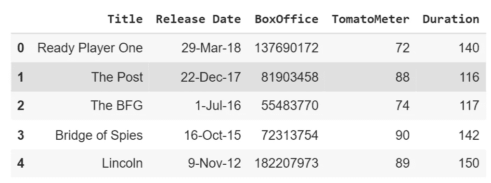
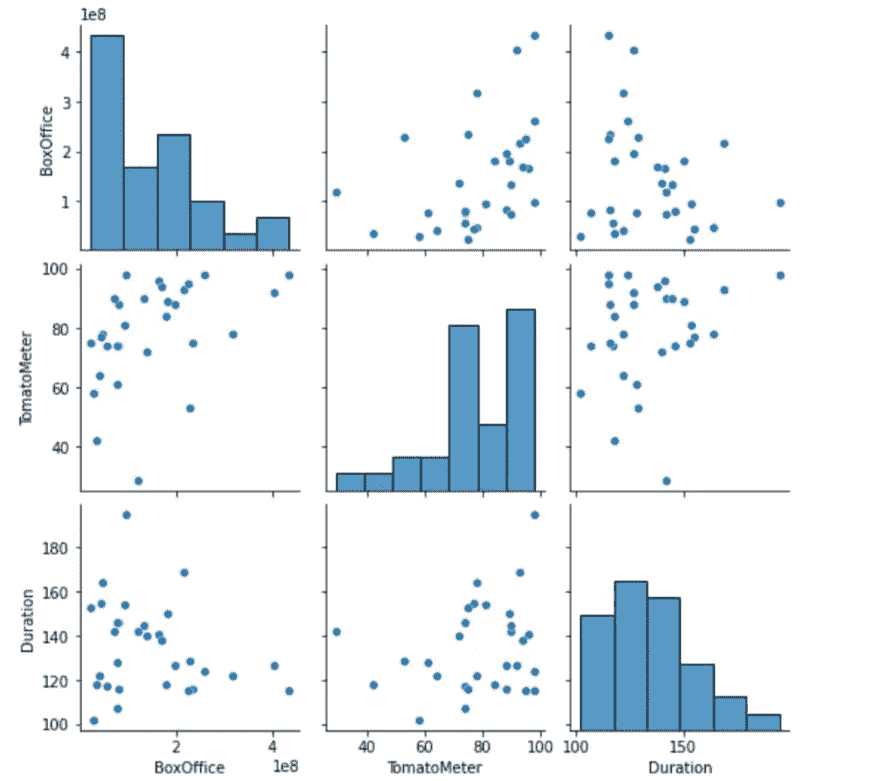
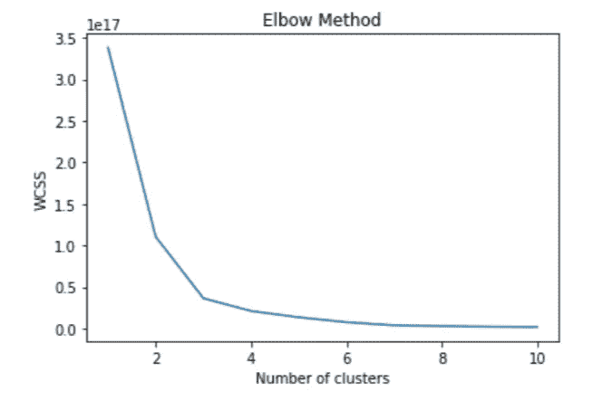
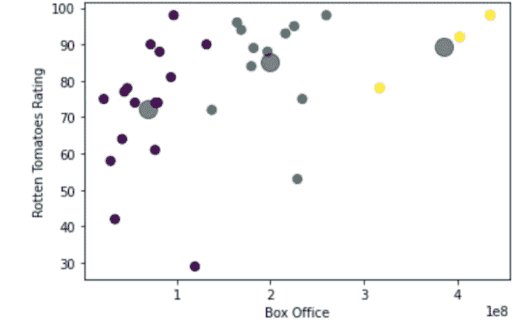
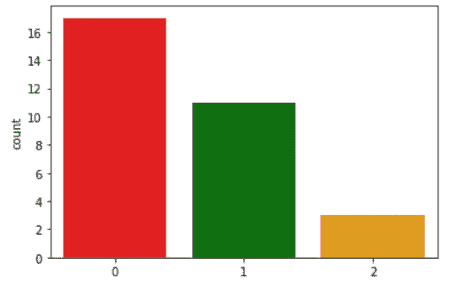
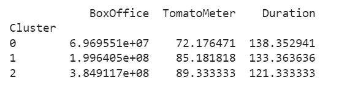
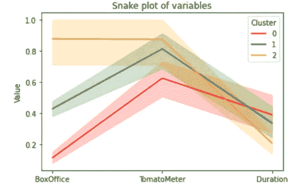
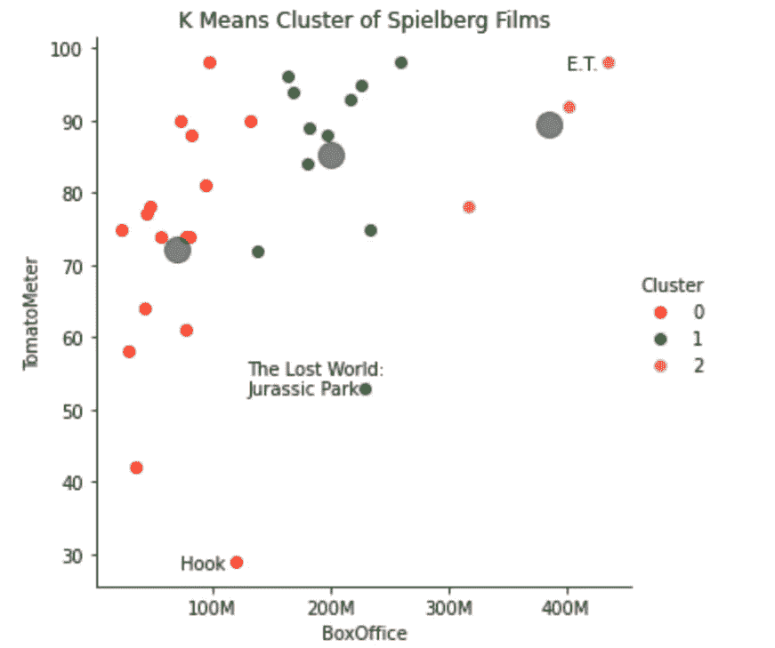

# K-Means 类的亲密接触

> 原文：<https://towardsdatascience.com/close-encounters-of-the-k-means-kind-4aff91b3d0ab?source=collection_archive---------18----------------------->

## [实践教程](https://towardsdatascience.com/tagged/hands-on-tutorials)

## **用聚类算法分割史蒂芬·斯皮尔伯格的电影**

[📸—埃里克·维特索— Unspalsh](https://unsplash.com/@ewitsoe)

# **场景 1:为电影集群搭建舞台**

“不管是成功还是失败，我都为自己执导的每一部电影感到骄傲。”

史蒂文·斯皮尔伯格

职业生涯跨越近 60 年；据《时代》杂志报道，电影制作人史蒂文·斯皮尔伯格凭借《大白鲨》一炮走红，使 1975 年成为“鲨鱼的夏天”。从那以后，他不断地将自己和观众推出舒适区，建立了一份无人能及的遗产。正如《滚石》杂志(Rolling Stone)的 Bilge Ebiri 所指出的，斯皮尔伯格“总是在大片和更严肃的作品之间徘徊”，他的电影跨越了多个流派。一路走来，他获得了 18 项奥斯卡提名，找到了一种赢得评论界和商业赞誉的方法，因为他的 30 多部电影在国内票房收入超过 100 亿美元(经通胀调整后)。他似乎也没有慢下来；快速浏览一下他的 IMDB 页面,暗示他可能正在努力导演下一部大片。

试图对这位可能是有史以来最著名的电影导演的电影作品进行分类或细分并不是一件简单的任务。但是让我们试一试。一个简单的时间顺序列表或类型分类就足够了，但如果我们采取一种更数据驱动的方法，通过评估多种电影属性，在斯皮尔伯格电影集中潜在地浮现潜在的模式或主题，会怎么样？

# 场景 2: K 均值聚类概述

无监督学习指的是当没有每个数据点的标签、类或类别的明确标识时，试图提取意义的模型。聚类是一种无监督的学习方法，它将未标记的数据分组，以帮助我们更好地理解数据集中的模式。聚类是广泛使用的推荐引擎的关键组成部分，这些引擎嵌入到亚马逊、网飞和许多其他人每天都在使用的产品中。虽然我们将在这里使用聚类作为非常简单的电影建议工具的构建块，但是其他应用包括:

**个性化营销-** 利用客户数据库中的人口统计数据，营销人员可以对不同类型的用户进行分组，并为他们提供更合适的产品或个性化活动。知道这个群体中的人喜欢“x”(而不是“y”)，可以减少浪费的广告支出，同时提高活动转化率。

**异常检测-** 异常是数据集中偏离共同趋势或模式的数据点。结合 K-Means 聚类的视觉特性，可以设置预定的阈值或边界距离来帮助观察和隔离偏离包的离群值。

**文件缩减/图像压缩** -数字图像由像素组成，每个像素的大小为 3 字节(RBG)，每个字节的值从 0 到 255，导致每个像素有大量的颜色组合。K-Means 可应用于图像文件，将相似或相似的颜色分组，以创建文件大小减小但图像仍可解读的新版本。例如，代替包含 200 种颜色的狗的图像，K-均值聚类也许可以仅使用 10 种颜色来呈现图像，而不会显著降低图像的视觉特性。

存在多种聚类算法；您试图解决的问题以及您所掌握的数据通常会决定采用哪种方法。K-Means 聚类是最广泛使用的方法之一，它试图通过创建一定数量的聚类来对未标记的数据进行分类，如字母“k”所定义的。该算法确定适当的聚类，并根据每个数据点到质心的接近度(或相似度)将每个数据点分配给一个聚类，质心是聚类中心的别称。值得注意的是，K-Means 并不确保每个聚类都具有相同的大小，而是专注于识别最适合分离和分组的聚类。

K-Means 聚类通常被认为是一种“划分”技术，与其他聚类方法相比，它有几个优点。首先，这相当简单:告诉模型您想要多少个组，并将所有数据点分配给适当的组。这种简单性使它即使在非常大的数据集上也能快速运行。此外，它的流行导致了 Python 中大量的开源资源和相关库——我们将在后面探讨。

而 K-Means 聚类使用起来相对简单，并且可以很好地适应大型数据集；这种方法伴随着一些缺点。K-Means 聚类需要严格的数字数据，这可能需要根据可用的数据集准备一些数据。此外，该算法可能对异常值非常敏感。此外，K-Means 不能随着维数或变量的增加而很好地扩展；我们将看到两个甚至三个变量是如何很好地适用于这种技术的，但是超出这个范围会给解释带来困难。幸运的是，像[主成分分析(PCA)](https://builtin.com/data-science/step-step-explanation-principal-component-analysis) 这样的降维技术与 K-Means 配合得很好。

解释是任何 K 均值聚类练习中最重要的步骤；正如道恩·雅各布奇在她的教科书 [*营销模型*](https://catalog.library.vanderbilt.edu/discovery/fulldisplay/alma991043591966003276/01VAN_INST:vanui) 中所写的，“一旦集群被衍生出来，我们必须理解它们。”对聚类输出的正确分析应揭示现有问题的答案，并产生关于数据集的新问题。聚类的大小、位置和数量都是潜在的有用线索，可以为下一步的分析提供信息。

# 场景 3:分解算法

K 均值聚类算法的过程可以分为几个步骤:

第一步(初始化)——首先，我们需要决定我们想要多少个簇(以及质心)。这一步既可以随机完成，也可以通过肘方法通知，这将在后面解释。我们将告诉模型选择“K”个随机点作为我们的初始质心。

**第 2 步**(分配)—算法然后将每个数据点分配到通过平方距离测量的最近质心。

**步骤 3** (重新计算)——然后通过取当前分配给该聚类的所有数据点的平均值来重新计算或调整质心。

步骤 2 和 3 的迭代继续进行，直到不需要进行新的最佳重新分配，并且所有数据点都位于其数据与它们自己的数据最相似的聚类中。本质上，该算法寻求继续迭代，并最小化误差平方和(SSE)作为聚类性能的度量。这个迭代过程通过最小化簇内的可变性*和最大化*簇之间的可变性*展示了“像数据点一样分组”的思想。*

当在步骤 1 中随机选择质心位置时，K-Means 可以在算法的连续运行中返回不同的结果。为了克服这个限制，该算法可以运行多次，并最终提供基于 SSE 的最佳结果。

图:K-Means 收敛的 GIF([来源](https://commons.wikimedia.org/wiki/File:K-means_convergence.gif)

# 场景 4:读入和浏览数据

虽然 R 对于这种类型的分析是完全合适的工具，但是我们将使用 Python，因为它可以访问有用的 K-Means 方法以及强大的绘图功能。在加载[我们的数据](https://raw.githubusercontent.com/wcrowley342/Spielberg-K-Means-Clustering/main/Spielberg%20Movie%20Data%20-%20Cleaned.csv)来分析并最终推荐斯皮尔伯格电影之前，我们将导入 K-Means 所需的库以及其他一些用于后续绘制的库，同时也导入我们的数据集。

图:前五个观察值或我们数据集的“头”(图片由作者提供)

我综合了几个不同来源的数据——IMBD、[烂番茄](https://www.rottentomatoes.com/celebrity/steve_spielberg)和[数字](https://www.the-numbers.com/person/135430401-Steven-Spielberg#tab=technical)——收集了一系列斯皮尔伯格担任导演的电影，以及每部电影的相关变量，如年份、片名、[电影评分、](https://www.rottentomatoes.com/about#:~:text=The%20Tomatometer%20score%20represents%20the,receives%20at%20least%20five%20reviews.)国内票房表现(经通胀调整)和电影时长。如上所述，K-Means 聚类需要所有数值数据；幸运的是，这里就是这种情况，所以我们不需要转换数据集。(查看[我的上一篇文章](/python-pandas-and-the-peloton-aa024ca74fa5)以了解关于数据清理和准备的价值的更多细节，以及[本指南](https://developers.google.com/machine-learning/clustering/prepare-data)关于特定于集群的数据准备工作)。

[配对图](https://seaborn.pydata.org/generated/seaborn.pairplot.html)是快速探索数据集中分布和关系的有用工具。我们将使用。seaborn 库中的 pairplot 函数，只需一行代码，我们就可以了解数字变量(BoxOffice、TomatoMeter 和 Duration)之间的关系。不出所料，我们注意到票房和票房之间微弱但正相关，表明影评人和付费电影观众在谈到斯皮尔伯格电影时有一些共同的态度。

图:数据集的配对图(图片由作者提供)

可视化我们的数据有助于快速了解其形状、分布和对称性。除了散点图之外。pairplot 方法还提供了变量的直方图。displot 方法也可以用来实现这一点)。我们注意到两者都有一些尾部，电影票房呈左偏分布，票房略偏右。假设变量是正的，可以用对数变换来消除偏斜。出于本练习的目的，并且考虑到我们的数据集相对较小，偏斜度也相当小，我们将在本例中暂停运行该转换，但了解这一点还是有好处的。

最后，让我们使用图形库 plotly 来创建一个交互式散点图，显示根据我们感兴趣的两个变量(烂番茄和票房)绘制的电影。

图:通过 plotly 制作的数据集交互式散点图(图片由作者提供)

如上所述，K-Means 对数据集中的异常值非常敏感。在运行 K-Means 算法之前删除这些点是明智的，但是考虑到没有主要的异常值和相对较小的数据集，我们将跳过这一步。

# 场景 5: **确定聚类数**

当基于数据的预定数量的聚类不明显时，我们求助于[肘方法](https://en.wikipedia.org/wiki/Elbow_method_(clustering))，这是一种帮助确定适当数量的聚类的统计方法。回想一下，聚类旨在定义聚类，以使总的类内变化(通过从点到质心的距离来测量，也称为 WCSS 或类内平方和)最小化。自然，群集数量的增加与误差成反比关系；更多的聚类为我们的数据中的观察提供了更多的选项，以找到相似的组来加入。然而，添加越来越多的集群会产生较小的增量增益，并可能导致“过拟合”的例子。肘方法帮助我们在过多和过少的集群之间找到适当的平衡。

肘法也为这一努力增加了视觉元素。肘形图将显示每个 K 值的 WCSS 值，代表聚类总数。我们开始看到收益递减的点，有时看起来像肘关节，可以被认为是 k 值的一个很好的候选点。

图:帮助确定适当集群数量的“肘方法”图(图片由作者提供)

看起来我们理想的集群数量是三个！在确定用于分析的聚类数量时，没有硬性规定；因此，诸如“这些集群是可解释的吗？”或者“它们被新数据复制的可能性有多大？”将有助于做出最终决定。肘方法的正确应用是一个很好的例子，说明数据分析需要艺术和科学的独特融合。

# 场景六:**运用&解读 K-Means**

虽然对数据的未缩放版本和缩放版本运行 K-Means 通常是最佳实践，但为了简单起见，我们将坚持在数据集的未缩放版本上运行该算法，同时保持变量及其相对缩放的可解释性。我们可以从 sci-kit learn 的集群模块中运行 k_means()函数，使得 K-Means 的实现相对简单。

图:K-Means 结果的第一个视图(图片由作者提供)

这是我们第一次看到我们的集群数据！但是我们的工作还远远没有结束。正如精彩的教材《Python for Marketing and Research Analytics》中提到的那样，“细分项目中最关键的问题是业务方面:结果对手头的目的有用吗？”

回想一下识别斯皮尔伯格导演的电影的独特分组的初衷，我们可以求助于 Python 来帮助我们识别与上述情节匹配的其他拼图(同时也使用一些简单的技巧来帮助增强图形本身)。例如，我们将使用。countplot 方法来了解每个集群的相对大小，同时将它们分配给数字分组。

图:结果。展示聚类大小的计数图方法(图片由作者提供)

不平衡的聚类通常表示远处的异常值或一组非常不相似的数据点，这将保证进一步的调查。通过浏览上面的图表，我们可以看到《第二集》确实因其相对较小的尺寸而显得突出——即使对于可以说是有史以来最伟大的导演来说，创作一部观众和评论家都非常崇拜的电影仍然很难做到！鉴于这一组中的三部电影取得了票房和关键成功的理想平衡，如果我们能够超越坐在导演椅上的人来识别这三部电影之间的相似之处，那当然值得一看。

计算质心的汇总统计数据有助于回答“是什么使这个星团独一无二？”我们将在这里添加回持续时间变量，看看是否可以帮助打开一些新的见解。

图:显示了所有三个集群中相关变量的平均值(图片由作者提供)

我们还将创建一个蛇形图，以便我们能够以一种更直观的方式查看每个集群中感兴趣的变量之间的变化。这将需要我们的数据集以及集群的规范化版本。熊猫。melt 方法将规范化的数据帧重新排列成适当的布局。

图:蛇情节结果(图片作者)

我们可以看到，该图提供了一个有用的可视化表示，显示了所生成的聚类在不同的感兴趣属性之间的差异。例如，这三个集群之间最明显的区别似乎是 BoxOffice 变量。让我们把上面的 K-Means 散点图带回来，用一些有用的注释把所有的东西放在一起。

图:带注释的 K-Means 结果的更新视图(图片由作者提供)

当组合在一起时，聚类平均值、蛇形图和 K-Means 可视化可以帮助启发一些合适的名称来帮助我们描绘我们的聚类。红色的**簇 0** 可能是“一个混合包”。虽然这些电影都没有打破票房纪录，但它包含了广泛的番茄米评级。绿色的**集群 1** 可能是“强有力的竞争者”集群，代表除了《侏罗纪公园 2》之外最受评论家喜欢的电影，并且在票房上表现相当好。最后，我们可以称较小的黄色**星团 2** 为“最好的”。如果你必须为你的电影爱好者朋友策划一个斯蒂芬·斯皮尔伯格入门包，这个小组将是一个很好的开始。

让我印象深刻的是斯皮尔伯格执导的高质量、高评价电影的惊人比例。考虑到 2019 年电影[的平均评分为 59.3，](https://morningconsult.com/2019/10/29/rotten-tomatoes-scores-continue-to-freshen-what-does-this-mean-for-movies/)斯皮尔伯格的电影平均得分高达 78。当我们看持续时间时，另一个有趣的收获出现了，这个变量包含在 snake 图和汇总统计图表中，但不在我们的 K-Means 算法中。时长和票房之间的反比和明显关系引发了一个问题，即删减一些场景或对白是否会给斯皮尔伯格的下一系列电影带来更大的商业成功。

请记住，考虑将聚类分析的输出结果与您试图回答的最终业务目标或问题联系起来是非常重要的。一天结束时，聚类输出只是数据点的组分配向量，由数据分析师来决定如何或是否讲述一个有见地的故事！

# 场景 7:限制、未来研究、额外资源和最终想法

正如我们上面提到的，我们在这里工作的数据集在观察数量和变量数量上都相对较小。编码电影相关的分类变量，如类型或美国电影协会评级，将是一种潜在的表面有趣的模式，并加强我们的电影建议的努力。此外，将我们的方法与时间序列分析结合起来，看看斯皮尔伯格电影这些年来是如何变化的，这是未来研究的另一条途径。在方法上；在这次讨论中，我们仅仅触及了集群技术的皮毛。其他方法，如层次聚类——以及称之为“树状图”的乐趣——有助于确定哪两个数据点最相似(或不相似)。虽然 k-means 方法在分析数据集的方法中具有全局性质，但分层可以根据我们所掌握的变量，得出关于哪些斯皮尔伯格电影最相似的有趣见解。

如果你想了解更多关于这个主题的内容，或者查看更多聚类算法的例子，我在下面列出了我在研究和撰写这篇文章的过程中遇到的一系列有用的 K-Means 聚类文章和教程:

*   [Ben Alex Keen—K-Means Python 中的聚类](https://benalexkeen.com/k-means-clustering-in-python/)
*   [阿曼达·多宾——数据科学专家](https://github.com/aedobbyn/beer-data-science/blob/master/compile/compile.md)
*   [真正的 Python——Python 中的 K-Means 集群:实用指南](https://realpython.com/k-means-clustering-python/)
*   [方差解释— K 均值聚类不是免费的午餐](http://varianceexplained.org/r/kmeans-free-lunch/)
*   [Oracle AI &数据科学博客—K 均值聚类简介](https://blogs.oracle.com/ai-and-datascience/post/introduction-to-k-means-clustering)

虽然我不认为我们非常简单的推荐模型会很快从网飞偷走订户，但希望 K-Means 聚类的高层次概述有助于展示 Python 及其相关功能的简单方面如何从数据集揭示独特的见解和模式，并帮助一些最广泛使用的推荐引擎。

点击查看[原始代码。我忘记了什么或者你会做什么不同的事情？任何和所有的反馈都欢迎通过下面的评论，或者在 wmc342@gmail.com 给我留言。感谢你坚持这篇文章直到最后；喜欢这篇文章的人也喜欢…开玩笑而已；)](https://github.com/wcrowley342/Spielberg-K-Means-Clustering/blob/main/Spielberg_K_Means_Clustering.ipynb)