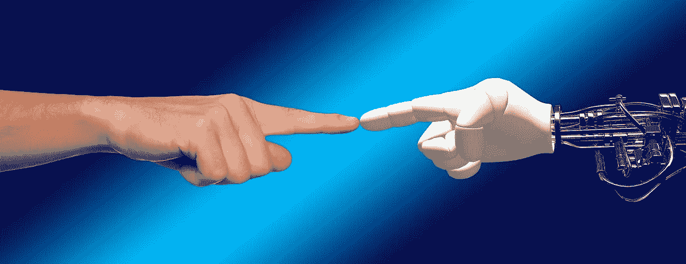
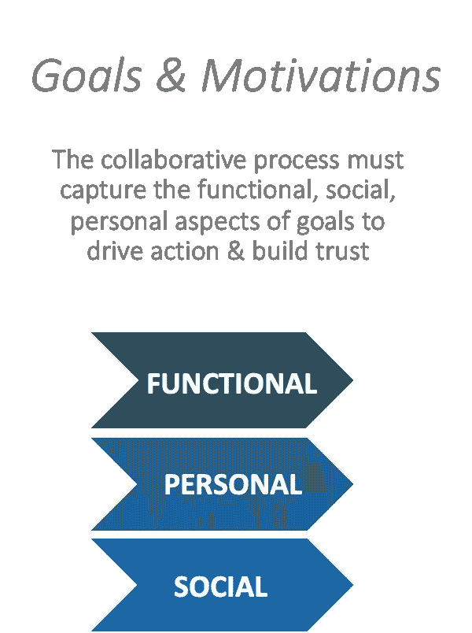
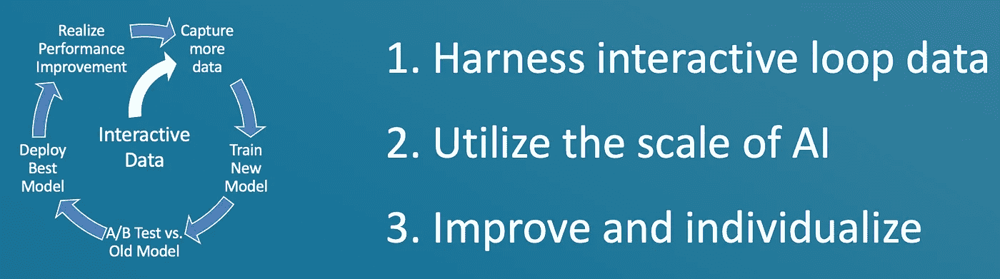
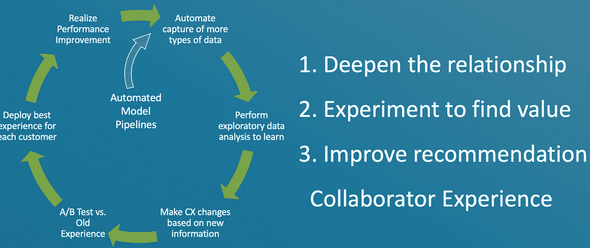
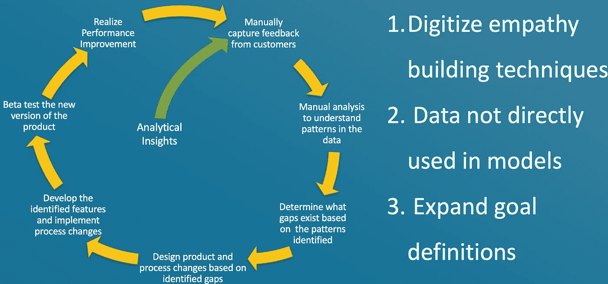
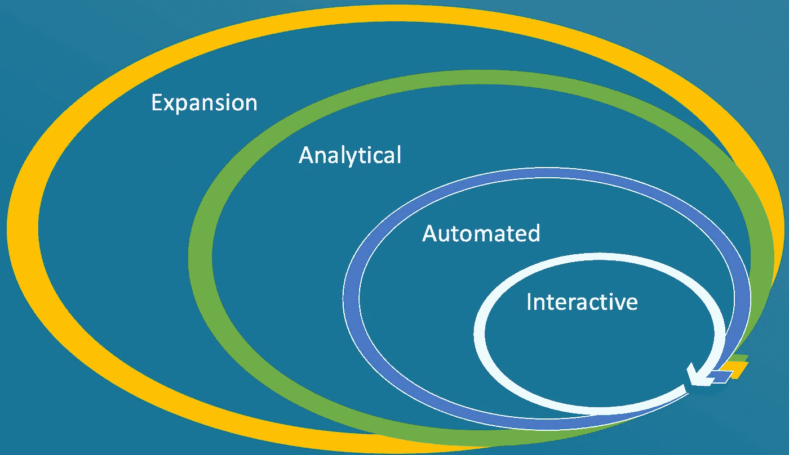

# 弥合人工智能价值差距第 2 部分:人工智能与自适应分析的共同创造

> 原文：<https://towardsdatascience.com/closing-the-ai-value-gap-part-2-ai-co-creation-with-adaptive-analytics-3f144b42028f?source=collection_archive---------38----------------------->

## 让你的人工智能产品与人合作来实现他们的目标

图像来源:[最大像素](https://www.maxpixel.net/Hand-Human-Contact-Robot-Divine-Machine-Spark-1571852)

在[之前的一篇帖子](/the-ai-value-gap-36463bcace6f)中，我介绍了一个概念，即人工智能不会实现分析师预测的大规模财务影响。这是因为它预计“解决”(通过规定分析)的大多数问题本质上都很复杂，因此很难使用静态系统来解决。像[强化学习](/reinforcement-learning-is-going-mainstream-heres-what-to-expect-d0fa4c8c30cf)这样的技术正在朝着构建适应不断变化的条件的系统取得进展(并且[自从我发表关于这个主题的第一篇文章以来，已经取得了](https://twimlai.com/off-line-off-policy-rl-for-real-world-decision-making-at-facebook/)的进展)，但是它们仍然需要问题的健壮模拟或者十亿用户规模的数据库。

幸运的是，另一个进步领域是增强人工智能或“人在回路中”人工智能。在这篇文章中，我将充实自适应分析的思想，它将重点放在每个过程中与人类一起学习，以便合作解决复杂的问题。

## 从接受人类会帮忙开始

构建人在回路中的自适应人工智能系统的过程将看起来不同于传统的人工智能开发过程。你的团队必须从设想一个未来的状态开始，在这个状态中，一个系统集成到业务或整个世界中来解决一个问题，在这个过程中真正地与人们协作。

> 当人工智能代理与人类合作者交互时，人工智能共同创造发生，人类合作者逐渐向代理提供更多信息。两者一起工作来发现和优化一个目标。

这增加了设计过程的复杂性，目标是在交付的结果中弥补这一点。我发现使用 Clayton Christensen 的 [**与运气**](https://www.amazon.com/Competing-Against-Luck-Innovation-Customer/dp/0062435612) 中介绍的技术，并在随后的[待做的工作](https://hbr.org/2016/09/know-your-customers-jobs-to-be-done)文献中进一步扩展，在这里是有帮助的。这涉及到一系列与规定性模型本身无关的问题:

图片作者。

今天谁参与了解决这个问题？他们扮演什么角色？

*   他们使用该系统的动机是什么？更广义地说？
*   这一过程中固有的社会制度是什么
*   你如何在不打断他们的情况下获得他们的反馈？

关于要做的工作，你有很多可以读的，在工作地图上有一个完整的框架。有了对系统中涉众的多方面目标的初步了解，您就可以开始开发一个与他们协作的系统。

## 接下来，使用体验设计技术来产生共鸣

适应性分析项目将从体验设计社区的技术开始。像 Ideo 的[方法卡](https://www.ideo.com/post/method-cards)这样的技术在这里会很有帮助:

> **学习:**活动分析，亲和图，流量分析
> 
> **看:**生活中的一天，墙上的苍蝇，延时录像
> 
> **提问:**叙述、认知图、五个为什么、调查&问卷
> 
> **尝试:**纸上原型，明年头条，角色扮演

## 反复了解利益相关者的目标

如果你只是简单地问利益相关者他们需要什么，最常见的回答是:“我不知道”。大多数人并不真正知道他们的确切目标，只是知道他们会随着时间的推移而明白。这意味着构建一个自适应的人工智能系统必须通过捕捉额外的信息，随着时间的推移不断地学习他们的目标。在上一篇文章中，我介绍了 4 种不同的反馈循环，可以发现和跟踪目标，使利益相关者的目标随着时间的推移而改变，这样你实际上仍然在帮助他们实现积极的结果。你追求的确切目标可能会有一点点变化，而你为实现目标所使用的方法肯定会改变。

# 构建适应能力:反馈回路

如果您接受最佳解决方案会随着时间的推移而改变，并且问题也可能会改变，那么您的系统必须衡量这些变化以真正优化。在您的系统中构建反馈回路，可以在多个层面上实现这种测量和调整。有了这些，让我们来详细看看 4 个反馈回路。

## 交互式循环

作者图片

中间最短的一个:交互循环。
你可以想象在本系列第 1 部分[中描述的 Gong.io 系统](/the-ai-value-gap-36463bcace6f)询问为什么销售人员在电话中的某个特定点忽略或接受他们的建议(可能是建议改变语气或从介绍转到演示)。这种反应为他们提供了更多的信息，我可以在下一次互动中直接使用这些信息来帮助做出更好的推荐，或者至少是更个性化的推荐。像多臂盗匪这样的在线学习系统是代理从用户动作中学习的很好的例子。

## 自动循环

作者图片

移出一个，有一个自动循环，使新模型的再训练能够利用整个系统的所有交互。为了实现这个循环，应该在边缘收集所有的交互数据和尽可能多的上下文数据。然后需要对其进行聚合，并在数据湖中存储一个有代表性的集合。如果你有兴趣了解更多关于这个过程的信息，请看我关于雾计算架构的演讲。从那里，系统可以使用 [MLOps 原则](https://www.credera.com/insights/building-a-mlops-system-for-minimal-maintenance)训练一组更好的全球模型。

## 分析回路

作者图片

下一个循环是对您正在获取的数据和/或向您的合作者提出建议的方式进行更改。

继续我们的销售代理支持示例:将净推销商得分调查数据与销售过程中了解到的细节联系起来，有助于了解客户对通话过程的感受。此外，如果销售人员提供反馈，说明他们不接受系统建议的原因是因为他们没有看到，系统开发团队可以改变向用户提供结果的方式。例如，如果视频聊天占据了电脑的整个屏幕，一种解决方案是将提醒推送到手机上，销售人员可以将手机放在屏幕旁边。

这个循环的关键是分析是离线进行的**，改进不仅限于模型本身，而是可以在整个系统中进行。**

## **补偿器**

****

**作者图片**

**最后一个循环是关于扩展系统所覆盖的问题部分。这种情况通常通过传统的设计技术发生，人们在人工实验室环境中观察系统的使用。有了现在可用的技术，你可以捕捉一些同样的信息，但是要在大范围内进行。通过利用系统使用的视频记录，您最终能够扩展一些设计社区技术，而不需要手动合成数据。通过数字化这些过程，你可以改进你的系统的下一个版本。

循环过程如下:**

1.  **和你一起工作的合作者会告诉你一些事情，你会考虑这些数据并提出不同的建议。这个过程会重复很多次。**
2.  **接下来，通过捕获数据并通过基于云的系统运行它来训练新的模型，你可以为你正在工作的每个人或小组制作正确的模型，并将这些模型推回到系统中。**
3.  **在分析循环中，您与开发团队合作，自动执行不同类型的数据捕获，并让数据科学家探索和分析这些数据，以开发新的更好的模型，并将这些数据加入到现有的集合中。此外，团队开始改变用户体验，以最大化模型的每个合作者的有效性(就像你把消息推回给人们的方式)。**
4.  **最后，最外层的扩展环包括手动捕获数据，这些数据可能永远不会直接包含在模型构建中，但旨在为人们提供所需的洞察力，以便调整正在解决的系统级问题。这使得麦肯锡在其文章中指出的业务层面财务指标得以优化。**

****

**所有 4 个循环必须协同工作，以消除 AI 值差距。图片作者。**

**没有这 4 个循环的协同工作，人工智能的价值差距将会持续。然而，根据我的经验，大多数数据团队都狭隘地关注交互式和自动化循环。实现更广阔的愿景需要跨数据、经验、产品设计和业务架构团队的协作。在下一篇文章中，我们将为刚刚开始开发自适应人工智能系统的组织提供一个框架和路线图。**

**本系列的更多内容:**

*   **[AI 值差距](/the-ai-value-gap-36463bcace6f)**
*   **[缩小人工智能价值差距第三部分:自适应分析路线图](/closing-the-ai-value-gap-part-3-the-roadmap-to-build-adaptive-analytics-e70eaf076ce0)**