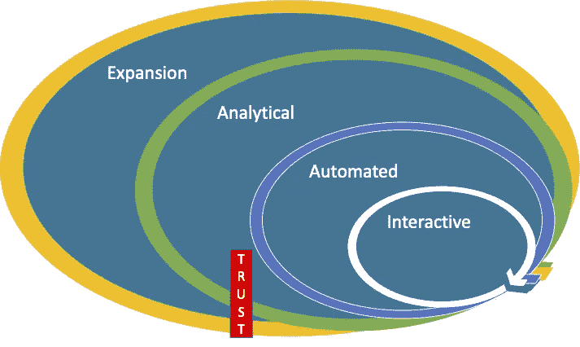
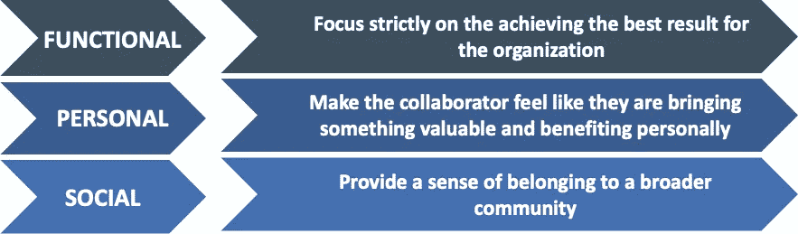
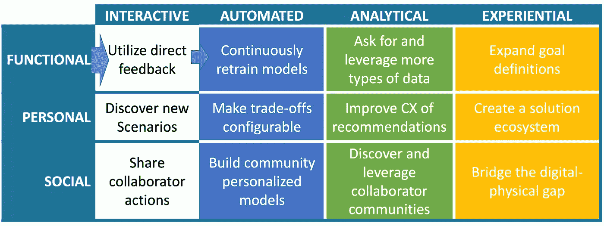
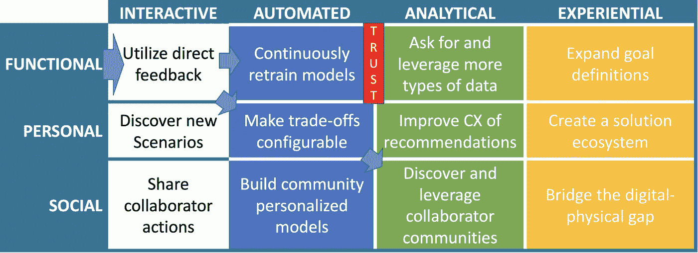
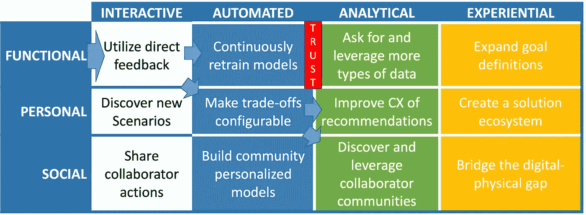
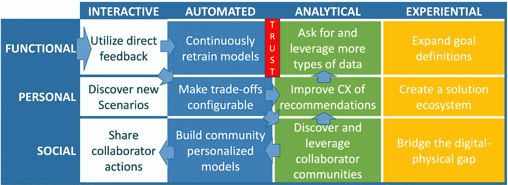
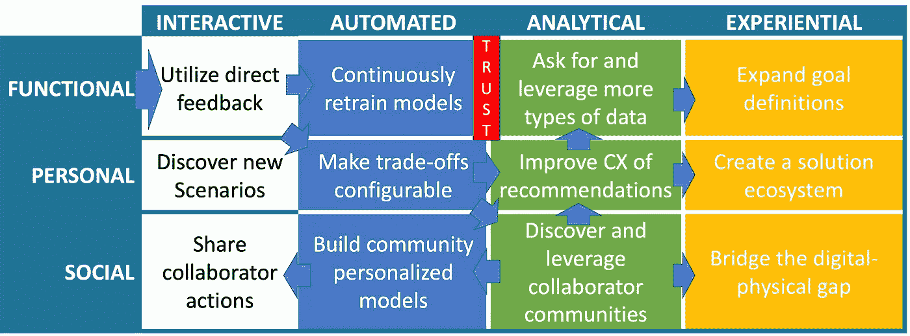
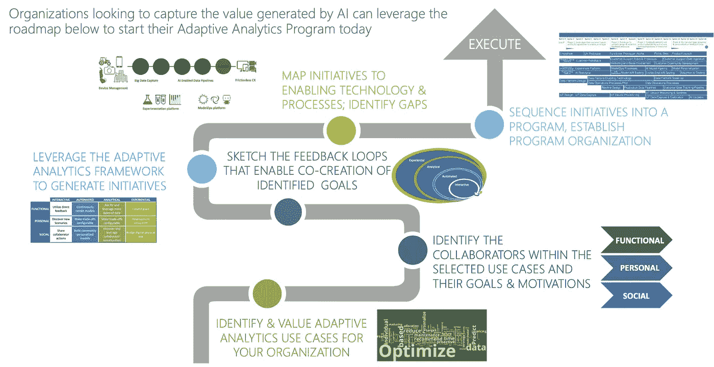

# 弥合人工智能价值差距第 3 部分:构建自适应分析的路线图

> 原文：<https://towardsdatascience.com/closing-the-ai-value-gap-part-3-the-roadmap-to-build-adaptive-analytics-e70eaf076ce0?source=collection_archive---------36----------------------->

## 实现自适应分析解决方案需要建立信任，这对人工智能系统来说并不容易。这个路线图会有所帮助。

自适应人工智能系统的创建并不像将反馈回路放置到位那么简单。人类的复杂性是一个挑战。图片来源:[维基媒体](https://commons.wikimedia.org/wiki/File:Hedge_maze_in_Parque_São_Roque_da_Lameira_4.jpg)

在本系列的[第 1 部分中，我介绍了我所谓的“人工智能价值差距”，即人工智能用例预测的价值生成与人工智能技术当前能力之间的脱节，并断言我们需要更广泛地考虑人工智能集成到的人在回路系统，从预测性&指令性转向适应性人工智能系统。](/the-ai-value-gap-36463bcace6f)

在[第二部分](/closing-the-ai-value-gap-part-2-ai-co-creation-with-adaptive-analytics-3f144b42028f)中，我充实了实现自适应分析系统的 4 个反馈回路:交互、自动化、分析和扩展，以及它们如何共同工作来创建一个协作的人工智能，该人工智能适应每个人，并随着时间的推移不断改进以更好地解决问题。

然而，这些帖子只触及了创造自适应人工智能解决方案背后的理论，以及它们如何弥合复杂问题的人工智能价值差距。在本帖中，我将带您了解一种实用的方法，来构建为您的组织构建自适应分析产品的计划。

## 挑战:建立信任

自动化和分析性反馈之间的信任墙。图片作者。

当一个组织试图采用适应性分析时，他们不能简单地说“这些是反馈循环，开始！”并得到一个功能性的自适应 AI 系统。相反，他们必须小心地从最初的系统扩展，随着时间的推移，以赢得合作者信任的方式利用其他形式的反馈(即，在循环中的人，称他们为合作者有助于获得正确的心态)。当向合作者索取更多信息而不提供任何回报时，只注重改进功能系统的简单路径会很快碰壁。当从自动化进入分析反馈循环时，就会出现这种情况。

## 介绍自适应分析路线图

重新审视我们合作者的 JTBD 需求将使我们能够超越信任之墙。作者图片

为了避免这个问题，我们必须记住，建立信任需要认识到合作者是一个人，这带来了一系列的复杂性。换句话说，就像我在上一篇文章中提到的，我们必须支持合作者要完成的全部*工作。为了建立一个使这成为可能的系统，我们必须随着时间的推移发展适应性人工智能系统，允许合作建立信任的基线。更具体地说，我们需要定义一系列计划来解决适应性人工智能系统合作者的功能、社会和情感需求。*

**

*一个自适应分析反馈框架，解决了合作者的全部 JTBD。图片作者。*

*在本帖中，我们将探讨上述自适应分析框架，该框架提供了一个建议的行动，以涵盖合作者在所有 4 个反馈循环中的功能、个人和社会需求。在该框架的指导下，一个组织将通过在反馈过程中扩展来解决个人和社会需求，从而绕过信任墙。你可能会发现这个框架看起来有点像棋盘游戏。在应用这个框架的过程中，我发现有一些“棋盘上的棋”可以走向成功。*

## *开始功能:收集和利用反馈*

**

*自适应分析解决方案的主要功能是收集和分析反馈，以随着时间的推移改进系统(从而改进其交付的结果)。这个过程通常从在已部署的系统中建立交互式反馈开始，它可以是被动的(让合作者忽略您的推荐者提出的建议)或主动的(提供多个选择并让合作者选择)。当系统收集所采取的行动和这些行动的结果时，可以在自动反馈循环中利用它们来改进构成系统核心的预测和规定模型。然而，正如我们之前所讨论的，只有当合作者愿意与你分享更多信息时，从自动化到分析性反馈的步骤才是可能的，而这需要信任。*

## *避开信任墙:通过提供配置转向个人*

**

*要继续，您必须与个人合作者建立信任。这最好在个人层面上实现，让他们*感觉自己是合作者，而不是系统用户。我最近听了一个演讲，演讲人说得很好:**

> *不幸的是，相对于让人类为技术工作而言，并没有激励技术为人类工作。~Rohan D'Souza: [利用 Olive 改善人类的医疗保健体验](https://virtual.reinvent.awsevents.com/session-virtual/?v2477da705118cc74fd14460db021e1784e2eed5a7982c6482ec95cb2e86d259644b8741959f52a49e0e6908b82a9d860=F7CB6196F7A8445D3FEF7E328C64BCB308BF5D4CE52C846725D68E88502181271A5C52207FDAB47C961BBA56496DE4FA)*

*这意味着你必须开始了解你的系统内的合作者的更广泛的目标。最简单的方法是，当他们忽略系统动作时，通过提供直接反馈，允许他们指定自己的目标，但也有更微妙的方法来实现这一点。*

*首先，你可以让系统决定你的系统人工智能模型以前没有遇到的场景何时发生。通过使用异常检测技术或置信区间，系统可以基于当前上下文检测何时没有正常推荐会被强烈推荐。如果模型在某个时间点对任何推荐只有 30%的信心，那么你可能已经发现了一个新的场景，你的产品现在可能没有得到很好的服务。您可以更改这些场景的体验，以收集更多反馈。这将感觉更具协作性，因为系统已经交互地发现它需要更多信息，并协作地要求额外的上下文。在某种程度上，这类似于团队成员表现出的脆弱性对团队建设的影响。*

*在我们的销售支持系统示例中，这可能是检测到对话已经转移到几乎没有培训数据的主题(可能是解决当前产品组合中常见差距的路线图上的新产品)。如果没有这个自适应步骤，AI 可能会将此标记为不正确的信息，并警告销售主管。有了这个，系统可以将它标记为潜在的误导和潜在的新主题。如果系统随后提示讨论该主题的销售人员/销售主管提供更多信息，它可以帮助更快地将该主题添加到模型中。销售团队也会觉得自己有所贡献，未来会更愿意提供帮助，从而侵蚀信任墙。*

*第二，对于那些根据合作者的偏好有多种“正确的”方法来解决问题的场景，最好允许他们明确地选择一个建议而不是另一个。同样，这里最佳的信任建立体验将检测到合作者在特定的上下文中偏好特定的选择，并提示他们选择该选项作为默认选项(或者更好的是，将其设置为默认选项，并允许他们轻松撤销该设置)。一个很好的例子是 Waze 这样的驾驶应用程序检测到司机更喜欢一条更安全的路线，这条路线可能比那些让他们在繁忙的道路上左转的路线花费的时间略长。这项技术是对上述异常检测方法的补充，因为新发现的场景可能是原始建议的可配置替代方案。*

*一旦你创建了一个系统来学习更多关于合作者的目标，你将如何帮助那个人或团队实现他们的目标？通过改变合作者对建议的体验，这进入了个人层面的分析循环。在上一篇文章中，我提到改变推荐交付的设备或位置是这种技术的一个例子。另一个方法是改变正在使用的语言，潜在地采用一种多臂强盗的方法来为这个合作者学习最有效的语言。或者，你可以提供额外的背景信息，说明为什么推荐更容易获取。这个清单可以很容易地继续下去，因为有一整个领域的经验设计。虽然有许多方法可以实现 CX 建议，但是理解正确的方法需要每个合作者投入时间，这反过来需要信任。到目前为止，可能已经建立了足够的信任，但情况并非总是如此。迈出社会需求的最后一步会有所帮助。*

## *社交:建立一个社区来培养合作精神*

**

*进入分析反馈循环的两条途径。图片作者。*

*下一层(我认为这一层真的被忽视了很多)是系统现在提供的社区建设方面。因为您正在寻找许多不同的方式来为不同的人个性化不同的模型，并且您还在捕捉他们与系统交互的方式以在个人层面上帮助他们，所以您可以通过发现行为相似的人群并将他们分组到社区来添加社交组件。*

*使用我们运行的例子，如果你有一组销售人员，你发现他们总是追求高接触的个人关系风格，而另一组则专注于展示他们销售的产品如何真正满足客户的业务目标。这是一个发现这些社区的分析反馈循环活动，因为分析并不用于直接改进模型本身。*

*一旦发现社区，您可以通过自动反馈循环返回，通过 collaborator 社区对您的模型培训进行细分来解决社交需求，collaborator 社区将培训单独的模型，以提出最符合社区风格的建议。您可以通过直接记录和建议同一社区中的合作者采取的新行动，利用在线学习方法来确定这些行动是否会带来更好的结果，从而进一步增加这种方法的交互性。*

*从协作者社区开始，通过分析循环中的个人需求往回移动，您可以设置由社区成员组成的焦点小组。他们将更愿意与分享他们经验的人分享见解，而不是与经验设计团队分享，从而打破最后的信任墙。然后，您可以使用这些见解来改善协作者体验，就像我们在引入社交需求层之前讨论的那样。*

*在这一点上，您的合作者很可能愿意分享更多的数据，使您能够更好地理解问题空间，并克服性能停滞。例如，通过让合作者的公司分享客户终身价值售后信息，您可以开始优化销售流程，以最大化长期回报，而不是二元销售/不销售指标。在我们的驾驶应用程序示例中，您可以访问合作者的日历，以建议优化他们的时间表，从而最大限度地减少驾驶时间。*

**

*利用社区检测来释放社会需求和分析反馈回路。图片作者。*

## *进入体验式循环扩大了交付的价值*

*获取这些新信息为系统提供了扩展目标的第一次机会。系统可以尝试优化整个销售团队的绩效，而不仅仅是查看销售人员的绩效。根据与客户的最初几次互动，谁是该交易的最佳销售人员？可能会有更好的销售风格，因此系统可以向销售领导推荐理想的风格匹配，而不是仅仅试图帮助一个人。这给了我们进入体验式循环的第一步，从整体上改变了产品与合作者互动的方式。它还极大地提高了可能的优化水平，缩小了 AI 值的差距。*

*在个人层面，该系统可以通过构建 API 经济或插件模型扩展到一个生态系统中，在该模型中，您的合作者可以自己构建模块来补充该系统并针对其特定场景对其进行改进。这些可以在其他合作者之间重复使用，以在你的自适应人工智能系统之上创建一个产品生态系统。利用合作者的这些直接贡献可以扩大体验循环。*

*在社交层面，您必须了解协作者社区，以创建社区参与战略，将他们联系在一起，帮助他们互相帮助，提高他们对系统的使用。例如，如果合作者彼此离得很近，举办活动让这些人聚在一起谈论他们对产品的使用。通过添加这一层，您不仅投资于提高您的采用率，而且还帮助这些人相互协作。*

**

*指导自适应人工智能系统设计的自适应分析框架的完整步骤。图片作者。*

# *从框架到路线图，快速入门*

*即使遵循本文中介绍的自适应分析框架，也可能感觉有很多复杂性。的确，这些是很难解决的问题，接受它们并不是出于真心。然而，我非常强烈地感觉到，任何一个团队，如果*希望*开始自适应分析，但不了解*如何*，可以遵循一套规定的步骤开始旅程。这一系列步骤形成了一个路线图，走过曲折的道路，到达您的组织可以开始执行一系列计划以帮助缩小人工智能价值差距(并获得您的 1T+美元收益)的点。*

**

*开始适应性分析并缩小人工智能价值差距的路线图。图片作者。*

*路线图中的阶段包括:*

1.  *首先确定您想要追求的高价值适应性用例。对于这一点，我们可以从我在第一篇文章中用来量化 AI 价值差距的麦肯锡确定的行业用例开始。*
2.  *下一步是为你的合作者确定真正的目标。在这里，您可以利用来自待完成工作、工作地图和设计思维的技术。你带来了真正的客户，并在你的组织内的一些必须一起工作的筒仓之间架起了桥梁，并帮助他们通过他们的合作者的观点来理解问题。*
3.  *这将帮助我们确定每个初始反馈循环的具体形式。自适应的、自动化的、分析的和经验的循环将基于用例的细节看起来非常不同。*
4.  *从那里，我们可以利用自适应分析框架来生成特定的计划和工作流，以构建系统的 MVP。*
5.  *在这一点上，我们必须找到合适的技术来实现这一自适应分析愿景，以便我们能够分配资源、评估工作并开始实施。这将是本系列第四篇也是最后一篇文章的主题。*

*像往常一样，我把这些文章放在这里，激发一些想法，开始一场对话。请不要犹豫，直接联系我们或回复我们。感谢阅读！*