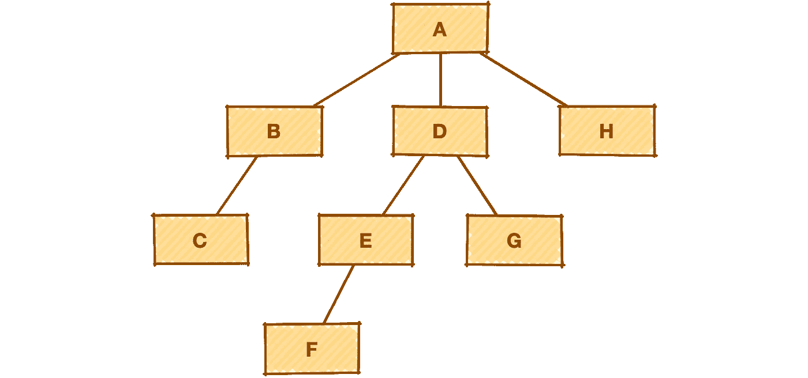
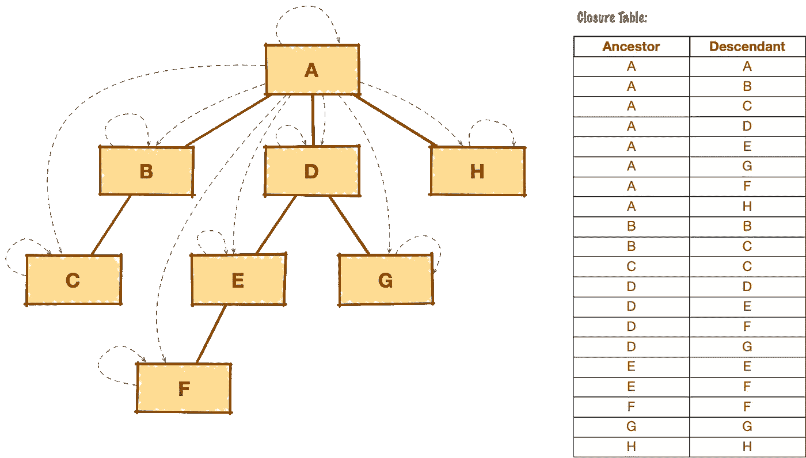
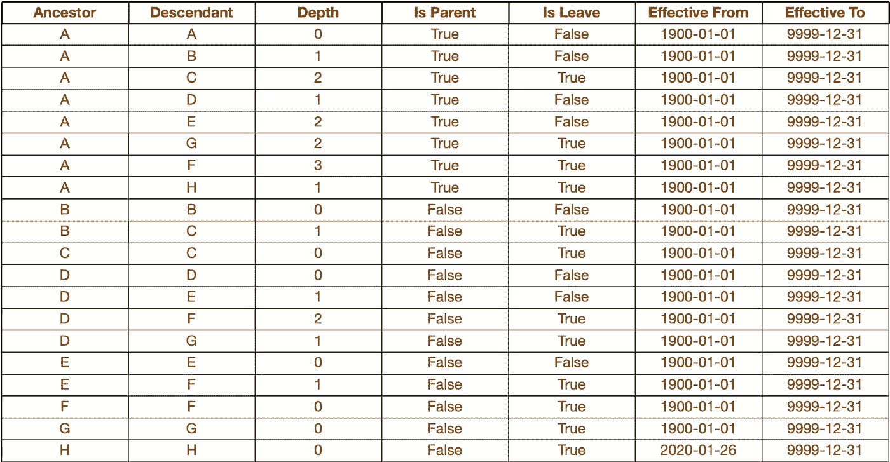
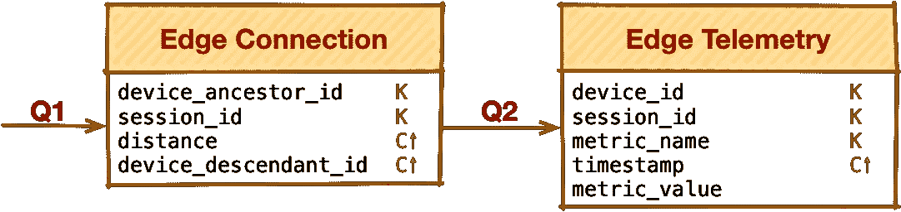

# 用于对 NoSQL 的层次结构建模的闭包表模式

> 原文：<https://towardsdatascience.com/closure-table-pattern-to-model-hierarchies-in-nosql-c1be6a87e05b?source=collection_archive---------33----------------------->

## [理解大数据](https://towardsdatascience.com/tagged/making-sense-of-big-data)，大数据建模模式

## 如何利用关系世界的最佳实践在 NoSQL 建立层级模型

# 介绍

有时我们会遇到这样的情况，当我们需要对不同复杂程度的层次结构进行建模时，却不确定如何以最有效、最可靠和最灵活的方式正确地完成这一任务。让我们回顾一下为我们提供一些答案的数据建模模式。

# 问题陈述

假设我们有一个深度参差不齐的层次结构，如下图所示:



作者图片

从功能的角度来看，我们需要涵盖以下主要情况:

**查询**层级:

*   **查询一个子树**，最好达到一定的深度级别，像直接下级以及达到一定级别的后代
*   **查询该节点的所有祖先**

**修改**层次结构:

*   **添加/删除层次结构中的节点**
*   **更改层次结构的布局**—将子树从一个位置移动到另一个位置(从一个父节点移动到另一个父节点)

**物联网商业案例驱动的高级**需求:

*   **高效管理****森林**—大量的树，每棵树的节点数和最大深度不一定很大，但树的数量可以增长到几十万甚至上百万
*   **管理进入**短期关系**的树的**节点。因此，有必要跟踪实际关系发生的时间段。

# 要使用的核心模式

我们也可以利用关系世界中的一些模式来研究 NoSQL。让我们考虑一下闭包表，它通常被低估，但却有很多优点，特别是:

*   高效的**子树查询**
*   管理**短期关系的可能性**
*   存储改变关系的**历史**

## 闭包表模式

根据闭包表模式，除了具有适当属性列表的主实体之外，我们还有一个附加实体，用于存储各个项目之间的层次关系。

例如，如果我们有一个雇员的从属层次结构，我们将有一个包含雇员信息的实体和一个专门存储从属关系的闭包表:


作者图片

该模式的主要构建块是一个额外的结构(表),用于保存树关系——从祖先到后代的每条路径的一组节点对，包括到自身的路径:



作者图片

基本结构可以扩展到有效地覆盖与子树选择的有限深度相关的更复杂的场景；找到所有的树叶；树根和有效时间范围:



作者图片

关于如何使用这种结构的更多细节包含在两篇好文章中。一个很好的例子就是这里的。

# NoSQL 的闭包表实现

NoSQL 很大，让我们考虑两个 NoSQL 存储——Cassandra 和 MongoDB 作为 NoSQL 世界的两个很好的代表，它们是列族和面向文档的存储。

因为我们考虑 NoSQL，我们需要遵循它的建模哲学:有一个清晰和狭窄的用例，以更准确地使用模型。

## 物联网用例描述

*输入:*

1.  有大量的边缘设备，产生遥测数据。
2.  边缘设备在工作会话范围内工作；
3.  在每次会议期间，他们形成一个关系层次

*查询需求:*

对于特定时间范围(特定会话 id)和特定边缘设备:

**Q1** :读取设备子树(其下属设备列表以及它们之间的关系)

**Q2** :读取设备的遥测数据以及所有下属设备的遥测数据

## 卡桑德拉溶液

为了实施上述物联网用例，提出了以下 Cassandra 数据模型(Chebotko 图):



作者图片

这里，边缘连接表起到了封闭表的作用，并存储了层次关系，而边缘遥测保存遥测数据本身。

边连接表可以用来有效地回答 Q1 查询。回答了 Q1 问题之后，我们就可以有效地回答 Q2 问题了。以便这两个查询都被这两个实体有效地覆盖。

看看[链接](https://github.com/andrijz/blog/blob/master/closure_table/cassandra_cqlsh.cql)后面的示例代码片段。

## MongoDB 解决方案

使用同样的方法，我们可以在 Mongo 上创建一个平面集合。在这里，我们可以利用设备祖先 id、会话 id 和距离字段的复合索引，如下所示:

## 祖先查询注意事项

所描述的解决方案很好地涵盖了上述确切的物联网用例，但是如果我们想要查询特定节点的祖先列表而不是子树，我们将需要通过新对象来扩展模型:

*   对于 Cassandra，我们需要引入并正确维护另一个边连接(反转)表，该表具有相同的属性列表，但键的配置不同(交换了`device_ancestor_id`和`device_descendant_id`)
*   对于 MongoDB，我们需要另一个索引:

```
db.edge_connection.createIndex({device_descendant_id:1, session_id:1, distance:1})
```

## 修改层次结构

上面描述的方法展示了在 Cassandra 和 Mongo 上实现的数据模型如何满足查询树的主要需求。但是层次结构的修改呢？

嗯，首先，现有的层次结构修改是完全可能的，它只是需要一些逻辑来实现(超出了本文的范围，但你可以谷歌一下)。

另一方面，在我们的物联网用例中，我们假设不需要修改:一旦树在会话范围内形成，它的结构将在会话结束前保持不变。并且节点的新组合在新会话的范围内形成树。

# 结论

在文章中，描述了闭包表模式如何在 Cassandra 和 MongoDB 等 NoSQL 存储上有效地实现。

还有其他模式可以用来建模层次结构，它们将在下一篇博客文章中描述。敬请期待:)