# 浓缩咖啡用滤布

> 原文：<https://towardsdatascience.com/cloth-filters-for-espresso-d5038f53605f?source=collection_archive---------30----------------------->

## 咖啡数据科学

## 超越纸过滤器；高级论文理论第四部分

在过去两年多的时间里，纸质过滤器一直是整个浓缩咖啡社区的一个有趣的实验。我记录了一些实验来帮助理解它们是如何运作的。这项特殊的工作开始比较漂白和未漂白的纸过滤器，但它把一个急转弯变成了布过滤器。

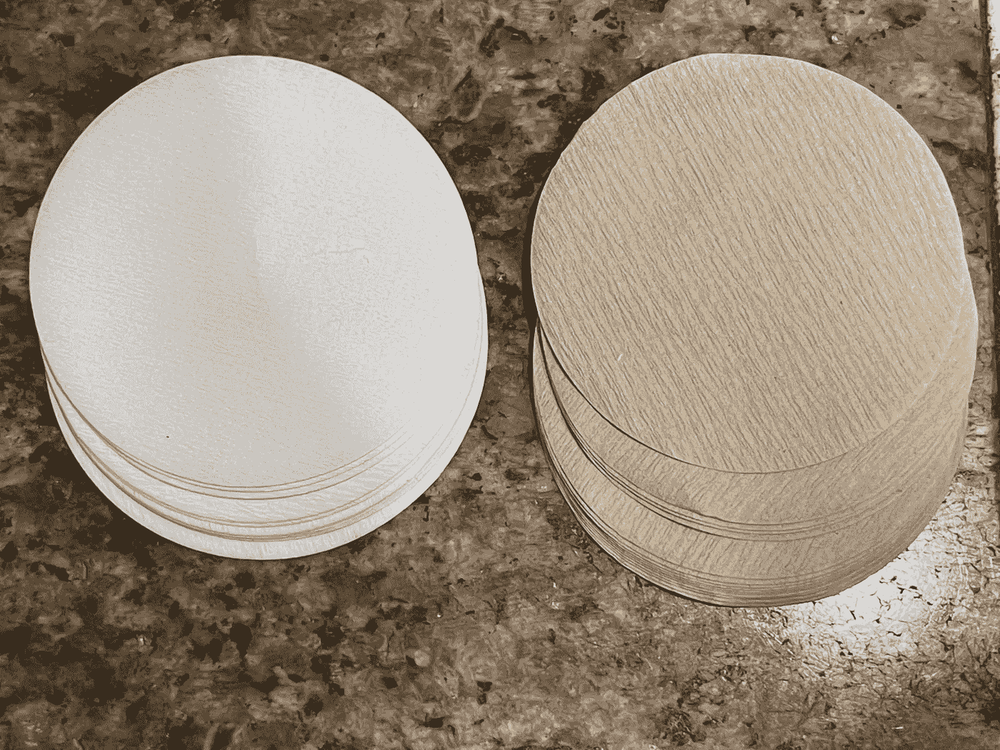

所有图片由作者提供

在试验纸质过滤器时，我最终试验了布料过滤器。我在一个视频中受到了詹姆斯·霍夫曼的影响，这个视频讲述了如何使用布料过滤器进行倾倒。今年夏天我的前几个实验没有引起我的注意，部分原因是因为其他一些变量无处不在。

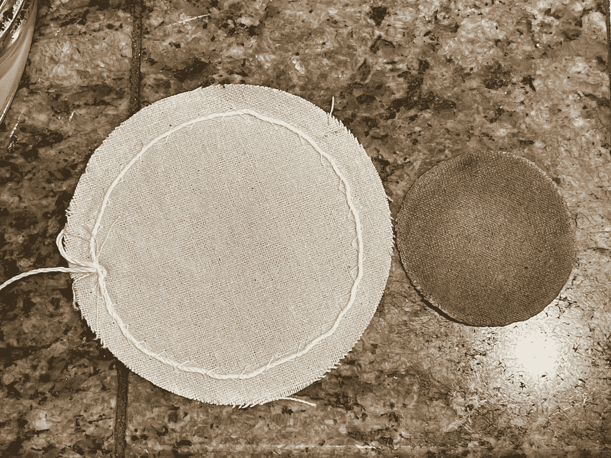

左边:一个未切割的新布过滤器。右边:被切到一边用了十次之后。

然而这一次，一切都在掌控之中，我被吹走了。这一枪打得又快又准。最好的部分是布过滤器也更容易清洗！

我所有的镜头都是[劈烤](/pressure-pulsing-for-better-espresso-62f09362211d)、[断奏捣实](/staccato-tamping-improving-espresso-without-a-sifter-b22de5db28f6)镜头，中间是布滤片，底部是布或纸滤片。我也使用[压力脉冲](/pressure-pulsing-for-better-espresso-62f09362211d)来拍摄我所有的照片。

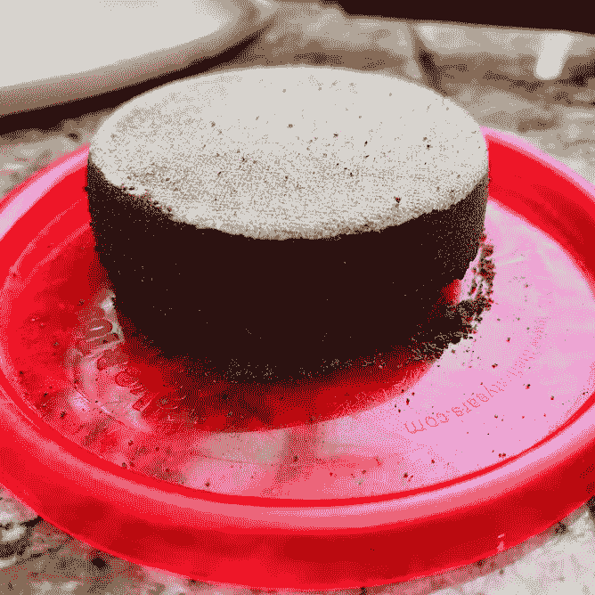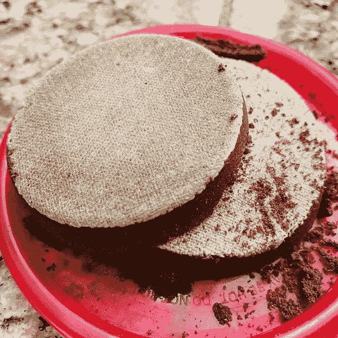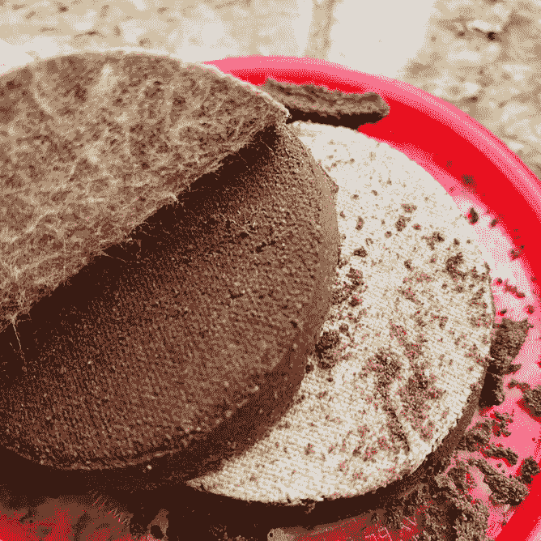

# 镜头性能指标

我将这些定义放在这里，因为在这一节之后，我将使用这些指标评估不同数量的纸质过滤器。

我使用了两个指标来评估镜头之间的差异:[最终得分](https://link.medium.com/uzbzVt7Db7)和[咖啡萃取](https://link.medium.com/EhlakB9Db7)。

最终得分是 7 个指标(强烈、浓郁、糖浆、甜味、酸味、苦味和余味)记分卡的平均值。当然，这些分数是主观的，但它们符合我的口味，帮助我提高了我的拍摄水平。分数有一些变化。我的目标是保持每个指标的一致性，但有时粒度很难，会影响最终得分。

使用折射仪测量总溶解固体(TDS ),该数字用于确定提取到杯中的咖啡的百分比，并结合一杯咖啡的输出重量和咖啡的输入重量，称为提取率(EY)。

# 漂白与未漂白纸过滤器

我从一个比较漂白和未漂白过滤器的实验开始。我瞄准了十对镜头，我看了一些度量标准。我看不出味道或提取率有什么不同。

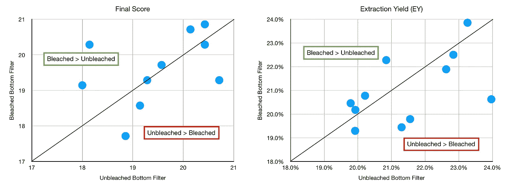

我甚至观察了不同的烘焙方法，仍然没有明显的模式。

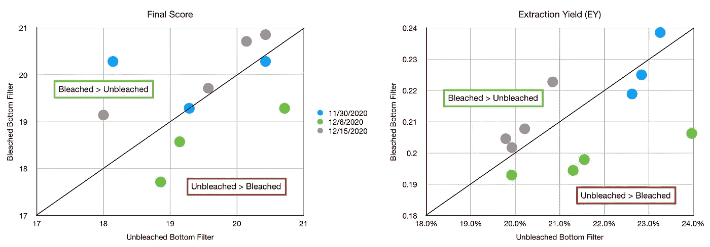

然而，当看拍摄时间时，有一个模式。T10 表示在量杯中达到 10 毫升所需的时间(通常一杯是 20 至 30 毫升的液体)。它受到我如何记录镜头的影响，但这不会从一个镜头到下一个镜头有太大的变化。漂白的 T10 时间比未漂白的长，总时间也比未漂白的长。因此，我更喜欢未漂白的。

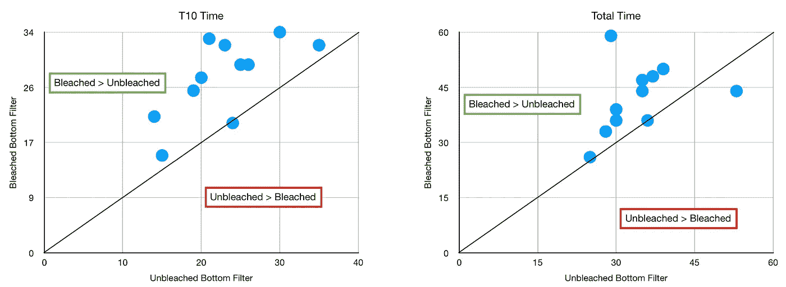

我计算了所有的差异，我打算看看这些过滤器如何清洗，但我得到了布料过滤器的侧道。在 10 对样本中，我没有通过 t 检验计算 p 值。

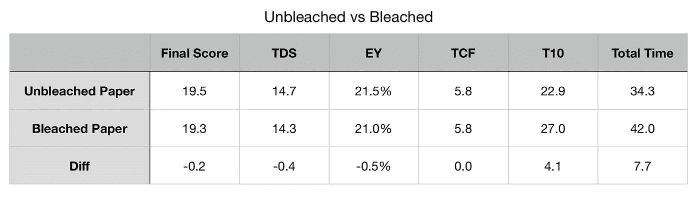

拍摄后:

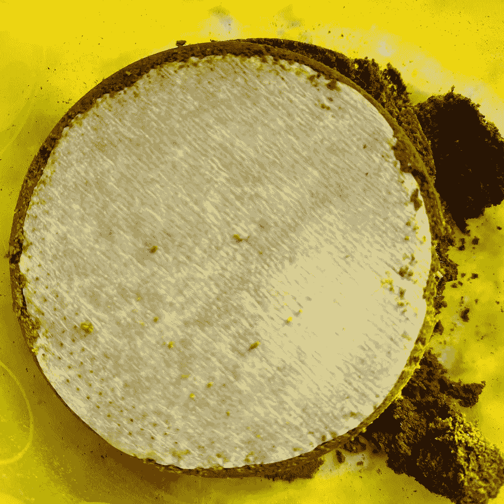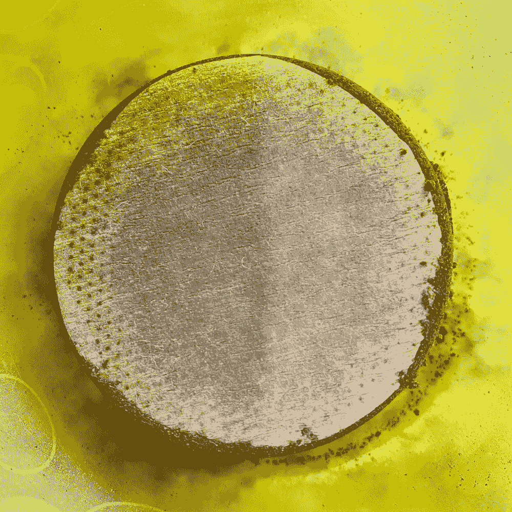

# 布与纸过滤器

关于布料过滤器，首先要知道的是它们会缩水。与[极地特快](https://www.youtube.com/watch?v=cxCkIlBvF-s)中流浪汉使用的袜子过滤器不同，这种过滤器需要切割成篮子大小。我在使用之前洗了几次，最近，我把它放在一个空的咖啡篮里，在我用另一个篮子拍照之前，我把它洗了一遍。然后我让它变干，在切之前我会这样做几次。

这是底部有布过滤器和底部有纸过滤器的一个镜头的流程图。

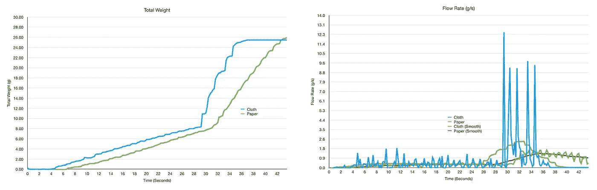

典型的重量和流量剖面。布料的脉动要少得多，因为它流动得很快

我对比了几次布和纸，有一个清晰的图案。布过滤器产生了更好的味道和更高的提取率。

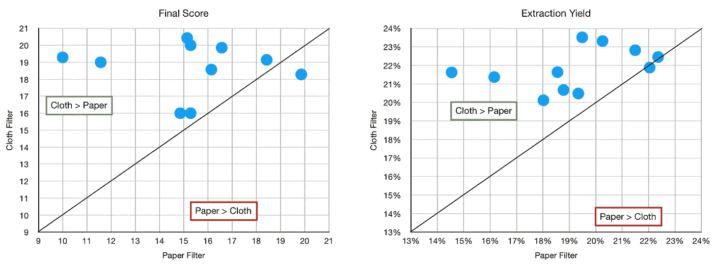

跨越不同的烘烤巩固了这一立场。

看看 T10 和总时间，布过滤器比纸过滤器跑得快。我很好奇这在多大程度上模拟了 2020 年初[的工作](https://www.sciencedirect.com/science/article/pii/S2590238519304102?via%3Dihub)，他们发现更粗的研磨但更快的拍摄产生了比他们想象的更高的提取率。

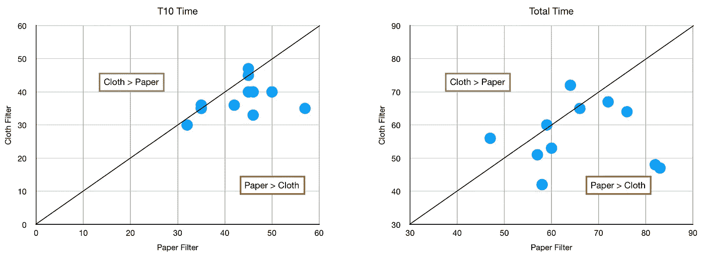

这里是更高的统计水平。我还包括 TCF 或时间覆盖过滤器。我发现这是一个度量标准，可以很好地指示预输注应该持续多长时间。在这些结果中，我试图将预输注保持为配对之间的常数。

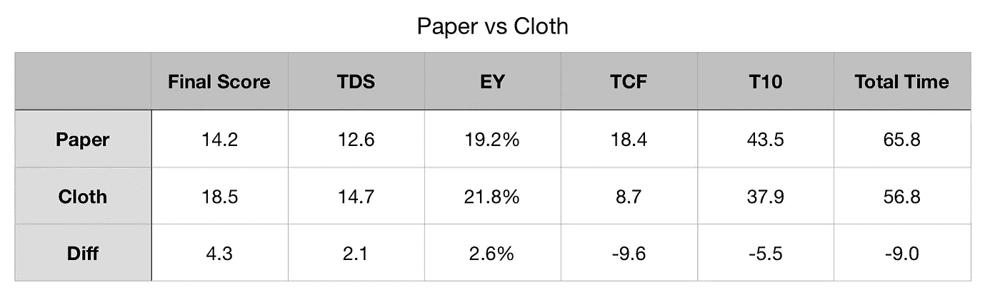

# 选择哪种布料

我用两块布做了实验: [Hario](http://Hario Siphon Cloth Coffee Filter... https://www.amazon.com/dp/B000IGOTW6) 和 [Masukaze](http://Diguo Coffee Syphon Cloth... https://www.amazon.com/dp/B00M5SRPCG?ref=ppx_pop_mob_ap_share) (在帝国咖啡过滤器下)。后者稍微便宜一些。Hario 的味道得分稍微好一点，但提取率似乎很低。

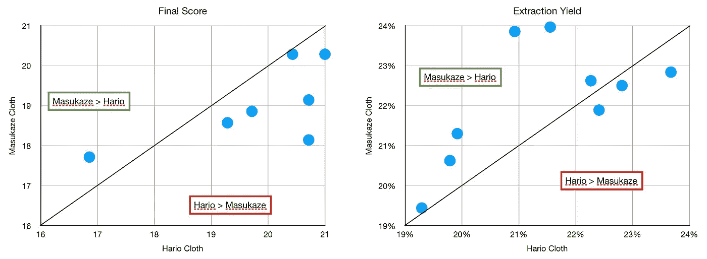

就时间而言，Masukaze 过滤器比 Hario 过滤器运行得快得多。

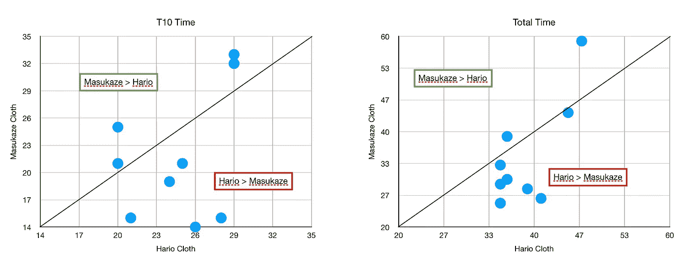

再次，这里是更高的统计水平。

意式浓缩咖啡的粗糙层理论是，它让水流在整个过程中重新平衡。由于布过滤器的厚度，我认为它也在做类似的事情。我认为这也给了液体更多的空间，这样过滤孔的限制就不会引起沟流。

奇怪的是，一个布过滤器可以让子弹跑得更快，我想知道这是否是更高提取率的贡献者。

在重复使用方面，我非常喜欢重复使用，所以我也用布过滤器取代了我使用的中间过滤器。

我不知道布过滤器或纸是否可以在家庭咖啡师之外经常使用，但它们的功能可以用来改善过滤篮。没有理由过滤篮不能有允许它更类似于纸过滤器或布过滤器的结构。我原以为[IMS superior](/ims-superfine-vs-vst-a-small-sample-espresso-filter-comparison-4c9233e194)会是这种情况，但是我没有注意到这样的改进。

如果你愿意，请在 [Twitter](https://mobile.twitter.com/espressofun?source=post_page---------------------------) 和 [YouTube](https://m.youtube.com/channel/UClgcmAtBMTmVVGANjtntXTw?source=post_page---------------------------) 上关注我，我会在那里发布不同机器上的浓缩咖啡照片和浓缩咖啡相关的视频。你也可以在 [LinkedIn](https://www.linkedin.com/in/robert-mckeon-aloe-01581595?source=post_page---------------------------) 上找到我。也可以在[中](https://towardsdatascience.com/@rmckeon/follow)关注我。

# [我的进一步阅读](https://rmckeon.medium.com/story-collection-splash-page-e15025710347):

[浓缩咖啡系列文章](https://rmckeon.medium.com/a-collection-of-espresso-articles-de8a3abf9917?postPublishedType=repub)

[工作和学校故事集](https://rmckeon.medium.com/a-collection-of-work-and-school-stories-6b7ca5a58318?source=your_stories_page-------------------------------------)

[个人故事和关注点](https://rmckeon.medium.com/personal-stories-and-concerns-51bd8b3e63e6?source=your_stories_page-------------------------------------)

[乐高故事首页](https://rmckeon.medium.com/lego-story-splash-page-b91ba4f56bc7?source=your_stories_page-------------------------------------)

[摄影启动页面](https://rmckeon.medium.com/photography-splash-page-fe93297abc06?source=your_stories_page-------------------------------------)

[用纸质过滤器改进浓缩咖啡](/the-impact-of-paper-filters-on-espresso-cfaf6e047456?source=your_stories_page-------------------------------------)

[纸质过滤器如何提高浓缩咖啡的流量](/how-do-paper-filters-improve-espresso-flow-rate-cd91dd3bd433?source=your_stories_page-------------------------------------)

[意式浓缩咖啡的金发滤纸](/goldilocks-paper-filter-for-espresso-d4ea675ecd83?source=your_stories_page-------------------------------------)

[为浓缩咖啡重复使用纸质过滤器](/reusing-paper-filters-for-espresso-ef1899ae2b35?source=your_stories_page-------------------------------------)

[有效切圆，为意式浓缩咖啡添加滤纸](https://medium.com/@rmckeon/effective-circle-cutting-to-add-paper-filters-to-espresso-d649d2ccf39c?source=your_stories_page-------------------------------------)