# 基于 DeepFashion 数据集和 Fastai 的服装分类

> 原文：<https://towardsdatascience.com/clothes-classification-with-the-deepfashion-dataset-and-fast-ai-1e174cbf0cdc?source=collection_archive---------6----------------------->

## 时尚 AI

## 一个关于我如何开始清理我的衣柜并最终训练一个神经网络的故事

图片由[罗曼·桑波斯基](https://www.shutterstock.com/de/g/Roman+Samborskyi)根据 Shutterstock.com[的许可使用](https://www.shutterstock.com/)

1 月 1 日是整理冬装的好时机。一个月前，当我走近我的衣柜时，我就是这么想的。叠毛衣、袜子和围巾的单调过程本质上是相当沉思的，并导致许多发现。我有三件同样款式的粉色衬衫。这一发现帮助我认识到，我不可避免地需要通过增加多样性和减少我拥有的物品的冗余来优化我的时装库存。自然，目标应该是将我的衣柜内容建模为一个图，该图将包含衣服项目、它们的类型(毛衣、裤子等)。)、属性(面料、款式、颜色等。)，以及关系(两个项目是否可以组合在一个 look 中)。在这篇文章中，我写的是我创建数据集的方法，特别是如何识别随机物品的服装类型。

## 本文包含以下部分:

1.  数据
2.  模特培训
3.  模型评估
4.  如何将预训练的模型从 Fastai 加载到 PyTorch
5.  摘要

即使我多年来一直在使用 Keras 进行深度学习，但这次我决定尝试一下 PyTorch 和 Fastai。文章中使用的完整代码可以在[这里](https://github.com/tsennikova/fashion-ai/blob/main/clothes-type-recogition.ipynb)找到。

# 数据

为了对我衣柜里的物品进行分类，我需要一个经过训练的模型来完成这项任务，为了训练这样一个模型，我需要数据。在这个项目中，我使用了由香港中文大学多媒体实验室收集的 [DeepFasion 数据集](http://mmlab.ie.cuhk.edu.hk/projects/DeepFashion.html)，这是一个用于服装类别和属性预测的大规模服装数据库。

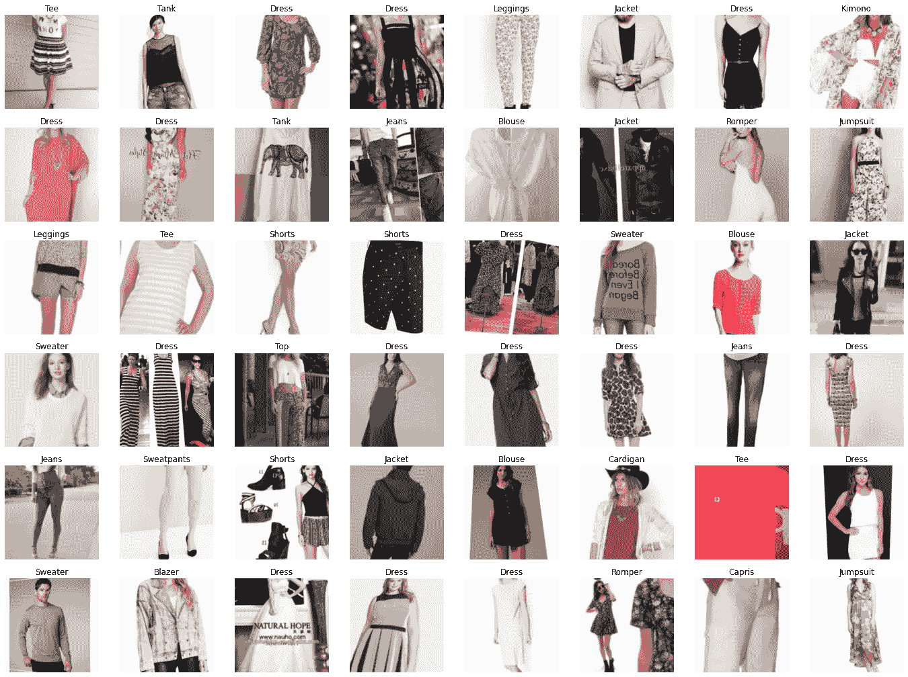

[深度时尚](http://mmlab.ie.cuhk.edu.hk/projects/DeepFashion.html)数据集

分类基准于 2016 年发布。它评估了 FashionNet 模型在预测 46 个类别和 1000 个服装属性方面的性能。原文请参考[深度时尚:用丰富的注释支持健壮的服装识别和检索，CVPR 2016](https://www.cv-foundation.org/openaccess/content_cvpr_2016/papers/Liu_DeepFashion_Powering_Robust_CVPR_2016_paper.pdf) 。

DeepFashion 数据库包含几个数据集。在这个项目中，使用了类别和属性预测基准。该数据集包含来自 46 个不同类别的 289，222 幅不同的服装图像。

训练标签以下列格式存储在 train_labels.csv 中:

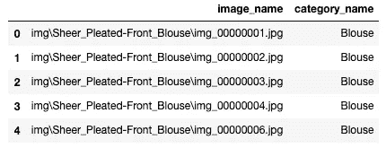

训练数据文件

训练数据文件包含图像和标签的位置。标签存储为字符串对象，每个图像一个标签。

我们可以使用 from_csv 方法将数据从 train_labels.csv 加载到 ImageDataLoaders 类。

我正在使用一种叫做*预调整*的 Fastai 数据增强策略。它首先将图像调整为较小的方形。由于正方形图像可以在 GPU 上处理，这使得接下来的所有放大操作都可以更快地进行。然后我们可以对每一批数据进行扩充。batch_tfms 顺序执行所有增强操作，如旋转和缩放，最后进行一次插值。这种增强策略将允许我们实现更好的增强图像质量，并由于在 GPU 上的处理而获得一些速度。

让我们看看数据集中的一些图像。

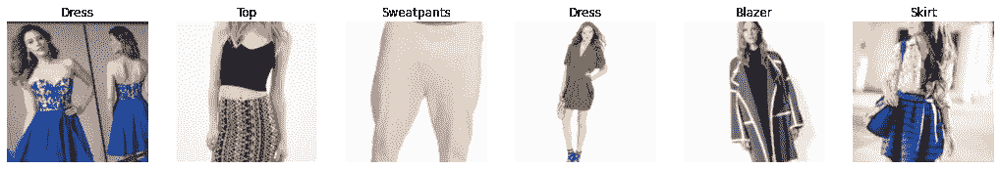

带标签的训练图像

我们还可以通过向上面的 show_batch 方法传递 unique=True 来检查增强图像的外观。

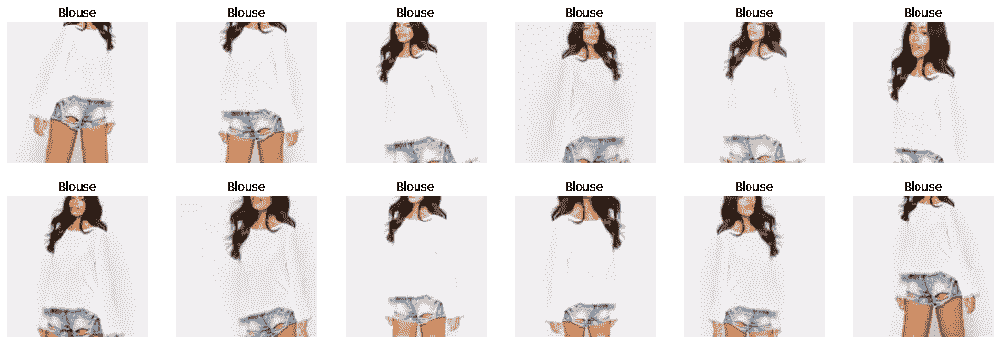

增强图像

正如我们所见，图像在增强后保持了质量。

# 模特培训

在这个项目中，我使用的是预先训练好的 [ResNet34](https://en.wikipedia.org/wiki/Residual_neural_network) 模型。我尝试了更深层次的架构，但是它们并没有带来显著的改进。DeepFashion 数据集的主要挑战是标签的质量。例如，上图显示了两件商品:衬衫和短裤，但它只有一个“衬衫”标签。这样，模型将不可避免地受到噪声的影响。

为了使迁移学习起作用，我们需要用一个新的线性层替换网络的最后一层，该层包含与我们的数据集中的类的数量相同的激活数量。在我们的例子中，我们有 46 个服装类别，这意味着在我们的新层中有 46 个激活。新添加的层随机初始化权重。因此，我们的模型在被训练之前将具有随机输出，这并不意味着该模型完全是随机的。所有未改变的其他层将保持与原始模型相同的权重，并且将擅长识别一般的视觉概念，例如基本几何形状、梯度等。因此，当我们训练我们的模型能够识别衣服类型时，我们冻结了除最后一层之外的整个网络。这将允许我们优化最后一层的权重，而不改变更深层的权重。

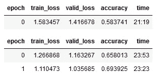

当我们调用 learn.fine_tune()时，我们冻结整个网络，并为一个时期训练新创建的层的随机初始化的权重。然后我们解冻网络，按照我们指定的次数(在我们的例子中是两次)一起训练所有的层。这就是为什么我们在输出中看到了一个额外的纪元。

## 早期评估

早期评估允许我们检查早期阶段的学习进度，并在我们花费大量时间训练模型之前发现我们方法中的错误。有多种方法可以查看训练神经网络所产生的结果。为了快速获得印象，我们可以看看最常混淆的类:

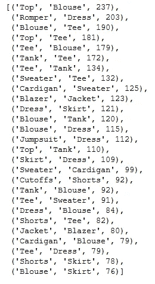

正如我们所看到的，网络经常混淆“上衣”和“衬衫”，“连衫裤”和“连衣裙”，“t 恤”和“衬衫”。即使是人类也会犯这样的错误。这样我们就可以早期评估我们的网络是否学习到了正确的模式。

观察误差的另一种方法是画出最高亏损。

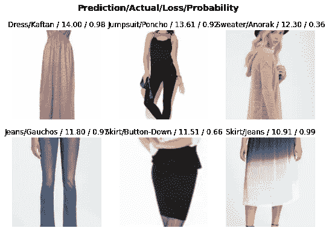

顶级损失。早期评估

如上所述，原始标签是有噪声的。我们的模型正确地分类了一件连体衣、两条裙子和一件连衣裙，而在原始数据集中，这些项目有错误的标签。

## 学习率探测器

现在，让我们浏览数据加载器中的数据，并逐渐增加每个小批量的学习率，以观察损失值如何随着学习率的变化而变化。我们的目标是找到最有效的学习速率，使网络更快地收敛。学习率在损失曲线的最陡斜率点处具有最佳值，因为这意味着损失下降得更快。极值点(最小值和最大值)和曲线的平坦部分对应于不允许网络学习的学习速率，因为这些点处的损失没有改善。

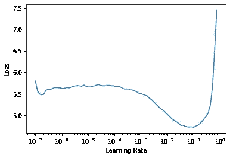

损失曲线

在我们的例子中，损失曲线的最陡点是学习率等于 0.005。这个学习率我们将用于进一步的培训。

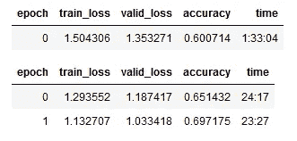

在对模型进行 3 个时期的训练后，我们获得了 0.697 的准确度，这比默认学习率下的 0.694 有所提高。

## 区别学习率

在训练了网络的所有层之后，我们需要再次检查学习率，因为在几批训练之后，网络学习的速度变慢，并且我们冒着以高学习率超过损失函数的最小值的风险。因此，学习率需要降低。

当我们在三个时期的训练后绘制损失曲线时，我们可以看到它看起来不同，因为网络的权重不再是随机的。

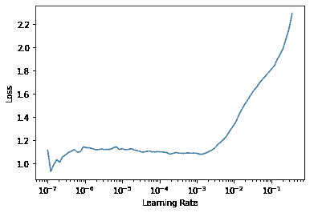

三个时期后的损失曲线

我们没有观察到与权重从随机更新到减少损失的点相关联的这种急剧下降。曲线的形状看起来更平坦。在未来的训练中，我们将采用一系列的重量，从减少的点一直到损失再次开始增加的点。

如前所述，从预训练模型转移的层已经擅长识别基本的视觉概念，并且不需要太多训练。然而，负责识别特定于我们项目的复杂形状的更深层次将受益于更高的学习速率。因此，我们需要对第一层使用较小的学习速率，对最后一层使用较大的学习速率，以允许它们更快地进行微调。

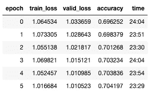

我们可以清楚地看到我们的网络在学习上取得了进步。然而，很难说我们是否需要继续训练，或者停下来不要过度适应模型。绘制培训和验证损失图可以帮助我们评估是否需要继续。

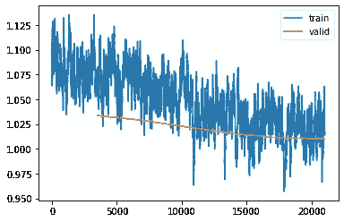

培训与验证损失

我们可以看到，尽管培训损失仍在改善，但验证损失不再改善那么多。如果我们继续训练，我们将增加训练和验证损失之间的差距，这将意味着我们过度拟合我们的模型。因此，我们最好现在停止训练，进入下一步，评估。

# 模型评估

在前面的步骤中，我们能够在验证数据集上实现 70.4%的顶级准确性。如果我们绘制验证准确度，我们可以看到它是如何随着每个时期而提高的。

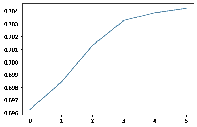

每个历元的最高验证精度

## 对训练数据集的评估

首先，我们将查看训练数据集上的预测，以估计我们是否仍有较高的偏差。

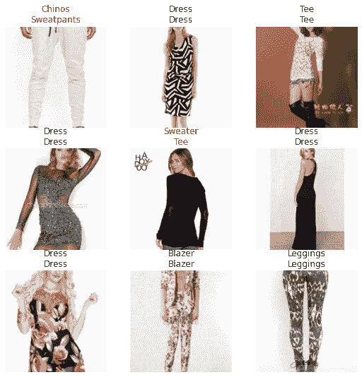

对训练数据的评估

训练数据集上的预测看起来不错。我们的模型捕捉到了主要概念。通过改进标签和清理数据，可以实现进一步的改进。

## 对测试数据集的评估

现在让我们加载测试数据，并检查模型在其上的表现。

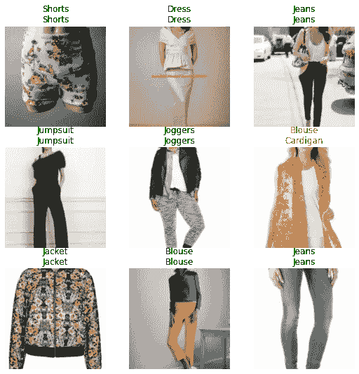

测试数据的评估

模型 Top-1 测试精度为 70.4%。它错误地分类了一些对象，但仍然非常接近我们在验证集上得到的结果。

原始论文 [DeepFashion:通过丰富的注释实现强大的服装识别和检索的作者，2016 年 CVPR](https://www.cv-foundation.org/openaccess/content_cvpr_2016/papers/Liu_DeepFashion_Powering_Robust_CVPR_2016_paper.pdf)使用前 3 名和前 5 名的准确度进行评估。

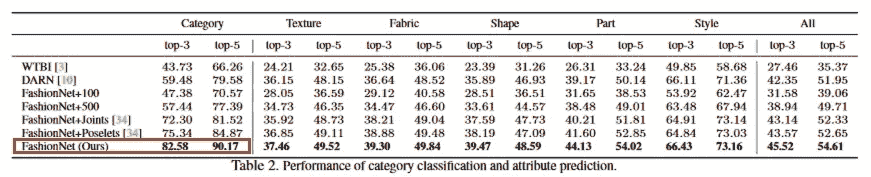

[DeepFashion:通过丰富的注释实现强大的服装识别和检索，CVPR 2016](https://www.cv-foundation.org/openaccess/content_cvpr_2016/papers/Liu_DeepFashion_Powering_Robust_CVPR_2016_paper.pdf)

为了使我们的结果具有可比性，我将使用相同的指标。

我们模型的**前三名**准确率为 **88.6%，**比基准准确率高 6%，我们模型的**前五名**准确率为 **94.1%，**比基准准确率高 4%。这不应该令人惊讶，因为原始论文的作者使用了 [VGG16](https://arxiv.org/pdf/1409.1556.pdf) 架构作为主干，这是一个功能较弱的模型。

## 对用户指定数据集的评估

最后，我们将检查模型如何处理我的图像。我用智能手机相机拍了 98 张自己衣服的照片。让我们加载图像，并检查模型是否可以正确地对它们进行分类。

该模型在用户指定数据上的 **Top-1** 准确率为 **62.4%** ，低于在 DeepFashion 数据集上的准确率。然而，对于 46 类分类模型来说，它仍然是好的。

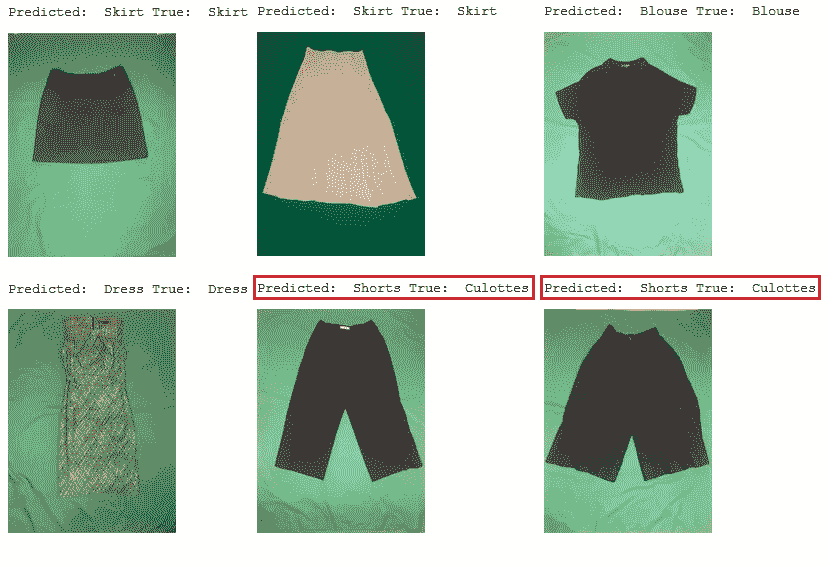

用户数据集中的图像与最初训练模型时使用的图像完全不同。例如，用户图像只显示一件衣服，而 DeepFashion 数据集中的图像显示一个人穿着一件衣服，这使得缩放衣服更容易。用户数据集中几乎所有的裤子都被归类为短裤，因为模型很难估计其相对于人体的长度。尽管如此，该模型学会了主要概念，并可用于各种时尚背景。

# 如何将预训练的模型从 Fastai 加载到 PyTorch

训练完模型后，我们可能想要在没有 Fastai 安装的推理机器上运行它。为此，我们首先需要保存模型及其词汇表:

torch.save 保存预训练模型的权重。它使用 Python 的 [pickle](https://docs.python.org/3/library/pickle.html) 实用程序进行序列化。要在 PyTorch 中运行模型，我们需要加载权重并重新定义模型:

将快速人工智能模型加载到 PyTorch

请注意，这一次我们需要在运行预测之前调整图像的大小并使其正常化。Fastai 库存储关于要在学习者中应用的变换的信息，但是当我们在 Fastai 之外运行模型时，我们需要首先变换图像。

之后，我们可以使用我们定义的类来运行预测:

# 摘要

在本教程中，我展示了如何使用 Fastai 库和 DeepFashion 数据集训练一个用于服装类型识别的 ResNet34 模型。我们已经看到，我们可以训练一个模型，对于前 3 名的准确性，它将超过当前基线 6%,对于前 5 名的准确性，它将超过当前基线 4%。我们对我自己的图像进行了评估，发现除了对比例敏感的项目(短裤或裤子问题)之外，该模型对项目进行了正确分类。模型性能可以受益于提高训练标签的质量和增加图像的多样性。

这只是我心目中时尚项目的开始。关于属性、图案和织物识别的文章将在后面。敬请期待！

*感谢您阅读这篇文章！如有任何问题，请在下方留言或通过* [*LinkedIn*](https://www.linkedin.com/in/tatiana-sennikova-7b864140/) *联系我。*

# 如果你喜欢这篇文章，这里有一些你可能喜欢的其他文章:

 [## 如何用深度学习把鸽子从阳台上赶走

### 基于 Keras 的迁移学习和树莓 Pi 的生产部署

towardsdatascience.com](/how-to-use-deep-learning-to-shoo-pigeons-from-the-balcony-31a2704f2160)  [## 探索性数据分析的代码和技术

### 如何分析数据，测试假设，并为您的客户创造洞察力

towardsdatascience.com](/code-and-techniques-for-exploratory-data-analysis-a44c50953502)