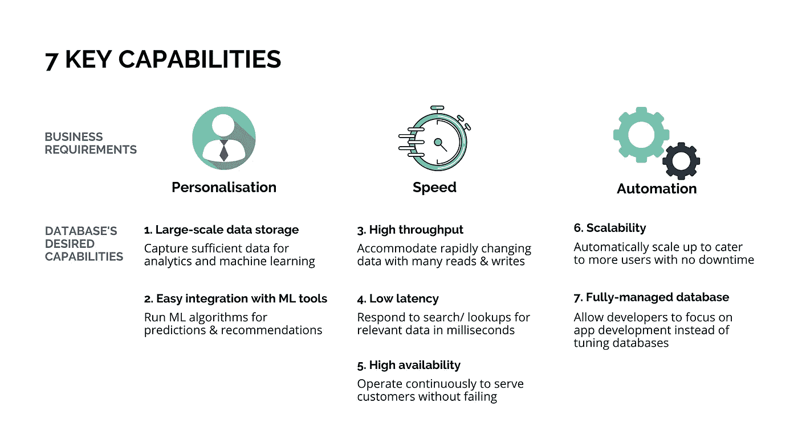
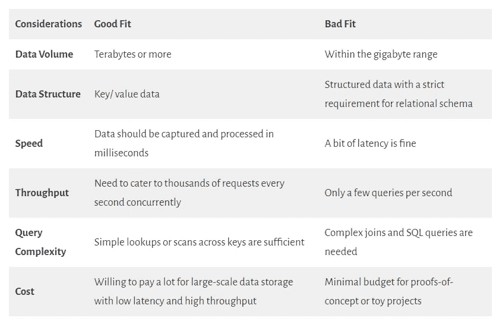
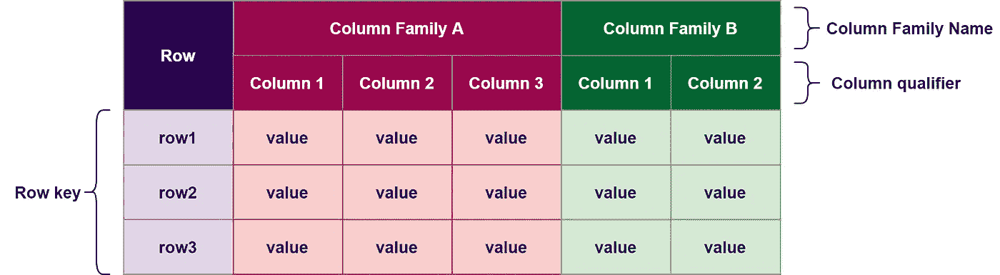
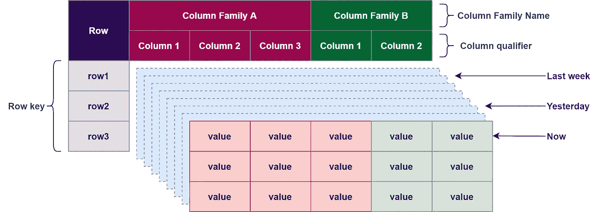
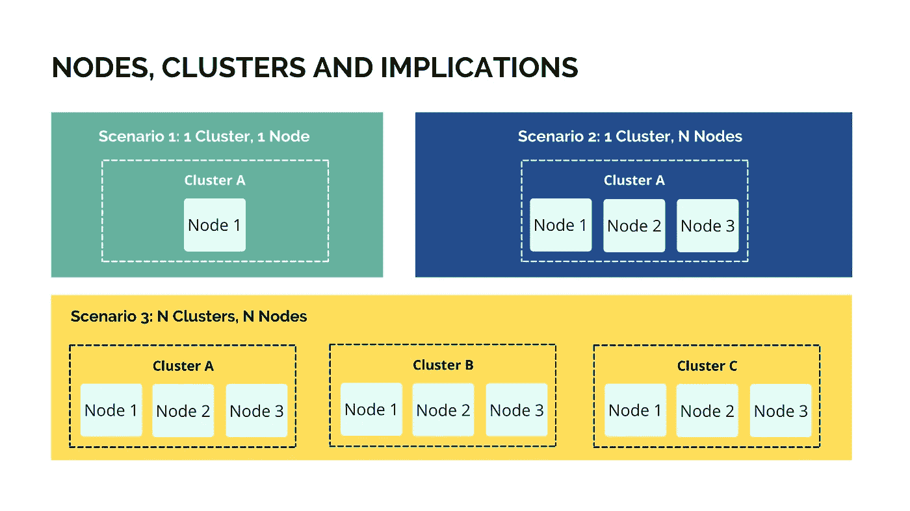

# Cloud Bigtable:它是什么，为什么有一天我们会需要它？

> 原文：<https://towardsdatascience.com/cloud-bigtable-what-is-it-and-why-might-we-need-it-one-day-b9ec2a032854?source=collection_archive---------43----------------------->

## 全能的 NoSQL 数据库为移动网站提供实时分析，以改善客户体验

汤姆·霍尔姆斯在 [Unsplash](/s/photos/mobile?utm_source=unsplash&utm_medium=referral&utm_content=creditCopyText) 上拍摄的照片

最初是谷歌的网络搜索索引存储系统。于 2015 年通过谷歌云平台作为公共服务提供，目前为 Spotify、谷歌地图和谷歌搜索等一些最著名的网络和移动应用程序提供支持。这就是云 Bigtable，它既不适合复杂的连接、即席交互查询，也不适合支持在线事务处理(OLTP)系统。

那么它是什么，为什么有一天我们可能需要像 Cloud Bigtable 这样的大规模数据库呢？

**你会学到:**

1.  现实世界的挑战:网站速度和个性化客户参与
2.  云 Bigtable 入门:定义、适合与不适合
3.  云大表的关键概念

# 现实世界的挑战:网站速度和个性化的客户体验

在进入技术层面之前，我认为从业务背景入手，揭示客户的期望如何推动处理大量实时分析工作负载的需求是有益的。所以我们开始吧！

## 顾客对即时满足和个性的期望

很难不注意到我们的客户总是忙忙碌碌，没有什么耐心，不会满足于不那么令人惊叹的客户体验。以下是客户在访问任何移动网站或应用程序时所期望的两件事。

1.  我现在就要
2.  我希望它能根据我的品味和喜好个性化

根据德勤在 2020 年的一项研究，网站速度仅仅提高 0.1 秒，就可以产生 7%的潜在客户，增加近 10%的支出。

另一份 [2019 市场研究](https://www.thinkwithgoogle.com/marketing-strategies/app-and-mobile/smartphone-mobile-app-and-site-purchase-data/)报告称，63%的智能手机用户更有可能从那些移动网站或应用程序为他们提供相关推荐的公司购买他们可能感兴趣的产品。

简而言之，**您的移动应用程序加载的速度和显示内容的个性化程度极大地影响了您的客户的参与度，以及他们是否决定在您的网站上购买。**

## 处理大量实时分析工作负载的数据库功能

但是个性化对移动网站和应用程序意味着什么呢？

Spotify 音乐应用程序就是一个很好的例子。只要你打开 Spotify，主页就会显示个性化内容，如最近播放的歌曲和与你的用户档案相关的热门节目，并推荐每日混音和发现每周音乐，以帮助你根据以前听过的歌曲发现新音乐。

另一个常见的用例是电子商务网站。您可以轻松找到个性化的产品推荐，如“您可能喜欢的其他人”、“经常一起购买”和“为您推荐”。

这是棘手的部分:所有这些必须在几毫秒内自动发生。因为生命太短暂，不能让我们宝贵的客户等待，在这个即时满足的时代，哪怕一秒钟都感觉像是永远，我说的对吗？

但是，构建如此强大的移动网站或应用程序来自动处理大量实时分析工作负载，以实现个性化推荐，从来都不是一件容易的事情。

信不信由你，这一切都始于一个数据库，或者我敢说，一个非常特殊类型的数据库，看起来一点也不像我们太熟悉的关系数据库。以下是理想数据库必须提供的关键功能。

作者图片

当谈到提供所有 7 个关键功能的现有数据库时，两个最著名的例子包括 Amazon DynamoDB 和 Google Cloud Bigtable。今天我们来探索一下云 Bigtable，把 Amazon DynamoDB 留到以后再说。

## 十秒钟外卖

***作为强大的 NoSQL 数据库家族中的一员，Cloud Bigtable 提供了强大的功能来支持移动网站或应用的个性化、速度和自动化。***

# 云 Bigtable 入门

> Cloud Bigtable 是一个稀疏填充的表，可以扩展到数十亿行和数千列，使您能够存储数 TB 甚至数 Pb 的数据。
> 
> —来自 [***谷歌云***](https://cloud.google.com/bigtable/docs/overview)

首先，需要注意的是，Cloud Bigtable 不是一个关系数据库。它既不支持 ACID 事务，也不支持 SQL 查询。这使得云 Bigtable 不适合 OLTP 和 OLAP 系统。

此外，Cloud Bigtable 非常强大，有时甚至会大材小用，或者比小规模应用程序或玩具项目所需的成本更高。

如果你想知道你是否需要云 Bigtable，这里有一些我从 John J. Geewax 的书"[Google Cloud Platform in Action](https://learning.oreilly.com/library/view/google-cloud-platform/9781617293528/)"中总结的有用的考虑。

作者图片

## 十秒钟外卖

***云 Bigtable 是一种大规模数据存储解决方案，以查询复杂性和成本为代价，提供了极高的速度和高吞吐量。***

# 云大表的关键概念

作为一个为支持大规模分析工作负载而构建的 NoSQL 数据库，Cloud Bigtable 有许多独特的特征，使其有别于常见的关系数据库。

在所有特征中，这里有两个我们至少应该理解的关键概念。

## 使用 3D 地图结构优化数据处理

作者图片

看看上面的图片，你能看到什么？

该图展示了如何在云 Bigtable 表中以二维(行和列)存储数据。嗯，非常类似于关系数据库，对吗？

不要过早下结论。事情比看起来稍微复杂一些。所以让我解释一下这是怎么回事。

**第一维:行**

每个**行**由单个**行关键字**唯一标识或索引。简单地说，行键类似于关系数据库中的主键。存储在 Cloud Bigtable 中的数据**自动按字母顺序**按行键排序(也称为按字典顺序排序)，这使得**跨表搜索和扫描速度更快。**

**第二维:列**

相关数据然后被分组到**列族**中。例如，用户的基本简档信息(例如姓名、电子邮件地址、移动电话号码)可以被分组到一个家族中，而用户的评论可以被分组到另一个家族中。其目的是**将所有频繁检索的信息收集在同一位置，从而提高查找效率。**

同一系列下的每一列都有一个唯一的**列限定符**。与行键类似，**相同系列中的列也按照它们的列限定符按字母顺序排序，以提高查询速度。**

关于云 Bigtable 列，有两点需要注意。

1.  同一表中的两个柱族不应共享同一个族名。此外，同一系列中的任何两列都不应共享同一个列限定符。因此，**每个列都由列族名和列限定符**的组合唯一标识。
2.  如果某一列在特定行中不包含任何数据，则它不会占用任何空间或存储空间。这就是为什么我们**说云 Bigtable 表是稀疏的**。

现在我们知道行和列是云 Bigtable 中 3D 地图结构的前两个维度。但是第三维度在哪里呢？让我们找出答案。

**第三维度:细胞**

作者图片

这可能需要一点想象力，但上面的图片可能会帮助你。如果我们通过特定的行键进行查找，并放大到特定的列，通常我们会期望找到单个值。

但是在 Cloud Bigtable 中，我们会在不同的时间点发现**值的不同版本。每个有时间戳的版本被称为一个**单元**，这是我们正在寻找的第三维。**

那么，为什么要有这个第三维度，让事情变得复杂呢？

请记住，存储在云 Bigtable 中的数据预计会随着时间的推移而快速变化。例如，客户可能会点击查看某个产品，然后迅速转到下一个产品。用户可能听了一首歌 10 秒钟，没有找到适合她心情的曲子，然后按下 Next。

但是**我们希望很容易地看到连续数据的历史**，比如客户从上周开始浏览了哪些产品，用户昨天听了哪些歌曲，客户的音乐类型是如何演变的。

有了第三个维度，**企业可以有效地回到过去，提取相关的过去互动进行分析，并在几毫秒内显示个性化的内容或建议**。这使得 Cloud Bigtable 成为强大的数据库，为移动网站或应用提供速度和个性化支持。

注意，云 Bigtable 的性能严重依赖于模式设计和行键的选择。如果您想了解更多关于在 Cloud Bigtable 中设计模式和选择合适的行键的最佳实践，请不要忘记查看这个 [Google 文档](https://cloud.google.com/bigtable/docs/schema-design)。

## 利用分布式处理基础设施提高性能

**实例、集群和节点**

诚然，我花了一段时间才理解云大表基础设施是如何工作的。不要惊慌，因为我不会用太多的技术细节来烦你。为了让事情尽可能容易理解，以下是你最起码需要知道的。

云大表基础设施有 3 个关键组件:实例、集群和节点。

*   当我们说部署云 Bigtable 数据库时，它意味着创建一个**实例**。它是一个巨大的容器，容纳着数据库的所有部分。**一个实例可以包含一个或多个集群**。
*   每个**簇**表示存储数据的特定位置。**在每个集群下，可能有一个或多个节点。**
*   每个**节点**负责管理数据在数据库中的写入和查询。

**性能&可用性影响**

作者图片

***场景 1: 1 个集群，1 个节点***

场景 1 展示了最简单、最便宜的云 Bigtable 实例。您可以部署一个包含 1 个集群和 1 个节点的实例。但是等等！因为你能并不意味着你应该。

对于一些实验或(相当昂贵的)宠物项目来说，拥有一个集群和一个节点可能没问题。但是，如果前端应用程序生成和查询的数据太多，单个节点可能很容易过载，速度会大大降低。此外，只有一个集群就像把所有的鸡蛋放在一个篮子里。如果集群由于技术问题变得不可用，相关的应用程序也会失败。

***场景二:1 个集群，N 个节点***

简单地在同一个集群下添加更多的节点将把我们从场景 1 带到场景 2。有了这些额外的节点，您可以处理更多的数据读写请求，从而获得更好的性能。这对于扩大规模以应对不断增长的数据处理需求特别有用。

但是，拥有单个集群意味着所有数据仅在单个区域中可用。如果在该地理位置发生任何事故(例如停电)，您的数据库和应用程序也会宕机。毫无疑问，这是一个需要考虑的关键风险，因为我们都希望我们的移动网站或应用程序能够连续运行而不出现故障，我说的对吗？

***场景三:N 个集群，N 个节点***

场景 3 是云 Bigtable 发挥其全部威力的地方。有了多个集群，对一个集群中的数据所做的任何更改都会在几秒钟或几分钟内复制到位于不同地带或区域的其他集群中。如果一个集群完全失败，其他集群中的数据随时可用。另一个群集可以快速承担工作负载，以便我们可以照常开展业务。这种情况的不利方面是钱！让多个集群并行运行当然需要一些巨额的日常开支。

# 十秒钟外卖

***尽管云 Bigtable 非常强大，但它也有其独特之处，需要我们从不同的角度思考如何设计和管理数据库以提高性能和可用性。***

# 离别的思绪

曾几何时，我们需要处理的数据只有千兆字节多一点，而且可以很好地放入闪存驱动器。仅在几年前，一个需要 1tb 存储的数据仓库就足以让人惊叹。然而，如今企业每天生成数十亿字节的数据非常普遍。毫不奇怪，我们的客户也开始期待企业将如此大量的数据转化为个性化内容，以获得更好的移动网站和应用体验。

顾名思义，云 Bigtable 旨在成为强大的数据库，为移动网站和应用程序提供大量实时分析工作负载。虽然这篇博客文章仅仅触及了云 Bigtable 的皮毛，但我希望我已经让您对这个独一无二的 NoSQL 数据库有了一两个新的认识。

如果你正在读这封信，感谢你抽出时间。请随时在 LinkedIn 和 T2 Twitter 上与我联系，并告诉我下次如何做得更好。保重，保持安全，继续牛逼！

*原载于 2021 年 3 月 22 日 https://thedigitalskye.com*<http://thedigitalskye.com/2021/03/23/cloud-bigtable-what-is-it-and-why-might-we-need-it-one-day/>**。**