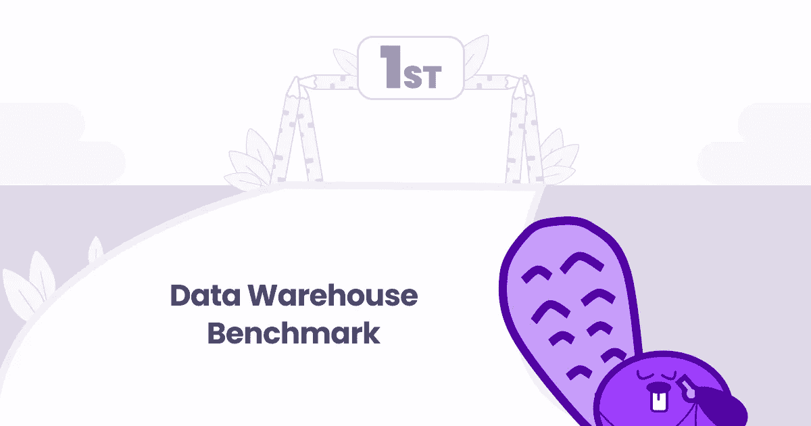
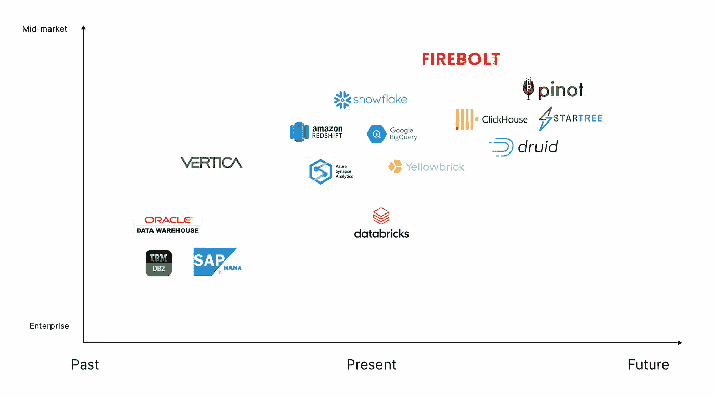

# 云数据仓库:过去、现在和未来

> 原文：<https://towardsdatascience.com/cloud-data-warehousing-the-past-present-and-future-2fad19ee64bf?source=collection_archive---------14----------------------->

## 意见

## 领先数据仓库提供商分析

本帖所有图片均由作者创作

那是 2013 年，我的工作是向印度最大的摩托车制造商销售车队管理解决方案，但只有当他们首先投资一个新的数据库系统，使我们的解决方案可行时，这笔交易才会成功。

我与一家合作伙伴供应商一起，将 SAP Hana 作为一款现代数据库解决方案进行推介，该解决方案非常适合事务性和分析性工作负载。

当时，大规模收集、存储和分析数据需要大量投资，并且只有预算为几十万美元和几个月人力资本的企业才可行。

快进到现在，对于一个认真构建数据文化的组织来说，投资数据仓库是一个赌注。毫不奇怪，这种转变是由市场上发生的创新推动的，这些创新带来了更好、更经济的数据仓库解决方案。

在探索云数据仓库工具市场之前，有必要了解一下为什么公司需要数据仓库以及导致其快速采用的因素。‍

# 数据仓库的需求和优势

由于专门构建的 SaaS 工具的激增，数据和数据源比以往任何时候都多。与此同时，大大小小的组织都认识到，提供由数据驱动的个性化体验是吸引和留住客户的唯一途径。

只有当团队能够分析和激活从每个客户接触点收集的数据时，这才成为可能，虽然有 SaaS 产品套件可以帮助实现这一点，但在仓库中存储一份数据副本可以打开更多的可能性。此外，不存储数据的副本会导致供应商锁定、效率低下，并让需要临时分析或特定数据集在他们所依赖的外部工具中可用的团队感到沮丧。

现在让我强调一下采用数据仓库的明显好处。‍

## 经济实惠且易于实施

基于使用的定价以及存储和计算的分离(详见下文)使得各种规模的企业采用数据仓库变得极其经济实惠，即使数据量有限且数据源很少。事实上，大多数数据仓库供应商为存储和分析提供试用和免费的月度配额。

就实现数据仓库而言，您可以在几个小时内(或者几分钟，如果您以前做过的话)完成一个数据仓库，而不需要编写任何代码。使用 ELT 工具，如 [Fivetran](https://astorik.com/company/fivetran/) 或 [Airbyte](https://astorik.com/company/airbyte) ，您可以从几乎所有可以想象的数据源将数据接收到数据仓库中。不用说，我们必须编写 SQL 来对数据进行查询，或者构建可以在下游应用程序中使用的数据模型。但是作为一个非工程师来说，SQL 并不难，[这里有一些学习 SQL 的好资源](https://chetnetwork.com/microCourse/sql-for-all)。‍

## 高性能和可扩展

云数据仓库的最大优势之一是，与它们的前辈不同，现代仓储工具建立在将计算与存储分离的架构之上。

这意味着存储数据的费用与对数据进行查询的费用是分开的。这不仅带来了成本优势，还使云数据仓库的性能更高，能够并发运行数百个查询。我推荐[这篇快速阅读来了解更多关于云数据仓库中的并发性](https://www.sisense.com/glossary/automatic-concurrency-scaling/)。

此外，随着存储成本日益降低，公司能够在其数据仓库中复制生产数据库，从而使数据仓库成为所有数据的真实来源。‍

# 数据仓库市场概述

让我们看看数据仓库解决方案市场在过去十年中是如何发展的，以及它的发展方向。‍

## 过去

在这篇文章的开头，我提到我试图达成的一笔交易依赖于买家对 [SAP Hana](https://en.wikipedia.org/wiki/SAP_HANA) 的投资，这在当时是一种内部解决方案，前期成本为几十万美元。因此，你可以想象，要让公司放弃这笔钱，需要的不仅仅是几次销售会议。

(如果你好奇的话，我的那笔交易陷入了几个月的循环，直到我停止跟进。)其他领先的仓储解决方案由甲骨文、T2、IBM 和 T4 Vertica 提供。这些部署在本地，并结合了事务(OLTP)和分析(OLAP)处理。IBM 的这篇短文在[中解释了 OLTP 和 OLAP 之间的主要区别。](https://www.ibm.com/cloud/blog/olap-vs-oltp)

随着云的普及，所有这些供应商现在都提供云仓储解决方案；然而，当人们谈论现代云仓储工具时，它们并没有出现。‍

## 现在

现在是 2021 年，数据仓库市场正处于一个独特的转折点。由于上述原因，领先的云仓储解决方案提供商正在经历快速采用。与此同时，一家老牌数据公司和一家挑战者新贵正试图分一杯羹。‍

**领头的马**

Amazon Redshift、Google BigQuery 和 Snowflake 是目前在云仓库环境中谈论的三个最受欢迎的解决方案，其次是微软 Azure 所谓的仓库解决方案。

[Redshift 于 2012 年推出](https://aws.amazon.com/about-aws/whats-new/2012/11/28/announcing-amazon-redshift/),是云中的第一个 OLAP 数据库，启动起来既快又便宜。它也标志着我们今天所知的现代云数据仓库的开始。虽然 BigQuery 在 Redshift 之前上市，但直到 2016 年 6 月，即全面上市近 5 年后，[谷歌才推出对标准 SQL](https://cloud.google.com/bigquery/docs/release-notes#June_02_2016) 的支持，从而导致更广泛的采用。

然而，自 2014 年公开发布以来， [Snowflake 是第一个提供将计算与存储分离的解决方案的](https://en.wikipedia.org/wiki/Snowflake_Inc.)，这种架构后来被其他提供商采用(尽管许多 Redshift 客户可能仍然没有在支持这种架构的集群上运行)。

如果你想更深入地挖掘并理解红移、BigQuery 和雪花之间的区别，我强烈推荐[这个深入的比较](https://poplindata.com/data-warehouses/2021-database-showdown-bigquery-vs-redshift-vs-snowflake/)。

如上所述，[微软也有一匹马在竞争](https://azure.microsoft.com/en-us/services/synapse-analytics)，我被告知它非常适合运行在 Azure 云上的公司。

同样值得一提的是，在确立了自己作为领先的数据仓库供应商的地位之后，Snowflake 现在将自己定位为一个[端到端云数据平台](https://www.snowflake.com/cloud-data-platform/)，除了其他功能之外，现在还可以[存储和处理非结构化数据](https://www.snowflake.com/blog/snowflake-launches-unstructured-data-support-in-public-preview/)。‍

一个玉米和一个挑战者

目前的仓储格局包括另外两家公司——价值 380 亿美元的 Databricks 和挑战者 Firebolt。如果不考虑这两家公司所能提供的东西，对数据仓库解决方案的任何评估都是不完整的。

Databricks 由 Apache Spark 的创始人创建，最初为 Spark 提供[托管解决方案，Spark 是一个旨在处理大量数据的分析引擎，通常由大公司用来管理机器学习工作负载。](https://databricks.com/spark/comparing-databricks-to-apache-spark)

今天，Databricks 提供了一个名为 [Lakehouse](https://databricks.com/blog/2020/01/30/what-is-a-data-lakehouse.html) 的产品，它结合了数据 **lake** 和数据仓库 **house** 的功能。

从历史上看，数据湖一直用于存储没有直接用例的原始、非结构化数据。另一方面，数据仓库是为存储结构化数据而设计的，这些数据是为分析目的而准备或转换的。

然而，随着由仓储解决方案驱动的 ELT 相对于 ETL 的崛起，变得更加便宜和高效，数据湖和数据仓库之间的界限正在变得模糊。值得注意的是，Snowflake 和 Databricks 正在缓慢但肯定地融合——如果你想知道更多，我的朋友[安妮卡在这种融合方面做了出色的工作](https://thesequel.substack.com/p/snowbricks-and-dataflake)。

接下来，Firebolt 已经成为该领域的一个挑战者，它提出了一些[非常大胆的主张](https://www.firebolt.io/why-firebolt)，并在解释它们是如何做到的方面做了很好的工作[(强烈推荐观看这个产品演示)。](https://www.firebolt.io/resources/cloud-data-warehouse-demo)

我很喜欢 Firebolt 如何迅速地将自己定位为一个由数十亿美元的巨头主导的市场中的一个重要竞争者，同时也享受着乐趣！‍

## 未来

目前的市场领导者不会很快被打乱，很可能在未来几年成为领导者。

Firebolt 无疑让我们看到了数据仓库的未来，随着它的发展势头，预计 Snowflake 和其他公司不会只是停下来盯着看。然而，有一些专门构建的分析数据库系统正在推动当前仓库解决方案所能达到的极限。

[ClickHouse](https://clickhouse.com/) 、 [Apache Druid](https://druid.apache.org/) 和 [Apache Pinot](https://pinot.apache.org/) 都是面向实时分析用例的开源 OLAP 数据库/数据存储/数据库管理系统。 [Materialize](https://materialize.com/) 是另一家在实时分析领域大步前进的数据库初创公司。

这些不是通用的数据仓库解决方案，因为它们旨在仅满足实时用例，并且它们的架构不同，没有分离存储和计算，这是现代数据仓库工具的核心前提。

如果你在寻找 ClickHouse，Druid 和 Pinot 之间的超级详细的比较，[这就是它](https://leventov.medium.com/comparison-of-the-open-source-olap-systems-for-big-data-clickhouse-druid-and-pinot-8e042a5ed1c7)。这些“数据库系统”绝不是数据仓库的替代品，但它们确实让我们看到了从能够存储大量数据用于分析的产品中可以期待什么。‍

作者图片:数据存储工具的演变。点击[查看完整的基准测试](https://www.notion.so/Catalog-of-Data-Storage-Tools-10f8cbc27a1245e7b155b62e4f6e5029)

# 结论

现代数据仓库工具使得做两件事情变得非常容易和经济实惠——在云中存储大量数据，并使用 SQL 查询这些数据以进行分析和激活。

那些认真对待对数据的控制权和所有权，但却选择不投资数据仓库的公司，终究是不认真的。有些公司使用 PostgreSQL 数据库作为他们的数据仓库，虽然这在短期内是可以的，但随着数据仓库变得越来越便宜，性能越来越好，没有理由不尽早建立一个。‍

[*首发于蓖麻博客*](https://www.castordoc.com/blog/cloud-data-warehousing-the-past-present-and-future) *。*