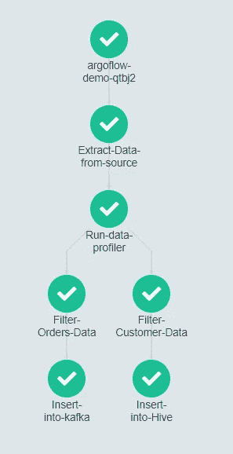

# 使用 ArgoWorkflow 的云原生数据管道

> 原文：<https://towardsdatascience.com/cloud-native-data-pipelines-using-argoworkflow-1e1fd8c03939?source=collection_archive---------20----------------------->

## 利用容器和 Kubernetes 扩展您的数据工程管道

# 背景

无论您是数据工程师、平台工程师、数据科学家还是 ML 工程师，在处理数据时，我们都面临着创建管道的挑战。尽管我们的数据处理目标之间存在折衷的差异，但有一点是不变的“我们需要创建和扩展 DAG 的能力”。在现代计算解决方案中，DAG 或有向无环图的概念是核心。简而言之，DAG 描述了复杂的非递归计算中的一系列执行步骤，定义可以在[这里找到](https://en.wikipedia.org/wiki/Directed_acyclic_graph)。实际上，我们将 DAG 定义为一组线性任务，这些任务共同作为一个逐步的过程运行。我们的简单目标是使开发和部署管道的过程尽可能自动化和可伸缩。

可以使用许多工具来构建管道。[比较选项](https://www.datarevenue.com/en-blog/airflow-vs-luigi-vs-argo-vs-mlflow-vs-kubeflow)

[Apache Airflow](https://airflow.apache.org/) —基于 python 的编排平台，专为运营团队和数据科学打造。这个领域最好的用户界面之一

[perfect](https://www.prefect.io/)—为开发人员使用而构建的程序编排平台。它是这一领域的新兴工具，正在获得越来越多的关注。

[Luigi](https://luigi.readthedocs.io/en/stable/index.html)——另一个供开发者使用的开源解决方案

[Ctrl-M](https://www.bmc.com/it-solutions/control-m.html)—BMC 流行的企业工作流管理工具

# DAG 已定义

为什么我们叫他们达戈？DAG 是一个有向非循环图，是管道的数学抽象。进一步说，*图*是顶点(或点)和边(或线)的集合，表示顶点之间的连接。*有向图*是一种图，其中的边指向从一个顶点到另一个顶点的方向。在这种情况下，同一对顶点之间可能存在两条边，但在这种情况下，它们将指向相反的方向。有向图通常被称为有向图。如果一个图包含一个或多个圈，则该图是*循环的*，其中*循环*被定义为沿着边的顶点之间的路径，该路径允许你沿着唯一的一组边返回到顶点。当一个图不包含圈时，它是无圈的。因此，*有向无环图*或 *DAG* 是没有圈的有向图。

# Argo 工作流

[Argo WorkFlows](https://argoproj.github.io/projects/argo/) 是一个云原生计算基础项目，是一个开源的容器原生工作流引擎，用于编排 Kubernetes 中的作业，将工作流中的每个步骤作为一个容器来实现。Argo 使开发人员能够使用类似于传统 YAML 的自定义 DSL 启动多步管道。该框架提供了复杂的循环、条件、依赖管理和 DAG 等。这有助于增加部署应用程序堆栈的灵活性以及配置和依赖性的灵活性。使用 Argo，开发人员可以定义依赖关系，以编程方式构建复杂的工作流，将任何步骤的输出作为输入链接到后续步骤的工件管理，并在易于阅读的 UI 中监控计划的作业。Argo 是作为 Kubernetes CRD(自定义资源定义)实现的。因此，Argo 工作流可以使用 kubectl 进行管理，并与其他 Kubernetes 服务(如卷、秘密和 RBAC)进行本机集成，并提供完整的工作流功能，包括参数替换、工件、夹具、循环和递归工作流。

# 其他功能

*   可视化和管理工作流的用户界面
*   工作流模板用于存储集群中常用的工作流
*   计划的工作流
*   带有 REST API 的服务器接口
*   基于 DAG 或步骤的工作流声明
*   步骤级输入和输出(工件/参数)
*   参数化
*   条件式
*   重试(步骤和工作流级别)
*   K8s 资源编排
*   调度(亲和力/容忍度/节点选择器)
*   卷(短期/现有)
*   平行度限制
*   魔鬼化的步骤

# 管道 API

为了简化环境和简化实施，我们的目标是利用我们在 Docker 和 Kubernetes 上的投资，同时使开发人员能够自动化所有语言和框架的云原生部署管道。

既然我们已经有了所有必要的材料；a)用于代码的容器 b)用于访问云资源的容器的编排 c)以编程方式构建复杂工作流(DAG)的能力，让我们仔细看看为什么我们开发了管道 API。

Argo 中的工作流自动化是由 YAML 模板驱动的(易于采用，因为 Kubernetes 主要使用相同的 DSL ),这些模板是使用 ADSL (Argo 领域特定语言)设计的。使用 ADSL 提供的每条指令都被视为一段代码，与 github 中的应用程序代码一起托管。Argo 提供/支持六种不同的 YAML 构造:
**容器模板:**根据需要创建单个容器和参数
**工作流模板:**定义作业，换句话说就是短时间运行的应用程序，它运行到完成。工作流中的步骤可以是容器
**策略模板:**用于触发/调用作业或通知的规则
**部署模板:**创建长时间运行的应用程序
**固定模板:**将 Argo
**项目模板之外的第三方资源粘合起来:**可以在 Argo 目录中访问的工作流定义。

这些模板提供了一组非常强大的特性，但也会给开发人员带来负担，特别是当它涉及到创建和维护复杂的 yaml 时。在多系列的这一部分中，我们将展示一个利用 [Spark](https://github.com/GoogleCloudPlatform/spark-on-k8s-operator) 的管道，这也是一个非常有趣的 K8 运营商，敬请关注关于该主题的未来文章。

# 项目配置

第一步是我们在您的项目中创建一个 config.yaml 文件，它包含所有关于图像/容器细节的底层细节。配置文件主要包含两个组件:

*   容器:包含预构建的容器图像
*   资源:可以包含任何需要实现的定制资源定义

下面是示例 yaml，它包含使用 [pydeequ](https://github.com/awslabs/python-deequ/) 运行示例数据分析器的`jobprofilerclient`和使用 [spark 操作符](https://github.com/GoogleCloudPlatform/spark-on-k8s-operator)运行 Spark 作业的资源模板`sparkk8sScala`

现在，您可以使用下面的代码创建一个复杂的 DAG:

添加任务后，可以编译 DAG，我们还可以查看依赖关系，并将 DAG 提交到 Argo 工作流:

当提交到 ArgoWorkflow 时，此代码会生成如下所示的 DAG:

要查看工作代码，请查看 [github](https://github.com/IndustrialDataops/argoflow) repo，在这里我们将继续添加更多的管道 API 特性。请继续关注更多的用例，包括 ML 管道。

# 请联系！

如果您有任何问题，请联系我们。在这里找到我【https://www.linkedin.com/in/roberthheise/ 

你可以在 https://www.linkedin.com/in/gopalkrishna9/的[找到 Gopal](https://www.linkedin.com/in/gopalkrishna9/)