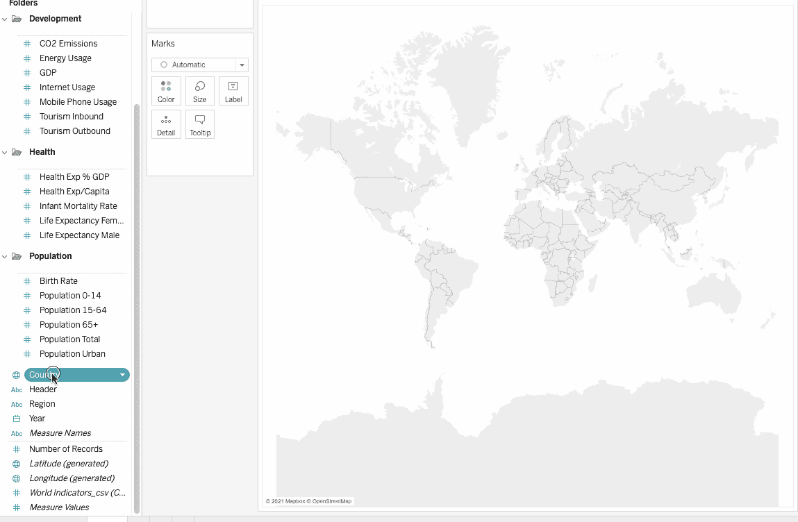

# Tableau 中的聚类分析

> 原文：<https://towardsdatascience.com/cluster-analysis-in-tableau-1f19acd0c647?source=collection_archive---------20----------------------->

## 了解如何轻松地在 Tableau 中对数据进行聚类

图片由[尼基·❕❣️提供请保持安全❣️❕](https://pixabay.com/users/nickype-10327513/?utm_source=link-attribution&utm_medium=referral&utm_campaign=image&utm_content=5889697) 来自 [Pixabay](https://pixabay.com/?utm_source=link-attribution&utm_medium=referral&utm_campaign=image&utm_content=5889697)

考虑这样一种情况，您有一些属于您公司的销售数据。假设你想从消费者的消费能力中发现一种模式。如果您可以在数据中发现不同的群体或关联，您的公司就可以根据他们的偏好来定位不同的群体。这种直觉背后的基本思想被称为**聚类**，tableau 有一个固有的特性，可以根据某些属性自动对相似的数据点进行聚类。在本文中，我们将探索 Tableau 的这一功能，并了解如何将聚类方法应用于一些真实的数据集。

# 什么是集群？

[**聚类**](https://en.wikipedia.org/wiki/Cluster_analysis) 又称聚类分析，是一种**无监督的机器学习**算法，倾向于根据某种相似性度量对更多相似的项目进行分组。

下面的[图非常直观地展示了](http://tech.nitoyon.com/en/blog/2013/11/07/k-means/) [K 均值算法](https://en.wikipedia.org/wiki/K-means_clustering)的工作。在 K 均值聚类中，该算法将数据集分成 K 个聚类，其中每个聚类都有一个质心，质心计算为该聚类中所有点的平均值。在下图中，我们从随机定义 4 个质心点开始。然后，K 均值算法将每个数据点分配到其最近的聚类(交叉)。当所有数据点的平均值改变时，质心移动到新的位置，然后重复整个过程，直到质心位置不再有可观察到的变化。

[可视化 K-Means 算法](http://tech.nitoyon.com/en/blog/2013/11/07/k-means/)

# Tableau 中的聚类

Tableau 还使用了 [**K 均值聚类**下的](https://en.wikipedia.org/wiki/K-means_clustering)算法。它使用 [**卡林斯基-哈拉巴斯**](https://onlinehelp.tableau.com/v10.0/pro/desktop/en-us/clustering_howitworks.html) 准则来评估聚类质量。下面是对[卡林斯基-哈拉巴斯标准](https://onlinehelp.tableau.com/v10.0/pro/desktop/en-us/clustering_howitworks.html)的数学解释:

来源:[https://online help . tableau . com/v 10.0/pro/desktop/en-us/clustering _ how networks . html](https://onlinehelp.tableau.com/v10.0/pro/desktop/en-us/clustering_howitworks.html)

这里 SSB 是总体的**类间**方差，SSW 是**总体类内方差**，k 是类的数量，N 是观察的数量。

这个比率给出了一个决定簇的内聚性的值。较高的值表明聚类之间的关联更紧密，聚类内距离较低，聚类间距离较高。

既然我们对什么是集群有了一个概念，那么是时候看看如何使用 tableau 来应用集群了。

# 使用聚类发现数据集中的模式

聚类有助于发现数据集中的模式。假设你是某个旅游公司的分析师。作为一家公司，了解人们旅行习惯的模式会很有用。你有兴趣知道哪个年龄段的人更喜欢旅行。你的工作是使用世界指标样本数据来确定哪些国家有足够多的合适的客户。

## 舞台环境

在本教程中，我们将使用 [**画面公开**](https://public.tableau.com/en-us/s/) **，**这是绝对免费的。从[官网](https://public.tableau.com/en-us/s/)下载 Tableau 公版。按照安装说明进行操作，如果单击 tableau 图标时出现以下屏幕，就可以开始了。

Tableau 主屏幕|作者图片

## 连接到数据集

**世界经济指标**数据集包含推动世界各国经济发展的有用指标，如预期寿命、经商便利度、人口等。数据集是从联合国网站上获得的。数据集可以从这里的[进入](https://github.com/parulnith/Data-Science-Articles/tree/main/Cluster%20Analysis%20in%20Tableau)。

*   将数据集下载到您的系统中。
*   将数据从计算机导入 Tableau 工作空间。使用`Sheets`选项卡下的`Data Interpreter`，校正并重新排列数据。

按作者连接到数据源|图像

## 格式化数据源

在工作表中，数据源中的列在**数据**窗格的左侧显示为字段。**数据**窗格包含由表格组织的各种字段。有许多功能可以归为一类。这也将有助于更好地表示所有数据字段。

*   选择`Business Tax Rate`、`Days to Start Business`、`Ease of Business`、`Hours to do Tax`、`Lending Interest`、>文件夹>创建文件夹

按作者分组文件夹|图像中的字段

*   将文件夹命名为 **Business，**，现在上述所有字段都包含在这个特定的文件夹中。

文件夹视图|按作者排序的图像

*   同样，创建三个新文件夹— `Development`、`Health`和`Population`，方法相同，如上图所示。分别添加以下字段。这是格式化后数据窗格的外观:

最终外观|作者图片

*   双击数据窗格中的`Country`。Tableau 创建一个地图视图，用一个实心圆代表每个国家。将标记类型改为**地图，o** 在**标记**卡片上，

按作者显示数据集|图像中的国家/地区

# 确定聚类的变量

聚类的下一步是确定将在聚类算法中使用的变量。在 tableau 中，变量类似于字段。对于能够给出理想集群的最佳变量，没有唯一的答案，但是您可以用几个变量进行实验，以查看期望的结果。在我们的例子中，让我们使用以下字段:

*   **人口城市**

城市人口是一个国家人口密度的良好指标。密度越高，商机就越多。

*   **65 岁以上人口**

65 岁以上的人口意味着老年人。许多老年人倾向于喜欢旅行，所以这可能是一个有用的指标。

*   **女性预期寿命**和**男性预期寿命**

预期寿命较高的国家意味着那里的人们寿命更长，对旅游更感兴趣。

*   **人均旅游人数**

该字段不存在，可以使用`Tourism Outbound`和`Population Total`字段创建为计算字段，如下所示:

`Tourism Per Capita = SUM([Tourism Outbound])/SUM([Population Total])`

人均旅游|作者图片

`Tourism Outbound`代表人们每年花在国际旅行上的钱(以美元计)。为了得到平均值，我们需要将这个字段除以每个国家的人口

## 将选定字段添加到视图中

在继续之前，我们需要将默认聚合从`SUM`更改为`AVERAGE`。Tableau 使得聚集度量或维度成为可能，尽管[聚集](https://onlinehelp.tableau.com/current/pro/desktop/en-us/calculations_aggregation.htm#Measures)度量更常见。每当我们向视图中添加一个度量时，默认情况下会对该度量应用一个聚合。需要使用的聚合类型取决于视图的上下文。

将选定字段添加到视图|按作者排序的图像

更改所有选定字段的聚合，然后将它们拖到**标记**卡上的**细节**中，如下所示:

将汇总从总和变为平均值|按作者分类的图片

# 使聚集

Tableau 中的聚类是一个简单的拖放过程。以下步骤概述了群集过程:

*   点击`Analytics`窗格，拖动`Cluster`到视图上，数据自动按 Tableau 聚类。就这么简单。

Tableau 中的聚类|按作者分类的图像

*   虽然 Tableau 可以自动决定要创建的聚类数，但我们也可以控制聚类数以及计算它的变量。将字段拖到框中以将其包括在聚类分析算法中，或者将其拖出以将其排除。

决定聚类数|按作者分类的图像

*   为了更好的分析，我们将使用 4 个集群和默认变量。注:一些国家不属于任何类别，被标记为非类别。

4 个群集和默认变量|作者图片

*   该集群被创建为一个新的药丸，可以在颜色架上看到。将此药丸拖到数据窗格上，保存为一个组。

聚类字段|图像 y 作者

在这里，我们根据所选的衡量标准对国家进行了分组。但是，我们如何理解这些结果，以及我们如何根据集群做出商业决策呢？下一节将解决这些问题。

# 描述集群

单击标记卡中的集群字段，然后单击描述集群选项。

描述各种集群|作者图片

这将显示一个包含集群详细描述的文档。文档中有两个选项卡— `Summary`和`Models`:

## 1.摘要

这给出了每个聚类的结果和每个变量的平均值的汇总。

结果摘要|作者图片

从上面的结果，我们可以推断集群 2 具有:

*   男性和女性的平均预期寿命最高
*   最高的人均旅游总量
*   最高平均城市人口

这意味着它拥有预期寿命更长的富裕城市人口，似乎是老年旅游业的良好市场。让我们看看这一组包括哪些国家。

分析第 2 组中的国家|作者图片

## 2.模型

`models’`选项卡显示所有变量/字段平均值的各种统计值，并显示其统计显著性。你可以在这里阅读更多关于集群模型统计数据[。](https://help.tableau.com/v2020.4/public/desktop/en-us/clustering.htm#InformationModels)

按作者分析模型选项卡|图像

因此，作为一名分析师，你可以向销售团队展示这份清单，让他们关注这些潜在客户。聚类为我们提供了一些很好的见解。从这里开始，您可以尝试不同的领域，设置人口或收入的阈值等。有许多方法可以对数据进行聚类，但基本原理是相同的。

# 结论

在本文中，我们学习了如何使用简单的拖放机制对 Tableau 中的给定数据集执行聚类分析。聚类是一个重要的工具，当与 Tableau 结合使用时，可以为分析师提供统计分析技术的力量。

# 参考文献和进一步研究

[在数据中寻找聚类](https://help.tableau.com/v2020.4/public/desktop/en-us/clustering.htm#InformationModels)—Tableau 的自我指导，深入聚类分析的概念。