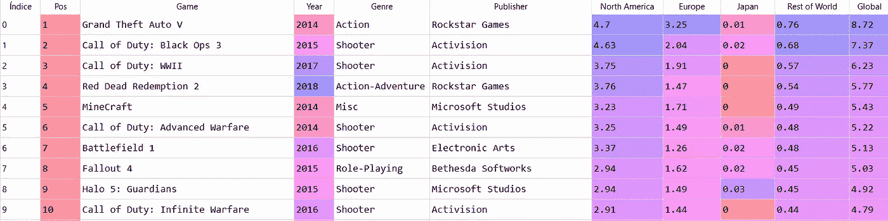

# Plotly Express 的聚类和重叠条形图

> 原文：<https://towardsdatascience.com/clustered-overlapped-bar-charts-with-plotly-express-c752d2925cf1?source=collection_archive---------14----------------------->


图片由 Ergyn Meshekran 从 Unsplash 提供

# **簇状&重叠条形图**

**聚类(分组)条形图**显示主要类别和属于第二分类变量的子类别(子类别)之间的相对比例的数字信息。与[堆积条形图](/stacked-bar-graphs-why-how-f1b68a7454b7)、**类似，它们应该用于比较和比例，但重点是组成。当一个整体被分成多个部分时，它们特别有效。它们能够在子类别**之间进行比较**，而堆叠条形图在子类别**内进行比较**。**

[簇状条形图](/clustered-overlapped-bar-charts-94f1db93778e)由多组矩形条表示，这些矩形条可以**水平或垂直**定向。每个主要类别被分成代表第二分类变量的子类别的条簇**和**。每个子类别的数量由那些矩形条的长度或高度来表示，这些矩形条并排放置 **形成一个簇**，簇之间的间隙比单个标准条稍宽。

[**重叠(重叠)条形图**](/clustered-overlapped-bar-charts-94f1db93778e) 用于不同项目或类别之间的**比较**。他们只对单个图表中每个项目或类别的两个数字变量进行比较。数值变量必须密切相关，才能进行比较。它们也用于显示基于相似前提的长期趋势。它们不应用于关系或分布分析。概念上的想法是**对比两个变量**的数值，这两个变量一个重叠在另一个之上，允许用更大的阐释力描述信息。

# **簇状&重叠条形图，带有 Plotly Express**

我们使用了从社区 Kaggle [1]下载的公共数据集。该数据集包含从 VzCharts 收集的与视频游戏销售和游戏评级数据相关的记录。我们特别选择了一个 *csv 文件*，其中有 422 条关于微软 Xbox One 主机上视频游戏销售的记录。我们想知道 2013 年至 2018 年期间全球不同地区的销售额分布情况。我们还想知道哪些是最畅销的类型。

首先，我们导入 Plotly Express 作为 *px，*模块 `*plotly.graph_objects*` 作为 *go* ，Pandas 库作为 *pd* ，并将我们的 *csv 文件*转换成数据帧:

```
import pandas as pdimport plotly.express as pximport plotly.graph_objects as godf = pd.read_csv(path + 'XboxOne_GameSales2.csv', index_col=False,               
                 header = 0, sep = ';', engine='python')
```

下面的屏幕截图显示了数据集的前十条记录:



最初，我们删除了在*年*列中具有 N/A 值的行，然后删除了在*全局*列中具有 *0* 值的行，最后，我们根据*年*列对剩余的记录进行分组，并对每个组求和。

```
df.dropna(subset = ['Year'], inplace = True)df.drop(df[df['Global'] == 0.0].index, inplace = True)df_clust = df.groupby(['Year']).sum().reset_index()
```

完成这三行代码后，我们就可以绘制一个簇状条形图了。

对于本文中的聚类(**分组**)条形图，Plotly 函数是`*go.Bar()*` ，对应的参数是: *x=* 代表时间线的数据帧中的列名，而 *y=* 是代表特定区域的数据帧中的列名。此外，我们还设置了条形的宽度和图例的文本。

我们使用方法`*fig.add_trace()*`添加新的**轨迹**(条)到图形对象`*Figure()*`。我们重复这个过程四次，每个区域一次。

```
anchos = [0.2] * 6fig = go.Figure()fig.add_trace(go.Bar(x = df_clust['Year'],
                     y = df_clust['North America'], 
                     width = anchos, name = 'North America'))fig.add_trace(go.Bar(x = df_clust['Year'],
                     y = df_clust['Europe'],
                     width = anchos, name = 'Europe'))fig.add_trace(go.Bar(x = df_clust['Year'], 
                     y = df_clust['Japan'],
                     width = anchos, name = 'Japan'))fig.add_trace(go.Bar(x = df_clust['Year'], 
                     y = df_clust['Rest of World'],
                     width = anchos, name = 'Rest of World')) 
```

我们用`*update.layout*`更新了图表:设置标题、字体大小以及图形的宽度和高度。

**我们必须选择 *barmode = 'group'* 来绘制一个簇状条形图**。记住，我们选择了*条形图=‘stack’*作为[堆积条形图。](/stacked-bar-charts-with-plotly-express-85885e91874f)

然后我们更新了 x 轴和 y 轴(文本、字体、tickfont)。我们将图表保存为静态的 *png* 文件，最后，我们使用[默认模板( *plotly* )绘制图表。](/histograms-with-plotly-express-e9e134ae37ad)

```
fig.update_layout(title =  "XboxOne World Sales (MM) ",
                  barmode = 'group', title_font_size = 40,
                  width = 1600, height = 1400)fig.update_xaxes(title_text = 'Year',
         title_font=dict(size=30, family='Verdana', color='black'),
         tickfont=dict(family='Calibri', color='darkred', size=25))fig.update_yaxes(title_text = "Sales",
         title_font=dict(size=30, family='Verdana', color='black'), 
         tickfont=dict(family='Calibri', color='darkred', size=25))fig.write_image(path + "figclust1.png")fig.show()
```


图 1:一个簇状条形图。作者用 Plotly Express 制作的图表。

这是一个很好的图表，但我们无法清楚地确定哪些值对应于日本。此外，图例的大小不足以正确显示。

因此，我们在每个轨迹中加入了参数*文本*，以及对应于每个区域的数值。我们使用方法`*update_traces()*`来设置这些数字注释的属性(模板、位置和字体特征)。最后，我们使用方法`*update_layout(legend=go.layout.Legend()*` 来建立屏幕上的位置( *x，y* )、图例项显示的顺序( *traceorder* )，最后是图例的族、大小和颜色。请注意， `go.Legend`已被弃用，取而代之的是`go.layout.Legend`。

```
anchos = [0.2] * 6fig = go.Figure()fig.add_trace(go.Bar(x = df_clust['Year'], 
                     y = df_clust['North America'],
                     width = anchos, name = 'North America',
                     text = df_clust['North America']))fig.add_trace(go.Bar(x = df_clust['Year'], 
                     y = df_clust['Europe'],
                     width = anchos, name = 'Europe',
                     text = df_clust['Europe']))fig.add_trace(go.Bar(x = df_clust['Year'], 
                     y = df_clust['Japan'],
                     width = anchos, name = 'Japan',
                     text = df_clust['Japan']))fig.add_trace(go.Bar(x = df_clust['Year'], 
                     y = df_clust['Rest of World'],
                     width = anchos, name = 'Rest of World',
                     text = df_clust['Rest of World']))fig.update_layout(title =  "XboxOne World Sales (MM) ",
                  barmode = 'group',title_font_size = 40,
                  width = 1600, height = 1400)fig.update_layout(legend=go.layout.Legend(
            x=1,y=1,
            traceorder= normal",
            font=dict(family="Verdana",size= 22, color = "black")))fig.update_traces(texttemplate='%{text:.2f}',textposition='outside',
            textfont=dict(size=60, family='Verdana', color='black'))fig.update_xaxes(title_text = 'Year',
           title_font=dict(size=30,family='Verdana',color='black'), 
           tickfont=dict(family='Calibri', color='darkred',size=25))fig.update_yaxes(title_text = "Sales", 
           title_font=dict(size=30,family='Verdana',color='black'), 
           tickfont=dict(family='Calibri', color='darkred',size=25)) fig.write_image(path + "figclust1.png")fig.show()
```


图 2:带注释的簇状条形图。作者用 Plotly Express 制作的图表。

现在我们可以做一个很好的比较，不仅是视觉上的，还有数字上的。

为了更好地讲述故事，我们决定在两个最畅销的地区按流派分析销售情况:

首先，我们按流派分组，并对北美和欧洲对应的列求和。正如我们从前面的图表中所知，北美是销量最高的地区，我们将列 *[“北美”]* 按降序排列。我们得到了 16 种不同的风格，太多了，难以形象化。因此，我们只筛选出那些在 2013 年至 2018 年期间销量超过 500 万册的书籍。

```
df_genre = df.groupby(['Genre'], as_index = False) 
                      ["North America", 'Europe'].sum()df_genre.sort_values(by=['North America'], inplace = True, 
                     ascending = False)df_genre = df_genre[df_genre['North America'] > 5]
```

**我们选择 bar mode =‘overlay’来得到一个重叠的条形图**，因为我们每个类别只有两个数字变量。

```
anchos = 0.5fig = go.Figure()fig.add_trace(go.Bar(x = df_genre['Genre'], 
                     y = df_genre['North America'],
                     width = anchos, name = 'North America',
                     text  = df_genre['North America']))fig.add_trace(go.Bar(x = df_genre['Genre'],
                     y = df_genre['Europe'],
                     width = anchos, name = 'Europe',
                     text = df_genre['Europe']))fig.update_layout(title = "XboxOne Sales by Genre (MM)",
                  barmode = 'overlay',title_font_size = 40,
                  width = 1600, height = 1400)fig.update_layout(legend=go.layout.Legend(
             x=1,y=1, traceorder= "normal",
             font=dict(family="Verdana",size= 22, color = "black")))fig.update_xaxes(
          title_text = 'Genre', 
          title_font=dict(size=30,family='Verdana',color='black'),
          tickfont=dict(family='Calibri', color='darkred', size=25))fig.update_yaxes(
          title_text = "Sales",
          title_font=dict(size=30, family='Verdana', color='black'),
          tickfont=dict(family='Calibri', color='darkred', size=25))fig.write_image(path + "figover1.png")fig.show()
```


图 3:重叠条形图。作者用 Plotly Express 制作的图表。

不出所料，射击游戏是北美人的最爱，销量是紧随其后的游戏的两倍。按比例来说，欧洲人只在赛车类型上与他们相匹配。

我们可以通过一个小的改动来改进图表:**在第二个栏**中将 offset 属性设置为 0.0005 **。此属性移动绘制横条的位置(以位置轴为单位)。**

```
fig.add_trace(go.Bar(x = df_genre['Genre'], 
                     y = df_genre['Europe'],offset = 0.0005,
                     width = anchos, name = 'Europe',
                     text= df_genre['Europe']))
```


图 4:部分重叠的条形图。作者用 Plotly Express 制作的图表。

如图 4 所示的图表被称为**部分重叠条形图**。从概念上讲，当代表不同数据集的矩形开始重叠而不是并排放置时，它们相当于聚类(分组)条形图。重叠条意味着一个矩形在另一个矩形前面重叠 100%的极端情况。毫无疑问，观众会发现很难对三个或更多部分重叠的条进行比较。此外，重叠和部分重叠的条形图只有在较长的条形图总是在较短的条形图后面的情况下才能显示良好的信息。

# **总而言之:**

当您想要对整体的各个部分进行直接比较时，可以使用簇状条形图。另一方面，重叠条形图能够很好地比较两个密切相关的数值变量。

如果你对这篇文章感兴趣，请阅读我以前的(【https://medium.com/@dar.wtz】):

带 Plotly Express、跟踪和布局的面积图

</area-charts-with-plotly-express-510a1f12ac11>  

散点图，带有 Plotly Express、趋势线和分面

</scatter-plots-with-plotly-express-1b7f5579919b>  

*参考文献*

[1]:[https://www.kaggle.com/sidtwr/videogames-sales-dataset?select = Xbox one _ gamesales . CSV](https://www.kaggle.com/sidtwr/videogames-sales-dataset?select=XboxOne_GameSales.csv)