# 客户细分的聚类算法

> 原文：<https://towardsdatascience.com/clustering-algorithm-for-customer-segmentation-e2d79e28cbc3?source=collection_archive---------2----------------------->

## K-均值聚类的逐步指南

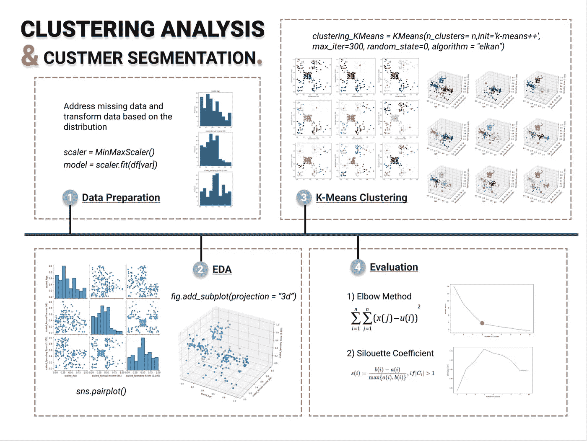

聚类分析信息图(图片作者来自[网站](https://www.visual-design.net/post/clustering-algorithm-for-customer-segmentation)

# 什么是聚类算法？

**在商业环境中:**聚类算法是一种辅助客户细分的技术，客户细分是将相似的客户归类到同一细分市场的过程。聚类算法有助于从静态人口统计和动态行为两方面更好地了解客户。具有相似特征的客户通常以相似的方式与企业互动，因此企业可以通过为每个细分市场创建定制的营销策略来受益于这种技术。

**在数据科学上下文中:**聚类算法是一种无监督的机器学习算法，它发现密切相关的数据点组。监督算法和非监督算法之间的根本区别在于:

*   监督算法:它需要将数据集划分为训练集和测试集，算法基于训练数据集的输出/标签进行学习，并将其推广到未观察到的数据。例如，决策树、回归、神经网络。
*   无监督算法:当数据集中没有任何已定义的输出/标签时，它用于发现隐藏模式。例如，聚类、关联规则挖掘、降维。

在这里，我收集了各种 ML 算法的实用指南。


[德斯坦贡](https://destingong.medium.com/?source=post_page-----e2d79e28cbc3--------------------------------)

## 机器学习实用指南

[View list](https://destingong.medium.com/list/practical-guides-to-machine-learning-a877c2a39884?source=post_page-----e2d79e28cbc3--------------------------------)10 stories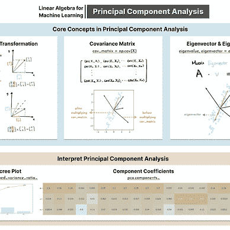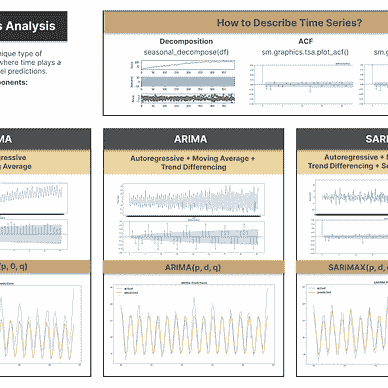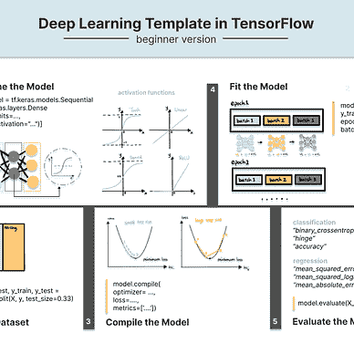

# 为聚类准备数据

在概述了什么是集群之后，让我们更深入地研究一个实际的客户数据示例。我用的是 Kaggle 数据集“[商城客户细分数据](https://www.kaggle.com/vjchoudhary7/customer-segmentation-tutorial-in-python)”，数据集中有五个字段， *ID，年龄，性别，收入，支出分数*。商场最关心的是顾客的消费分数，因此本练习的目标是在领域*消费分数*中找到隐藏的聚类。

## 1.加载和预览数据

使用 describe()加载数据集并汇总列统计信息。

```
import pandas as pd  
import numpy as np  
import seaborn as sns  
import matplotlib.pyplot as plt  
from pandas.api.types import is_string_dtype, is_numeric_dtype df = pd.read_csv("../input/customer-segmentation-tutorial-in-python/Mall_Customers.csv")
```

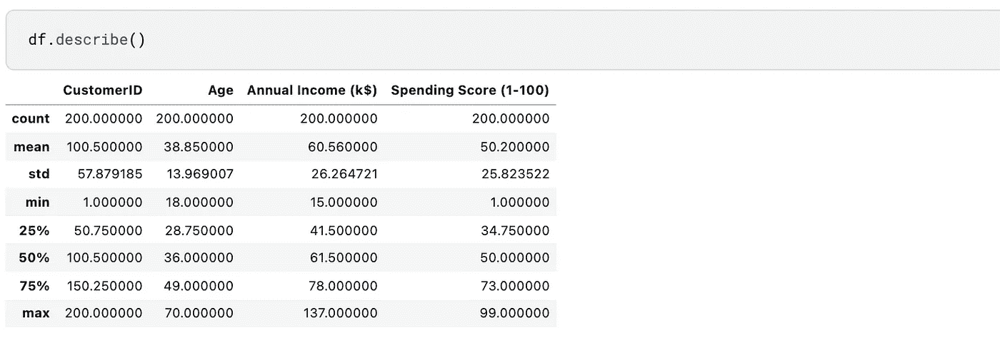

描述数据集

检查每个字段的分布:对分类变量使用条形图，对数值变量使用直方图。

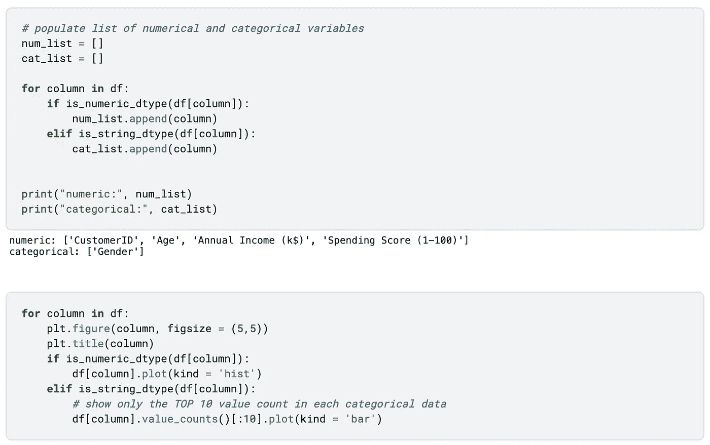

单变量分析(图片由作者提供)

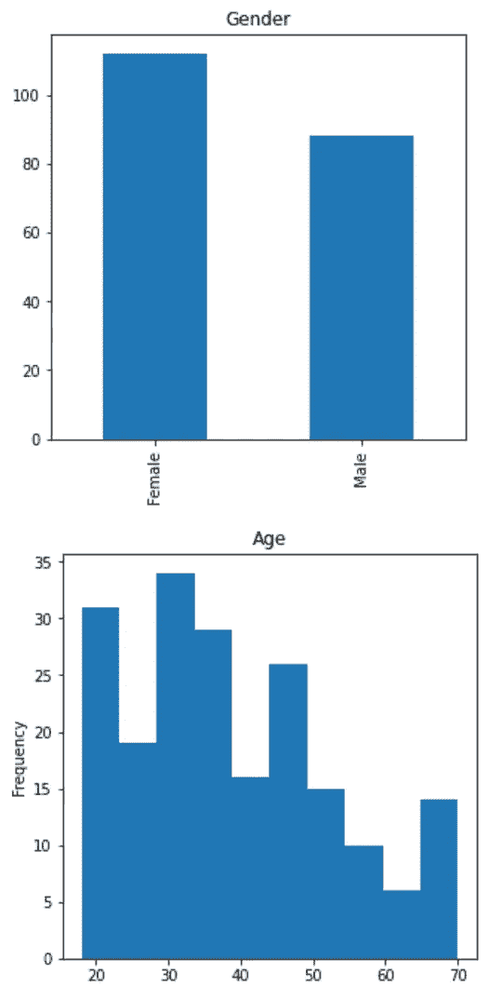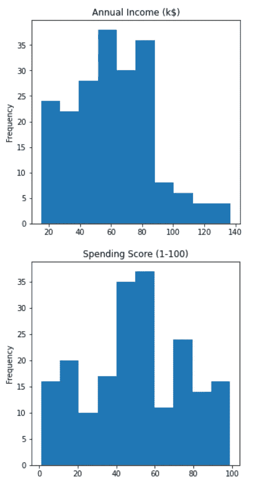

数据分布(图片由作者提供)

如果您想了解更多关于数据可视化和 EDA 的细节，请查看这两篇文章。

[](/feature-selection-and-eda-in-python-c6c4eb1058a3) [## 机器学习中的特征选择和 EDA

### 如何使用数据可视化来指导特征选择

towardsdatascience.com](/feature-selection-and-eda-in-python-c6c4eb1058a3) [](/semi-automated-exploratory-data-analysis-eda-in-python-7f96042c9809) [## Python 中的半自动探索性数据分析(EDA)

### 一键式全面数据探索流程

towardsdatascience.com](/semi-automated-exploratory-data-analysis-eda-in-python-7f96042c9809) 

## 2.数据预处理

既然我们已经定义了目标并对数据有了更好的理解，我们需要预处理数据以满足模型需求。在这个例子中，我选择 K 均值聚类作为主要算法，原因将在后面解释。

标准的 k 均值算法不能直接应用于分类数据。更具体地说，分类变量(例如，本例中的性别)的搜索空间是离散的(男性或女性)，因此不能直接与连续空间组合并以相同方式测量距离。因此，我丢弃了“性别”字段和“客户 ID”字段。

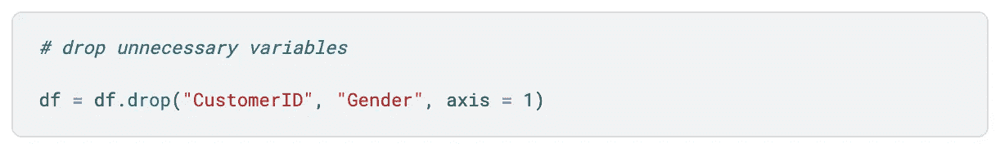

由于 K 表示基于欧几里得距离解释数据点之间的接近程度，因此将所有维度协调到一个标准尺度中是很重要的。应该选择适当的数据转换类型，以便与数据的分布保持一致。来自 Google 的这篇文章提供了集群中数据转换的一般指南。

总而言之:

*   如果正态分布→归一化
*   如果幂律分布→对数变换
*   如果数据不符合任何分布→分位数

从前面的单变量分析中，我们可以看到这些变量既不符合正态分布也不符合法律分布。因此，我使用 MinMaxScaler 将数据范围缩小到 0 到 1 之间，同时保持分布形状。

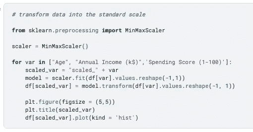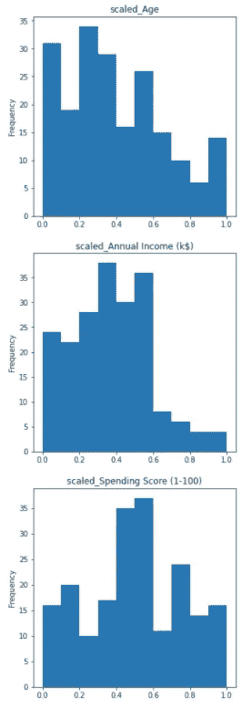

数据转换(图片由作者提供)

## 3.电子设计自动化(Electronic Design Automation)

探索性数据分析提供了视觉线索，表明当将多个变量组合在一起时，是否有可能形成有洞察力的集群。这也是必不可少的一步，因为选择合适的聚类算法依赖于聚类的形状。一些基于中心的算法(例如 K 均值)更适用于球状簇，并且它们倾向于将线性簇分开。而基于密度的算法(例如 DBSCAN)更适合具有不规则形状和大量噪声的聚类。

我以下面的方式形象化了这三个领域。

**2D 散点图**

*   年龄与年收入
*   年收入与支出得分
*   年龄与支出收入

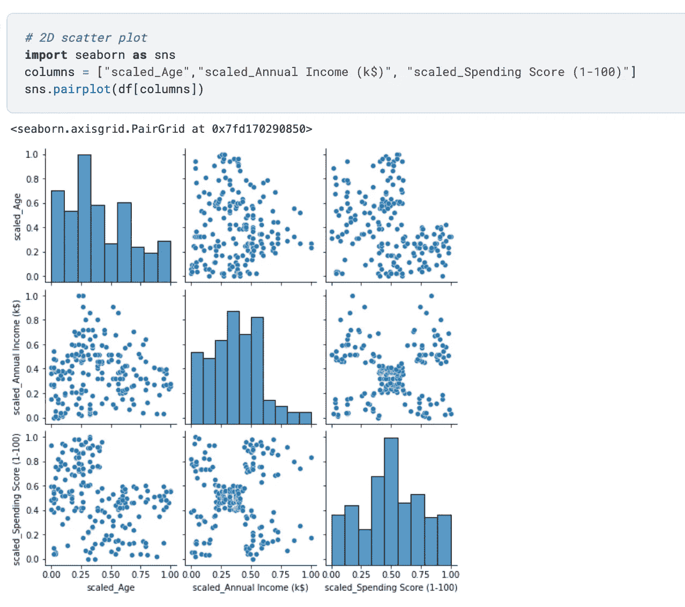

2D 散点图(图片由作者提供)

**三维散点图:**

*   年龄与年收入和支出得分

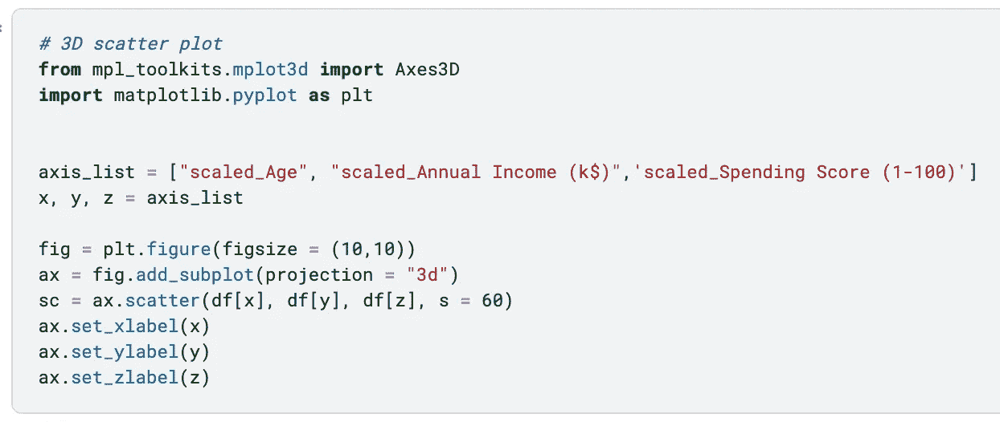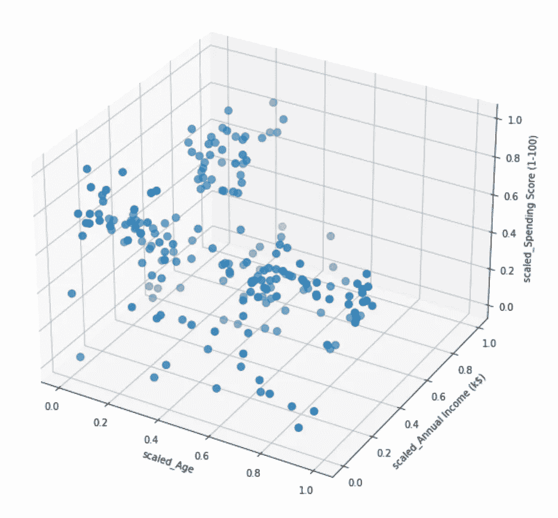

3D 散点图(图片由作者提供)

在这种情况下，很明显,“年收入与支出分数”的图表生成了一些基于中心的聚类。因此，我将使用 K 均值算法进行进一步的探索。

# k 表示聚类

## 1.K 均值聚类是如何工作的？

k 表示聚类是一种基于**中心的聚类算法**，这意味着它根据接近度或距离将数据点分配给聚类，遵循以下程序:

1.  **指定星团的数量“K”。**
2.  **初始化 K 个随机质心，给每个簇分配一个质心:**质心是每个簇的中心。开始时随机选择 k 个数据点作为质心，其他数据点的聚类标记随后相对于它们定义。因此，不同的初始质心分配可能导致不同的集群形成。
3.  **通过将数据点分配到最近的质心来形成 K 个聚类:**最近的质心通常由最小的欧几里德距离来定义，但根据使用情况，它也可以是相关或余弦。
4.  **重新计算每个聚类的质心**:在所有数据点被分配到一个聚类后，对于每个聚类，我们重新计算属于该聚类的所有数据点的平均值，并将其定义为新的质心。
5.  **当质心不再变化时达到收敛:**重复步骤 2-4，直到达到停止准则，即质心不再变化或达到最大迭代次数。

该过程还确定了 K 均值算法具有将点聚类成具有相似大小的圆形的限制，并且它还严重依赖于预定义的数字 K

## 2.如何建立 K 均值聚类模型？

现在让我们仔细看看如何使用 python scikit learn 实现它。

首先，我定义了一个 *KMeans_Algorithm* 函数，它将数据集和聚类数作为参数传递。

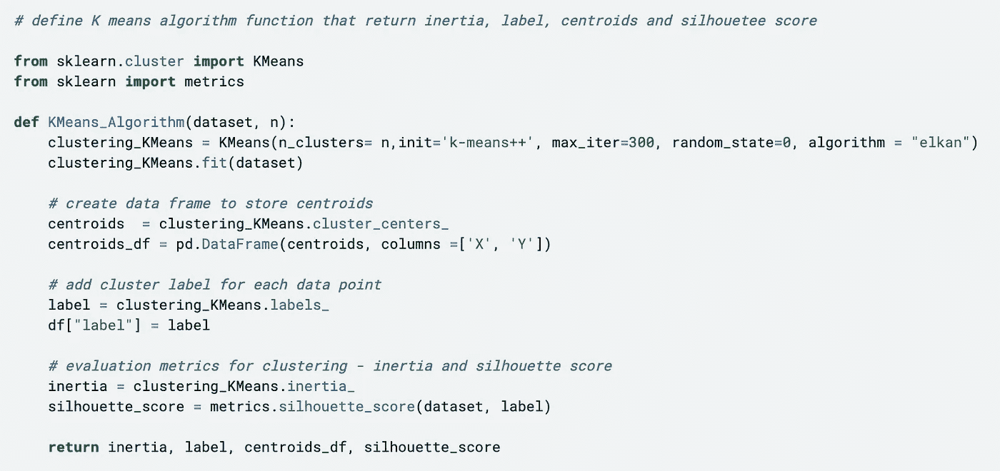

定义 KMeans_Algorithm 函数(图片由作者提供)

该函数从 sklearn 库中调用 *KMeans()* 并指定一些关键参数:

*   ***n_clusters:*** 集群的数量
*   ***init:****它控制初始化技术，我选择了“k-means++”来以一种聪明的方式选择初始质心以加速收敛*
*   ****max_iter:*** 指定每次运行允许的最大迭代次数*
*   ****算法*** *:* 有几个选项可以选择，“auto”、“full”和“elkan”我选择“elkan”是因为它是一个 K Means 算法变体，使用三角形不等式使其更具时间效率。*
*   ****random _ state:***用一个整数来决定初始质心的随机生成*

*输出将生成以下属性和评估指标:*

*   ****cluster _ centres _:***返回一个形心位置的数组*
*   ****惯性 _:*** 数据点到其最近质心的距离平方之和*
*   ****标签 _:*** 将聚类标签分配给每个数据点*
*   ****silhouette _ score:***数据点到同一聚类中其他数据点之间的距离与最近邻聚类中的数据点进行比较*

*在这个例子中，我主要对关于“支出分数”的聚类的形成感兴趣。因此，我使用了数据集 X1，X2，X3，如下所述，作为模型的输入。*

*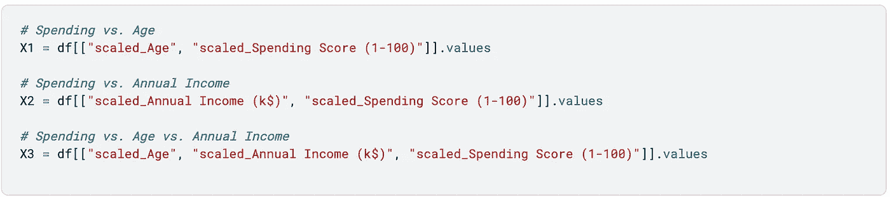*

*请注意，我们不再需要为无监督模型的训练和测试划分数据集。*

***年龄与支出得分***

*下面的代码使用了数据集 X1——按比例调整的年龄与按比例调整的支出分数，并直观地显示了随着分类数从 2 增加到 10，分类是如何变化的。*

*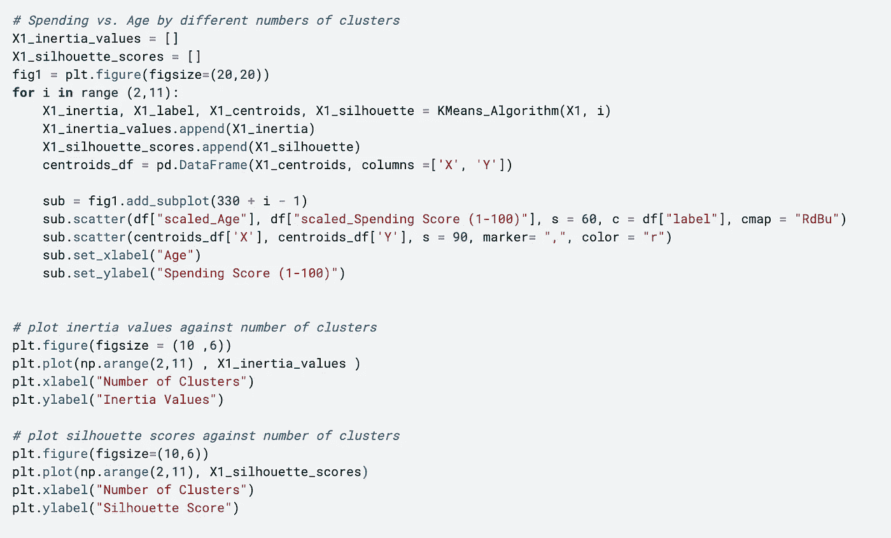*

*年龄与花费分数的 k 均值(图片由作者提供)*

*代码的第一部分遍历多个集群，并为每个集群生成一个散点图，红色方块表示质心。如下所示，当指定的“k”值改变时，聚类也改变。*

*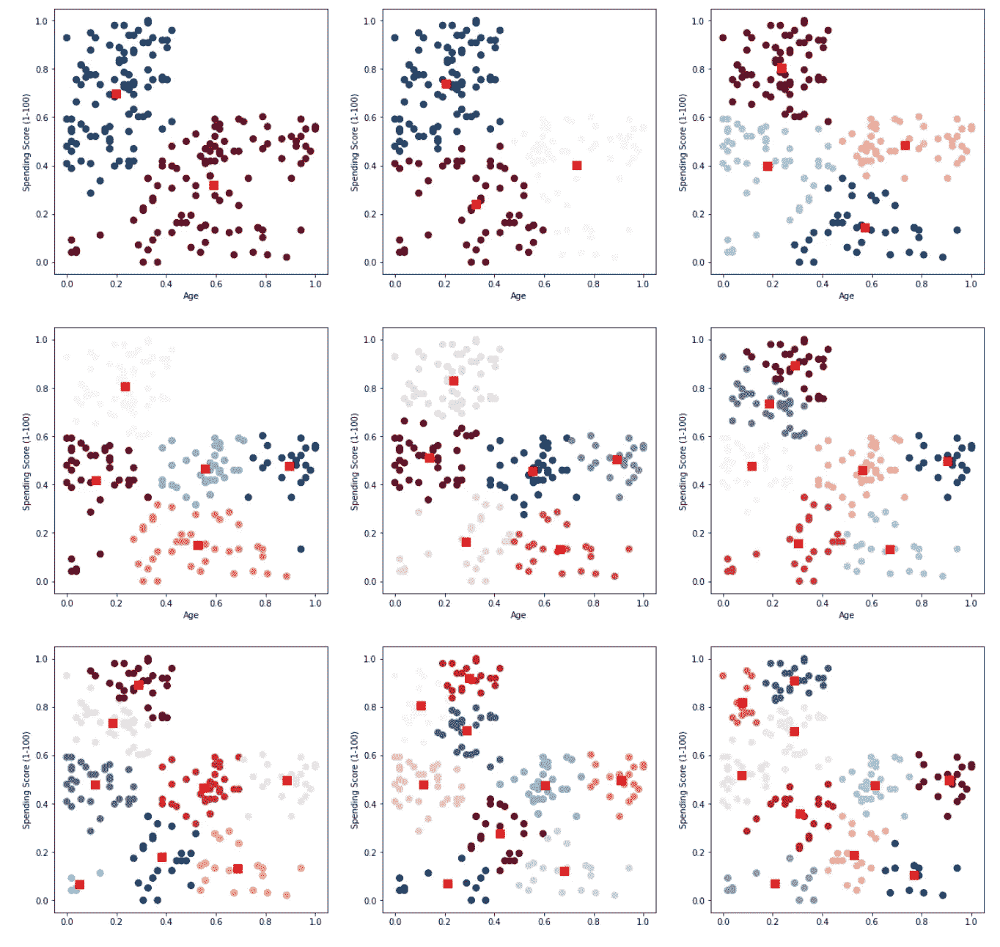*

*X1 的聚类结果(图片由作者提供)*

*之后，我基于两个指标评估模型性能:**惯性和轮廓系数**。*

*由于聚类是一种无监督算法，我们不能根据预测结果和实际结果之间的差异直接评估模型质量。因此，评估应基于 [**最小化类内距离同时最大化类间距离**的原则。](https://www.geeksforgeeks.org/ml-intercluster-and-intracluster-distance/)基于这一原理，有两种评价方法可以确定最佳聚类数。*

***1)利用惯性的肘法:***

*惯性测量样本到其最近聚类质心的平方距离之和。对于相同数量的聚类，惯量越小表示聚类越好。肘方法通过查看下图的转折点(“肘”点)来确定最佳聚类数，在本例中为 6。*

*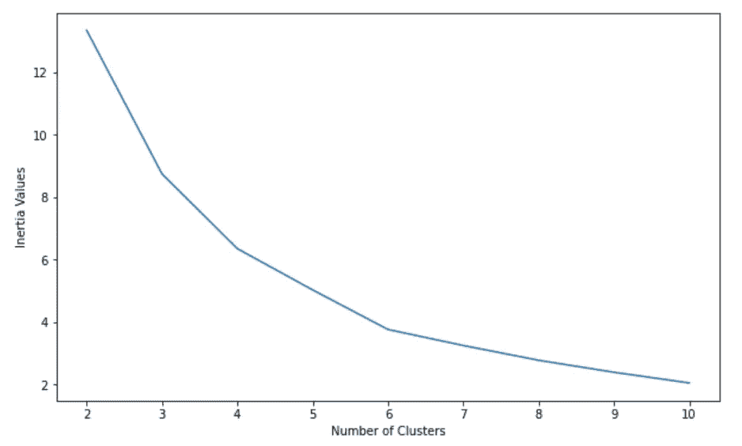*

*肘法(图片由作者提供)*

***2)轮廓系数:***

*下面是让它显得令人生畏的剪影系数公式:*

*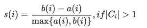*

*但是基本上它转化为最小化簇内距离，同时最大化簇间距离。 *a(i)* 是数据点 I 到**同一聚类中其他数据点的平均距离，**和 *b(i)* 是数据点 I 到**最近邻聚类中所有点的平均距离。**目标是最小化 *a(i)* 并最大化 *b(i)* ，因此当系数越接近 1，表示聚类越好。在本例中，2 和 6 都显示了分数的峰值。*

*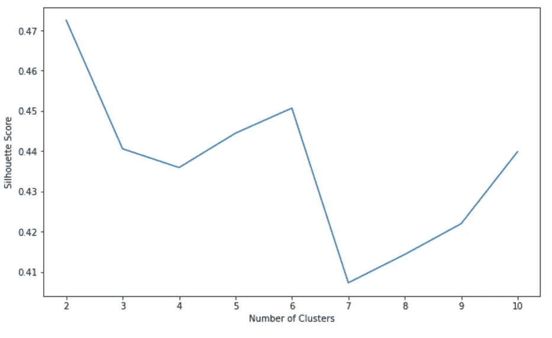*

*轮廓系数(图片由作者提供)*

*基于这两个指标的结果，在绘制“年龄”与“支出分数”的对比图时，6 很可能是最佳的聚类数。然而，无论是从分数还是从视觉效果来看，说年龄和花费分数一起形成有洞察力的聚类仍然不足以令人信服。*

***年收入与支出得分***

*从 EDA 过程中，我们观察到图表中有几个不同的集群。现在，让我们仔细看看该模型是否能如预期的那样将客户划分为不同的细分市场。该代码与上面的代码类似，但只是将输入数据集更改为 X2-按比例缩放的年收入与按比例缩放的支出分数。*

*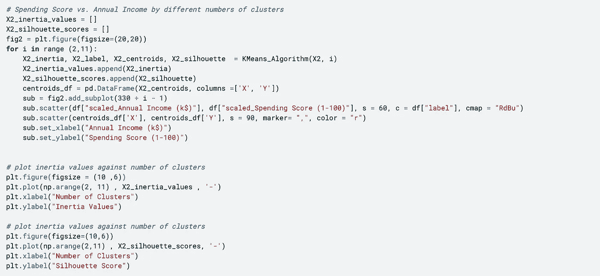**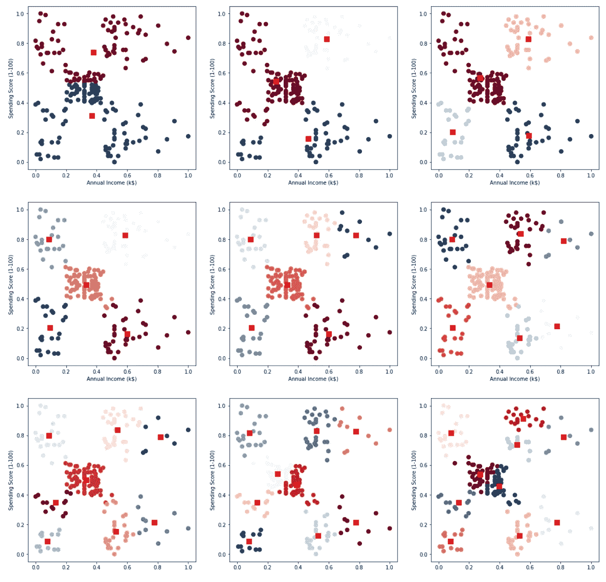**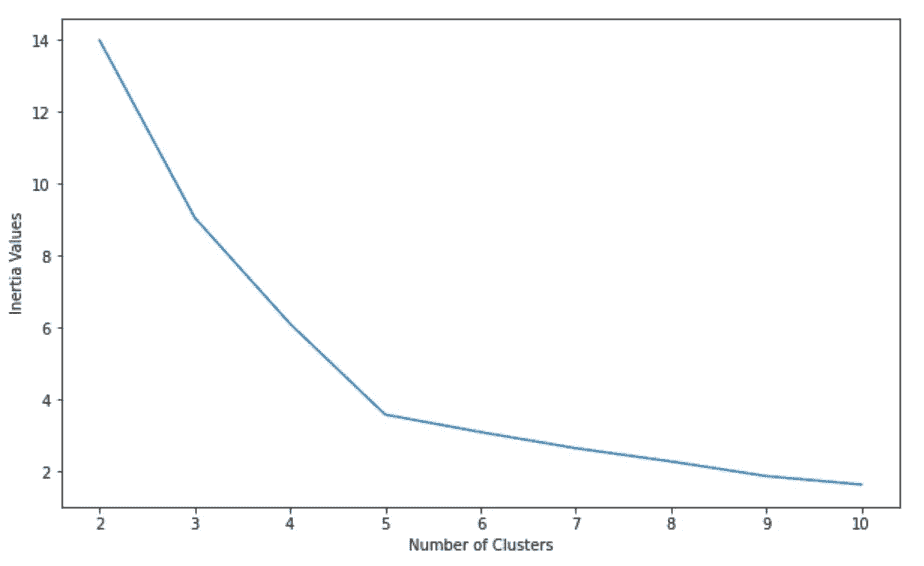**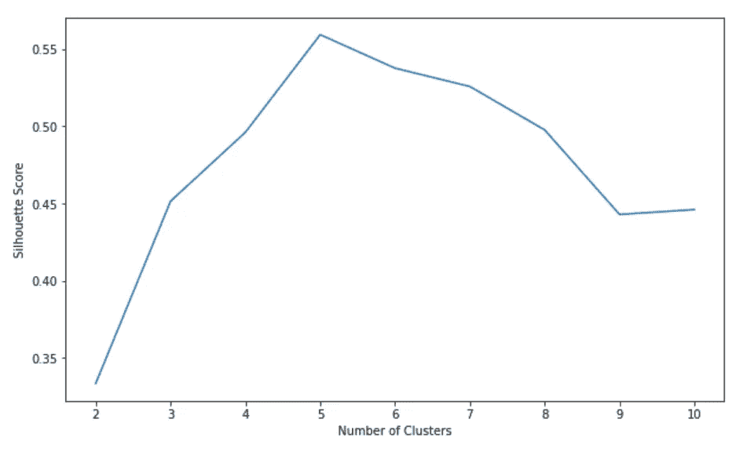*

*年收入与支出得分的平均值(图片由作者提供)*

*很明显，当聚类的数量等于 5 时，存在相当好的分割，并且在散点图中也清楚地示出了这一点。*

*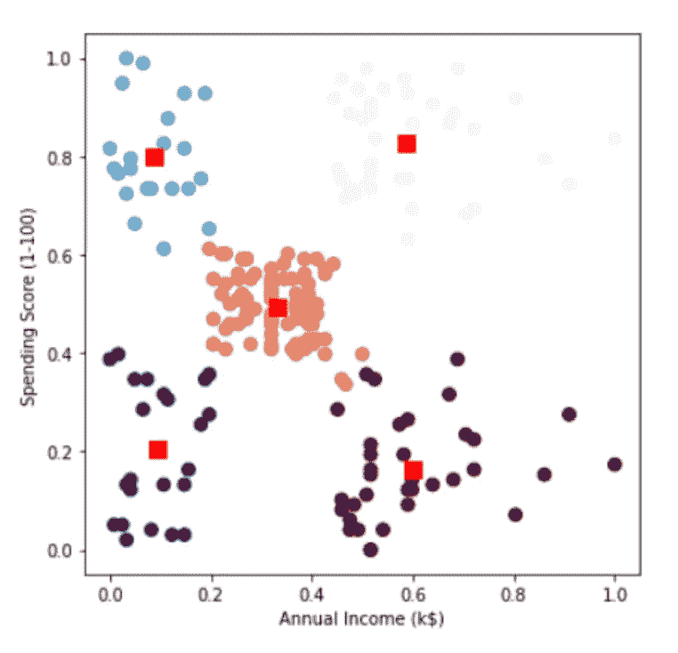*

*年收入与支出分数，含 5 个聚类*

***年龄对比年收入对比支出得分***

*如果你感兴趣，我们还可以进一步研究这三个领域是如何相互作用的。*

*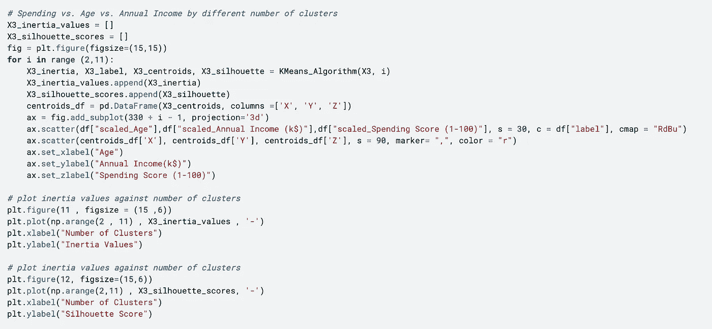**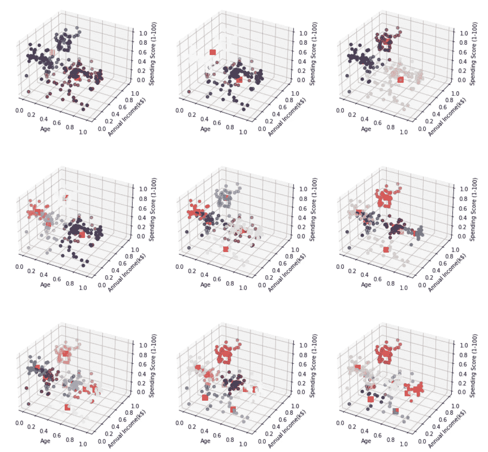**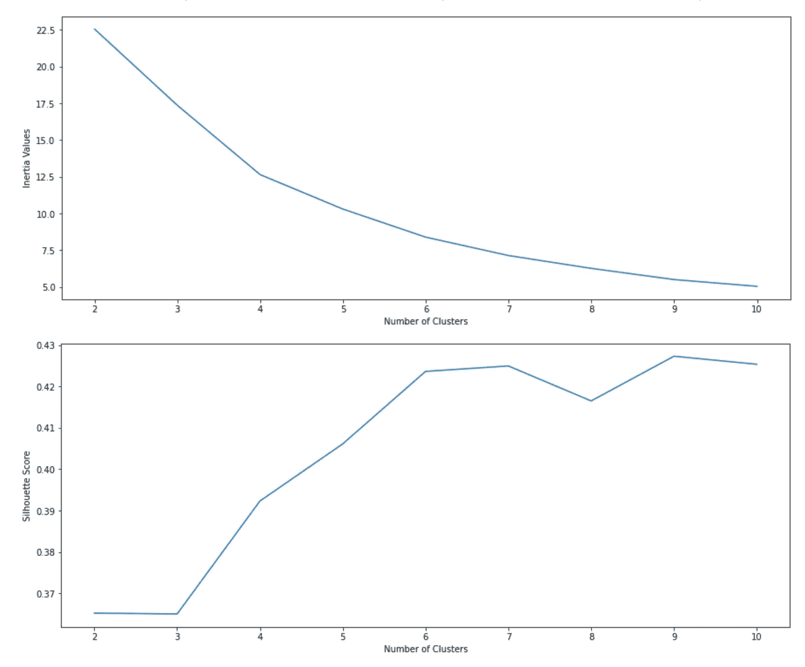*

*年龄、年收入和支出得分的平均值(图片由作者提供)*

*虽然，就可视化和度量值而言，没有形成任何突出的聚类的迹象，但无监督学习是关于发现和探索隐藏的努力。尽管如此，做进一步的调查还是值得的。*

# *3.如何应用于客户细分？*

*毕竟，聚类模型的目标是为客户细分带来洞察力。在本练习中，根据两个方面将客户分为 5 类:支出分数与年收入，这最有利于制定量身定制的营销策略。*

*如下所示，客户可以分为五类:*

1.  *高年收入(7 万美元以上)和高支出分数(60 分以上)*
2.  *高年收入(7 万美元以上)和低支出分数(40 分以下)*
3.  *低年收入(低于 4 万美元)和高支出分数(高于 60)*
4.  *低年收入(低于 4 万美元)和低支出分数(低于 40)*
5.  *平均年收入(介于 4 万美元和 7 万美元之间)和平均支出得分(介于 40 和 60 之间)*

*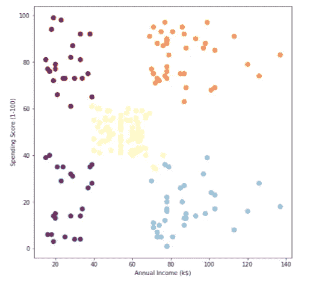*

*基于每个群体的不同特征，企业可以不同地接近每个客户群体。第一类和第三类客户产生的收入最多，他们需要使用营销策略来留住客户，如忠诚度计划或通过时事通讯提供折扣。另一方面，客户获取策略更适合第二组和第四组。这可以是根据他们的收入水平量身定制的营销活动，因为高收入群体和低收入群体对产品有不同的偏好。*

# *更进一步*

*使用 K 均值聚类有几个局限性，值得注意。当集群的大小和密度不同时，或者如果有任何显著的异常值，它就不能很好地工作。因此，当遇到类似这样的情况时，我们需要考虑其他聚类算法。例如，DBSCAN 对噪声和异常值有更强的抵抗力，并且层次聚类不假设任何特定数量的聚类。如果你想了解更多关于与 DBSCAN 的比较，请查看我的 [Kaggle 笔记本](https://www.kaggle.com/destingong/customer-segmentation-using-clustering-algorithm)。*

*希望你喜欢我的文章:)。如果你想阅读更多我关于媒体的文章，请使用这个附属链接(【https://destingong.medium.com/membership】T2)注册媒体会员。*

# *带回家的信息*

*本文介绍了聚类算法，特别是 K 表示聚类，以及我们如何在业务环境中应用它来帮助客户细分。一些关键要点:*

1.  *为聚类分析准备数据:数据转换和探索性数据分析*
2.  *使用 scikit learn 实现 k 均值聚类算法*
3.  *使用惯性和轮廓分数的聚类算法评估*

## *更多这样的文章*

*[](/semi-automated-exploratory-data-analysis-eda-in-python-7f96042c9809) [## Python 中的半自动探索性数据分析(EDA)

### 一键式全面数据探索流程

towardsdatascience.com](/semi-automated-exploratory-data-analysis-eda-in-python-7f96042c9809) [](/simple-logistic-regression-using-python-scikit-learn-86bf984f61f1) [## Python 中的简单逻辑回归

### 从数据预处理到模型评估的逐步指南

towardsdatascience.com](/simple-logistic-regression-using-python-scikit-learn-86bf984f61f1) [](https://medium.com/analytics-vidhya/top-15-websites-for-data-scientists-to-follow-in-2021-67352092c54d) [## 2021 年数据科学家关注的 15 大网站

### 启发学习的网站和博客

medium.com](https://medium.com/analytics-vidhya/top-15-websites-for-data-scientists-to-follow-in-2021-67352092c54d) 

*原载于 2021 年 7 月 4 日 https://www.visual-design.net*[](https://www.visual-design.net/post/semi-automated-exploratory-data-analysis-process-in-python)**。***