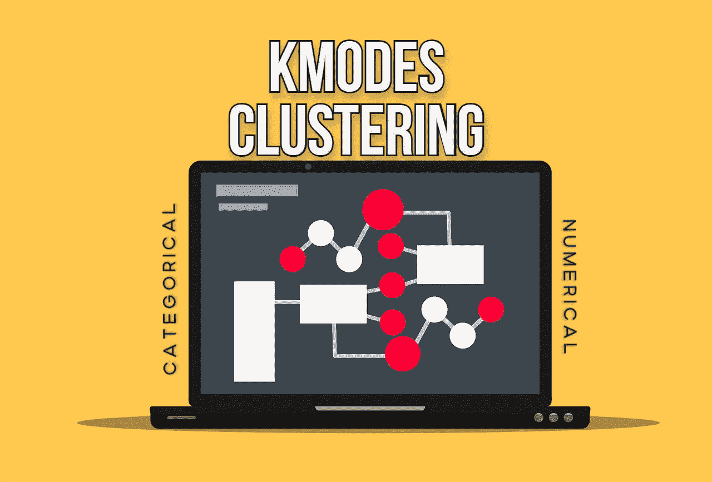

# 具有混合类别和数值特征的数据聚类算法

> 原文：<https://towardsdatascience.com/clustering-algorithm-for-data-with-mixed-categorical-and-numerical-features-d4e3a48066a0?source=collection_archive---------4----------------------->

## k-Modes 和 k-Prototype 算法直觉和用法



图片由[穆罕默德·哈桑](https://pixabay.com/users/mohamed_hassan-5229782/?utm_source=link-attribution&amp;utm_medium=referral&amp;utm_campaign=image&amp;utm_content=6087062)发自 [Pixabay](https://pixabay.com/?utm_source=link-attribution&amp;utm_medium=referral&amp;utm_campaign=image&amp;utm_content=6087062)

聚类是一种无监督的机器学习技术，它以这样一种方式将群体分成几个聚类或组，即一个聚类中的数据点彼此相似，而不同聚类中的数据点不相似。k-Means 是一种流行的聚类算法，仅限于数字数据。

## 为什么 k-Means 不能用于分类特征？

k-Means 是一种流行的基于质心的聚类算法，它将整个群体的数据点分成 k 个聚类，每个聚类具有几乎相等数量的数据点。k-Means 聚类算法背后的思想是找到 k 个质心点，并且数据集中的每个点将属于具有最小欧几里德距离的 k 个集合中的任一个。

k-Means 算法不适用于分类数据，因为分类变量是离散的，没有任何自然来源。所以计算欧几里得距离对于这样的空间是没有意义的。

k-Means 算法有一种变体，称为 k-Modes，适用于具有分类特征的数据。k-Prototype 是 k-Modes 算法的扩展，适用于混合分类和数字特征。

# 什么是 k 模式和 k 原型算法:

k-Modes 是一种基于 k-Means 算法范例的算法，用于对分类数据进行聚类。k-modes 根据数据点之间的匹配类别定义聚类。k-Prototype 算法是对 k-modes 算法的扩展，它结合了 k-Modes 和 k-means 算法，能够对混合的数值和分类变量进行聚类。

## 安装:

k-modes 和 k-prototype 算法可以使用开源库`**kmodes**` 实现。可以使用以下命令从 PyPl 安装 kmodes 库:

```
**pip install kmodes**
```

## 用法:

如前所述，`**kmodes**` 算法仅用于分类变量的聚类。而人们可以使用`**KPrototypes()**` 函数来用一组混合的分类和数字特征对数据进行聚类。

用于演示的数据集包含分类特征和数字特征。

```
**from kmodes.kprototypes import KPrototypes****kproto = KPrototypes(n_clusters=2, verbose=2, max_iter=20)
kproto.fit(df_array, categorical=cat_idx)**
```

`**KPrototypes**` 函数用于将数据集聚类成给定的`**n_clusters**` (聚类数)。在拟合训练数据集时，开发人员需要将分类特征的索引指定为参数。训练时`**KPrototypes**` 算法将使用 k-Modes 算法训练分类特征，剩余的数字特征将使用标准 k-Means 算法训练。

训练后，可以使用`**cluster_centroids_()**`函数获得聚类的质心。

```
**print(kproto.cluster_centroids_)**
```

使用函数`**predict()**`来预测聚类。

```
**clusters = kproto.predict(df_array, categorical=cat_idx)**
```

## 实施:

(作者代码)

# 结论:

在本文中，我们讨论了如何将聚类应用于具有混合的分类和数字特征集的数据集。KPrototypes 算法结合了 k-Modes 和 k-Means 算法的实现，为具有混合数据类型的数据创建分类。k-Modes 算法可以处理缺失值或 NaN 值，但建议估算这些值以获得更好的性能。

kModes 库的实现模仿了`**scikit-learn**`中的集群算法，并具有相同的 API。

> 阅读下面提到的文章中的[以获得对 k-Means、k-Means++和 k-Medoids 算法的更多理解。](/understanding-k-means-k-means-and-k-medoids-clustering-algorithms-ad9c9fbf47ca)

</understanding-k-means-k-means-and-k-medoids-clustering-algorithms-ad9c9fbf47ca>  

# 参考资料:

[1] KModes 库 GitHub 库:[https://github.com/nicodv/kmodes](https://github.com/nicodv/kmodes)

> 感谢您的阅读