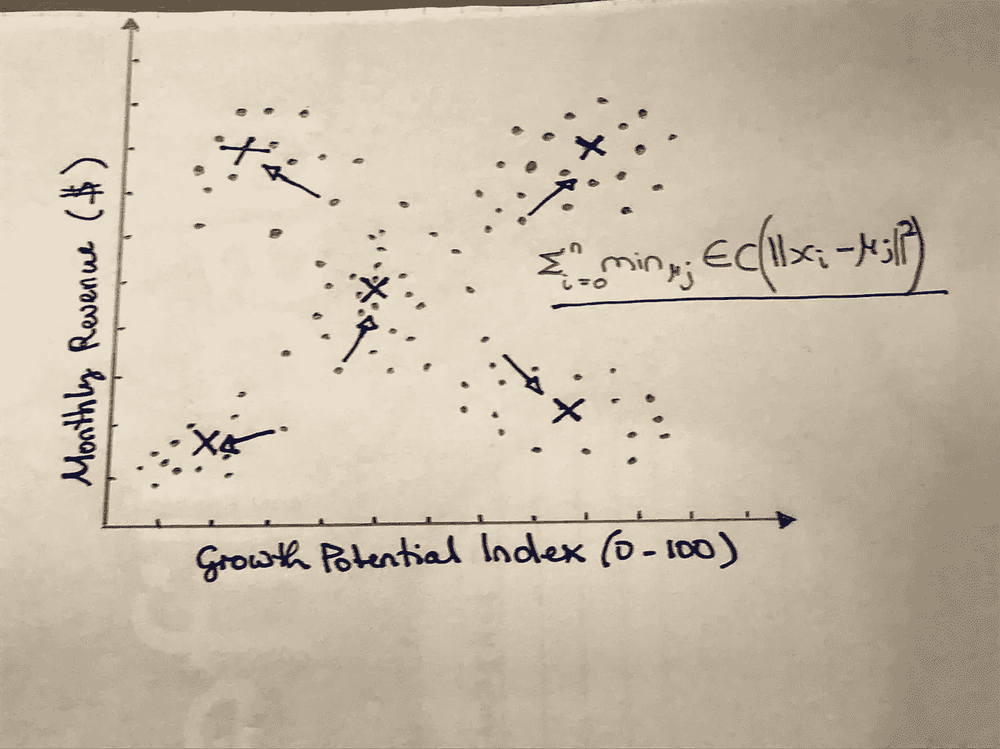

# 用于经济政策指导的聚类算法

> 原文：<https://towardsdatascience.com/clustering-algorithms-for-economic-policy-guidance-45f469704815?source=collection_archive---------16----------------------->

## [行业笔记](https://towardsdatascience.com/tagged/notes-from-industry)

## 在本教程中，我们将探索如何将数据科学方法应用于现实世界的经济政策挑战。

作者照片

T 创新的魔力总是产生于不同知识的融合。在那里，固执的学者们用新思想进行实验，以推进科学前沿。这无疑类似于知识领域像分子一样融合时释放的化学反应。当狡猾的技术和抽象的理论在点火和炼金术的地狱中结合在一起。

经济学和数据科学也是如此，这两个专业不仅有着共同的目标，而且都来自同一个知识宝库——统计学。在过去的几年里，他们变得越来越紧密。

*Einav 和 Levin (2014)* ，在一篇题为:**大数据时代的经济学**的论文中，将这种发展称为“实证转向”。在对未来的预测中，他们进一步指出，经济学将越来越多地采用机器学习学术社区中用于分析大数据的技术。事实上，Python 包的出现，如 **EconML** 、 **DoWhy** 和 **DeepIV** 证明了他们预测的准确性。

鉴于这些有趣的发展，本文的目的是说明聚类，一种无监督的学习方法，可以用来解决最优税收问题。

# 数据集

作者照片。

本文通过一个由 200 家索马里公司组成的小数据集，将重点放在寻找可能有助于设定适当税率的隐藏模式上。快速浏览数据集的信息表可以发现，我们既有丰富的地理信息，也有金融信息。总共有 14 列。

最重要的栏目是以美元计算的收入、连续活动的年数、增长潜力、公司经营的行业及其税收负担。地理位置当然也很重要。

如果您想对数据有所了解，或者您想亲自体验一下，您可以从下面的 Datapane 下载:

**有趣的栏目**:

*   **Growth _ Potential _ Index**(0-100 的较高值，表示公司在中短期内可以快速增长)
*   **月收入($)** (公司月总收入)
*   **An_Revenue ($)** (一年的月收入外推)
*   税收负担(可从总收入中扣除的官方税率)
*   **税收 _ 收入**(当地政府每年从公司获得的收入)
*   **产业**(相当明显)
*   **地理信息**(我们有经纬度，城市和省份)

该数据集可用于各种目的，但本文的目的是应用无监督学习算法对公司进行聚类，并确定它们是否被过度征税或征税不足。

但在我们探讨税收归宿的话题之前，让我们先对数据集进行一些探索性分析。

图 1:按城市/省份统计的价值。作者照片

图 1)显示，许多公司位于贝纳迪尔海岸和索马里首都摩加迪沙。其次是较大的城市，如博萨索、拜多阿和贝莱德文，其中第一个城市以其繁忙的港口和渔业闻名，后两个城市是该国南部的主要农业贸易中心。

图 2:按行业统计的价值和按增长潜力统计的税收。作者照片。

图 2)表明，我们数据集中的绝大多数公司都在金融服务领域运营，反映了索马里内战后时代(2000 年代和 2010 年代)的移动货币和汇款繁荣。第二个子图揭示了存在集群模式，其中企业是明显可区分的，因为一些企业产生高税收，而另一些企业产生较低的税收。这些公司的增长潜力也各不相同。

图 3:增长潜力、月收入和税收收入之间的成对网格图。作者照片。

可悲的是，图 3)几乎没有埋藏洞察力的宝藏。唯一值得注意和引人注目的模式似乎表明，现代企业需要支持，或许是减税以刺激增长和释放规模经济。因为其中一个散点图显示，有一群增长潜力低、月收入相对微薄的公司。也许这是一个逃税的例子，否定了我提出的用税收刺激经济增长的建议。

图 4:按部门划分的收入与税收归宿。作者照片。

图 4)无疑是迄今为止发现的最深刻的洞察力。我们可以清楚地看到——由于条形的颜色和大小形成对比——制造业和建筑业产生的税收收入占年收入的比例最高。与能源和电力、金融和资金转移等行业相比，农业和畜牧业的税率也不成比例。下图进一步证明了这一观察的可信度。

图 5:税负与增长潜力对比。作者照片。

在图 5)中，我们按降序比较了各个行业的增长潜力和税收负担。显而易见，制造业和建筑业以及农业和畜牧业在所有行业中的税负份额最高，尽管它们的增长潜力最大。一个可能的解释是，这两个部门都向摩加迪沙和博萨索的主要港口缴纳进出口税。因此，需要政府干预来减轻税收和运输成本的负担，这无疑会阻碍经济增长。此外，聚类算法可能有助于识别需要解决的隐藏模式。

# k 均值聚类

众所周知，大多数机器学习模型分为三个不同的类别:1)监督学习，2)非监督学习，以及 3)强化学习。在第一类中，结果变量是已知的，无论是连续的数值变量还是必须预测的类。聚类属于第二类，没有明显的结果可以预测。主要目的是找到隐藏的模式，并简单地将杂乱无章的数据组织成组。

因此，聚类练习的起点总是一团数据点，我们的目标是使模型能够找到隐藏的模式，并根据列间的相似性将每个点分配到一个组(聚类)。聚类算法有许多应用，从生物遗传学到客户细分，再到内容推荐引擎。

图 6:月收入与增长潜力指数的散点图。作者照片。

从前面的图(图 6)中可以看出，我们总是首先检查最重要变量上的分散点。这项工作的目标是直观地衡量集群的最佳数量。给定情况下的最佳集群数是 5，这不是很明显吗？观察左上方和右上方的聚类，紧密聚类的数据点中间的斑点，以及两个方向上的底部两个。作为这种原始方法的替代，我们可以使用肘方法来计算惯性分数。

图 7:最佳聚类大小检测的肘形图。作者照片。

惯性分数表示聚类内平方和(WCSS ),它表示每个数据点与其所属聚类中心之间的距离。K-means 聚类寻求优化这个 WCSS，以便为可达到的最小距离找到尽可能少的聚类。因此，WCSS 越大，集群越松散，反之亦然。从图 7)中，我们可以发现 WCSS 和集群大小之间的最佳平衡是 5，其中折线图弯曲得像一个弯头。

图 8:惯性得分及其目标函数。作者照片。

检测到 5 是最佳的聚类大小后，我们现在可以开始实现 K-means 聚类模型。

结果向我们展示了五个清晰可辨的集群及其 id。

图 9:集群的散点图。作者照片。

# 结论

最后的任务通常是给集群命名，并将结果传达给决策者。在我们的例子中，下面的集群名称和随后的结论如下:

**集群 0** (右下):收入高但增长潜力低 **HL** 。

**集群 1** (左下):低收入和低增长潜力 **LL** 。

**集群 2** (右上):高收入高增长潜力 **HH** 。

**集群 3** (左上):低收入但高增长潜力 **LH** 。

**集群 4** (中):收入中等，增长潜力中等 **MM** 。

就经济政策建议而言，我们可以从这项工作中得出以下结论:

*   能源和电力部门属于 LL 类组 1。该行业的企业税负较低，这一点应该保持不变。在当代索马里的社会经济环境中，这一部门进一步发展的可能性很大。
*   电信部门属于 HL 群组 0 类别。该部门的公司虽然收入最高，但税负较低。这一领域似乎监管不足。这些公司应该缴纳公平的税收份额，这将为帮助其他更不景气的行业提供更多的政策空间。
*   HH 集群 2 无疑是制造业和建筑业，目前是税负最高的行业之一(约 38%)。我们早些时候已经指出这个部门是如何在主要港口遭受原材料进口税的。电信部门收入的增加可以允许当局这样做。
*   LH 第 3 组可确定为农业和畜牧业，这是索马里经济的支柱。这些国家的大部分劳动力都在这个部门就业。除此之外，它在更好的粮食安全方面发挥着关键作用，因此必须得到培育和保护，免受港口和机场不合理的关税和税收。为了实现这些战略目标，必须降低目前接近 40%的高税负。
*   我们还没有讨论的最后一个扇区是 MM 星团 4。是我们政策指导制定剩下的最后一个行业。它可以被认为是金融和货币转移行业，正如我们所看到的，其税收负担非常低，约为 15%。为了更具战略重要性的产业，建议政策制定者提高这一比率。

在本文中，我们研究了如何将经济学和数据科学结合起来，以获得关于紧迫问题的新视角。我们探索了 K-means 聚类算法，经历了一次灵感引力之旅。当然，还有更多的聚类算法:比如 DBSCAN、Affinity Propagation、MeanShit 等等。但这是另一个帖子的故事。

在我的博客上订阅时事通讯，我正在那里为未来的出版物建立读者群。我的推特账号是 **@warsame_words** ，我欢迎反馈和建设性的批评——对于后者， [LinkedIn](https://www.linkedin.com/in/mohamed-warsame-428136153/) 是一个受欢迎的渠道。谢谢你陪我走完这段旅程。在 Medium 上关注我，了解我的最新数据相关文章，例如:

 [## 数据造福人类——索马里干旱管理

### 应用数据科学和分析应对全球变暖引发的环境挑战。端到端项目，包括…

towardsdatascience.com](/data-for-good-somalia-drought-management-e882355a98e0)  [## 数据分析师与数据科学家

### 比较分析的作用和责任，重叠点和期望的最性感的工作…

towardsdatascience.com](/data-analyst-vs-data-scientist-a83af97ad472)  [## 无处不在的假新闻:如何用 SOTA NLP 检测

towardsdatascience.com](/fake-news-everywhere-how-to-detect-it-with-sota-nlp-f2dc1e07247c)  [## 道德数据工作:技术数据保护的教训

### 一个初学者友好的教程，探索伦理数据科学-阐明一个人如何可以与数据工作，而…

towardsdatascience.com](/ethical-data-work-lessons-on-technical-data-protection-e6ab2d0c6571)