# 新冠肺炎期间的聚集性和帕金森病人

> 原文：<https://towardsdatascience.com/clustering-and-parkinsons-patients-during-covid-19-5552c005cfd9?source=collection_archive---------32----------------------->

## [变化数据](https://towardsdatascience.com/tagged/data-for-change)，原因聚类

## 在新冠肺炎期间发现帕金森病患者的亚组，以对社区内的潜在亚组受疫情影响的方式进行详细分析。

图片来自 [iStockPhoto](https://www.istockphoto.com/photo/cropped-view-of-senior-man-playing-with-puzzles-gm1089332974-292224059)

围绕新冠肺炎有许多挥之不去的问题；久而久之，我们揭示了疾病对不同人群的不同影响。试图理解由高层人口统计学分层的影响是本能的；然而，对遭受神经损伤的社区有什么影响？

在一个 3 人小组中，我们决定分析新冠肺炎影响帕金森氏病患者的方式。帕金森病是第二常见的神经退行性疾病；因此，了解 Covid 对帕金森病患者的影响是有益的。

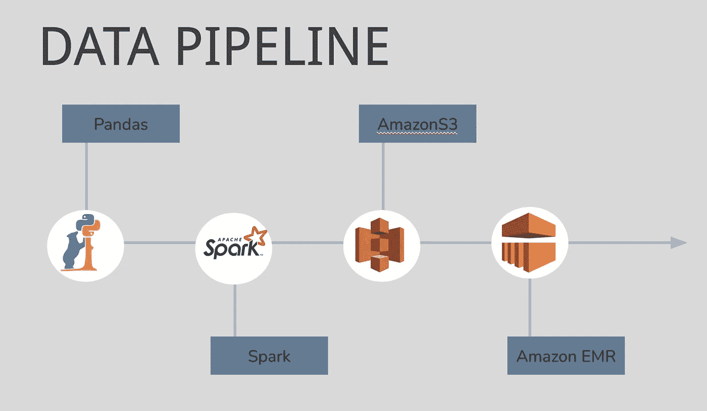

我们的管道(图片由作者提供)

## **我们的数据**

所使用的数据是围绕疫情和帕金森社区的最大和第一个数据集，由迈克尔·J·福克斯帕金森研究基金会提供。该系统包含 57 个不同的调查/数据集可供选择；我们小组决定合并以下调查:

1.  **关于你:**人口统计信息，29 列
2.  **新冠肺炎在 PD 社区的经历:**关于 PD 社区如何受到影响的信息，214 个专栏
3.  **你的心情:**心情得分，20 列

## 数据观察

1.  “情绪”、“Covid”和“关于”信息在单独的数据帧上
2.  大量的空值
3.  一些行包含“不愿回答”
4.  无关列
5.  许多二进制列

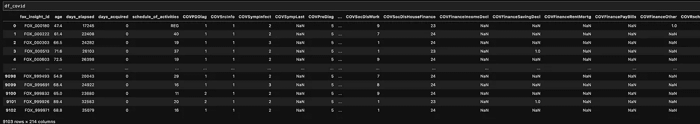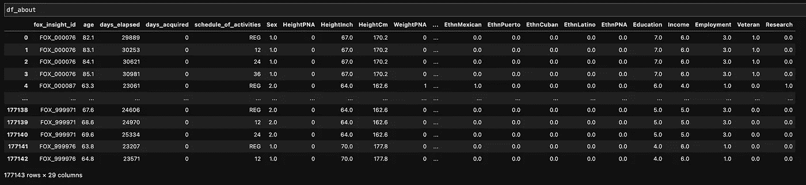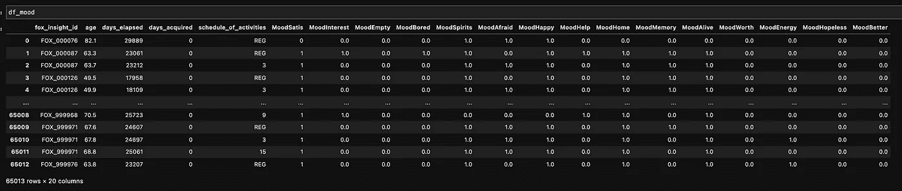

作者图片

## 数据预处理目标

1.  加入情绪、covid 和关于日期和 id
2.  删除包含空值的列
3.  删除“不愿意回答”行
4.  将情绪列一起编码到单独的类别中
5.  由于我们使用聚类算法，我们将执行主成分分析

经过预处理后，我们绘制了解释方差对 PCA 成分的数量。

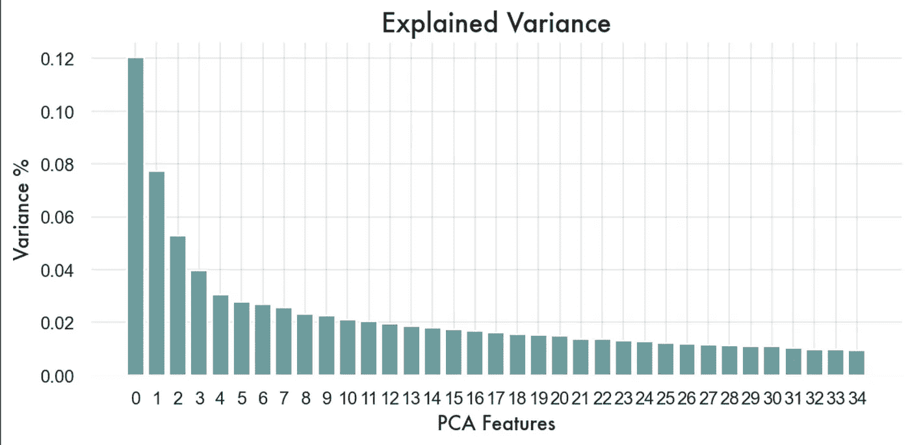

作者图片

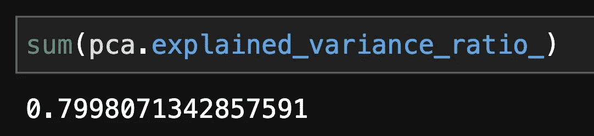

作者图片

由于用 35 个主成分解释的方差比刚好低于 0.80，我们得出结论，35 个主成分将足以压缩 293 列。

## k 均值聚类

在高层次上，机器学习的两个子集是监督学习和非监督学习。这两者之间的区别在于实例是否已经被预先标记(监督学习)或者没有被预先标记(非监督学习)。

给定预测值和它们相应的标签，训练监督学习算法，直到它能够区分预测值和它们的标签之间的关系。首要目标是根据新数据实现标签的准确预测。然而，对于无监督学习，目标是推断数据中以前未知或不清楚的关系和模式。

K-Means 是最常见的聚类技术之一，属于无监督学习方法的范畴。通过聚类技术解决的基本情况是当我们想要通过相似性推断数据的自然分组时。

## **选择‘k’**

我们的算法需要输入聚类数 k，您可能想知道我们如何选择合适的聚类数。首先，在选择“k”时没有确定的答案或万无一失的方法。然而，有一些常见的做法来获得一些关于“k”的适当值的直觉。对于这个项目，我们选择了肘方法。

肘法是一个相对简单的想法。对于不同的 k 值，我们简单地评估数据点和它们指定的聚类质心之间的平方距离之和，并且我们选择平方距离之和开始以图形方式变平的 k 值。

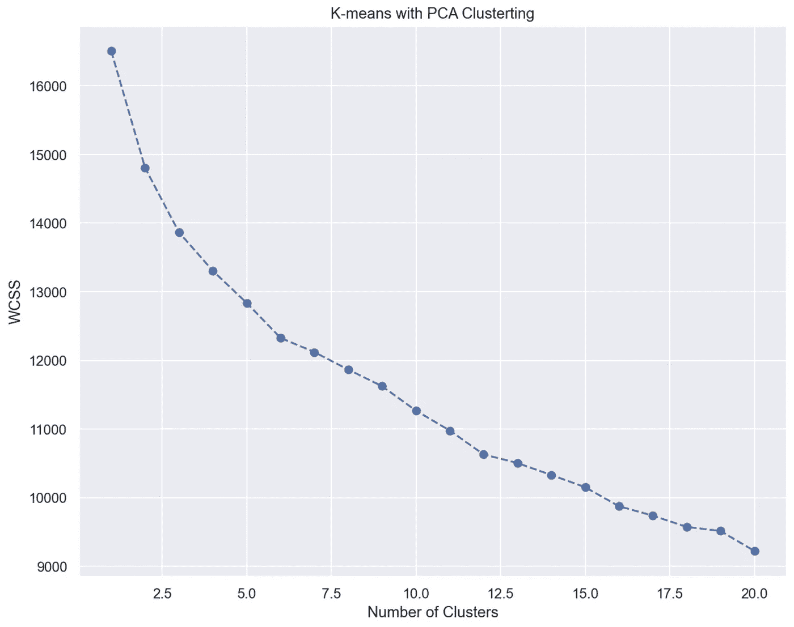

作者图片

根据肘法，一个合适的“k”可能在 6 左右。下面，我们通过绘制主成分 1 与接下来的 5 个主成分来可视化具有 6 个聚类的聚类算法的性能。我们可以看到，该算法在识别独立的集群方面做得不错。

## 基于情感比较聚类

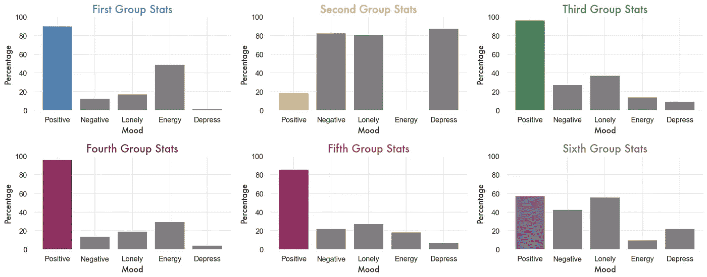

作者图片

虽然大多数集群都有相当积极的反应，但作为对立物脱颖而出的两组是第一和第二集群。

我们使用 Spark 重新运行数据，发现了类似的结果:

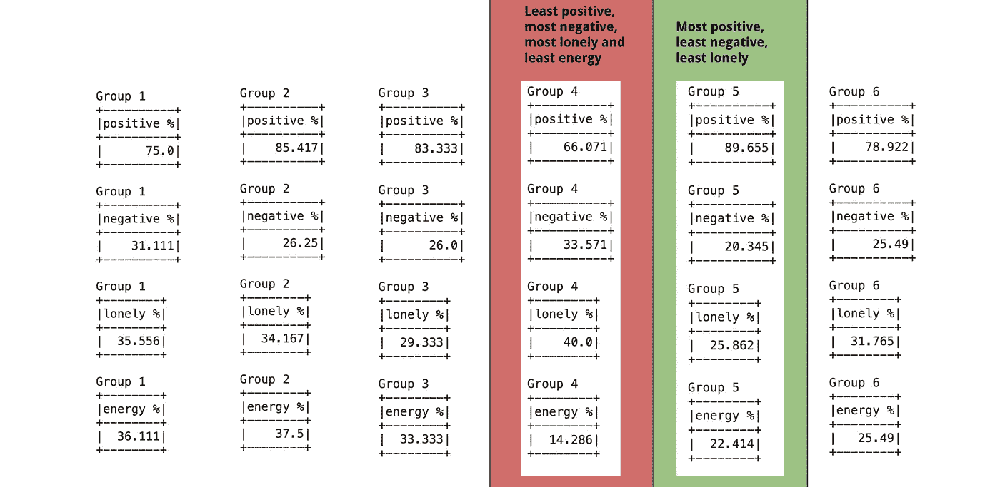

作者图片

一个自然的问题出现了:我们能找出是什么导致了两组人之间的差异吗？

## 收入

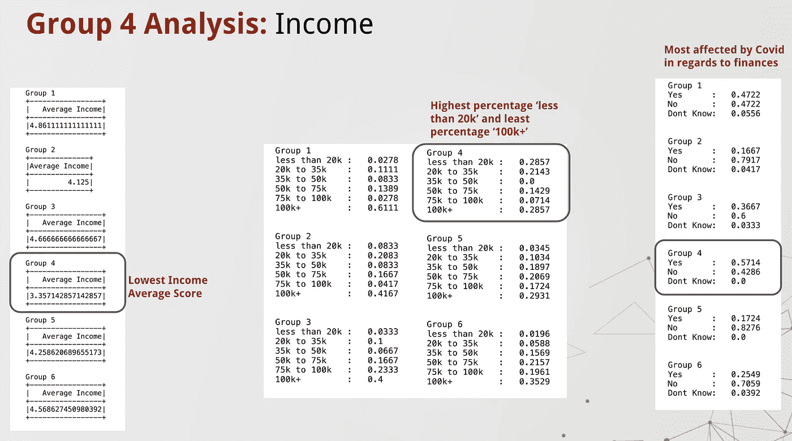

作者图片

通过对第 4 组的收入分析，我们发现该组的平均收入得分最低，收入“低于 2 万美元”的比例最高，收入“超过 10 万美元”的比例最低。随后，第 4 组在财务方面受 Covid 的影响最大。

## Covid 的影响

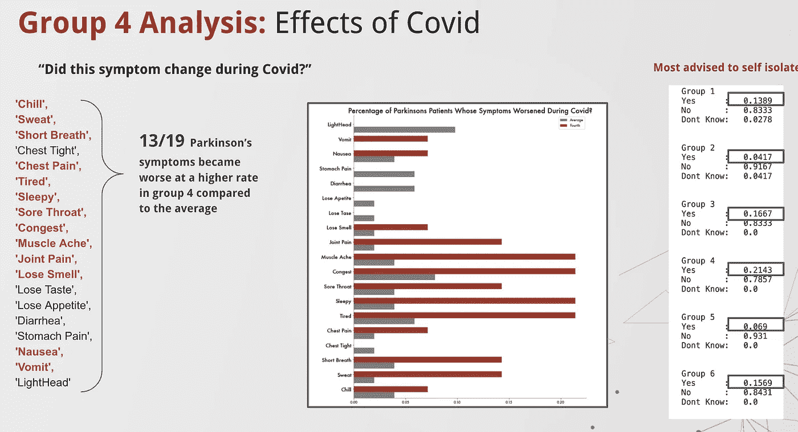

作者图片

此外，与平均值相比，第 4 组的 Covid 症状恶化率更高。他们也被建议自我隔离。

## 收入人口统计

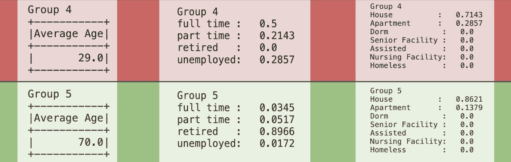

作者图片

第 4 组和第 5 组之间的收入统计数据的比较显示，第 4 组实际上没有退休的患者，而第 5 组有绝大多数退休的患者。

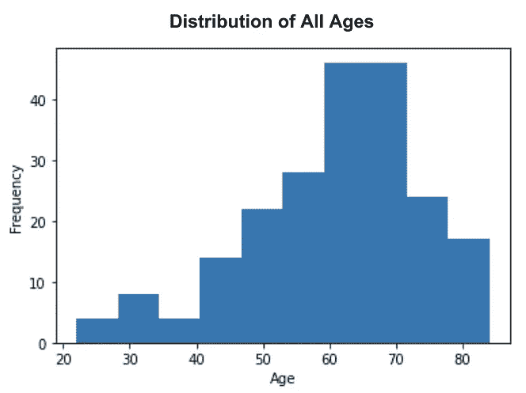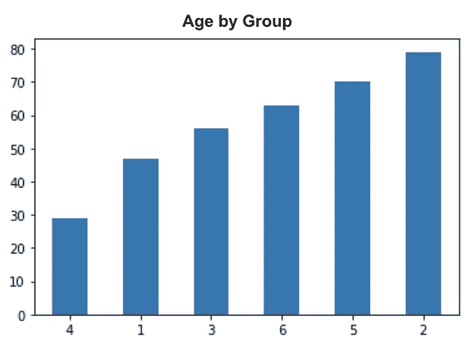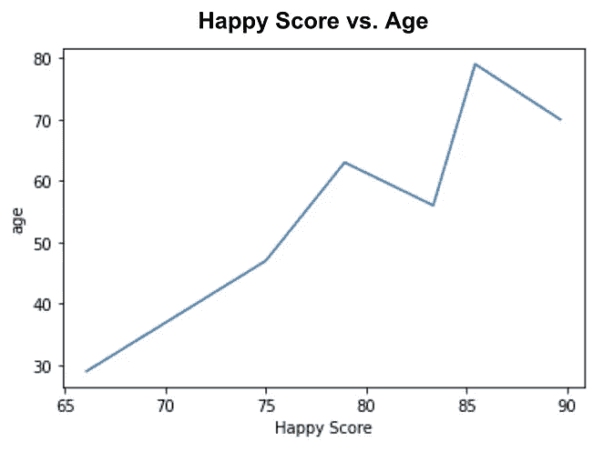

作者图片

由于年龄和退休之间的直接关系，年龄显然是一个需要探索的重要特征。所有患者的年龄分布显示，大多数患者年龄较大。第二个情节突出了第四组是迄今为止最年轻的一组，平均年龄只有 29 岁；这是之前直方图中的一个大的异常值。因为第四组是最不快乐的，我们决定分析这是否普遍。在最后一张图中，我们绘制了所有“快乐”分数与年龄的关系。我们可以看到有一个年龄随正分线性增长的总趋势。

对此的一个可能的解释是，想要社交的年轻人更容易受到 Covid 的社会影响，而更居家的老年人生活更正常。

## 摘要

1.  尽管聚类仅基于欧几里德距离，但如果存在一些基本的差异组(对于正确数量的聚类)，它也能准确地捕捉到这些差异组。
2.  在这种情况下，聚类分析显示，在新冠肺炎期间，有明显的社会影响对年轻组比对老年组帕金森病人产生不利影响。

— — — — — — — —— — — — — — — — — — — — — — — — — — — — — — —

*团队包括:克里斯塔贝尔·帕巴兰、维克多·纳兹鲁克汉扬和丹尼尔·卡雷拉*

*“Fox Insight 研究(FI)由迈克尔·J·福克斯帕金森研究基金会资助。我们要感谢帕金森社区参与这项研究，使这项研究成为可能。”*

*“本文准备过程中使用的数据于 2021 年 3 月 10 日从 Fox Insight 数据库(https://Fox Insight-info . michaeljfox . org/Insight/explore/Insight . JSP)获得。有关该研究的最新信息，请访问 https://fox insight-info . michaeljfox . org/insight/explore/insight . JSP。*