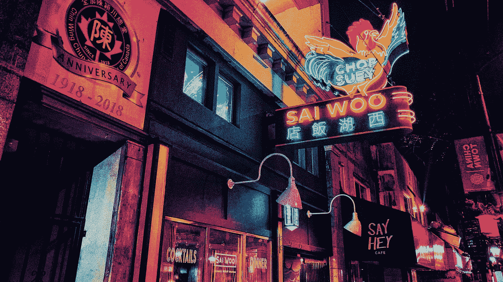
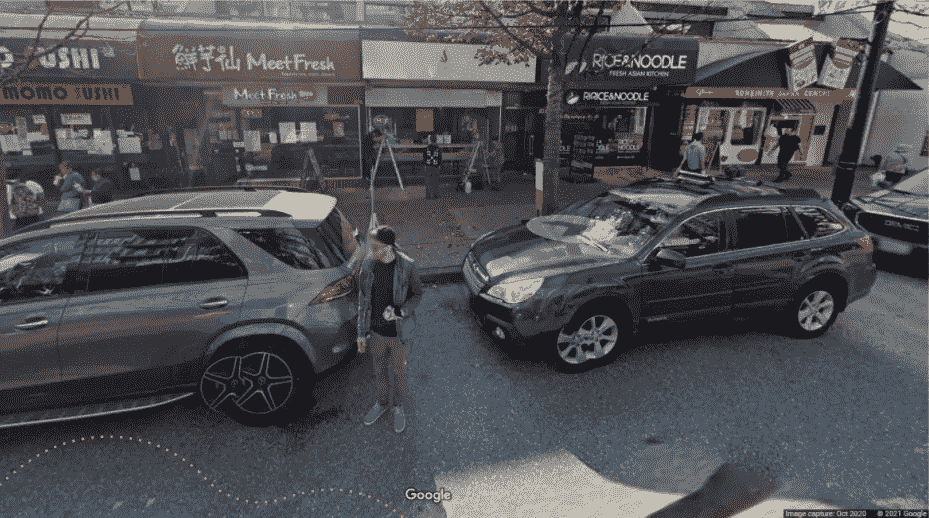
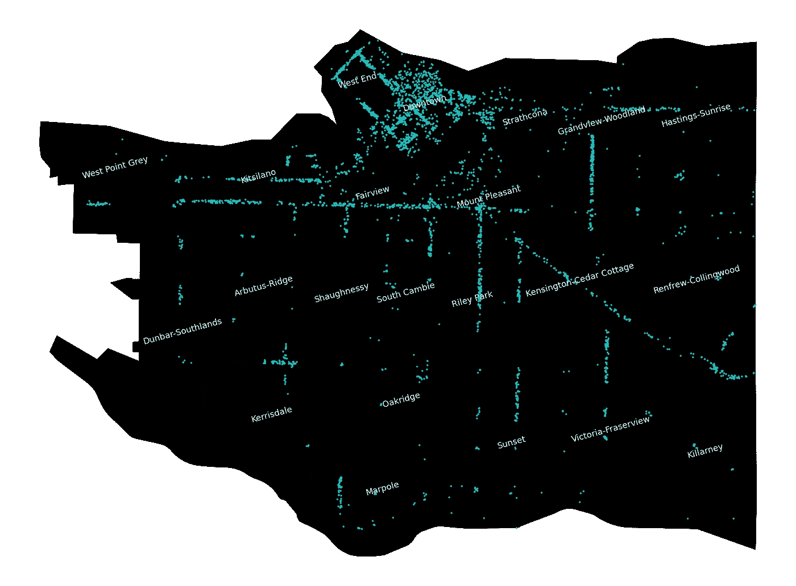
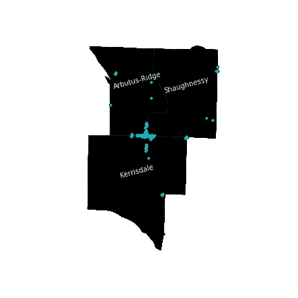
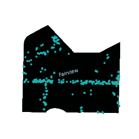
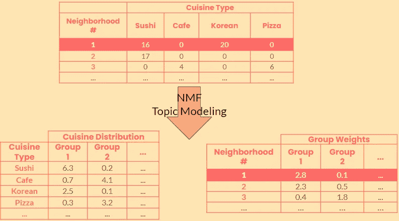
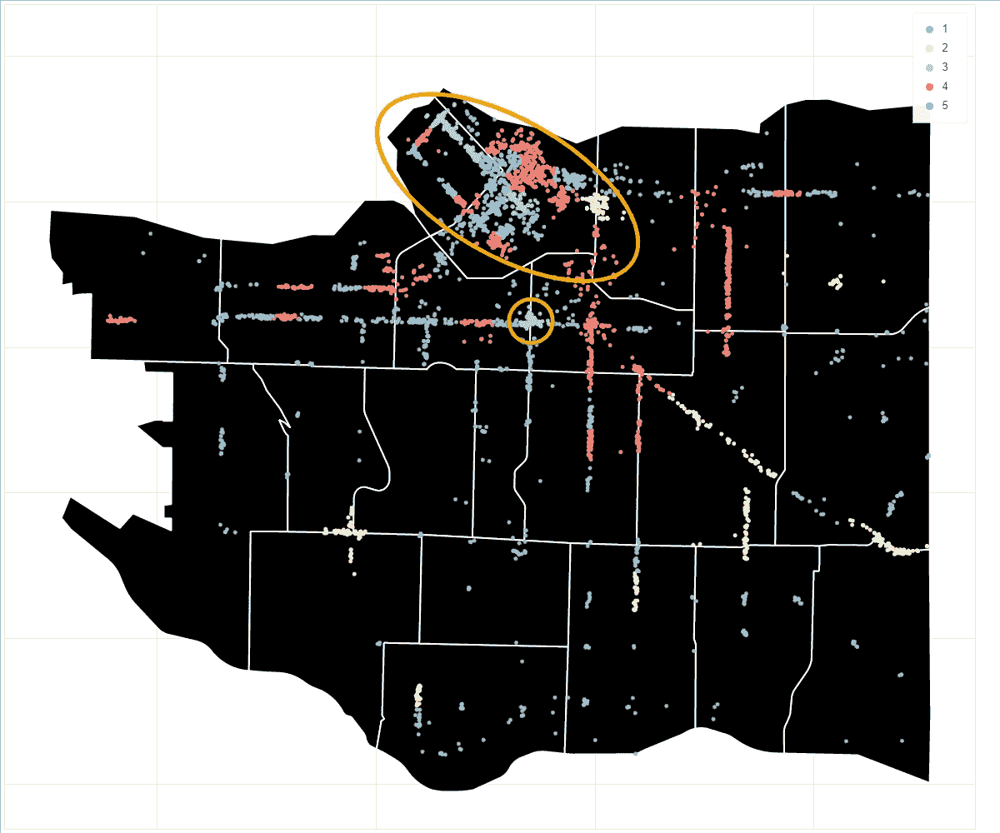

# 不列颠哥伦比亚省温哥华的餐馆聚集区

> 原文：<https://towardsdatascience.com/clustering-culinary-neighborhoods-in-vancouver-british-columbia-d8c712399874?source=collection_archive---------21----------------------->

我们可以在哪个集群中找到这家餐厅？让我们来了解一下！(照片由 [Unsplash](https://unsplash.com?utm_source=medium&utm_medium=referral) 上的 [JP Holecka](https://unsplash.com/@jaypiddy?utm_source=medium&utm_medium=referral) 拍摄)

## 通过 Python 中的主题建模和聚类算法，我展示了温哥华各个街区美食的地理模式。

作为一个自豪的温哥华人，我经常向在美国生活时遇到的人提起我来自哪里。除了搞不清楚温哥华位于哪个海岸之外，不熟悉的人通常会告诉我，他们访问这座城市只是为了乘船去阿拉斯加。然而，温哥华不仅仅是加拿大的西部港口。旅游指南宣称温哥华以其[的自然美景、令人难忘的户外活动和多样化的社区而闻名。然而，如果不提到温哥华充满活力的美食，那么对温哥华的描述就不完整:](https://www.travelandleisure.com/travel-guide/vancouver)

> 不要告诉这个国家的其他地方，温哥华是加拿大的外出就餐之都。放弃你的饮食，直接进入北美最好的亚洲美食，从闲聊的中国餐馆到越南的 banh mi 三明治店，或者释放你对新鲜捕获的当地海鲜的丰富自助餐的食欲，包括季节性斑点虾和多汁的野生鲑鱼。——[*孤独星球*](https://www.lonelyplanet.com/canada/vancouver)

但是如果没有旅游指南，我们还能如何找到描述温哥华美食之都的方法呢？答案当然在于数据。

# **动机:**

我对透过温哥华众多“美食街区”的视角探索温哥华很感兴趣——毕竟，当人们说他们住在温哥华时，他们实际上是指他们在外出就餐的地方花了很多时间。和大多数城市一样，温哥华的餐馆往往聚集在客流量大的地区(对此的经济解释可以在这里找到)。

温哥华罗布森街的谷歌地图街景。我们仅在一个街区就有至少四家餐馆！(图像屏幕-由作者捕捉)

但考虑到温哥华可供就餐的美食种类繁多，我对特定类型的美食通常位于何处，以及餐馆聚集在一起的方式是否有任何模式变得更感兴趣。通过主题建模和聚类算法的应用，本博客旨在回答两个问题:

1.  某些类型的菜肴在某些地区比在其他地区更有代表性吗？
2.  我们可以根据温哥华最受欢迎的美食来划分区域吗？

旅行者在选择外出就餐的特定菜系时可以使用这种分析来识别感兴趣的区域，但也可以标记特定菜系的餐馆经营者的进入区域，该餐馆经营者希望避开可能已经被该菜系饱和的区域。

# 数据收集和准备:

为了回答这些问题，我使用了 Yelp 提供的[数据，确定了位于](https://www.kaggle.com/yelp-dataset/yelp-dataset)[温哥华本地边界](https://opendata.vancouver.ca/explore/dataset/local-area-boundary/export/)内的约 4000 家餐馆类企业。我从 Yelp 餐厅数据中分析了三个主要特征:

*   地理位置
*   来自 [Yelp 定义的餐厅标签](https://blog.yelp.com/2018/01/yelp_category_list)的美食类型
*   平均星级的贝叶斯估计。这是 Yelp 确定的 5 星评级的一种修改措施，用于减少评论数量少的企业产生的噪音。我用来计算这个指标的公式可以在这个[网站](https://www.animenewsnetwork.com/encyclopedia/ratings-anime.php#best_bayesian)上找到

我的数据样本，如果我自己这么说的话，这是一个非常好的多汁猪肉饺子的地方……(图片由作者提供)

我们分析的第一步是为我们的餐馆数据确定标签，这些标签将餐馆分成人们会去并容易走进的区域。我称这些为“美食社区”我从温哥华市政府定义的 22 个社区中的餐馆位置开始:

(图片由作者提供)

餐馆往往聚集在一些可见的区域，但城市提供的街区边界在识别我们的美食街区时提出了两个问题:

*   我们看到出现在城市街区边界的餐馆集群会被任意分割。

(图片由作者提供)

*   我们还看到，像美景镇这样的较大的社区将大量的餐馆聚集在一起，而没有占据社区内较小的、更适合步行的区域。

(图片由作者提供)

我避免使用城市的标签来识别我的烹饪社区，而是使用 KMeans 聚类算法在餐馆的位置上生成标签。在我指定了我希望在我的数据中包含的标签数量(KMeans)之后，该算法的效果是根据它们的位置来标记餐馆。使用 [scikit-learn 的轮廓分数](https://scikit-learn.org/stable/modules/generated/sklearn.metrics.silhouette_score.html)作为优化我的标签质量的指标，我将我的数据分成 123 个烹饪社区。这产生了以下更新的餐厅图，用颜色表示我们烹饪社区的不同标签:

(图片由作者提供)

# **数据建模**

现在我们已经确定了我们的烹饪社区，我们可以开始确定在这些社区中发现的烹饪类型的模式。我将我的数据建模过程概述如下。

*   首先，我将每个街区表示为不同菜系数量的向量。这给了我们一个初步的方法来量化我的邻居，并找出他们之间的差异。
*   为了纳入餐馆质量的信息，我进一步调整了每一种菜系的计数，这是基于该街区对该菜系相对于城市平均水平的平均评分。
*   我的数据显示有 332 种不同的烹饪类型，因此很难确定我们的数据中可能存在什么模式。因此，我对我的数据应用了一种 NMF 算法，将每个街区描述为一个美食*群体*的集合，而不是许多单独的美食类型——这一过程被称为主题建模(下文将详细介绍)。为了简单地描述这个过程，NMF 算法使用关于通常发生在邻近地区的烹饪类型的信息，并创建由各个烹饪类型的分布构成的烹饪组(主题);然后，该算法根据每个街区在每个烹饪组中的权重，生成每个街区的表示。

(图片由作者提供)

*   将每个邻域转换成烹饪组集合后，我应用另一个 KMeans 聚类算法，根据每个烹饪组的权重对邻域进行聚类。这将决定我们可能会在每个街区代表的烹饪群体中看到什么样的模式。

(图片由作者提供)

**主题建模温哥华美食**

在对我的数据尝试 NMF 算法的不同数字输入后，我决定对四个烹饪组进行建模。按照在每个烹饪组中的权重显示前 5 种烹饪类型揭示了一些非常独特的主题。

平均类别计数还显示了城市中每种烹饪类型的出现与其在每个烹饪组中的权重之间的一般相关性(图片由作者提供)

第 1 组(酒吧/西方)的主要特点是酒吧的出现，以及西方美食类型，如三明治、海鲜和来自加拿大和美国的美食。

对于第 2 组(中国/越南)，我们看到中国美食和其他相关标签如点心和海鲜的权重很大。鉴于温哥华有大量的中国人口，这在温哥华作为一个烹饪团体并不令人惊讶。然而，我们也看到了相当大的重量为越南菜，这意味着这些美食一起出现在类似的地点。

第 3 组(日本/韩国)显示了类似的趋势，日本料理占很大比重，而韩国料理也占相当大的比重。

最后，我们有第 4 组(休闲/咖啡馆)，它有咖啡和茶、咖啡馆、早午餐、比萨饼和三明治，是这个烹饪组的特色。

**按烹饪类别对温哥华街区进行聚类**

现在我们来看看我们的第二个 KMeans 聚类算法是如何基于烹饪组权重对我们的邻居进行聚类的。在这里，我选择 K = 5 是基于确定损失度量的最大减少，惯性(参见 [scikit-learn 的聚类文档](https://scikit-learn.org/stable/modules/clustering.html)的第 2.3.2 节)。

下面，我提供了显示特定邻域分组的邻域具有的权重范围的箱线图。除了邻域标签#5 之外，这些邻域聚类中的每一个都表现出对我建模的四个烹饪组中的一个的强权重，如来自特定烹饪组的每个邻域的高权重所示。

(图片由作者提供)

# **结果**

在所有这些建模之后，我们最终可以在温哥华的地图上绘制出我们得到的邻域标签，在那里我们可以找到针对特定烹饪群体的加权区域。每个邻域分组的图例如下:

1.  绿色:偏向条形/西部
2.  黄色:偏向中国人/越南人
3.  紫色:偏向日语/韩语
4.  红色:偏向休闲/咖啡馆
5.  蓝色:不偏向任何一个烹饪类别

(图片由作者提供)

总的来说，温哥华的许多地区并不是由一个特定的烹饪团体主导的，直到你开始搬进住宅区或温哥华市中心。以下是我从这张地图中得到的一些亮点:

*   在橙色圆圈中，我们看到温哥华市中心被绿色的酒吧/西餐集团所占据，这是可以理解的，因为这与温哥华的夜生活有关。然而，我们也看到了一些标记为其他烹饪组的口袋，不仅显示了温哥华的餐饮选择是多么多样化，而且也显示了日本和中国烹饪组的密集区域。这些饱和区可以定位有意义的区域，如温哥华的唐人街，由市中心东侧的黄色集群表示。
*   金色圆圈代表我在查看数据时的一个发现。在我进行分析之前，我所知道的温哥华唯一充斥着日本或韩国餐馆的地区都位于市中心。然而，调查这个美食街区的标签，发现一个由日本餐馆主导的区域，我以前并不熟悉。我看了一下排名前三的日本餐馆，发现它们也有一些不错的评论！我在这里联系一下供参考: [Saku](https://www.yelp.com/biz/saku-vancouver-3) 、 [Uma 寿司](https://www.yelp.com/biz/uma-sushi-vancouver)、[丸里路咖啡馆](https://www.yelp.com/biz/marulilu-cafe-vancouver?osq=Marulilu)。

## **总结思路**

我的项目揭示了温哥华的餐馆场景可以分为四大菜系，其中三个主要倾向于酒吧、中国和日本菜系。在地图上标出不同的菜系表明，在某些地区某些民族的菜系占主导地位，从而确定人们可以在城市的多个地区寻找特定的菜系。

我计划研究如何将温哥华的其他地理和人口特征结合起来，看看能否根据用户可能被吸引的区域创建一个餐馆推荐系统。

我对这些街区的最终标记似乎与我对这个城市的了解相吻合。它和你的一致吗？如果你同意或不同意，请在评论中告诉我！