# 地理空间应用中的聚类—您应该使用哪种模型？

> 原文：<https://towardsdatascience.com/clustering-in-geospatial-applications-which-model-should-you-use-59a039332c45?source=collection_archive---------8----------------------->

## [思想和理论](https://towardsdatascience.com/tagged/thoughts-and-theory)

## 应用于城市网络的机器学习中的 KMeans、DBSCAN 和分层聚类模型之间的新比较


香港夜间交通| [PxHere](https://pxhere.com/en/photo/1200898)

T 看看 Python 中流行的机器学习工具箱，scikit-learn 关于不同聚类算法的页面——你会看到 10 种不同算法之间的比较。软件包开发人员在比较和可视化应用于不同玩具场景的不同聚类算法方面做得非常出色。这些可视化的优势在于你肯定知道基本事实——例如，3 个斑点应该是 3 个集群。然而，这并没有明确地告诉我们这些算法将如何处理地理空间数据，这可能是相当复杂的。地理空间聚类的一些重要应用包括减少[大型位置数据集](https://geoffboeing.com/2014/08/clustering-to-reduce-spatial-data-set-size/)的大小，以及通过[出租车出行聚类](https://ieeexplore.ieee.org/document/7517811)了解大规模移动模式，用于城市规划和交通。

在许多实际情况下，很难先验地知道有多少个聚类是正确的。在这种情况下，很难解释将数据分组到聚类中的聚类算法的结果。再加上其他 9 种算法，你可能会在每种算法中得到不同的结果，而且几乎不可能知道哪种算法最接近事实。在这里，我通过 3 个步骤对同一个曼哈顿城市街道网络数据集应用了 3 种代表性的聚类算法——k means、DBSCAN 和层次凝聚聚类:

1.  *使用逾渗理论的统计物理学中的相变标准，通过随机移除临界数量的节点，将曼哈顿街道网络分成 3 个大型集群*
2.  *对数据集应用不同的聚类算法，并在此过程中发现一种在节点移除之前校准聚类算法的新方法*
3.  *通过 Jaccard 相似性度量评估哪些聚类算法的性能优于其他算法。*

好了，该行动了！

# 从 OSMnx 获得曼哈顿街道网络

```
import osmnx as ox
place=’Manhattan, New York City, New York, USA’
G = ox.graph_from_place(place)
ox.plot.plot_graph(G,edge_linewidth=0.1,edge_color='C0',node_size=0,bgcolor='w',save=True, filepath='Manhattan.png')
```

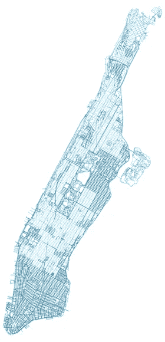

从 OSMnx 获得的曼哈顿街道网络

为了获得曼哈顿的街道网络，我们使用了 OSMnx，这是一个基于 python 的包，用于利用强大的协作地图项目 OpenStreetMap (OSM)对城市街道网络进行网络分析。网络包含表示交叉点的结点和表示交叉点之间双向道路的边。

# 来自逾渗理论的基本事实

为了获得地面真相，我们需要找到一种方法，通过适当地删除节点，将网络划分为少量的簇。这对于网络来说通常是困难的，因为仅仅移除几个节点就可能导致多个小集群，从单个大集群中分离出来，并且这变得难以通过聚类算法来检测。

相反，我们使用逾渗理论的统计物理学。许多论文(包括我们最近关于联网车辆遭受网络攻击后大规模网络中断的工作)表明，随机移除城市网络中的节点会导致渗透转变。在这个转变点，第二大簇具有最大的尺寸。这意味着在逾渗点，聚类算法最有可能从其余的噪声中区分出两个或三个大的聚类。

```
w = np.where(SG == np.max(SG))[0][0]G2 = G.copy()
G2.remove_nodes_from(nodes_G[0:int(w*100)])
conn = nx.weakly_connected_components(G2)
conn_list = list(conn)
conn_list = sorted(conn_list, key=len, reverse=True)
G3 = G2.copy()
for i in range(0, len(conn_list) — 3):
 G3.remove_nodes_from(conn_list[i + 3])X_G3 = [[G3.nodes[node][‘y’], G3.nodes[node][‘x’]] for node in G3.nodes]
ids_G3 = [list(G3.nodes())[i] for i in range(0, len(list(G3.nodes())))]labels=np.zeros(len(ids_G3))for i in range(0,len(ids_G3)):
 if(ids_G3[i] in conn_list[0]):
 labels[i]=0if(ids_G3[i] in conn_list[1]):
 labels[i]=1if(ids_G3[i] in conn_list[2]):
 labels[i]=2nc_g,ns_g=plot1(G,ids_G3,labels,’ground_truth.png’)
```

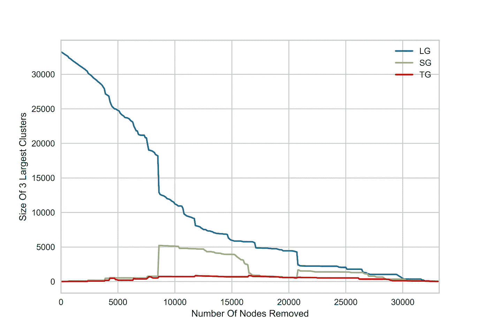

逾渗转换法将城市网络分解成集群以备后续测试|塞犍陀·维韦克

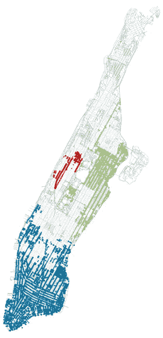

3 个最大的集群|塞犍陀·维维克

3 个最大的聚类代表了与我将要介绍的各种聚类算法相比较的“基本事实”。

# K 表示 K=3


k 均值的收敛| [Chire](https://en.wikipedia.org/wiki/K-means_clustering#/media/File:K-means_convergence.gif)

首先，让我们看看 vanilla KMeans 方法是如何工作的。KMeans 方法将数据划分为 K 个簇，通过迭代优化来减少簇内方差。每个可观察值属于具有最近平均值的组。显而易见的选择是 K=3，从地面真理。

```
#kmeans n_clusters=3
model = KMeans(n_clusters=3, random_state=0).fit(X_G3)
k3_labels = model.labels_
#kmeans_labels = np.unique(model_labels[model_labels >= 0])nc_k3,ns_k3=plot1(G, ids_G3, k3_labels,’kmeans_3.png’)
```

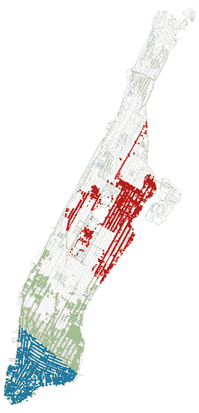

K 均值聚类结果，K=3 |塞犍陀·维韦克

结果表明，KMeans 将第一个聚类分成两个，而将第二个和第三个聚类合并为一个单独的聚类。这是由于 KMeans 对球状、线性可分数据的限制。请记住，在这种情况下，我们选择了 K=3 的值，因为我们从地面真相中知道应该是 3 个集群。然而，情况并非总是如此，大多数时候我们不知道有多少个集群存在，需要一个可靠的算法来告诉我们要寻找多少个集群。相反，让我们使用 elbow 方法来找到最佳的聚类数，然后使用最佳的聚类数来应用 KMeans。

# 肘法

```
#kmeans elbow methodmodel = KMeans()
visualizer = KElbowVisualizer(model, k=(4, 12))visualizer.fit(np.array(X_G3)) # Fit the data to the visualizer
model = KMeans(n_clusters=visualizer.elbow_value_, random_state=0).fit(X_G3)
ke_labels = model.labels_
#kmeans_labels = np.unique(model_labels[model_labels >= 0])nc_ke,ns_ke=plot1(G, ids_G3, ke_labels,’kmeans_elbow.png’)
```

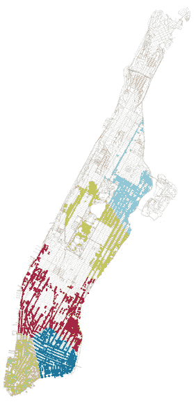

使用肘方法，用 KMeans 对结果进行聚类；K=7 |塞犍陀·维维克

我们使用 yellow brick machine learning visualizer 软件包中的 KEllbowVisualizer，它实现了“肘”方法，通过用一系列 K 值拟合模型来选择最佳聚类数。肘方法给出了 K=7 的最佳值，但与选择 K=3 相比，它的表现尤其糟糕。

# 肘形法

DBSCAN 方法广泛用于地理空间聚类。该方法使用两个参数 MinPts 和 Eps 来拟合聚类。MinPts 是将一个点视为聚类核心的一部分所需的半径 Eps 内的最小数量，包括该点本身(下图中标为 A 的点)。如果一个点是从核心点可到达的，但是在半径 Eps 内不包含 MinPts，那么它被认为是该簇的非核心点(点 B & C)。最后，从核心点不可到达的点是噪声点(点 N)。

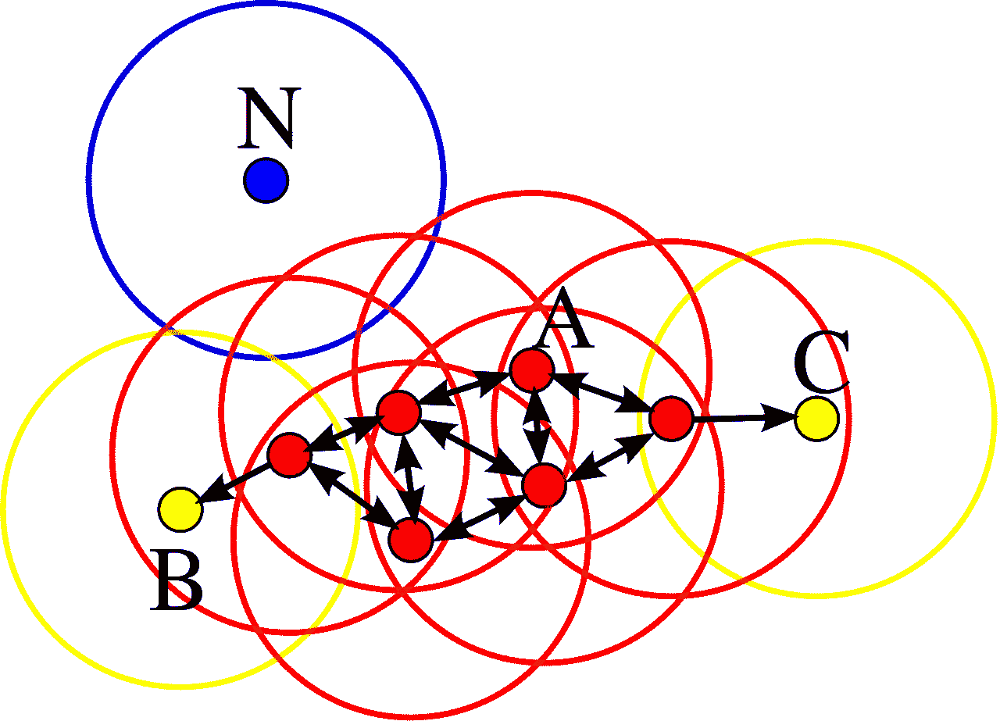

DBSCAN 聚类算法，MinPts=4| [Chire](https://commons.wikimedia.org/wiki/File:DBSCAN-Illustration.svg)

选择 Eps 和 MinPts 并不简单，但是有一些广泛使用的试探法。通常使用 min pts≥2 *维。我们使用 MinPts=5，因为曼哈顿很大程度上是一个网格。在一个网格中，每个交叉点都有 4 个相邻的交叉点，这使得 5 个交叉点包括它自己。要选择 Eps，我们用肘法

```
neigh = NearestNeighbors(n_neighbors=5)
nbrs = neigh.fit(np.radians(X_G3))
distances, indices = nbrs.kneighbors(np.radians(X_G3))
distances = distances[:, 1]
distances = np.sort(distances, axis=0)
fig=plt.figure()
plt.plot(distances)
plt.xlim(15000, 19000)
plt.ylim(.000001, .00002)plt.ylabel(‘5-NN Distance (Radians)’)
plt.xlabel(‘Points Sorted By Distance’)
plt.savefig(‘dbscan_elbow’,dpi=600)model = DBSCAN(eps=0.000005, min_samples=5, algorithm=’ball_tree’, metric=’haversine’).fit(np.radians(X_G3))dbe_labels = model.labels_
#db_labels = np.unique(model_labels[model_labels >= 0])
nc_dbe,ns_dbe=plot1(G, ids_G3, dbe_labels,’dbscan_elbow_G.png’)
```

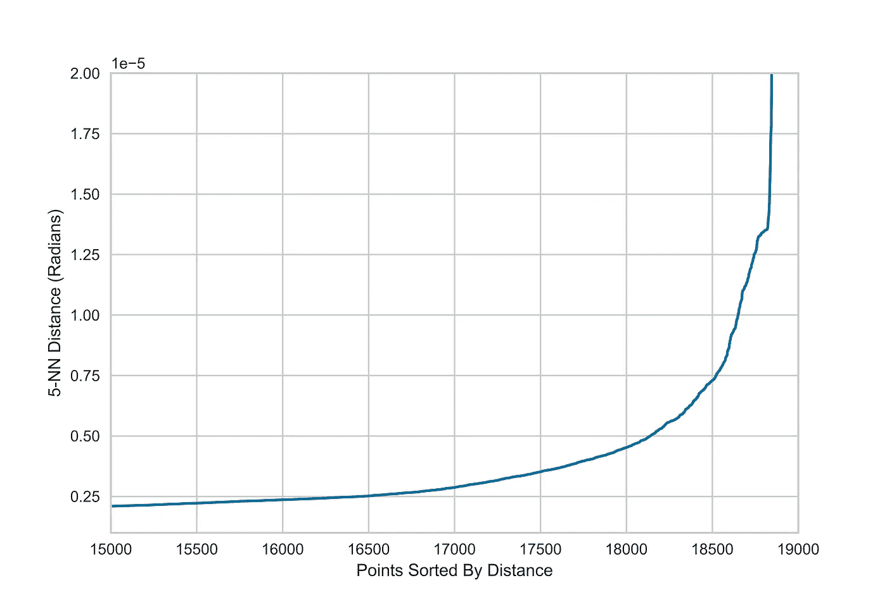

寻找最佳 Eps 的 DBSCAN 肘法|塞犍陀·维韦克

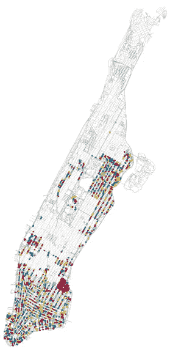

塞犍陀·维韦克

这种方法效果很差。似乎 Eps=0.000005 被严重低估了，因为星团非常小。相反，如果我们在删除节点之前查看群集以进行校准，会怎么样？

# 校准的 DBSCAN

当曼哈顿街道网络中的节点未被移除时，理想的算法将给出 1 个大的连通聚类，而当节点被移除时，将给出 3 个聚类。让我们利用这些信息来校准 DBSCAN 算法的 Eps 值。

```
#dbscan calibration method# now figuring optimal epsilon for city
cs = np.zeros(16)
for i in range(0, 16):
 db = DBSCAN(eps=np.linspace(0.000005, 0.000005 * 10, 16)[i], min_samples=5, algorithm=’ball_tree’, metric=’haversine’).fit(
 np.radians(X_G))
 cs[i] = len(np.unique(db.labels_))
 # print(0.000005*(i+1))fig=plt.figure()
plt.loglog(np.linspace(0.000005, 0.000005 * 10, 16), cs)
plt.ylabel(‘Number Of Clusters’)
plt.xlabel(‘Eps Value (radians)’)
plt.savefig(‘dbscan_calib’,dpi=600)model = DBSCAN(eps=0.00003, min_samples=5, algorithm=’ball_tree’, metric=’haversine’).fit(np.radians(X_G3))dbc_labels = model.labels_
nc_dbc,ns_dbc=plot1(G, ids_G3, dbc_labels, ‘dbscan_calib_G.png’)
```

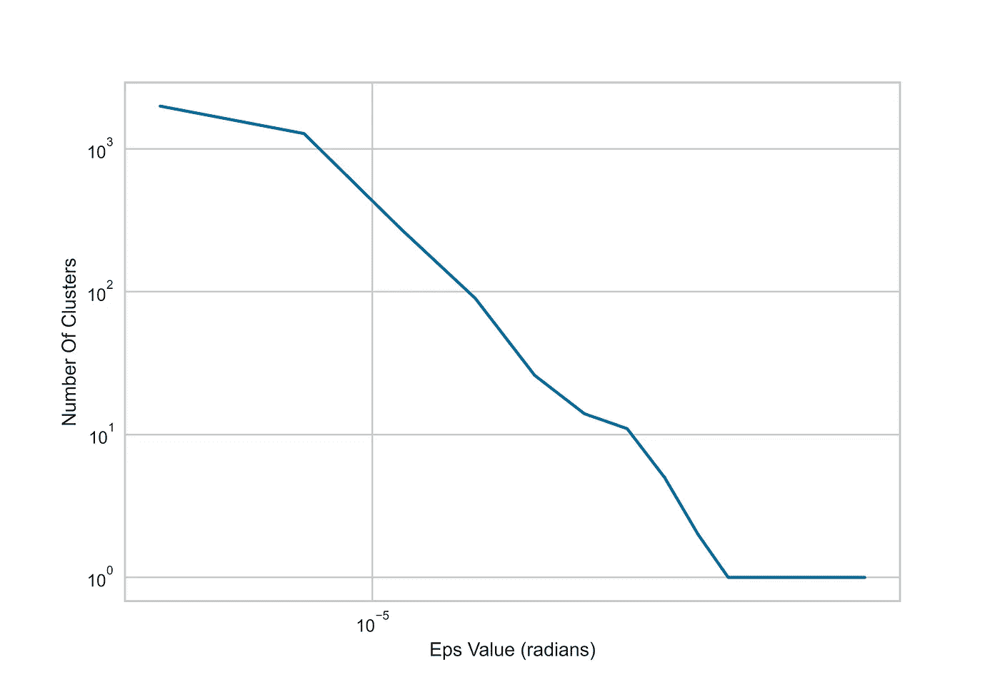

查找 Eps 的 DBSCAN 校准方法|塞犍陀·维韦克

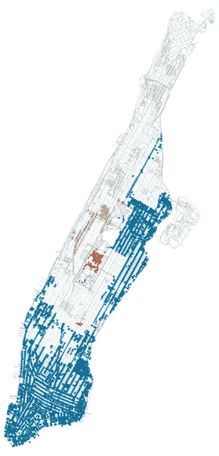

DBSCAN 校准方法|塞犍陀·维韦克

我们选择在没有删除节点时给出一个集群的最小 Eps 值，得到 Eps=0.00003。这产生了一个更好的结果，并且直观地显示出 3 个集群。第一个似乎覆盖了地面实况组 1 和 2，第二个和第三个组分裂了第三个地面实况组。所以更好，但不完美。

# 校准的层次凝聚聚类

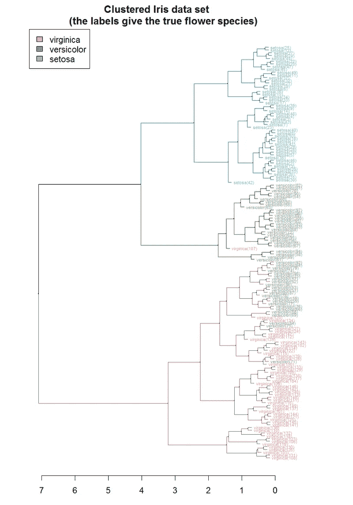

[Iris 数据集](https://en.wikipedia.org/wiki/Iris_flower_data_set) | [Talgalili](https://en.wikipedia.org/wiki/Hierarchical_clustering#/media/File:Iris_dendrogram.png) 的层次聚类[树状图](https://en.wikipedia.org/wiki/Dendrogram)

最后，让我们看一个聚类算法，它构建了一个聚类的层次结构。层次凝聚聚类是一种自下而上的方法，其中每个可观察值从一个单独的聚类开始，随着一个聚类在层次中向上移动，聚类对被合并。一般来说，这是一个相当慢的方法，但有一个强大的优势，那就是可以可视化整个聚类树，称为树状图。

根据应用程序的不同，有一些不同的选项来查找集群的数量。与 KMeans 类似，可以选择集群的数量。或者，当聚类相距太远而无法合并时，使用距离标准来停止聚类，类似于 DBSCAN。

层次聚类的缺点在于选择聚类数量或距离标准的非直观性——相当于将上述的树状图可视化，并进行任意的截断。

相反，我做了一些类似于 DBSCAN 校准方法的事情——从完全连通的曼哈顿网络校准凝聚聚类距离标准，而不移除节点。

```
#hierarchical agglomerative clustering calibration method
n_l=np.zeros(10)
for i in range(0,10):

    model = AgglomerativeClustering(distance_threshold=np.linspace(0.02,.2,10)[i], n_clusters=None)
    model = model.fit(np.radians(X_G))
    distances = model.distances_
    n_l[i]=len(np.unique(model.labels_))
    print(i)
plt.plot(np.linspace(0.02,.2,10),n_l)nc_ag,ns_ag=plot1(G, ids_G3, ag_labels, ‘hierarch_calib.png’)model = AgglomerativeClustering(distance_threshold=.2, n_clusters=None)
model = model.fit(np.radians(X_G3))
ag_labels = model.labels_
nc_ag,ns_ag=plot1(G, ids_G3, ag_labels, 'hierarch_calib_G.png')
```

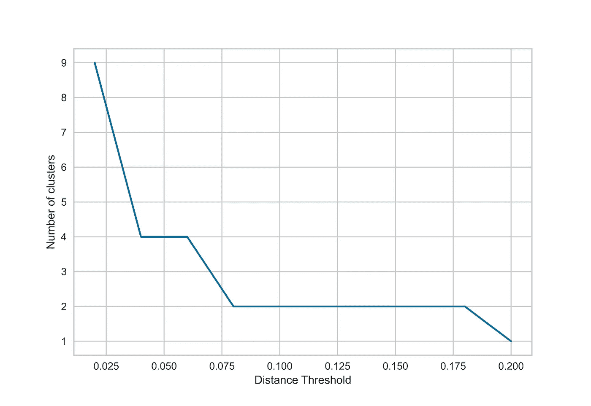

分级凝聚聚类距离标准校准|塞犍陀·维韦克

类似于 DBSCAN，我选择对应于距离阈值的最小值的距离标准，当没有节点从曼哈顿的街道网络中移除时，该距离阈值给出 1 个聚类。凝聚聚类只给出一个大的聚类。

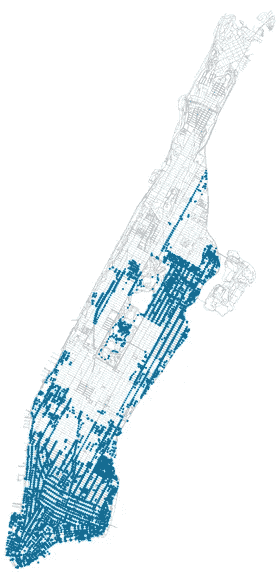

分层凝聚聚类结果|塞犍陀·维维克

当选择簇数= 3 时，看起来更好。

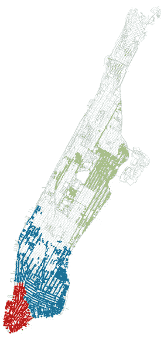

分层凝聚聚类结果，n_clusters=3 |塞犍陀·维韦克

# 地理空间应用的最佳算法是什么？

我们考虑了 3 种常用的空间聚类算法:KMeans、DBSCAN 和应用于曼哈顿街道网络的分层凝聚聚类。有趣的是，答案并不像我最初想的那样简单，它取决于最佳聚类数是否是先验已知的。

为了比较苹果和苹果，我在没有先验知识的情况下绘制了聚类算法的输出。从视觉上看，DBSCAN 似乎做得最好，证明了它在地理空间应用程序中的广泛使用。然而，如果我们事先知道聚类的数目，情况就不是这样了。

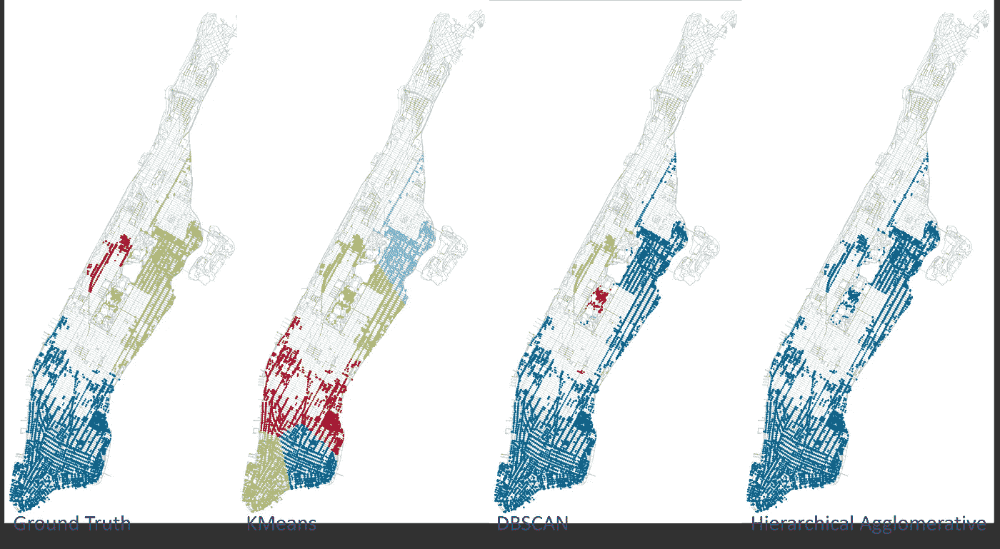

缺乏聚类数目先验知识时的聚类算法性能|塞犍陀·维韦克

为了量化每个算法的表现，我对非二进制类使用了 Jaccard 相似性度量。

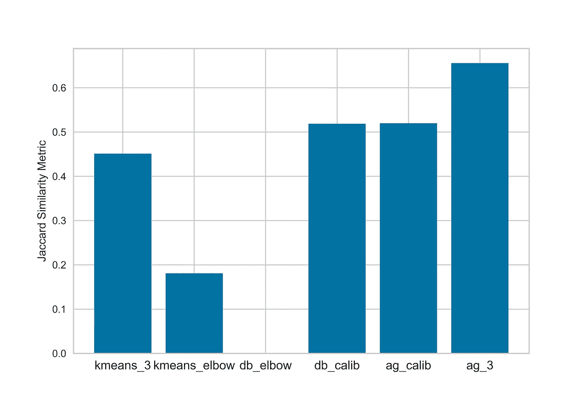

评估地理空间聚类算法的 Jaccard 评分|塞犍陀·维韦克

表现最好的是凝聚聚类算法，使用 n_clusters=3 (ag_3)，其 Jaccard 得分超过 0.65。在没有这些信息的情况下，通过校准(db_calib，ag_calib)的 DBSCAN 和凝聚聚类是并驾齐驱的。然而，我将把这一轮交给 DBSCAN，因为它识别单独的聚类，而凝聚聚类算法只找到单个聚类。

# 结论

如您所见，没有完美的空间聚类算法。在地理空间应用中尤其如此，其中网络节点和边不是均匀分布的，并且数据通常是有噪声的。获得的聚类算法结果可能是曼哈顿街道分布的一个特征，曼哈顿比其他城市更像网格-观察这些算法在其他城市网络中的表现可能会很有趣。我们知道，与新加坡、罗马和圣保罗等城市相比，芝加哥、迈阿密和曼哈顿等城市的街道网络更像网格。这里开发的方法通常可以应用于量化聚类方法在各种地理空间场景中的功效。如果您感兴趣，可以在 GitHub 上找到 python 代码。还有一个朱庇特笔记本:

<https://github.com/skandavivek/Geospatial-Clustering>  

以下是 YouTube 上的教程链接:

*参考文献:*

1.  [*Geoff Boeing，“聚类减少空间数据集大小”，SocArxiv (2018)*](https://osf.io/preprints/socarxiv/nzhdc/)
2.  [*Dheeraj Kumar 等人，“通过出租车出行聚类了解城市移动性”，第 17 届 IEEE 移动数据管理国际会议(MDM) (2016)*](https://ieeexplore.ieee.org/document/7517811)
3.  <https://arxiv.org/abs/1903.00059>*塞犍陀·维韦克等人，“被黑客攻击的联网车辆的网络物理风险”，《物理评论》E (2019)*
4.  *[*Geoff Boeing，《城市空间秩序:街道网络定向、配置和熵》，应用网络科学(2019)*](https://appliednetsci.springeropen.com/articles/10.1007/s41109-019-0189-1)*

*如果你喜欢这篇文章，请关注我。*

*如果你对科技和现代社会之间的相互联系有全面的看法，请订阅我的时事通讯。*

*<https://skandavivek.substack.com/> *