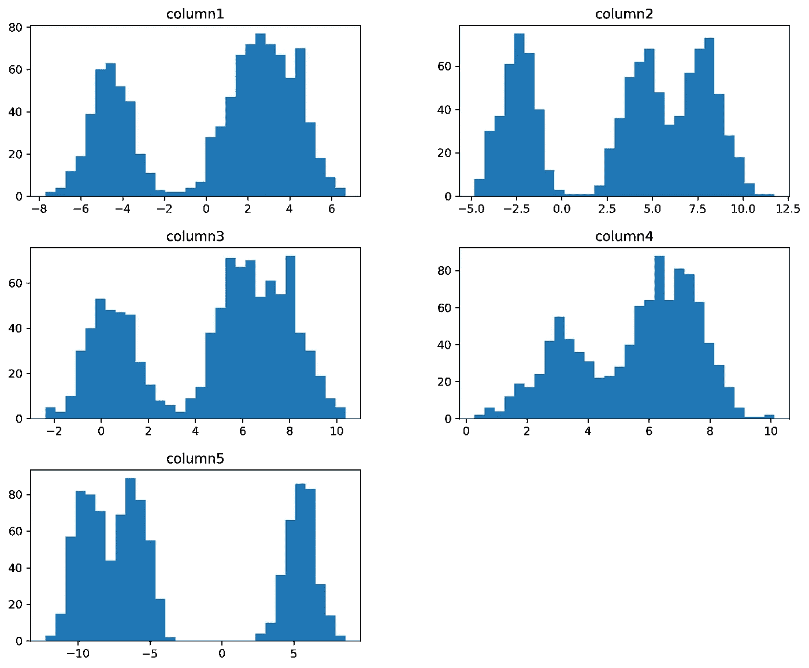
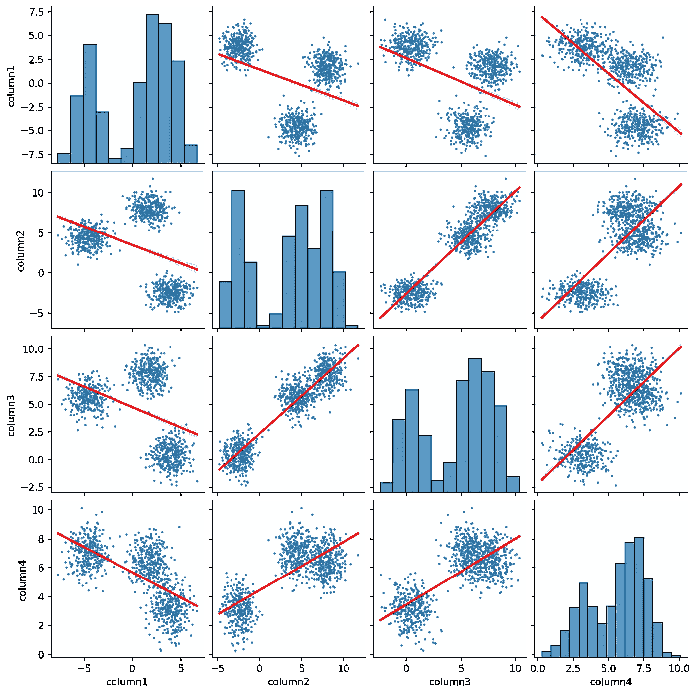

# PyCaret 简化了集群

> 原文：<https://towardsdatascience.com/clustering-made-easy-with-pycaret-656316c0b080?source=collection_archive---------3----------------------->

## 利用强大的 Python 库进行低代码机器学习


卢卡斯·霍布斯在 [Unsplash](https://unsplash.com?utm_source=medium&utm_medium=referral) 上的照片

> 这篇文章的内容最初发表在我的最新著作《用 PyCaret 简化机器学习》中。你可以[点击这里](https://leanpub.com/pycaretbook/)了解更多。

无监督机器学习的基本任务之一是聚类。此任务的目标是根据给定数据集实例的共同特征，将它们分类到不同的群集中。聚类在各个领域有许多实际应用，包括市场研究、社会网络分析、生物信息学、医学等。在本文中，我们将通过使用 [PyCaret](https://pycaret.org/) 来检查一个聚类案例研究，PyCaret 是一个 Python 库，它支持所有基本的机器学习任务，如回归、分类、聚类和异常检测。PyCaret 通过遵循低代码方法简化了机器学习工作流，从而使其成为初学者以及希望快速原型化 ML 模型的专家的绝佳选择。

# 软件要求

本文中的代码应该可以在所有主要的操作系统上运行，比如微软的 Windows、Linux 和苹果的 macOS。你需要在你的电脑上安装 Python 3 和 JupyterLab。我建议你使用 Anaconda，这是一个机器学习和数据科学工具包，包括许多有用的库和软件包。Anaconda 可以在这个[链接](https://www.anaconda.com/products/individual)免费下载。或者，你可以使用像 [Google Colab](https://colab.research.google.com/) 这样的云服务来运行 Python 代码，而不用担心在你的机器上安装任何东西。你可以创建一个新的 Jupyter 笔记本并输入代码，或者从 Github 库下载。

# 正在安装 PyCaret

通过在 Anaconda 终端上执行以下命令，可以在本地安装 PyCaret 库。您还可以在 Google Colab 或类似的服务上执行相同的命令，将库安装到远程服务器上。

`pip install pycaret[full]==2.3.4`

执行该命令后，PyCaret 将被安装，您将能够运行本文的所有代码示例。建议通过包含`[full]`说明符来安装可选的依赖项。此外，安装正确的包版本确保了最大的兼容性，因为我使用的是 PyCaret ver。2.3.4 撰写本文时。最后，[为 PyCaret 创建一个 conda 环境](https://docs.conda.io/projects/conda/en/latest/user-guide/getting-started.html#managing-envs)被认为是最佳实践，因为它将帮助您避免与其他包的冲突，并确保您总是安装了正确的依赖项。

# k 均值聚类

K-Means 聚类是最流行和最简单的聚类方法之一，易于理解并在代码中实现。它在下面的公式中定义。


*K* 是所有集群的数量，而 *C* 代表每个单独的集群。我们的目标是最小化 *W* ，这是集群内变化的度量。


定义类内变异有多种方法，但最常用的方法是平方欧几里德距离，如上式所示。这导致了以下形式的 K 均值聚类，其中 *W* 被欧几里德距离公式代替。


# 使用 PyCaret 进行聚类

K-Means 是一种广泛使用的方法，但还有许多其他可用的方法，如仿射传播、谱聚类、凝聚 Clustering⁴、均值漂移 Clustering⁵和基于密度的空间聚类(DBSCAN)⁶.我们现在将了解 PyCaret 聚类模块如何帮助我们轻松地训练模型并评估其性能。

```
import numpy as np
import pandas as pd
import matplotlib.pyplot as plt
import matplotlib as mpl
import seaborn as sns
from pycaret.clustering import *
from sklearn.datasets import make_blobs
mpl.rcParams['figure.dpi'] = 300
```

我们首先导入一些标准的 Python 库，包括 NumPy、pandas、Matplotlib 和 Seaborn。我们还导入了 PyCaret 聚类函数，以及可用于生成数据集的`make_blobs()` scikit-learn 函数。最后，我们将 Matplotlib 图形 DPI 设置为 300，这样我们就可以获得高分辨率的图形。没有必要启用此设置，所以如果需要，可以删除最后一行。

# 生成合成数据集

```
cols = ['column1', 'column2', 'column3',
        'column4', 'column5']arr = make_blobs(n_samples = 1000, n_features = 5, random_state =20,
                 centers = 3, cluster_std = 1)data = pd.DataFrame(data = arr[0], columns = cols)
data.head()
```


作者图片

```
data.info()<class 'pandas.core.frame.DataFrame'>
RangeIndex: 1000 entries, 0 to 999
Data columns (total 5 columns):
 #   Column   Non-Null Count  Dtype  
---  ------   --------------  -----  
 0   column1  1000 non-null   float64
 1   column2  1000 non-null   float64
 2   column3  1000 non-null   float64
 3   column4  1000 non-null   float64
 4   column5  1000 non-null   float64
dtypes: float64(5)
memory usage: 39.2 KB
```

我们将使用`make_blobs()` scikit-learn 函数生成一个合成数据集，而不是加载真实世界的数据集。该函数生成适合于聚类模型的数据集，并且具有可以根据我们的需要修改的各种参数。在本例中，我们创建了一个包含 1000 个实例、5 个特征和 3 个不同聚类的数据集。使用合成数据集来测试我们的聚类模型有各种好处，主要是我们已经知道了实际的聚类数，因此我们可以轻松地评估模型性能。真实世界的数据通常更加复杂，也就是说，它们并不总是具有明显分离的聚类，但是使用简单的数据集可以让您熟悉工具和工作流。

# 探索性数据分析

```
data.hist(bins = 30, figsize = (12,10), grid = False)plt.show()
```



作者图片

`hist()` pandas 函数让我们可以轻松地可视化每个变量的分布。我们可以看到，所有变量分布要么是双峰的，要么是多峰的，也就是说，它们有两个或更多的峰值。当数据集包含多个具有不同特征的组时，通常会发生这种情况。在这种情况下，数据集专门创建为包含 3 个不同的聚类，因此变量具有多峰分布是合理的。

```
plt.figure(figsize=(10, 8))
sns.heatmap(data.corr().round(decimals=2), annot=True)plt.show()
```


作者图片

我们使用了`corr()` pandas 函数和`heatmap()` Seaborn 函数来创建一个热图，可视化所有变量对的相关值。我们可以看到列 2 和列 3 有很强的线性关系，相关值为 0.93。第 3 列和第 4 列也是如此，相关值为 0.75。另一方面，列 1 与所有其他列反向相关，尤其是列 5，其值为-0.85。

```
plot_kws = {'scatter_kws': {'s': 2}, 'line_kws': {'color': 'red'}}
sns.pairplot(data, kind='reg', vars=data.columns[:-1], plot_kws=plot_kws)plt.show()
```



作者图片

我们使用`pairplot()` Seaborn 函数为合成数据集创建散点图矩阵，对角线上有每个变量的直方图。数据集聚类在散点图中是可见的，这表明它们彼此明显分开。正如之前在关联热图中观察到的，我们可以看到一些变量对具有很强的线性关系，而其他变量对则具有相反的线性关系。通过将`pairplot()`函数的`kind`参数设置为`reg`，每个散点图中包含的回归线突出显示了这一点。

# 正在初始化 PyCaret 环境

```
cluster = setup(data, session_id = 7652)
```


作者图片

在完成探索性数据分析(EDA)之后，我们现在将使用`setup()`函数来初始化 PyCaret 环境。通过这样做，将创建一个为模型训练和部署准备数据的管道。在这种情况下，默认设置是可以接受的，所以我们不打算修改任何参数。不管怎样，这个强大的函数有许多数据预处理能力，所以你可以参考 [PyCaret 集群模块](https://pycaret.readthedocs.io/en/latest/api/clustering.html)的文档页面来阅读更多关于它的细节。

# 创建模型

```
model = create_model('kmeans')
```


作者图片

`create_model()`函数让我们可以轻松地创建和评估我们偏好的聚类模型，比如 K-Means 算法。这个函数默认创建 4 个集群，所以我们可以简单地将`num_clusters`参数设置为 3，因为这是正确的数字。相反，我们将遵循一种对真实世界数据集进行归纳的方法，其中聚类数通常是未知的。执行该功能后，将打印出许多绩效指标，包括 Silhouette⁷、Calinski-Harabasz⁸和 Davies-Bouldin⁹.我们将把重点放在轮廓系数上，它在下面的等式中定义。


*   *s(i)* 是数据集实例 *i* 的剪影系数。
*   *a(i)* 是 *i* 的平均类内距离。
*   *b(i)* 是 *i* 的平均最近簇距离。

产生的度量值是所有实例的平均轮廓系数，范围在-1 和 1 之间。负值表示实例被分配到了错误的集群，而接近 0 的值表示集群重叠。另一方面，接近 1 的正值表示分配正确。在我们的示例中，该值为 0.5822，这表明可以通过为数据集找到最佳聚类数来提高模型性能。接下来，我们将看看如何通过使用肘方法来实现这一点。

```
plot_model(model, 'elbow')
```


作者图片

`plot_model()`函数让我们为模型创建各种有用的图表。在这种情况下，我们创建了一个肘图，它将帮助我们找到 K-Means 模型的最佳聚类数。肘方法为一系列的 *K* 值训练聚类模型，并可视化每个⁰.的失真分数曲线上的拐点——即所谓的“肘”——表明了 K 的最佳值。正如所料，该图在 *K* = 3 处有一个拐点，用垂直虚线突出显示。

```
model = create_model('kmeans', num_clusters = 3)
```


作者图片

在使用肘方法找到最佳聚类数之后，我们再次训练 K-Means 模型。正如我们所看到的，平均轮廓系数增加到 0.7972，表明模型性能提高，每个数据集实例的聚类分配更好。

# 绘制模型

```
plot_model(model, 'cluster')
```


作者图片

如前所述，`plot_model()`是一个有用的函数，可以用来为我们的聚类模型绘制各种图形。在这种情况下，我们为 K 均值模型创建了 2D 主成分分析(PCA)图。PCA 可用于将数据投影到低维空间，同时保留大部分方差，这种技术称为降维。在将 PCA 应用于合成数据集之后，原始的 5 个特征已经减少到 2 个主成分。此外，我们可以看到集群被清楚地分开，并且所有数据集实例都被分配到正确的集群。

# 保存和分配模型

```
save_model(model, 'clustering_model')results = assign_model(model)
results.head(10)
```


作者图片

`save_model()`函数让我们将集群模型保存到本地磁盘，以备将来使用或作为应用程序部署。模型存储为 pickle 文件，可以使用补充的`load_model()`功能加载。此外，`assign_model()`函数返回合成数据集，并为分配给数据集实例的分类标签添加一列。

# 结论

希望我在本文中提供的案例研究能够帮助您掌握 PyCaret 集群模块。我还鼓励读者自己尝试其他数据集并实践上述技术。如果你想了解更多关于 PyCaret 的知识，你可以查看[用 Pycaret](https://leanpub.com/pycaretbook/) 简化机器学习，这是我最近出版的一本关于图书馆的书。欢迎在评论中分享你的想法，或者关注我的 LinkedIn，我会定期在那里发布关于数据科学和其他主题的内容。

# 参考

[1]:斯坦利，道格拉斯。" K-均值聚类:半个世纪的综合."英国数学和统计心理学杂志 59.1(2006):1–34。

[2]:杜拉克，德尔伯特。相似性传播:通过传递消息来聚集数据。多伦多:多伦多大学，2009 年。

[3]:冯·卢克斯堡，乌尔里克。"关于谱聚类的教程."统计与计算 17.4(2007):395–416。

[4]:阿克曼，马塞尔 r 等，“凝聚式聚类分析”算法 69.1(2014):184–215。

[5]:德尔潘尼斯，康斯坦丁诺斯 g .“均值漂移聚类”课堂讲稿(2005): 32。

[6]:汗、卡姆兰等《DBSCAN:过去、现在和未来》第五届数字信息与网络技术应用国际会议(ICADIWT 2014)。IEEE，2014 年。

[7]: Rousseeuw，Peter J .“轮廓:聚类分析的解释和验证的图形辅助”计算与应用数学杂志 20(1987):53–65。

[8]:卡利翁斯基、塔德乌什和耶日·哈拉巴斯。"一种用于聚类分析的枝晶方法."统计学通讯-理论与方法 3.1(1974):1–27。

[9]:戴维斯、戴维 l 和唐纳德 w 波尔丁。"一种聚类分离方法."IEEE 模式分析和机器智能汇刊 2(1979):224–227。

[10]:袁、春晖、。" K-means 聚类算法中 K 值选择方法的研究."j 2.2(2019):226–235。

[11]:阿卜迪、埃尔韦和林恩·威廉斯。“主成分分析。”威利跨学科评论:计算统计学 2.4(2010):433–459。