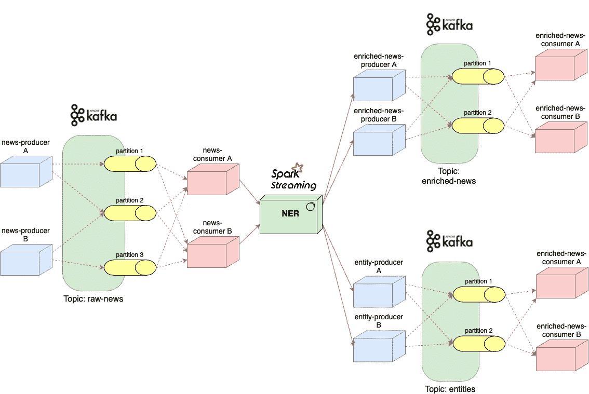

# 基于命名实体的新闻文章聚类

> 原文：<https://towardsdatascience.com/clustering-news-articles-based-on-named-entities-306a23d368e1?source=collection_archive---------17----------------------->

## 我如何实时处理西班牙语新闻，并可视化提到的人、地点和组织的分布

丹尼·米勒在 [Unsplash](https://unsplash.com?utm_source=medium&utm_medium=referral) 上的照片

在这篇文章中，我想和你分享我关于自然语言处理的硕士论文。尽管我在几年前就完成了它，但直到现在我才认为用英语写出来会很棒(我的硕士论文是用西班牙语完成的)，并希望通过展示如何构建一个涵盖数据科学项目中许多阶段的系统来帮助一些有抱负的数据科学家或机器学习工程师。

# 介绍

可能由于我的多元文化经历，我一直对语言感兴趣。因此，在我攻读硕士学位期间，当我为论文选择主题时，我毫不犹豫；我想开发和研究自然语言处理。其中一个项目是基于文档相似性对新闻文章进行实时分类。我听说了教授指导这篇论文的一些很棒的事情，所以我全力以赴这个项目。

这个项目的目的是从新闻文章中识别相关信息，可视化它们的命名实体(人、组织和位置)的分布，找到文章之间的相似性，并最终根据它们的主题对新闻进行分组…并且都是实时的！

我知道对于一些人来说，数据科学和工程的广泛工具可能是令人生畏的，特别是对于那些没有软件背景的人。虽然这不是我的案例，但我只有纯软件开发的经验，所以我很高兴地接受了我的教授的建议，选择了这个堆栈:

*   [Apache Kafka](https://kafka.apache.org) 用于在处理前对实时文章进行排队，以及在处理后对命名实体进行排队(在不同的主题中)。
*   [Apache Spark](https://spark.apache.org) (PySpark 流)用于实时处理新闻。
*   [Spacy](https://spacy.io) Python NLP 库，用于在文章中查找命名实体。
*   [Brat 快速标注工具](https://brat.nlplab.org/introduction.html)用于标注文章，用于语言模型的评估和训练。
*   [Elasticsearch](https://www.elastic.co/elasticsearch/) 用于存储从每篇文章中提取的命名实体。
*   用于可视化不同类型命名实体的分布。

作者图片

# 数据

第一步是获取一些新闻文章。由于数据提取超出了这个项目的范围，我决定从 https://webhose.io/free-datasets/spanish-news-articles/的[下载一个包含西班牙旧新闻的数据集](https://webhose.io/free-datasets/spanish-news-articles/)

考虑到我们需要评估一些语言模型的性能，我们需要构建一个可信的测试集来比较预测。还有什么比我们自己手动标注文字更值得信赖呢？是的，这是一个漫长而乏味的过程，但作为回报，我们得到了一个非常有价值的*黄金标准*，我们可以继续用它来测试语言模型。为此，我们可以从主数据集中随机选取一组文章，并使用诸如 [Brat](http://brat.nlplab.org/index.html) 之类的注释工具用正确的命名实体来标记这些文章。

作者图片

需要注意的是，我将使用一个 Python 脚本来模拟新闻的接收，该脚本将来自我的本地数据源的文章注入到一个 Kafka 主题中，遵循每分钟 12 篇文章的泊松分布，而不是处理互联网上出现的当前新闻。

# 韵律学

您可以使用许多不同的指标来评估分类模型的性能。这里要考虑的一个重要方面是数据集是否平衡，即实体的类型是否平均分布？就我而言，我发现文章中提到的人数明显多于地点和组织的数量。因此，我决定追求精确度、召回率和 F1 分数(简介[此处](/multi-class-metrics-made-simple-part-ii-the-f1-score-ebe8b2c2ca1))。

Precision 表示检索到的实体中相关实体的百分比，而 recall 给出模型检索到的相关实体的比例。

检查分类模型准确性的一种直观方法是构建混淆矩阵，这可以用 [Scikit-learn](https://scikit-learn.org/stable/modules/generated/sklearn.metrics.confusion_matrix.html) 轻松完成。当你有两个以上不同类型的实体时，你的混淆矩阵会变得非常有趣，因为你可以清楚地看到你的模型混合了哪些类或者*混淆了*，如果你想改进你的模型，它会提示你应该在哪里工作。

# 预训练语言模型评估

建议使用预先训练好的模型，然后在必要时用您的数据重新训练，而不是从头开始训练语言模型。Spacy 已经为不同的语言和环境提供了各种各样的预训练模型。注意模型的大小也很重要，因为数据集越大，模型就越精确，但处理和重新训练的工作量也越大。

幸运的是，我找到了一个西班牙的 NER(命名实体识别)[模型](https://spacy.io/models/es)，它用我的 3 种类型的实体进行训练:人、地点和组织。

正如你可能已经猜到的，由于在训练中花费较少的资源，非英语模型通常不如英语模型准确。因此，我们想知道这个初始模型有多精确，我们想通过在我们自己的数据上检查它的性能来做到这一点。这就是我们的*黄金标准*发挥作用的地方。

以下是根据我们的黄金标准评估西班牙语 Spacy 语言模型的结果。正如我们所看到的，它已经相当好地识别了地点和人，但它未能检测到大多数组织。还必须提及的是，该模型检测到一些实际上不是实体的地点、人员和组织(矩阵的最后一行)。

作者图片

判决？尽管考虑到我们使用的是非英语语言模型，结果并不差，但我们可以明确地说，我们离完美还很远，尤其是在识别组织方面。

那么我们能做些什么呢？

# 模特培训

如果我们使用了值得信赖的测试集，很明显，为了改进我们的语言模型，我们应该重新训练它。为了这个任务，我们需要更多的文章。实现这一点的一种方法是使用一种叫做[的基于规则的匹配](https://spacy.io/usage/rule-based-matching)的技术对数据进行综合注释。

基本上，我们将下载一个实体(人、组织和地点)的大列表，并自动在另一组文章中找到它们。这将产生像黄金标准一样的带注释的文章子集。然而，我们将使用这组带注释的文章来重新训练模型。

当重新训练基于神经网络的模型时，要考虑的一个方面是*灾难性遗忘，*通过这种方式，我们用新数据重新训练模型越多，它就越有可能*忘记*以前的知识。这个问题的标准解决方案是所谓的*假排练*，它包括混合一些以前的预测作为训练数据，以不忘记它已经学会的东西。关于这个话题的更多技术细节可以在[这里](http://www.cs.otago.ac.nz/staffpriv/anthony/publications/pdfs/Robins95.pdf)找到。

在 Spacy 中训练语言模型时，您需要考虑某些属性:

*   训练规模:训练集越大，模型学习的就越多，但是考虑你的计算资源和时间是很重要的。
*   历元数:已经完成了多少遍数据。
*   辍学率:让模型更难记住数据。
*   审查率:新的合成数据和原始模型预测之间的权衡(待*审查的知识)。*

来源:[https://spacy.io/usage/training](https://spacy.io/usage/training)

# 优化的语言模型评估

现在是时候检查我们的重新培训是否对模型的性能产生了影响。我们可以用测试原始模型的相同方法，对照黄金标准来测试它，并比较结果。

正如下面的图所指出的，对于“组织”和“人”类型的实体有所改进，而对位置的检测稍差。

作者图片

混淆矩阵显示仍然有大量的假阳性(矩阵的最后一行)和假阴性(最右列)。

作者图片

总的来说，我们可以说该模型略有改进，但资源的缺乏使得用更大的数据集训练该模型变得复杂。

一旦你有了一个像样的模型，目标应该是把它投入生产，以便实时处理真实的数据。

# 实时自然语言处理

如前所述，由于新闻存储库是本地托管的，我们需要将新闻文件注入 Kafka 主题。Apache Kafka 的工作方式是拥有*主题*，其中*生产者*注入可以被*消费者*收集的数据。通过这种方式，我们可以在系统的不同组件之间实现*松耦合*，这意味着如果其中一个组件出现故障，所有组件都会继续正常运行。

想象一个有一群计算机的场景(超出了这个项目的范围，因为这只是独立的)，我们可以在下面找到三个不同的 Kafka 主题。*新闻生产者*组件可以是我们的 Python 脚本，它生成文章并将它们排列在*原始新闻*主题中。与此同时，主处理模块( *NER* )正在使用[火花流](https://spark.apache.org/streaming/)来消费和处理这些原始物品，用我们之前训练过的空间模型来检测命名实体。

作者图片

一旦用我们的模型处理了文章并提取了命名实体，我们需要考虑如何处理这些信息。让我们不要忘记这个项目的主要目标是根据他们的命名实体来聚集新闻。即使我们在本地使用静态的新闻库，我们也需要想象在现实世界中总会有更多的新闻出现。因此，在处理了一定数量的新闻后，只对新闻进行聚类是没有意义的。取而代之的是，我们希望能够随时对已经处理过的新闻进行可视化和分组。

那么我们该如何应对呢？首先，我们需要一个地方来存储我们从正在处理的文章中提取的相关信息。

# 已处理数据的存储

Elasticsearch 官方上是一个搜索引擎，但它也是一个强大的 [NoSQL 数据库](https://www.elastic.co/blog/found-elasticsearch-as-nosql)，它是 NoSQL，因为你不必为你的数据指定模式。因此，在我们的例子中，我们只是以 JSON 格式抛出一些数据(我们的文章和它们的命名实体),而 Elasticsearch 会发挥神奇的作用。

如果您回忆一下架构图，在文章被 NER 处理之后，管道分成两个分支。这种设计背后的理由基于两个原因:

1.  我们需要能够通过命名实体查询文章，还需要获得实体的全球分布。
2.  Elasticsearch (v6.5.1)不支持嵌套对象上的聚合。技术细节[此处](https://www.elastic.co/guide/en/elasticsearch/guide/current/denormalization.html)。

因此，我们需要应用命名实体的反规范化，这导致 Elasticsearch 中的两个单独的*索引*:*新闻索引*存储每篇文章以及它们检测到的命名实体和时间戳，而*实体索引*存储所有命名实体，而不管它们属于哪篇文章。

现在，我们已经存储了一些相关信息，如果能够可视化所有这些信息以发现什么是趋势话题，岂不是很好？

# (英)可视化(= visualization)

Elasticsearch 的一个关键优势是它与 [Kibana](https://www.elastic.co/kibana) 完全集成，后者是一个可视化工具，可以表示在任何给定时间在 Elasticsearch 中索引的数据，更重要的是，使用它您可以轻松创建实时仪表板来分析您的数据分布。

下面是一个例子，展示了在使用 Kibana 时，你可以对仪表盘做些什么。

作者图片

如果您还记得我们存储在*新闻索引*中的 JSON 字段，其中一个字段是时间戳。当你想知道“为什么我们需要一个时间戳”时，想想你想要分析多少新闻，或者更好地说，你想要回溯多远？你想看过去 5 分钟或前一天的热门话题吗？这时我们需要考虑一篇文章的年龄。在 Kibana 中，您可以通过时间窗口轻松过滤数据(JSON 文档)。

话虽如此，仪表板的结论可能会非常不同，这取决于您想要检查信息的时间，尽管有大量实体涉及政治家和政党。

所以下一个问题是，有了这些信息，我们如何找到一些模式来帮助我们将新闻分成不同的类别？

# 使聚集

一种可视化不同类别的方法是用一个图表，其中每个点代表一篇文章，点与点之间的距离，新闻有多相似。简单地说，我们可以使用每篇文章中的命名实体来计算它们的主题有多相似，从而计算每个点之间的距离。一旦我们有了用图表表示的文章，我们就可以很容易地想象文章的不同类别或*社区*。

这里的想法是按需生成这个图表，指定在 Elasticsearch 中索引的新闻的时间范围，例如，我们可以生成一个图表，表示上一小时处理的新闻。

要回答的一个关键问题是，我们如何根据它们的命名实体来衡量两篇文章有多相似(或不同)？人们可以想到一个简单的实现，要么是 Jaccard 指数 T1，要么是 T2 余弦相似度 T3(这里是比较 T4 T5)。然而，像“美国”和“美国”这样语义相关的实体呢？在我们的图表中，谈论这两个不同实体的新闻会不会离得很近呢？好消息……这个问题可以通过 [*单词嵌入*](https://medium.com/data-science-group-iitr/word-embedding-2d05d270b285) 轻松解决，其中每个单词都用一个实值向量来表示其含义，因此相似的单词将有相似的向量或*嵌入*。

好的，那么我们如何使用单词嵌入来绘制正在 Elasticsearch 中处理、丰富和存储的新闻呢？第一步是获取这些新闻和实体，你可以用 Python 中的 [elasticsearch-py](https://elasticsearch-py.readthedocs.io/en/7.10.0/index.html) 库来完成。现在我们可以将 Spacy 用于比较单词嵌入的能力(文档[这里是](https://spacy.io/usage/linguistic-features#vectors-similarity))与 Scikit-learn 提供的[多维标度](https://scikit-learn.org/stable/modules/manifold.html#multi-dimensional-scaling-mds)结合起来。这将把 Spacy(或者更准确地说是 word2vec)给出的多维表示转换成可以用来绘制我们的图形的 2D 表示。

好了，一旦我们有了新闻的 2D 表示，最后一步就是找出有多少个集群或社区以及属于每个集群或社区的新闻。实现这一点的一种方法是通过*卢万算法*进行社区检测。即使数学细节可能相当复杂(见这里的)，如果我们只是使用 [python-louvain](https://github.com/taynaud/python-louvain) 库，我们真的不需要从头实现它。

根据用于绘制图表的 Python 库，结果可能如下所示，其中每个点代表一条新闻，颜色表示不同的主题。本例中的图例显示了每个主题中最常见的实体。据此，人们可以说，新闻已经分为西班牙和拉丁美洲、美国政治和西班牙政治。

作者图片

# 结论

正如您在本文中看到的，有如此多的开源工具可以用于几乎任何您能想到的 NLP 任务。还要记住，JSON 可能是在应用程序之间共享数据的最佳格式，因为它在开源社区得到了广泛的支持。最后，自从我完成这个项目以来，已经有很多关于数据可视化工具的工作，所以我建议你在选择满足你特定需求的工具之前去比较它们。

我只有有限的时间和资源来完成这个项目。几个肯定会带来巨大价值的扩展是:

*   抓取即时 RSS 提要，而不是处理新闻的静态存储库(一些相关的工作[这里](https://medium.com/analytics-vidhya/how-to-import-data-from-cnns-rss-feed-95c828e446e))。
*   使用云计算通过更大的带注释的数据集来重新训练模型。你可以和 Docker 竞争。这里有一篇关于整合所有这些工具的有趣文章。

如果你对源代码感兴趣，可以查看我的 [GitHub repo](https://github.com/ejmacias/doc_similarity) (注意西班牙文写作)。

感谢您的阅读，并随时留下评论！