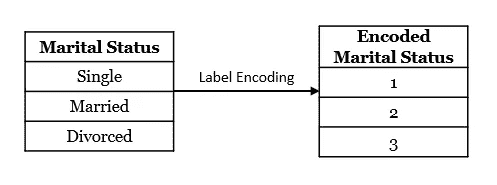
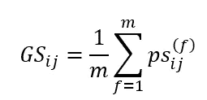
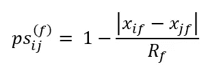
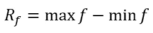
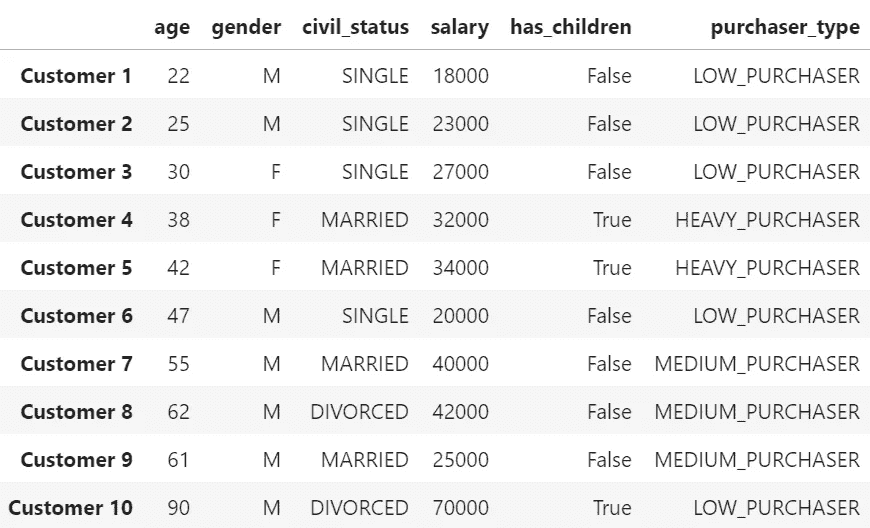
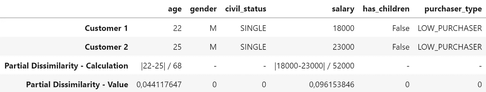
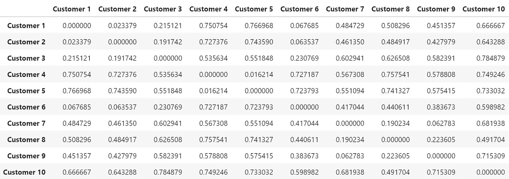
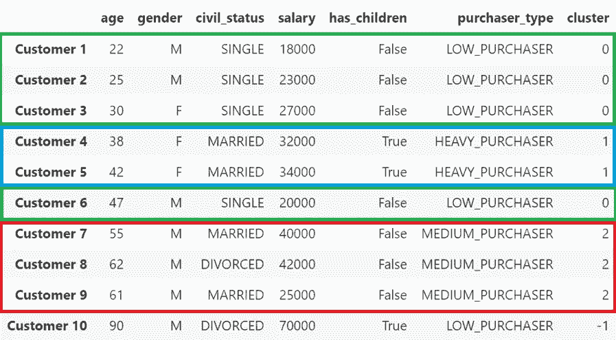

# 基于数字和类别特征的聚类。

> 原文：<https://towardsdatascience.com/clustering-on-numerical-and-categorical-features-6e0ebcf1cbad?source=collection_archive---------0----------------------->

## [实践教程](https://towardsdatascience.com/tagged/hands-on-tutorials)

## 在 Python 中使用高尔距离。

由[蒙罗工作室](https://unsplash.com/@universaleye?utm_source=medium&utm_medium=referral)在 [Unsplash](https://unsplash.com?utm_source=medium&utm_medium=referral) 拍摄的照片

# 介绍

去年，我一直在从事与客户体验(CX)相关的项目。在这些项目中，对客户数据进行机器学习(ML)和数据分析技术，以提高公司对客户的了解。最近，我集中精力寻找具有某些共同特征的不同客户群体，以便能够对他们采取特定的行动。

您可能已经猜到了，这个项目是通过执行**集群实现的。**对于那些不熟悉这一概念的人来说，聚类是根据一组对象或观察结果(例如，客户)的特征或属性(例如，性别、年龄、购买趋势)将它们分成不同的组(称为聚类)的任务。这种划分应该以这样的方式进行，即在同一个集群中的观测值应该尽可能地相似。此外，每个集群应该尽可能远离其他集群。[1]

一个主要的挑战是找到一种方法对既有分类变量又有数值变量的数据执行聚类算法。在现实世界中(尤其是在 CX)，许多信息都存储在分类变量中。尽管 web 上有大量关于数字变量聚类的信息，但是很难找到关于混合数据类型的信息。

这是一项复杂的任务，对于将这种数据类型的混合与聚类算法结合使用是否合适存在很多争议。然而，我决定放手一搏，尽我所能。在这篇博客的剩余部分，我将分享我的个人经历和我所学到的东西。

在接下来的章节中，我们将会看到高尔距离是什么，使用哪种聚类算法比较方便，以及它在 Python 中的使用示例。

**免责声明**:我认为自己是一个数据科学新手，所以这篇帖子并不是要创造一个每个人都应该使用的单一而神奇的指南，而是分享我所获得的知识。我现在的主要兴趣是不断学习，所以我乐于接受批评和指正。欢迎在评论区分享你的想法！

# 高尔距离

既然我们理解了集群的含义，我想强调一下上面提到的下面这句话。

*划分的方式应该是观测值* ***尽可能的相似*** *在同一个集群*。

如何定义不同客户之间的**相似度**？在只有数字特征的情况下，解决方案看起来很直观，因为我们都知道 55 岁的客户更像 45 岁的人，而不是 25 岁的人。有许多方法可以测量这些距离，尽管这些信息超出了本文的范围。

但是，如果我们不仅知道他们的年龄，还知道他们的*婚姻状况*(例如，单身、已婚、离婚……)呢？这种分类特征可以通过使用诸如插补、标签编码、一键编码等技术转换成数字特征……然而，这些转换可能导致聚类算法误解这些特征并产生无意义的聚类。例如，如果我们在*婚姻状况*特征上使用标签编码技术，我们将获得以下编码特征:

应用于婚姻状况特征的标签编码技术

这种转换的问题是，聚类算法可能会认为一个*单身*值更类似于*已婚* ( *已婚*[2】–*单身* [1]=1)，而不是*离异* ( *离异*[3】–*单身* [1]=2)。如图所示，转换特征可能不是最佳方法。

这就是高尔距离(衡量相似性或不相似性)发挥作用的地方。**高尔相似性(GS)** 最早是由 J. C .高尔在 1971 年定义的[2]。为了计算观察结果 *i* 和 *j* (例如，两个客户)之间的相似性，将 *GS* 计算为观察结果的 *m* 特征之间的部分相似性的平均值( *ps* )。

观察值 I 和 j 之间的相似性。每个观察值都有 m 个不同的特征，或者是数字的，或者是分类的，或者是混合的。

部分相似性的计算取决于被比较的特征的类型。

*   对于一个**数字特征**、**、**来说，两个个体 *i* 和 *j* 之间的部分相似性是一减去他们在特定特征中的值(绝对值)之间的差除以该特征的总范围。

当 f 是数值时，特征 f 中观察值 I 和 j 之间的相似性。

特征 f 的范围

*   对于一个**分类**特征，两个个体之间的部分相似性只有在两个观察值完全相同时才为 1。否则为零。

部分相似度的范围总是从 0 到 1。因此，当我们计算部分相似性的平均值来计算 GS 时，我们总是得到一个从 0 到 1 不等的结果。零表示观测值尽可能不同，一表示完全相等。

由于这些发现，当存在分类变量和数字变量的混合时，我们可以测量两个观察值之间的相似程度。然而，在进入细节之前，我们必须小心谨慎，并考虑到某些方面，这些方面可能会影响该距离与聚类算法的结合使用。

## 高尔距离的数学性质

关于交叉验证，我强烈推荐阅读两个问题:

*   [高尔的相异指数](https://stats.stackexchange.com/questions/22212/gowers-dissimilarity-index)
*   [混合类型数据的层次聚类——使用什么距离/相似度？](https://stats.stackexchange.com/questions/15287/hierarchical-clustering-with-mixed-type-data-what-distance-similarity-to-use)

两者都将**高尔相似度** (GS) **定义为非欧几里得和非公制的**。**高尔相异度** (GD = 1 — GS)与 GS 有相同的局限性，所以它**也是非欧非度**。然而，定义为√GD 的高尔相异度实际上是一个欧几里德距离(因此是自动度量的)，当没有使用特殊处理的序数变量时(如果你对此感兴趣，你应该看看 [Podani 如何将高尔扩展到序数字符](https://www.researchgate.net/publication/271789313_Extending_Gower's_General_Coefficient_of_Similarity_to_Ordinal_Characters)

这很重要，因为如果我们使用 GS 或 GD，我们使用的距离不符合欧几里德几何。因此，不得使用基于欧几里德距离的方法，因为一些聚类方法:

*   k 均值
*   层次聚类的沃德法、形心法、中位数法
*   …

# 编程语言中的高尔距离

## R 或 Python 中的相关工作

现在，我们可以在 R 或 Python 中使用这个度量来执行聚类吗？关于 R，我发现了一系列非常有用的帖子，通过一个叫做 [*雏菊*](https://www.rdocumentation.org/packages/cluster/versions/2.1.2/topics/daisy) *:* 的函数，教你如何使用这个距离度量

*   混合类型数据的聚类:一种使用 R 的建议方法。
*   [使用高尔距离](https://medium.com/@rumman1988/clustering-categorical-and-numerical-datatype-using-gower-distance-ab89b3aa90d9)聚类分类和数值数据类型。
*   [R](/hierarchical-clustering-on-categorical-data-in-r-a27e578f2995)中分类数据的层次聚类(仅具有分类特征)。

但是，我还没有找到用 Python 实现它的具体指南。这就是为什么我决定写这个博客，并试图给社区带来一些新的东西。原谅我，如果目前有一个具体的博客，我错过了。

## Python 中的高尔距离

首先，很重要的一点是，目前我们还不能在 scikit-learn 提供的聚类算法中包含这个距离度量。这是自 2015 年以来 scikit-learn 的 GitHub 上的一个[开放问题](https://github.com/scikit-learn/scikit-learn/issues/5884)。然而，自 2017 年以来，由 [Marcelo Beckmann](https://github.com/marcelobeckmann) 领导的一组社区成员一直致力于高尔距离的实施。希望它能很快在图书馆内使用。

在这个过程中，另一位名叫 Michael Yan 的开发人员显然使用了 Marcelo Beckmann 的代码创建了一个名为[***gower***](https://pypi.org/project/gower/)*的非 scikit-learn 包，该包已经可以使用，而无需等待 scikit-learn 社区昂贵且必要的验证过程。**注意，这个实现使用了高尔相异度(GD)。***

# *动手实施*

## *数据*

*当我学习新的算法或方法时，我真的喜欢在非常小的数据集中看到结果，这样我就可以专注于细节。因此，对于实现，我们将使用一个小的合成数据集，其中包含关于杂货店客户的虚构信息。*

*创建熊猫数据帧的 Python 代码*

*创建的数据有 10 个客户和 6 个特征:*

*   ***年龄**:数字*
*   *性别:分类*
*   ***公民身份**:绝对身份*
*   ***薪资**:数字*
*   *客户有孩子吗？:二进制*
*   ***购买者类型**:分类*

*所有信息如下所示:*

**

*客户综合数据*

## *高尔距离*

*现在，是时候使用之前提到的 [*高尔包*](https://pypi.org/project/gower/) 来计算不同客户之间的所有距离了。让我们手动做第一个，并且**记住这个包正在计算高尔相异度(DS)** 。所以计算的方式有点变化。*

*   *对于一个**数字**特征，两个客户 *i* 和 *j* 之间的部分相异度是它们在特定特征中的值(绝对值)的差除以该特征的总范围。*工资*的范围是 52000(70000–18000)，而*年龄*的范围是 68(90–22)。注意**在这些特性中没有异常值**的重要性。一个非常大或非常小的错误值将直接影响范围，因此该特征的差异将变得不那么重要。*
*   *对于一个**分类**特征，当两个客户对此特征具有不同的值时，两个客户之间的部分不相似性为 1。否则为零。*

*按照这个过程，我们计算前两个客户的所有部分差异。*

**

*计算前两个客户的部分差异*

*两个客户之间的高尔相异度是沿着不同特征的部分相异度的平均值:(0.044118+0+0+0.096154+0+0)/6 = 0.023379。由于值接近于零，我们可以说这两个客户非常相似。*

*让我们使用 [*高尔包*](https://pypi.org/project/gower/) 来计算客户之间的所有差异。然后，将结果存储在一个矩阵中:*

**

*距离矩阵*

*我们可以这样解释这个矩阵。在第一列中，我们看到了第一个客户与所有其他客户的不同之处。由于 GD 较低，该客户与第二、第三和第六位客户相似。*

## *对距离矩阵执行聚类*

*我们刚刚看到的矩阵可以用于几乎任何 scikit-learn 聚类算法。然而，我们必须记住高尔距离的局限性，因为它既不是欧几里得距离，也不是公制距离。*

*要在 scikit-learn 聚类算法中使用 Gower，我们必须在所选方法的文档中查找直接传递距离矩阵的选项。虽然参数的名称可以根据算法的不同而改变，但我们几乎总是应该将值*预先计算好*，所以我建议去算法的文档中查找这个单词。*

*在本文中，我们将使用 **DBSCAN** (带噪声应用的基于密度的空间聚类)算法。理解算法超出了本文的范围，因此我们不会深入讨论细节。我在这里留下了[算法](https://scikit-learn.org/stable/modules/clustering.html#dbscan)背后理论的链接，以及一个直观解释其基本功能的 gif。*

*这里我们有代码，在这里我们定义了集群算法，并对其进行配置，以使要使用的指标为“*预计算*”。拟合算法时，我们将引入已计算的距离矩阵，而不是将数据集与数据一起引入。此外，我们将集群的结果添加到原始数据中，以便能够解释结果。*

*最终结果如下:*

**

*如果我们分析不同的集群，我们会发现:*

*   ***集群 0(绿色):**工资在 18，000 至 27，000 英镑之间，没有孩子并且很少购买的客户。*
*   ***第 1 组(蓝色):**收入约 3.3 万英镑、经常购物的 40 多岁母亲。*
*   ***第 2 组(红色):**60 多岁的男性，中等购买量，无子女*
*   ***Cluster -1:** 这不是集群本身，而是被算法识别为异常值的客户。它无法在任何集群中识别。*

*通过这些结果，我们可以了解客户所划分的不同群体。因此，我们可以对它们执行特定的动作，例如个性化的广告活动、针对特定群体的要约……的确，这个示例非常小，并且被设置为具有成功的集群，实际的项目要复杂得多并且花费时间来实现显著的结果。*

# *结论*

*本文提出了一种在 Python 中使用 Gower 距离执行聚类的方法。它还暴露了距离度量本身的局限性，因此可以正确使用。最后，这个小例子证实了以这种方式开发的集群是有意义的，并且可以为我们提供大量信息。*

*我希望你能发现这种方法很有用，并且你会发现这篇文章很容易阅读。最重要的是，我很高兴收到任何形式的反馈。所以，请随意分享你的想法！*

# *参考*

*[1]维基百科投稿人，聚类分析(2021)，[https://en.wikipedia.org/wiki/Cluster_analysis](https://en.wikipedia.org/wiki/Cluster_analysis)*

*[2] J. C. Gower，[广义相似系数及其若干性质](https://www.jstor.org/stable/2528823?origin=crossref) (1971)，生物统计学*