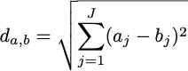

# 集群:走出黑盒子

> 原文：<https://towardsdatascience.com/clustering-out-of-the-black-box-5e8285220717?source=collection_archive---------6----------------------->

## k-均值和高斯混合模型

米克·豪普特在 [Unsplash](https://unsplash.com?utm_source=medium&utm_medium=referral) 上的照片

作者:詹娜·琼斯和尼克·潘恩

# 介绍

最近，无监督学习受到了很多关注，因为它能够在没有任何训练的情况下发现数据中的模式。具体来说，聚类已被用于解决许多数据问题，包括客户细分、欺诈检测、推荐引擎以及最重要的足球运动员位置。本文讨论并比较了两种不同的数据点分组方法: **K 均值和高斯混合模型(GMM)** 。然后，我们使用这些方法中的每一种对相同的示例数据集进行聚类。

# **术语**

与机器学习系统一样，需要一些特定的术语:

*   **特征**:可用于分析的可测量数据(如果我们有一个足球运动员的数据集，我们可以将身高作为一个特征，体重作为一个特征，大学作为一个特征)。
*   **维数**:数据集中特征的数量。在我们的例子中，将有两个维度:每个玩家的身高和体重。很容易想象二维空间(通常在数学课上看到)，也有可能想象三维空间，但之后，更高维空间就不容易想象了。尽管如此，一个数据集中可以有无限数量的维度。
*   **质心**:计算出的一簇数据点的中心位置。对于 K-Means，这是每个维度的每个聚类中数据点的算术平均值。
*   **聚类**:由相似特征组合在一起的一组数据点。
*   **距离度量**:计算任意数据点距离每个聚类质心有多远的方法。
*   **误差平方和**:一旦数据被划分到给定数量的聚类中，该度量取每个数据点与其聚类中心之间的距离平方和，将分析中的所有数据点相加。它用于帮助评估数据中有多少个聚类。

# 例子

**数据**:我们使用了一组二维数据，显示了 NFL 橄榄球运动员的身高和体重，分为 AFC 和 NFC 南部赛区的跑卫、紧逼端和防守铲球。有 94 个数据点。

以二维形式显示数据的数据集摘录

该示例的目标是根据身高和体重将每个玩家正确分配到 *K* 个集群(位置)中的一个。**请记住，该算法既没有看到标记数据，也没有经过任何训练——决策将完全基于二维数据做出。**

下面是原始数据的图表，每个点代表一个玩家。你能想象出*的最佳集群数量吗？*

原始数据散点图

> 这对于计算机来说是一个相当棘手的问题，因为存在重叠的数据点和一些异常值。

视觉检查显示有两个不同的组:一个位于较高的重量范围，另一个跨越较低的重量范围，包括不同的高度。仅仅通过观察很难判断在第二组中是只有一个还是有许多集群。

我们想评估如何成功的 K-Means 和 GMM 可以分组的数据。在开始之前，让我们看一下实际的集群。

实际的集群

# k 均值聚类

K-Means 由于其简单性很容易成为最流行的聚类算法。最终，它假设数据点彼此越接近，它们就越相似。流程如下:

1.  选择集群的数量 *K*
2.  随机建立每个质心的初始位置
3.  使用距离测量将每个数据点分配到最近的质心
4.  使用分配给每个聚类的数据点的平均值重置每个质心位置
5.  返回步骤 3 并重复，直到没有单个数据点改变聚类

**如何找到最优的聚类数， *K* ？**

聚类中最困难的步骤之一是确定最佳聚类数， *K，*对数据进行分组，没有“正确”的答案。最常见的方法被称为“肘法”。本质上，它对整个数据集运行 K 均值聚类，得到不同的 K 值*和*，并计算每个*和*的误差平方和(SSE)

绘制结果是很重要的。该图类似于一只手臂，顾名思义，陡度变化最大(即肘部)的 *K* 的值被认为是最佳的聚类数。**目标不是找到最小化总平方距离的 *K* ，而是找到当 *K* 增加时导致收益递减的 *K* 。**

在我们的示例中，elbow 方法返回值 3 作为最佳聚类数(根据实际数据，我们知道这是正确的)。

什么是距离度量？

K-Means 算法使用**欧几里德距离度量**。这意味着每个聚类中心周围的距离度量是“圆形”的。**不同地说，每个维度的重要性是相等的，因此有了术语‘圆形’**。该距离可以定义为

其中 *J* 代表维数。

在我们的示例中，我们将该公式应用于两个维度:

如果我们计算 Derrick Henry (DH)的身高和体重与 RB 和 te 形心的身高和体重之间的距离，我们会发现到 TE 形心的距离要短得多，因此，他被归类为 TE。

**如何重置每个质心位置？**

将每个数据点分配到一个集群后，我们只需计算每个集群中每个维度的数据点的算术平均值(即每个位置的所有球员身高的平均值和所有球员体重的平均值)。这就是每个质心的新位置。均值的使用是该算法得名的原因:K-Means。

该算法直接在 sklearn.cluster.KMeans 包中实现。但是，我们将通过一个小示例来展示步骤 1(确定最佳集群数量)之后会发生什么。

首先，在步骤 2 中，每个质心被随机初始化。在第二幅图像的步骤 3 中，使用距离测量将数据点指定给最近的质心。

接下来，基于平均值重置每个质心位置。在第二幅图像中，数据点被重新分配给现在距离数据点最近的质心。

重复上述过程

该过程结束，因为没有数据点用新的质心位置改变聚类

我们用 Python 在数据集上运行了该算法，结果令人鼓舞。

K-Means 成功地将数据聚类成三组；然而，它错误地将三家 RBs 指定为 te。

**结果**:聚类对应于实际数据聚类，只有三个玩家被错误分类。因为我们已经知道每个玩家的位置，所以我们能够容易地评估集群。所有的 dt 都成功地聚集成一组，但这并不奇怪，因为我们可以用肉眼看到。令人印象深刻的是，尽管看起来是一组连续的数据，但大多数 RBs 和 TEs 都被正确地聚类。

**特征标准化**

当要素具有不同的比例(例如房价- 400，000 和平方英尺- 1，500)时，通过对数据进行标准化来预处理数据可能很重要，这样一个元素对距离的贡献与另一个元素相比不会过大，从而主导整个距离测量。为了更平均地分配要素之间的贡献，我们可以对数据进行标准化，以便整个数据集的每个维度的平均值分布是相同的。在我们的例子中，我们选择不标准化数据，因为我们相信运动员的体重自然比他们的身高更重要。然而，为了说明标准化的效果，我们展示了使用和不使用特征标准化的示例数据的分析结果。

从 K-均值和实际数据分组中交叉列表指定的聚类。集群 0 和 1 完全对应于 DT 和 RB 位置。群组 2 主要包括 te，并且错误地包括 3 个 Rb。

如上图所示的分配聚类的交叉列表，具有特征标准化

有了标准化的数据，错误分类的 RBs 就少了。然而，更多的运动员被错误分类，因为标准化挤压了体重范围，把两个 300 磅左右的运动员归入了运动员组。

特征标准化的 k-均值算法

正如我们所见，特征标准化的效果将取决于数据以及特征的结构和尺寸的构成。

**K-Means 的优势**:

*   简单易懂
*   非常快(所有正在计算的是每个点和聚类中心之间的距离)
*   易于实施

**K-Means 的缺点**:

*   必须手动选择 *K*
*   取决于初始质心位置
*   由于异常值，可能会歪曲质心位置

# 高斯混合模型

高斯混合模型是一种期望值最大化(EM)算法，其数据点假定具有高斯(正态)分布。它通常被描述为 K-Means 的一个更复杂的版本。它需要两个参数，均值和协方差，来描述每个聚类的位置和形状。

该模型基于多元高斯分布，即:

其中对于每个集群，

GMM 要求一个五步流程:

1.  选择集群的数量， *K*
2.  随机建立每个质心的初始参数(即平均值、协方差和权重)
3.  使用当前参数计算数据集来自这组分类的可能性
4.  通过更改参数(聚类比例、中心和围绕中心的分布)最大化可能性
5.  返回到步骤 3 并重复，直到参数的变化小于预编程的量或者已经完成了固定次数的迭代

**什么是期望值最大化算法？**

EM 首先计算给定数据点来自高斯分布与当前参数集的混合的可能性。然后，它通过改变参数来最大化可能性。

可能性有多大，如何最大化？

似然函数基于数据点来自高斯聚类的加权集合的概率:

在哪里

当然，权重总和为 1。

然后，似然性是来自具有这些参数的聚类集的 *N* 个数据点的整个数据集的概率。

与许多似然最大化问题一样，取对数并最大化对数似然函数(它给出相同的最大值或最小值)更容易，因为当取对数时，似然函数中的乘积变成和。通过对每个参数(聚类加权、聚类均值和聚类协方差)进行微分，可以相当容易地获得用于更新每个参数的公式。确切的过程超出了本文的范围，但是下面给出了结果公式。

**期望**:在没有将数据点分配给单个聚类的情况下，我们计算每个聚类的参数产生每个数据点的概率。这意味着为每次迭代重新计算如上给出的新值 *P(x)* 。

**最大化**:我们需要使用以下公式分别更新每个聚类的权重、均值和协方差:

**什么是距离度量？**

GMM 不使用距离度量，而是应用围绕聚类中心的概率分布来计算数据点属于给定聚类的可能性。顾名思义，这是一个多元正态分布，变量的个数等于数据中的维数。

由于 GMM 正在寻找每个聚类的最佳参数，我们最终可能希望将每个数据点分配给一个聚类。这是通过选择离每个数据点“最近”的质心来实现的。为此，Python 的 Sklearn 包使用了一种称为 Mahalenobis 距离的距离度量，而不是 K-Means 中使用的欧几里德距离。这一措施被定义为:

很明显，该公式允许围绕质心的椭球形轮廓而不是圆形轮廓，并且其形式与多元高斯分布公式中使用的形式相同。

在我们的数据集上运行该算法给出了比 K-Means 稍好的结果。

GMM 成功地将数据分为三组；然而，它错误地分配了一个 RB 和一个 TE。

**结果**:所有的 DTs 再次成功聚类成一组，而 Derrick Henry 再次被误归类为紧端，紧端被误归类为跑锋。

来自 GMM 的指定分类和实际数据分组的交叉列表。集群 0 完全对应于 DT 位置。集群 1 和集群 2 大体上是正确的，但是不正确地包括 1 个玩家

**GMM 的优势:**

*   可以分析更复杂和混合的数据
*   可以更容易地处理异常值

**GMM 的劣势:**

*   更难直接解释结果
*   不直接将数据点分配给聚类

# 两种方法的比较与讨论

# 1:相似性

**质心起点的选择**

选择每个质心的起点非常重要，因为它对结果有很大的影响。

已经提出了各种方法来初始化聚类中心。常见的方法有:

*   Forgy(随机选择 *K* 个数据点，并将其用作初始质心位置)
*   随机分区(为每个数据点随机分配一个聚类，然后基于该聚类计算质心——这通常会创建接近数据集中间的初始质心)
*   K-Means++(选择彼此尽可能远离的初始质心，有效地围绕数据集的边缘)。

对于 GMM，通常将每个聚类的初始分布(方差)设置为总体方差，并相等地设置权重。

两个 Sklearn 软件包都提供了使用不同的起点运行多次分析的选项，并提供了最适合所有运行的结果。用户可以设置运行分析的不同尝试次数。

**倾向于局部最小值而不是全局最小值**

因为质心的初始化本质上是一种猜测，所以它们可以从远离数据中真正的聚类中心的地方开始。这两种方法总是趋于一致(意味着它们总会找到解决方案)，但不一定是最佳方案。在途中，它们可能会陷入局部最小值并卡在那里。

具有两个局部最小值和一个全局最小值的函数的例子

当没有达到全局最小值时，结果将不是最佳的，并且将获得不同的聚类组。

结果显示该算法在左边达到全局最小值，在右边达到局部最小值。两者都是解决方案，但全局最小值是更好的数据聚类

# 2:差异

**确定性与概率性方法**

*   K-Means:使用**确定性方法**并将每个数据点分配给一个唯一的聚类(例如:Derrick Henry = TE)。这被称为硬聚类方法。
*   GMM:使用一种**概率方法**，给出每个数据点属于任何一个聚类的概率(例如:Derrick Henry = [0.63 TE，0.33 RB，. 04 DT]。这被称为软聚类方法。

**参数**

*   K-Means:仅使用**两个参数**:聚类数 *K* 和质心位置
*   GMM:使用**三个参数**:**:****聚类数 *K* ，均值和聚类协方差**

****更新质心****

*   **K-Means:仅使用分配给每个特定聚类的数据点来更新质心平均值**
*   **GMM:使用数据集中的所有数据点来更新质心权重、均值和协方差**

****特征标准化****

*   **K-Means:如果一个或多个维度将主导计算，则质心周围的“圆形”距离测量可以使特征标准化成为必要**
*   **GMM:通过计算和使用协方差矩阵，自动将问题考虑在内**

# **计算机编程语言**

**Python 通过它的 Sklearn 包实现了这两种集群技术。这些软件包非常容易使用，并且保留了大量的数据信息。它们还允许许多用户选择，这些选择由您添加到语句中的超参数定义。**

****Python 代码的超参数****

*   **聚类数(n_clusters):将数据分组到的聚类数以及质心数**
*   **最大迭代次数(max_iter):算法有两种完成方式:一种是当数据点停止改变聚类时(如上图所示)，另一种是为算法设置固定的循环次数(这将比收敛更快地结束算法)**
*   **Number initial (n_init):整个算法运行的次数，质心的起始位置不同。由于算法对起点[和](#b04f)很敏感，该软件包允许您选择多个不同的起点，以寻求最佳解决方案。**
*   **Random State (random_state):初始化质心时为每次运行设置相同的位置**

**一旦有了一个只包含要素数据的数据框(在下面的代码中称为“数据”)，就可以用很少的代码轻松运行 K-Means 和 GMM 聚类。**

# **结论**

**我们已经使用 K-Means 和 GMM 对使用标准 Python 包的数据集进行了聚类。我们希望这篇文章能帮助你通过理解这些算法的工作原理来更好地分析你的数据。**

**您可能需要尝试多种不同的方法来获得最佳结果:使用不同的超参数、调整聚类的数量、应用不同的距离度量，并可能标准化您的数据。**

**在大多数实际情况下，聚类并不简单或明显，因此对这些工具、它们的使用方式以及数据科学家可用的选项的更深入了解将会带来更好的结果。**

***所有非参考图片均由作者创作。***

# **参考**

**[1] Mahalanobis，P.C. (1936) *论统计学中的广义距离*。印度国家科学研究所会议录，2，49–55。**

**[2]希尔皮希，Y. (2019) *面向金融的 Python。*奥莱利媒体公司**