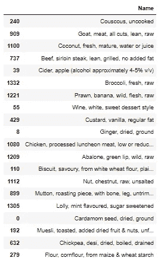
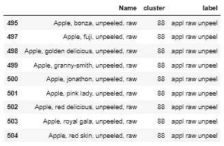
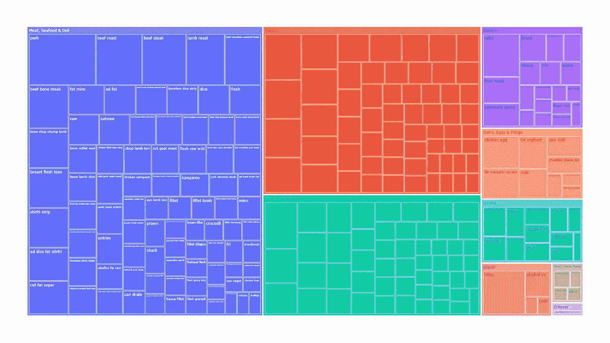
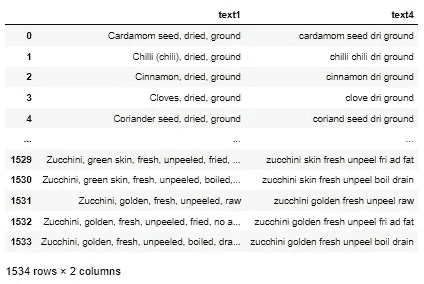
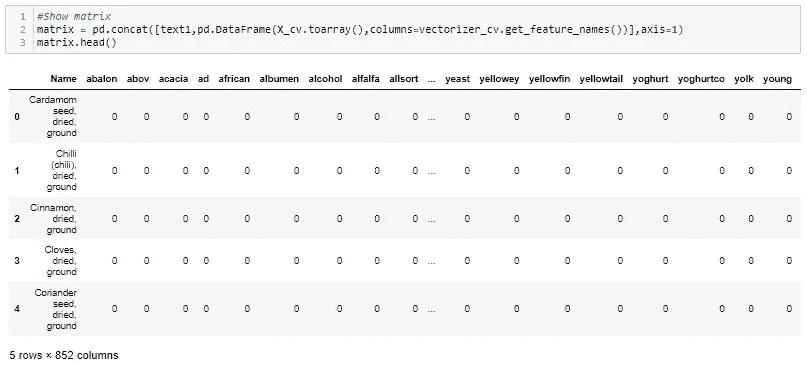
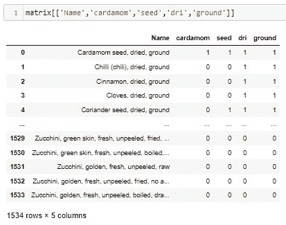
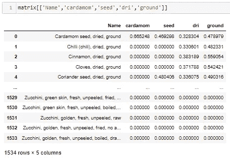
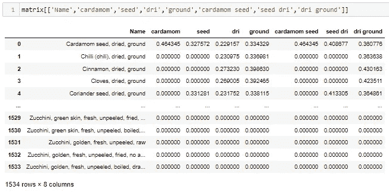
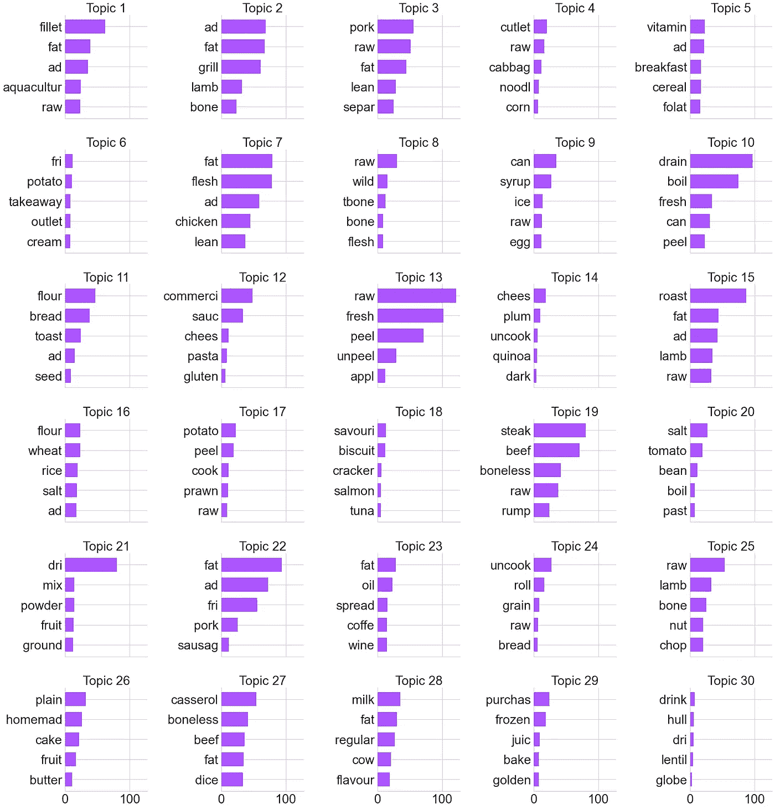
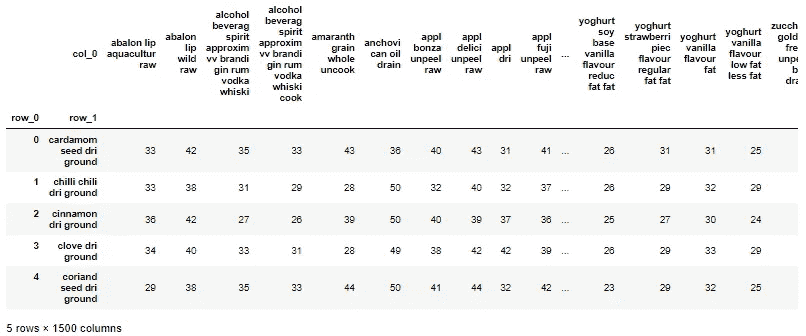

# 用 Python 对产品名称进行聚类—第 1 部分

> 原文：<https://towardsdatascience.com/clustering-product-names-with-python-part-1-f9418f8705c8?source=collection_archive---------1----------------------->

## 使用自然语言处理(NLP)和 K-Means 聚类 Python 中的未标记文本


Billy Huynh 在 [Unsplash](https://unsplash.com?utm_source=medium&utm_medium=referral) 上拍摄的照片

# 介绍

自然语言处理(NLP)是指对人类语言(如文本和语音)的自动计算处理。

它对于分析大量未标记的文本以快速提取含义特别有用，而这正是对电子商务产品进行分类时的问题所在。产品要么被贴上不正确的类别标签，要么根本没有标签。手动分类效率不高，如果不是不可能的话。

今天我们将讨论**我们如何使用 Python 中的 NLP 和 K-means 来自动聚类未标记的产品名称**，以快速了解数据集中的产品种类。这种方法是无监督的(没有设置类别和类别数量)，并且不同于有监督的分类，分类将产品名称分配给目标标签(已知类别)。

在本指南中，我将使用来自[澳大利亚食物成分数据库](https://www.foodstandards.gov.au/science/monitoringnutrients/afcd/Pages/datauserlicenceagreement.aspx)的数据集，其中包含澳大利亚食物营养成分的数据。我将向您展示我是如何将 1，534 个具有许多独特性的食物名称聚集在一起的…



未标注的食物名称|作者图片

…获得数据集中所有食品类型的高效、高级视图，只需很少的人工输入。



相似食物聚类示例|作者图片



所有带标签的分类|按作者分类的图像

该方法包括以下步骤:

*   **预处理****文本(食物名称)为干净的单词，这样我们就可以把它变成数字数据。**
*   ****矢量化**是将单词转化为数字特征的过程，为机器学习做准备。**
*   **应用 **K-means 聚类**，一种无监督的机器学习算法，将具有相似单词的食物名称分组在一起。**
*   ****通过聚类标记和可视化评估** **聚类质量**。**
*   ****微调**步骤 1–4 以提高集群质量。**

****本文是第 1 部分，将涵盖:预处理和矢量化。****

****请务必查看** [**第 2 部分**](https://medium.com/@didsomeonesaydata/clustering-product-names-with-python-part-2-648cc54ca2ac) **，其中将涵盖:K-means 聚类、评估聚类质量和微调。****

***完全披露:这个数据集实际上带有一个列“分类名称”,有 268 个类别，但为了演示的目的，让我们假装它不存在；)***

# **装置**

**本指南将使用**熊猫**、 **NumPy** 、 **scikit-learn** 、 **FuzzyWuzzy** 、 **Matplotlib** 和 **Plotly** 。可选的是用于预处理该特定数据集的库。我用了 **Gensim** 、 **String** 、 **NLTK** 和 **Webcolors** 。如果您还没有安装所有的东西，最简单的方法是通过 pip 安装。**

```
pip install fuzzywuzzy
pip install plotly
pip install gensim
pip install webcolors
```

**让我们导入库，加载数据集，并将食物名称放入熊猫系列中。**

# **预处理**

**这个游戏的目的是删除不必要的单词和字符，以便我们的食物名称中的单词对以后的聚类有意义。**

**有许多预处理技术，选择使用哪一种取决于它们对集群的影响。以下是我使用的技巧和原因。**

## **删除停用字词、标点和数字**

**停用词是语言中的常用词，如“the”、“a”、“is”、“and”。例如，因为所有的食物名称都包含单词“and”而产生一个聚类，这与食物无关，是没有用的。**

**我们将使用 Gensim 库删除停用词，使用字符串库删除标点和数字。**

## **词干化和使单词小写**

**词干包括把它们缩短成它们的词根形式。例如,“apple”和“apple”都变成了“appl ”,在矢量化阶段被视为同一个单词。**

**注意:基于上下文，词条满足会将两个单词都简化为真正的单词“apple”。它的计算量更大，并且不是这个练习所必需的，因为我可以很容易地判断词干所指的是什么。**

**使用 NLTK 库也将使所有单词小写。这是有用的，以便在矢量化阶段将“appl”和“Appl”视为同一个单词。**

## **去除颜色**

**在我们的食物名称中加入颜色可能会产生颜色相同但在其他方面不相关的食物群。我们将使用 Webcolors 字典删除颜色，但不删除也是食物的颜色(例如:“巧克力”和“酸橙”)。**

**这是我们食物名称的前后对比。我们最终在文本中找到了 851 个不同的单词。**

****

**作者图片**

**在矢量化阶段使用的一些 Python 库内置了这些技术。然而，如果测试多个矢量化模型，最好从一致、干净的文本开始，以便能够比较输出。**

# **矢量化**

**我们现在希望将清理后的文本转换成数字数据，以便对其进行统计分析。**

**就像预处理一样，有很多技术可以选择。这些是我测试过的模型。**

## **一袋单词**

**单词包(使用 sci-kit learn 的 CountVectorizer)是一个基本模型，用于统计文档中单词的出现次数。在这里，每一行——一个食物名称——都是一个文档。结果是一个矩阵，其中包含文本中每个不同单词的特征，以及一行(或向量)中每个单词的计数作为其数值。**

****

**原始食物名称的单词表|图片由作者提供**

**这又是一个矩阵，只显示了第一行中的单词。注意每一行的计数。**

****

**作者图片**

**像这样的基本单词计数可能不足以提取意思。在这种情况下，食物名称中的一些词更能说明它是什么类型的食物。例如，在“西兰花，新鲜的，生的”中，单词“西兰花”比“新鲜的”或“生的”对我们的聚类更重要，但是单词包给了这三者同等的权重。**

## **TF-IDF(单词级)**

**TF-IDF(使用 sci-kit learn 的 TfidfVectorizer)测量一个单词在文档中的频率，并将其与文本中所有单词的频率进行比较，以给它分配一个加权的重要性分数。**

**让我们在单词级别上看看它的作用，在这个级别上，单词被认为是彼此独立的意思。**

****

**作者图片**

**现在向量的每个单词都有不同的值。在第一行中，“豆蔻”得分最高，这太棒了！**

## **TF-IDF (n 克级)**

**我们可以在 n-gram 级别使用 TF-IDF，其中也考虑了单词序列的频率。**

****

**作者图片**

**在这里，我使用 ngram_range 参数告诉模型考虑 1(单个单词)和 2(两个单词的序列或二元语法)之间的 n 元语法。第一行具有相对于“小豆蔻种子”、“干燥的种子”和“干燥的地面”的值，“小豆蔻种子”的得分最高。厉害！**

**我测试了将 ngram_range 的上限增加到 3、4 和 5，但是 2 在稍后的聚类中最适合这个数据集。文档(我们的食物名称)相对较短，并且没有太多超过两个单词的有意义的 n-grams。**

## **潜在狄利克雷分配**

**LDA 识别词频模式，以概率估计文档的主题和在这些主题中使用的词。它假设每个文档由几个主题组成，相似的主题使用相似的词。就像在单词包中一样，每个单词在模型中都被认为是相互独立的。**

**LDA 对于大型文档(如新闻文章)在揭示其高级主题方面非常有用。然而，这个数据集并不完全正确，因为每个食物名称并不一定由多个主题组成。**

**我测试了最佳学习速度和告诉模型要查找的主题数量。这是 30 个话题的结果和每个话题的前 5 个单词。**

****

**作者图片**

**它已经完成了它该做的。我们有共同使用的词汇模式来描述我们的食物，但它们不能说明我们数据集中的食物类型。**

## **模糊的**

**最后，Fuzzywuzzy 计算两个字符串之间的相似性得分，非常适合模糊(而不是精确)匹配。这是一些打破常规的想法。我的逻辑是，如果相同食物类型的食物名称措辞稍有不同(例如:不同种类的苹果)，它们会产生很高的相似性分数。**

**在这里，我创建了一个每个食物名称及其与每个其他食物名称的相似性得分的矩阵。我最终得到了 1，534 行(每个食物名称一行)和 1，500 列(预处理后每个不同的食物名称一列)。**

****

**作者图片**

**无可否认，这是最慢的矢量化方法，因为它对 1，534 x 1，500 只熊猫的数据帧进行内存计算。聚类后，它的表现类似于单词袋。**

**继续阅读[第 2 部分](https://medium.com/@didsomeonesaydata/clustering-product-names-with-python-part-2-648cc54ca2ac)，找出聚类的结果。**

****本文是第 1 部分，内容包括:预处理和矢量化。****

****请继续阅读** [**第二部分**](https://medium.com/@didsomeonesaydata/clustering-product-names-with-python-part-2-648cc54ca2ac) **，其中将涵盖:K-means 聚类、评估聚类质量和微调。****

***本指南中使用的数据集来自* [*澳大利亚食品成分数据库*](https://www.foodstandards.gov.au/science/monitoringnutrients/afcd/Pages/datauserlicenceagreement.aspx) *，并经澳大利亚新西兰食品标准局许可。***