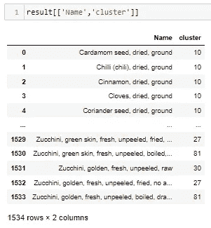
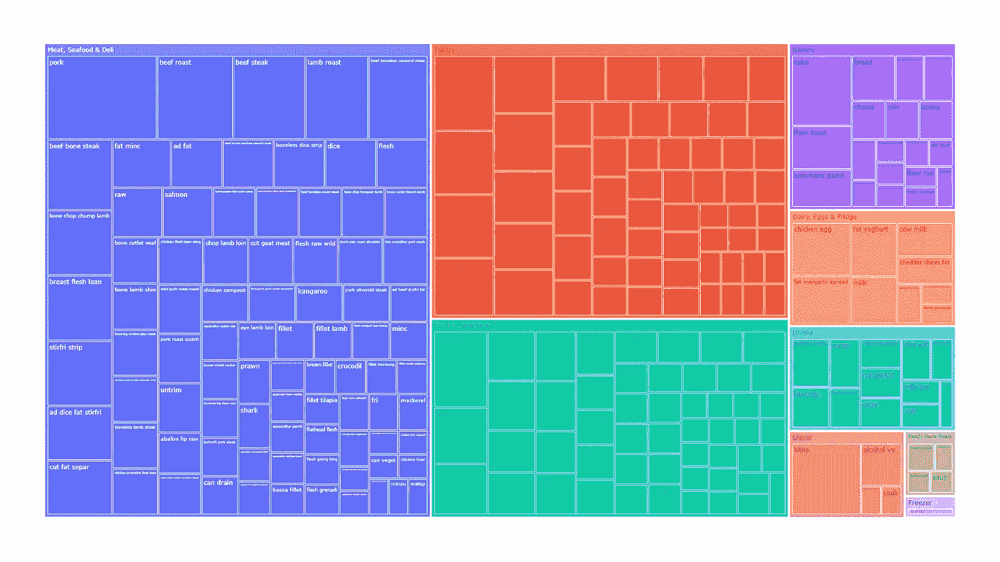

# 用 Python 对产品名称进行聚类—第 2 部分

> 原文：<https://towardsdatascience.com/clustering-product-names-with-python-part-2-648cc54ca2ac?source=collection_archive---------4----------------------->

## 使用自然语言处理(NLP)和 K-Means 聚类 Python 中的未标记文本

[李可莹](https://unsplash.com/@jaely368?utm_source=medium&utm_medium=referral)在 [Unsplash](https://unsplash.com?utm_source=medium&utm_medium=referral) 上拍照

# 介绍

本指南介绍了**我们如何使用自然语言处理(NLP)和 Python 中的 K-means 来自动聚类未标记的产品名称**，以快速了解数据集中的产品种类。

**本文是第 2 部分，将涵盖:K-means 聚类、评估聚类质量和微调。**

**如果你还没有，请阅读** [**第 1 部分**](/clustering-product-names-with-python-part-1-f9418f8705c8) **，其中包括:预处理和矢量化。**

现在我们有了单词矩阵，让我们开始聚类。

# k 均值聚类

这是有趣的部分:聚集我们的单词矩阵。

K-means 聚类根据数据点之间的相似性或接近性将数据点分配到离散的组中。我们指定聚类数 K，并且该算法迭代地将每个观察值分配给一个聚类，直到每个聚类的观察值尽可能接近其均值(或质心)。

作者图片

理论上，相似的食物名称应该聚集在一起，因为它们对相同的单词(和 n-grams)有相似的值。

作者图片

## 最佳聚类数

我们怎么知道把什么指定为 K？我们可以使用肘方法来测试不同的 K 值，并比较每个数据点到其质心的距离(误差平方和或 SSE)。

为了理解数据集中的食物类型，我们希望在一个聚类(低 SSE)中使食物名称尽可能相似，并使每个聚类包含 1 或 2 个以上的食物名称。

让我们用我们的词汇矩阵来做这件事。我们知道在我们的食物名称中有 851 个不同的单词，所以不可能有比这更多的食物类型。

作者图片

我们创建的集群越多，SSE 应该越低，并且每个集群离其质心越近。如果我们将图表扩展到 K=1，500(每个不同的食物名称一个聚类)，SSE 将是 0。

肘点看起来在 200。此后上证指数的跌幅开始越来越小。

## 创建集群

让我们从这里开始，测试 K=200。

作者图片

现在我们的单词包矩阵中的每一行都被分配到 0 到 199 之间的一个聚类中。你可以看到我们的研磨香料在前 5 排是在同一个簇中。哇哦！

# 评估集群质量

创建集群非常简单。现在我们想知道聚类是否恰当地回答了数据集中有哪些食物的问题。我们已经知道，更多的集群意味着更低的 SSE。但是这如何影响聚类的意义呢？

我们需要其他的方法来比较不同数量的聚类以及不同的单词矩阵。注意:SSE 不应该用来比较不同的矩阵，因为它们的值本质上是不同的。例如，单词包使用整数(0、1、2 等。)来表示单词的出现，而 TF-IDF 使用 0 到 1 之间的加权分数。

## 可读性聚类标签

现在我们的集群是 0 到 199 之间的数字。让我们给我们的集群贴上人类可读的标签。我们可以通过检索每个集群中每行的值大于 0 的矩阵列名来自动完成这项工作。这样我们可以看到一个聚类中所有食物名称共有的单词。

作者图片

我们可以开始理解每个集群代表什么。注意:有一些食物名称中没有任何常用词，所以它们没有被标注。

## 集群规模

现在我们已经有了集群标签，我们可以查看带标签的集群的数量及其大小。

作者图片

在 K=200 的单词袋矩阵中，1534 个食品名称中只有 96 个没有被标注，8 个食品名称在 1 个一组中。总的来说，93%的食物名称被归为一类。对于第一次测试来说，听起来相当不错！

## 进一步的标记是可选的

为了更容易地评估集群质量，我将集群分成了高级超市类别(水果和蔬菜、食品柜等等)。这是不必要的，特别是在集群较少的情况下，但是可以轻松阅读。

对 1534 种食物名称进行人工分类并不好玩。手动对数百个集群进行分类更容易管理。如果您有部分标记的数据，这就是分类算法派上用场的地方。

## 想象这一切

可视化文档相似性的常用方法是 [t-SNE](https://www.scikit-yb.org/en/latest/api/text/tsne.html) 。它将高维的矢量数据投影到二维空间。

来源:[黄砖 t-SNE 文档](https://www.scikit-yb.org/en/latest/api/text/tsne.html)

然而，由于我们有大量的集群，t-SNE 并不是可读性最好的。很难看到离散的集群及其大小。在 200 个集群中，我们多次循环通过颜色图来给每个集群着色，这使得它更难阅读。

相反，我选择了一个树形图，它可以在各自的超市类别中整齐地显示我们的聚类标签和大小。让我们看看我们的单词包矩阵能得到什么。

# 结果呢

## 单词包| K=200 | 93%在干净的簇中

作者图片

对于几行代码来说，这已经很棒了。

让我们在 K=200 时评估我们的集群。对于大多数类别，我们有几大串通用词来描述食物的种类。例如，'生的'，'干的'，'未煮的'，'煮的'，'沥干的'。即使是较小的聚类，我们也不知道数据集中的食物类型。

K=200 最终是单词包矩阵的最佳值。100、150、250 和 300 的测试将更少的食物名称放入干净的聚类中，并且没有使聚类标签更有意义。

如果一个单词包被赋予(大部分)向量中的每个单词相等的权重，那么聚类产生最常出现的单词组是有意义的。

## 模糊模糊| K=500 | 86%在干净的集群中

作者图片

就像单词包结果一样，我们模糊不清的聚类集中在描述食物的单词上，而不是食物本身:“添加脂肪”、“商业”、“生的”。

它能够找到更多具有长尾描述的组，如“煮过的，没有添加脂肪或盐”，因为矩阵强调字符串相似性，而不是单词相似性。

同样，聚类是基于最常见的单词或单词序列。

## **TF-IDF(字级)** | K=300 | 78%在干净的簇中

作者图片

单词级 TF-IDF 生成的结果最符合大多数超市类别的人的感觉。

我们现在可以在大多数集群中看到食物类型:“猪肉”、“烤牛肉”、“无盐坚果”、“小麦粉意大利面”、“卷心菜”、“生苹果”！

这些单词能够被聚类，因为它们被 TF-IDF 算法赋予了更大的权重，而更常见的描述性单词的权重较小。

## TF-IDF (n-gram 水平)| K=500 |在干净的簇中为 87%

作者图片

N-gram 级别的 TF-IDF 比 word 级别的 TF-IDF 为某些类别添加了更多的颜色，因为有关键的 bi-gram。例如，在茶水间，我们现在有“早餐麦片”、“甜饼干”和“牛奶什锦早餐”。在乳制品、鸡蛋和冰箱中，我们现在有“人造黄油脱脂”、“山羊奶酪”和“奶油脂肪”。

# 微调

虽然这些测试令人印象深刻，因为只需要很少的人工输入，但总有一些食物名称没有标签或标签不太相关(例如，“生的”远不如“卷心菜”有用)。

这里有一些进一步的调整，可以测试，以尽量减少残留的食物名称的数量。

*   考虑在预处理阶段删除更多的单词，或者在矢量化阶段降低它们的权重。
*   测试 min_df 和 max_df 设置中的设置阈值，以忽略在矢量化阶段出现太频繁或不够频繁的术语。
*   对于标签较宽的较大聚类，再次单独聚类可以进一步区分食品名称。
*   相反，测试分层聚类，以获得自下而上的食物名称分组方法。注意:这最适用于较小或唯一性较差的数据集。
*   如果所有这些都失败了，试着用你想要的标签手动标注足够多的食物名称，并使用分类算法来代替。

# 结论

我们已经看到 NLP 和 K-means 聚类对于组织未标记的文本是多么有效。

与任何建模一样，没有一个模型适合所有数据集和用例。但是有一些测试的实际步骤和注意事项。

这在电子商务产品分类中的应用产生了许多好处:解放人力、更准确和动态的分类、更好的库存洞察和更有意义的竞争分析，等等。

还有许多现实世界的应用:社交媒体帖子和评论的情感分析、模糊搜索、产品推荐、电子邮件过滤。

*本指南中使用的数据集来自* [*澳大利亚食品成分数据库*](https://www.foodstandards.gov.au/science/monitoringnutrients/afcd/Pages/datauserlicenceagreement.aspx) *，并由澳大利亚新西兰食品标准局许可。*