# 聚类句子嵌入识别短文本意图

> 原文：<https://towardsdatascience.com/clustering-sentence-embeddings-to-identify-intents-in-short-text-48d22d3bf02e?source=collection_archive---------0----------------------->

## [行业笔记](https://towardsdatascience.com/tagged/notes-from-industry)

## UMAP + HDBSCAN 的超参数调整以确定未标记文本数据中的聚类数


由[迈克·提尼翁](https://unsplash.com/@m15ky?utm_source=medium&utm_medium=referral)在 [Unsplash](https://unsplash.com?utm_source=medium&utm_medium=referral) 上拍摄的照片

***TL；DR*** *聚类短文本消息的无监督学习问题可以转化为约束优化问题来自动调优 UMAP + HDBSCAN 超参数。*[*chat intents*](https://github.com/dborrelli/chat-intents)*包使得这个调优过程很容易实现。*

# 介绍

用户对话交互可以成为如何改进产品或服务的巨大信息源。理解人们为什么联系客服也是自动化部分或全部回复的重要的第一步(例如，使用聊天机器人)。有几种方法来分析对话交互数据以提取有用的见解，并且通常通过讨论的主题、情感和意图来表征交互。

从想要改进产品或服务的角度来看，确定意图特别有用，因为它回答了这样一个问题:为什么人们首先伸出手来？然而，利用用户消息意图的一个主要障碍是，确定它通常被视为一个分类问题。这意味着您通常需要已经有了大量的标记数据才能开始。例如，[微软的路易斯](https://docs.microsoft.com/en-us/azure/cognitive-services/luis/luis-concept-intent)和[谷歌的 Dialogflow](https://cloud.google.com/dialogflow/es/docs/intents-overview) 都是从这样一个前提开始的，你要么可以使用预先构建的域标记数据，要么你已经有了标记数据。

但是，如果您还没有任何带标签的数据，并且您认为任何公开可用的带标签的数据都不相关(这是经常发生的情况)，该怎么办呢？除了无监督学习问题的挑战之外，包含意图的消息通常非常短(少于 15 个单词)。我最近接受了这个挑战，还有一个额外的障碍:我们总共只有大约 1000 个样本。我立刻想起了几年前看到的一些明智的建议:

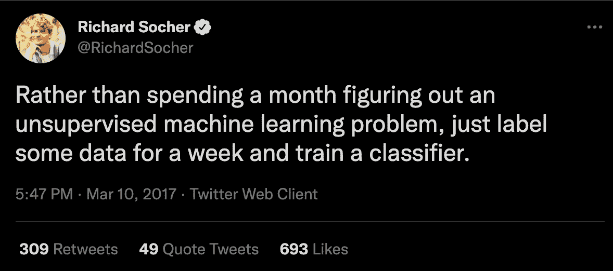

来源:https://twitter.com/RichardSocher/status/840333380130553856

在对我的特殊问题思考了一会儿，并尝试了几次把它当作一个无监督的学习问题，但毫无结果之后，我最终手动标记了这些数据(大约花了一周……)。手动标注让我对数据有了有益的理解和直觉。但与此同时，这让我非常好奇，想知道是否有一种方法可以更自动化地实现那些被标记的意图。这篇文章将提供一种我学到的方法，可以自动对短文本消息数据进行聚类，以识别和提取意图。

# 定义目标

在我们进一步讨论之前，让我们先定义一下我们要做什么。在这里我有兴趣回答这个问题:

> 给定用户和公司代表之间的一组未标记的对话，有没有办法自动获得用户意图的有用标记？

由于这是一个无人监管的问题，标记意图可能相当主观，我不指望能够找到一个完美的解决方案。但是，类似于 [auto-EDA 库](https://github.com/pandas-profiling/pandas-profiling)并不详尽，但在面对新数据时可以提供一个有用的起点，我们可以在进行耗时的手动标记之前做些什么来提供初步的见解吗？自动化的结果可能已经足够好了，使人们从一周或更长时间的手动标记数据中节省下来。或者，它可以通过提供一个有用的起点来加速标记过程。

# 数据

显然，我无法分享激发本文灵感的原始数据集，所以我开始尽可能地寻找公开可用的类似资料。虽然有几个对话数据集已经标记了意图，但其中许多的主要限制是所表示的意图数量很少(通常约 10 个)。拥有少量的意图或类会使问题过于简单。尽管手工标注过程本身是主观的，但我发现对于我正在处理的数据来说，很容易有超过 50 种不同的意图。对于现实世界的应用程序来说，这似乎很常见。

幸运的是，PolyAI 团队发布了 [banking77 数据集](https://github.com/PolyAI-LDN/task-specific-datasets)，其中包含了 77 种不平等表示的意图:

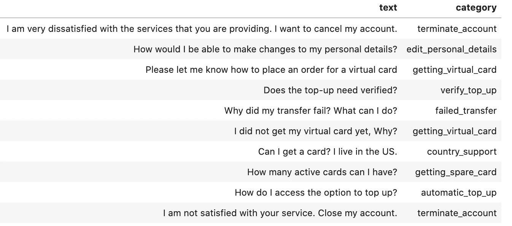

来自 bank77 数据集的样本数据。图片由作者提供。

完整数据集包含 77 个意图的训练数据集中的 10，0003 条消息。最大和最小类别计数分别为 187 和 35。

为了更接近我之前面临的挑战，我将从训练集中的 10，000 个样本中随机抽取 1，000 个样本:

```
data_sample = data_full.sample(1000, random_state=123)
```

请注意，尽管该数据集对于本练习的演示目的很有用，但这仍然有些人为，并且您将在真实环境中面临额外的挑战。例如，你首先需要确定在一个完整的对话序列中什么信息或句子实际上与意图相关，以及处理随机的系统错误信息、打字错误和无意义的信息。[这篇关于发现和分类 AirBnB 信息意图的文章](https://medium.com/airbnb-engineering/discovering-and-classifying-in-app-message-intent-at-airbnb-6a55f5400a0c)触及了一些现实世界的挑战。

# 尝试主题建模

有几种方法可以解决像这样的无监督学习问题。[面对这个问题，第一个想到的方法就是主题建模](https://en.wikipedia.org/wiki/Topic_model)。这是一种用来发现文档集合中潜在主题的技术。

可以使用许多算法来执行主题建模，但一个非常常见的算法是[潜在狄利克雷分配(LDA)](https://www.jmlr.org/papers/volume3/blei03a/blei03a.pdf) 。LDA 是一种生成概率模型，它假设每个文档由固定数量的主题分布组成，每个主题由单词分布组成。当尝试使用 LDA(和许多其他主题建模算法)时，一个很大的挑战是决定实际使用多少主题，这是一个必要的模型超参数。显然，如果这是我们希望从分析中得到的，那么这就是一个问题。[连贯性](http://svn.aksw.org/papers/2015/WSDM_Topic_Evaluation/public.pdf)是一种通过测量每个主题中单词的相似程度来评估所学主题质量的方法，连贯性分数越高越好。 [Gensim](https://radimrehurek.com/gensim/index.html) ，一个非常流行的主题建模库，让计算[模型一致性](https://radimrehurek.com/gensim/models/coherencemodel.html)变得很容易。不幸的是，对于我们在这里处理的短文，使用 coherence 选择多少主题并不明显:

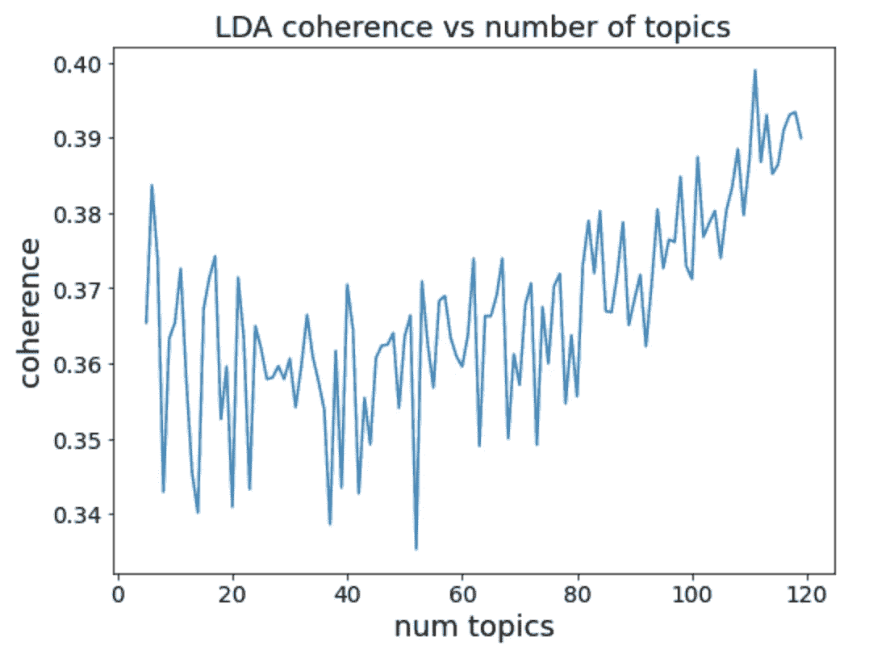

LDA 相干性作为应用于 bank77 数据集样本的主题数量的函数。图片由作者提供。

似乎增加主题的数量会继续增加这个数据集的一致性，这对于我们选择多少主题几乎没有指导意义。

更具挑战性的是，主题模型可能很难解释。例如，考虑以下确定的主题:

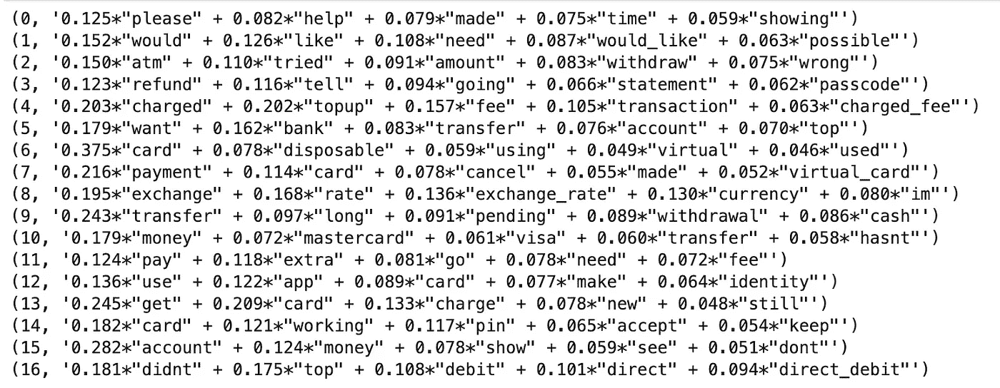

从 bank77 数据集的样本中提取的 LDA 主题。图片由作者提供。

虽然有些话题有意义，但许多很难解读。关于皮尤研究中心工作的系列文章很好地解决了解释主题模型的挑战。

最终，最大的问题是意图比主题更微妙。LDA 和其他主题建模方法的一个局限性是，它们将文档中的词汇表视为一个单词包，其中的顺序无关紧要。这对于较长的文档(和较大的语料库)很有用，在这些文档中，识别同现的单词可以很好地描述主题。此外，主题的数量通常相对较少，而且主题相当独特。然而，短文本意图带来了挑战，例如两个短语具有几乎相同的单词但意图非常不同，或者具有相同的意图但几乎没有共同的单词。这严重限制了标准主题建模方法在短文本中识别意图的有效性。

# 聚类嵌入

除了主题建模，聚类是解决无监督学习问题的另一种非常常见的方法。为了能够对文本数据进行聚类，我们需要做出多个决定，包括如何处理数据以及使用什么算法。

## 选择嵌入

首先，有必要用数字表示我们的文本数据。一种方法是创建每个单词的嵌入或向量表示，用于聚类。[这篇文章](/introduction-to-word-embeddings-4cf857b12edc)很好地概述了嵌入单词的各种方式。由于每个消息由几个单词组成，一种选择是简单地对每个消息中所有单词的单个单词嵌入进行平均。对于某些应用程序来说，这已经足够好了，但是最好是直接计算完整句子的嵌入，以便更有效地考虑含义。特别是考虑到每条消息有多短，这将有助于避免上述主题建模算法的一些缺陷。

事实证明，有许多方法可以找到完整消息或句子的单一向量表示。[本文](/document-embedding-techniques-fed3e7a6a25d)对实现这一目标的各种方法进行了概述。Google 的[通用句子编码器](https://tfhub.dev/google/universal-sentence-encoder/4) (USE)，由 [Cer 等人](https://arxiv.org/abs/1803.11175)于 2018 年首次发布，是一种流行的句子嵌入模型。使用模型在各种数据上进行训练，包括维基百科、网络新闻、网络问答页面和论坛，它在句子语义相似性任务上表现良好。

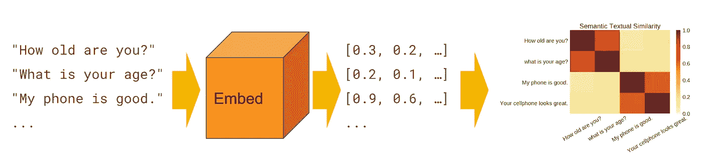

通用句子编码器模型。来源:tensor flow Hub[https://tfhub.dev/google/universal-sentence-encoder/4](https://tfhub.dev/google/universal-sentence-encoder/4)

2019 年，Reimers 和 Gurevych 发表了一篇[论文](https://arxiv.org/pdf/1908.10084.pdf)，介绍了句子-BERT，这是一种“对预训练的 BERT 网络的修改，使用连体和三元网络结构来导出语义上有意义的句子嵌入，可以使用余弦相似性进行比较”。他们还发布了一个 [Python 实现](https://github.com/UKPLab/sentence-transformers)，使得下载和使用许多不同的[预训练模型](https://www.sbert.net/docs/pretrained_models.html)变得容易。

鉴于我们的数据集如此之小，在这里使用预先训练的模型是更可取的。对于这个分析，我将比较四个预训练的句子嵌入模型的结果:USE 和三个不同的句子-BERT 模型( **all-mpnet-base-v2** 、 **all-MiniLM-L6-v2** 和**all-distilloberta-v1**)。

将我们的信息转换成句子嵌入就很简单了:

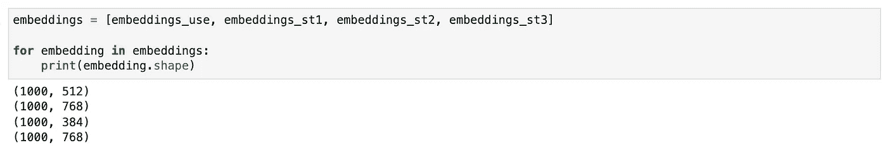

使用各种预训练的嵌入模型嵌入形状。图片由作者提供。

## 降维

如上所述，我们所有的句子嵌入都有很高的维数(每个大于 500 个特征)。维数灾难的一个表现是，聚类所需的距离度量(如欧几里德和曼哈顿)在如此高的维数上变得毫无意义(更多细节，请参见 Aggarwal 等人的“[关于高维空间中距离度量的惊人行为](https://bib.dbvis.de/uploadedFiles/155.pdf)”)。虽然一些句子转换器预训练模型是以保留一些距离度量的有用性的方式创建的，但是在聚类之前进行维度缩减将极大地改善结果。(为了向自己证明这一点，我[在没有先降维的情况下，使用不同的聚类算法和嵌入简单地探索了一下](https://github.com/dborrelli/chat-intents/blob/main/notebooks/03-clustering_without_dim_reduction.ipynb)。)

由[麦金尼斯等人](https://arxiv.org/pdf/1802.03426.pdf)于 2020 年提出的一致流形逼近和投影降维( [UMAP](https://umap-learn.readthedocs.io/en/latest/) )作为一种降维技术，已经迅速普及。UMAP 比 t-SNE 更快、更具可扩展性，同时也更好地保留了数据的全局结构。这使得它既可用于可视化，也可作为聚类前的预处理降维步骤。我们将在这里使用它。

## 选择聚类分析算法

Scikit-learn 文档中有一个[有用的概述](https://scikit-learn.org/stable/modules/clustering.html#overview-of-clustering-methods)，介绍了它支持的许多不同的聚类算法以及每种算法何时性能最佳。对于我们当前的应用，最好是使用一种不需要预先指定聚类数的算法，并且还可以容忍噪声数据。基于密度的算法在这里是一个很好的选择，因为它们不需要指定簇的数量，并且与簇的形状无关。具有噪声的应用的基于层次密度的空间聚类(HDBSCAN)已经变得流行，因为它具有比 DBSCAN 更少且更直观的超参数，并且对可变密度聚类是鲁棒的。HDBSCAN 文档提供了不同聚类算法的[有益比较](https://hdbscan.readthedocs.io/en/latest/comparing_clustering_algorithms.html#comparing-python-clustering-algorithms)。HDBSCAN 对当前的问题最有效，所以在本文中我们将重点关注它。

## 从 UMAP + HDBSCAN 生成集群

为了主题建模的目的，至少有两个包(可能更多)可以将 UMAP 和 HDBSCAN 链接在一起:Top2Vec ( [github](https://github.com/ddangelov/Top2Vec) 和 [paper](https://arxiv.org/pdf/2008.09470.pdf) )和 BERTopic ( [github](https://github.com/MaartenGr/BERTopic) 和 [article](/topic-modeling-with-bert-779f7db187e6) )。然而，两个包中使用的默认超参数对于像当前这样的具有短文本和小语料库的问题(大多数数据最终被分类为噪声，并且总共只找到三个聚类)并不工作良好。为了更容易适应我们当前的意图提取问题，我们将直接使用 UMAP 和 HDBSCAN 软件包进行超参数调整。

UMAP 有几个超参数来控制它如何执行降维，但最重要的两个是`n_neighbors`和`n_components`。`n_neighbors`参数控制 UMAP 如何平衡数据中的[局部与全局结构](https://umap-learn.readthedocs.io/en/latest/parameters.html#n-neighbors)。该参数控制 UMAP 学习流形结构的邻域的大小，因此较低的值`n_neighbors`将更多地关注非常局部的结构。`n_components`参数控制输入数据降维后最终嵌入数据的维度。不幸的是，没有地面真实标签，没有明显的方法来挑选最佳 UMAP 参数。这里我们有标签，我们将在最后使用它来确定我们做得有多好。但是这项工作的重点是当我们有未标记的数据时确定一种使用的方法。在安杰洛夫的 Top2Vec 论文中，他提到`n_neighbors` = 15 和`n_components` = 5 最适合他的下游任务，但这不太可能总是适用于任何数据集。

HDBSCAN 还有几个重要的超参数，但要考虑的最重要的一个[是`min_cluster_size`。直观地说，这控制了您想要视为集群的最小分组。此外，`min_samples`参数控制聚类的保守程度，如果未指定，该参数默认为等于`min_cluster_size`。它越大，作为噪声/异常值丢弃的点就越多。解耦这两个超参数并使`min_samples`小于`min_cluster_size`将通过将它们与它们最相似的相邻聚类合并来基本上保留将被标记为异常值的点。如果我们试图发现集群的数量，这并不是我们想要发生的事情。因此，这里我只考虑直接修改`min_cluster_size`参数:](https://hdbscan.readthedocs.io/en/latest/parameter_selection.html#selecting-min-cluster-size)

注意，UMAP 是一种[随机算法](https://umap-learn.readthedocs.io/en/latest/reproducibility.html)，使用随机性来加速逼近步骤并执行优化。因此，我们将随机种子状态设置为一个常量值，以获得给定的一组 UMAP 超参数的一致结果。

## 定义评分函数

我们现在有了一个管道，其中有三个我们想要调优的超参数(`n_neighbors`、`n_components`和`min_cluster_size`)。接下来，我们需要决定如何实际评估我们的聚类，以选择最佳超参数。虽然通常与各种聚类算法一起使用，但轮廓分数对于基于密度的算法(如 DBSCAN 和 HDBSCAN)来说并不是一个很好的验证度量，因为它假设所有点都被分配到一个组中，并且不能适当地处理噪声/异常值。[基于密度的聚类验证(DBCV)](https://epubs.siam.org/doi/pdf/10.1137/1.9781611973440.96) 已经被一些人提出并用于调整 HDBSCAN 超参数。虽然它可能在一些应用中运行良好，但对于当前的问题，它倾向于使用较少的聚类数，而将过多的样本放在“噪声”类别中。

相反，我们将利用有用的`probabilities_` HDBSCAN 属性，该属性来自文档:

> 每个样本作为其指定分类成员的强度。噪声点概率为零；聚类中的点的赋值与它们作为聚类的一部分存在的程度成比例。

[这篇由 Nikolay Oskolkov 撰写的文章](/how-to-cluster-in-high-dimensions-4ef693bacc6)提供了一个非常直观且符合逻辑的解决方案，只需将我们想要最小化的成本函数定义为:

```
Cost = percent of dataset with < 5% cluster label confidence
```

这将有助于确保我们将尽可能多的数据点分配给实际的聚类，而不是将它们标记为噪声。但是，是什么阻止我们设置超参数，使每个单独的点成为一个“集群”，或者仅仅是一个巨大的集群呢？

**这里我们必须使用一些领域知识来应用约束。**对于这个问题，根据我对这类数据的经验，我预计至少会有 30 个标签，但不会超过 100 个。所以我们的目标函数变成了一个约束优化问题:

```
minimize(Cost = percent of dataset with < 5% cluster label      
                confidence)Subject to: 30 < num_clusters < 100
```

## 随机超参数搜索

在当前数据集大小仅为 1，000 个样本的情况下，对于给定的一组输入，生成聚类并对其进行评分仍然需要大约 3 秒钟。尝试进行例如 10×10×10 超参数搜索空间的全网格搜索将花费几乎一个小时。较大的数据集需要更长的时间。我关心找到正确的超参数，但不太关心*T4。执行随机搜索而不是全网格搜索是一个非常有效的替代策略:*

运行对 100 个随机选择的超参数值的搜索得到:

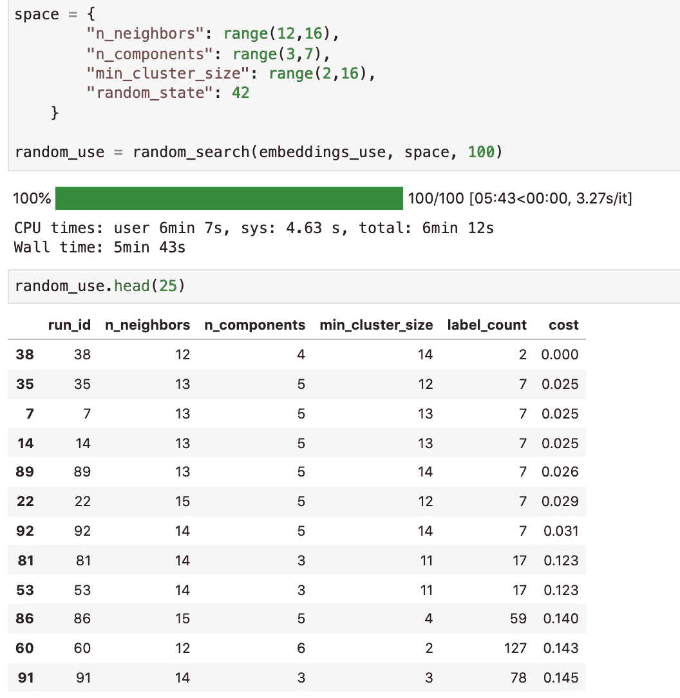

UMAP+HDBSCAN 随机搜索超参数空间的结果。图片由作者提供。

我们看到，成本最低的运行总共也只有不到 10 个集群。聚类数在 30 和 100 之间的第一个条目有 59 个聚类，成本为 0.140(即大约 14%的数据被标记为异常值或低置信度)。跑步也只用了 6 分钟。还不错。

## 基于超点的贝叶斯优化

随机搜索超参数空间工作得相当好，但是有一个更好的选择:贝叶斯优化。在这里，我们将利用流行的[超远视包](https://github.com/hyperopt/hyperopt)来做到这一点。如果你不熟悉 hyperopt 和贝叶斯优化，[这篇文章](https://medium.com/district-data-labs/parameter-tuning-with-hyperopt-faa86acdfdce)提供了一个很好的概述。

首先，定义我们想要最小化的目标函数。如果聚类的数量落在期望的范围之外，则通过添加惩罚项将优化约束包括在目标函数中:

然后使用树形结构 Parzen 估计器(TPE)算法在超参数搜索空间上最小化目标函数:

在我们的参数空间上运行具有 100 个最大评估的贝叶斯搜索产生比随机搜索稍好的结果:

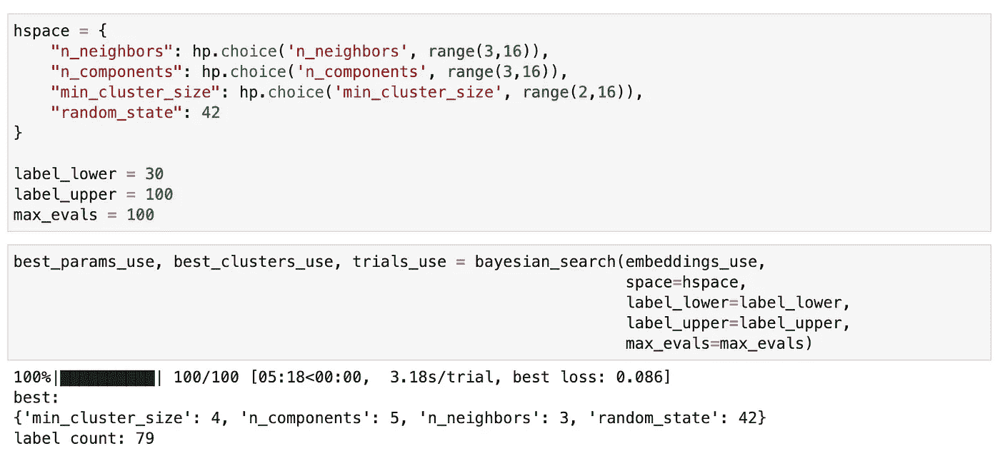

对 UMAP+HDBSCAN 的超参数空间进行贝叶斯搜索的结果。图片由作者提供。

然后，使用来自多个不同模型的嵌入来运行管道就很容易了:

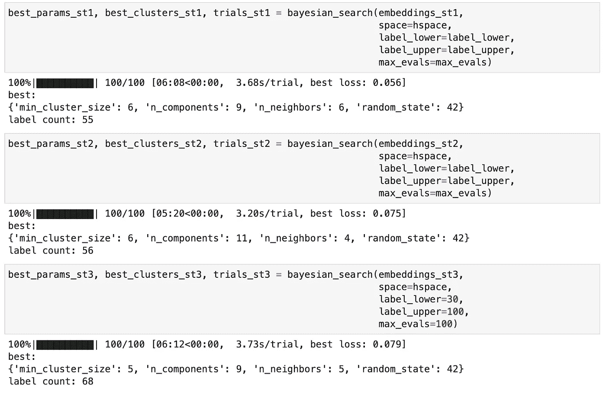

此处考虑的每个模型的最佳超参数。图片由作者提供。

在这一点上，我们可以做更多的事情，如可视化集群或手动检查其中一些以确保它们有意义。但最终，我们试图从最佳分析管道中找到“最佳”聚类结果。如果我们相信损失函数，那么选择损失最低的配置是有意义的。在上面尝试的组合中，似乎我们应该使用句子转换器#1 ( **all-mpnet-base-v2** )，它使用`n_neighbors` = 6、`n_comonents` = 9 和`min_cluster_size` = 6 生成了 55 个集群。

## 评估绩效，了解基本事实标签

在这种情况下，我们碰巧也知道基本事实标签，因此我们可以看到我们的损失函数与性能的相关性。我们可以手动检查模型在一些地面真实集群上的表现:

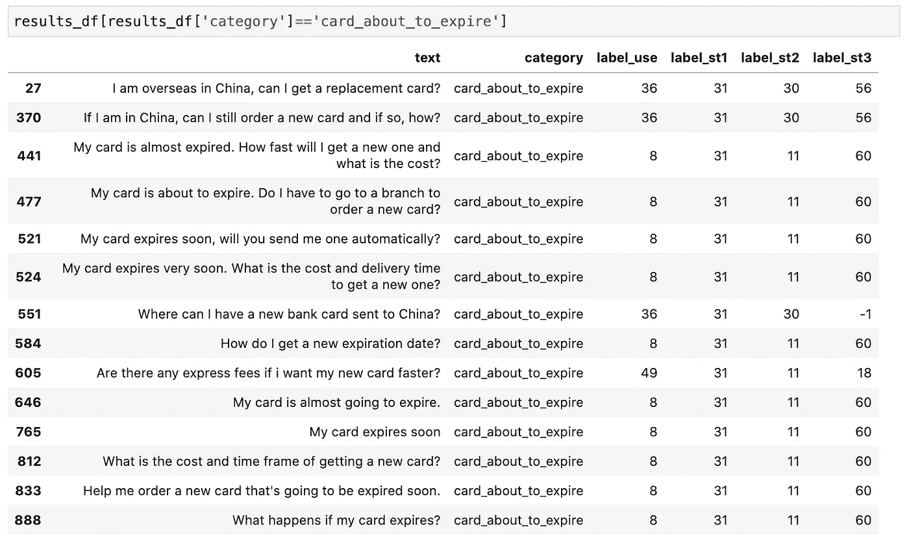

四种不同模型的单一基本事实类别的示例结果。图片由作者提供。

如上所示，所有模型在将`card_about_to_expire`基本事实组中的大部分消息放在同一个集群中时表现相对较好。至少对于这个类别来说，第一句话-transformer 模型似乎在正确地将所有消息分配到同一个集群方面表现突出。

除了手动检查所有组，我们还可以定量评估模型性能。评估文本聚类的两个常用指标是[归一化互信息](https://scikit-learn.org/stable/modules/generated/sklearn.metrics.normalized_mutual_info_score.html)和[调整后的 Rand 指数](https://scikit-learn.org/stable/modules/generated/sklearn.metrics.adjusted_rand_score.html)。这两个指标的值都在 0 到 1 之间，越大越好。计算考虑中的四个模型的最佳超参数的这些度量得出:

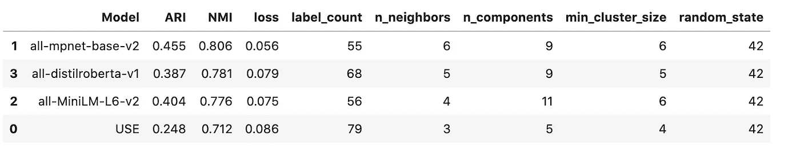

四个模型结果的比较和对地面真实标签的评估。图片由作者提供。

与我们之前的结论一致，句子转换器#1 实际上表现最好，ARI 为 0.46，NMI 为 0.81。然而，某些其他模型的性能排序并不遵循其成本函数值的预期顺序。因此，我们对超参数调整的评分方法并不完美，但显然对当前的应用仍然有用。

## 自动聚类标记

为了使结果更有帮助，我们还可以自动将描述性标签应用到我们找到的分类中。Liu 等人的论文提供了一种有趣的方法，通过从每个聚类中的短语中提取最常见的动作-对象对作为聚类标签(例如“book-flight”)。我们在这里考虑的 bank77 数据集比那篇论文中的数据集稍微复杂一些，但是我们可以做一些类似的事情。在这里，我们将连接最常见的动词、直接宾语和每个簇中的前两个名词。spaCy 包有一个强大的语法依赖解析器，我们可以用它来做这件事:

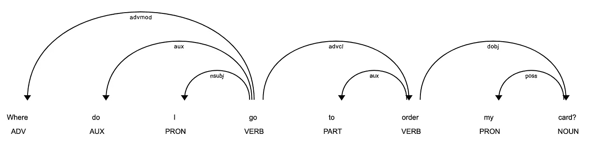

对一个例句应用 spaCy 的句法依存解析器的结果。图片由作者提供。

我们可以编写一个简单的函数来提取每个分类的标签:

将这些标签应用到我们的最佳模型找到的每个聚类中，产生了我们的最终结果:

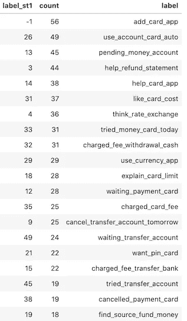

带有计数和描述性标签的提取分类的摘要。图片由作者提供。

使用我们的调整方法，我们已经自动提取了描述性标签，并将其应用于数据集中的 55 个分类。

因为在这种情况下，我们知道每个文档的基本事实标签，所以我们还可以检查一些文档，以查看我们的派生标签与基本事实标签的匹配程度:

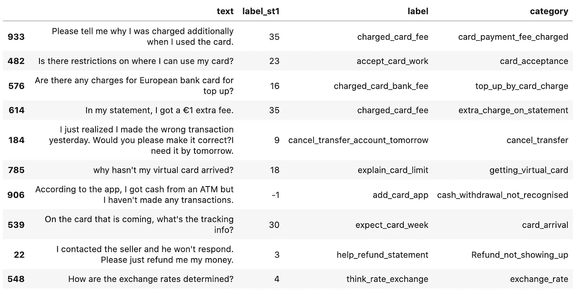

原始数据的样本，带有派生的描述性标签和原始的基本事实标签(“类别”字段)。图片由作者提供。

它们并不完美，但提取的标签与地面类别标签非常匹配！

# 摘要

在这篇文章中，我概述了一个利用领域知识创建约束优化问题的框架，以自动调整 UMAP 和 HDBSCAN 超参数。这使我们能够轻松地对短文本文档进行聚类，并应用描述性标签。本文的重点是小数据集，但是同样的方法也可以应用于更大的数据集。在决定或需要完成耗时的手动标注之前，聚类结果在很短的时间内提供了对未标注文本数据的有用见解。

本文中的所有代码示例，以及我为简化这些概念的应用而创建的 chatintents python 包，都可以在这里找到:

<https://github.com/dborrelli/chat-intents>  

感谢阅读。如果你觉得这篇文章很有帮助，请在下面留言或联系 LinkedIn。